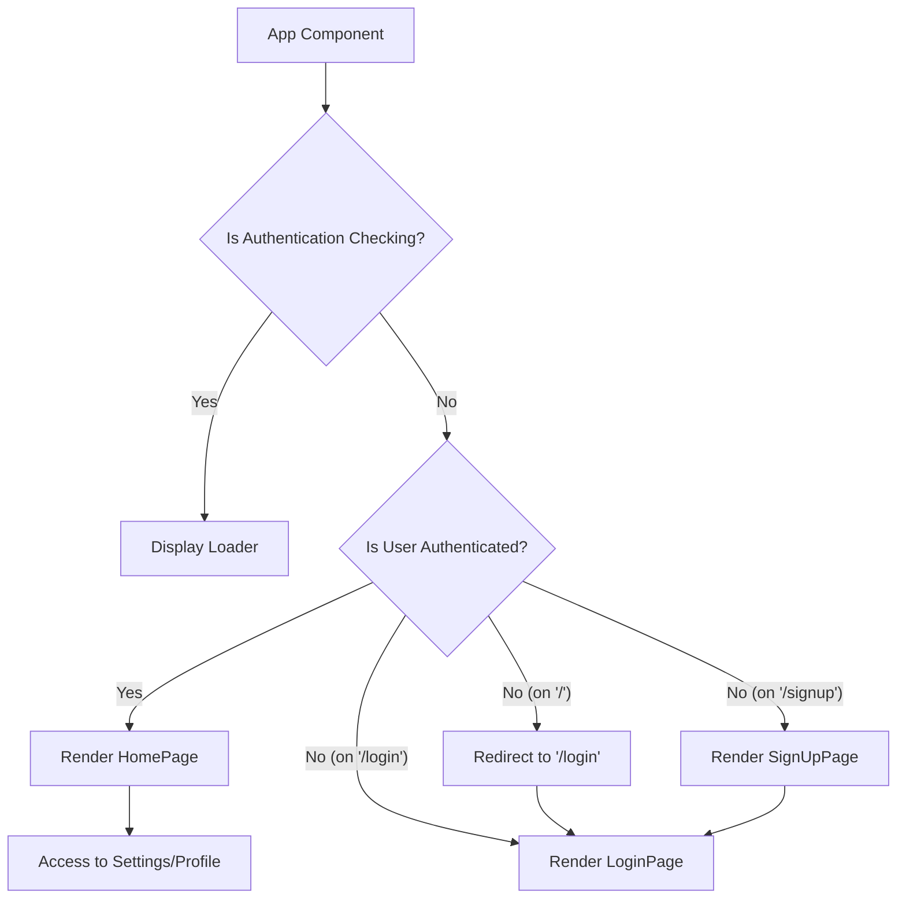
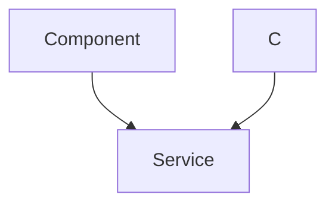

 # UI Components and Structure

This section outlines the core React components that constitute the user interface of the chat application, detailing their responsibilities, organization, and how they integrate to form a cohesive user experience. The frontend architecture prioritizes modularity, clear separation of concerns, and efficient data flow, leveraging React Router for navigation and Zustand for state management.

## Application Entry Point: `App.jsx`

The `App.jsx` file serves as the main entry point for the React application, defining the global structure, routing, and initial authentication checks. It orchestrates the rendering of different pages based on the current URL and the user's authentication status.

-   **Routing:** Utilizes `react-router-dom` to manage navigation between pages like Home, Login, SignUp, Settings, and Profile.
-   **Authentication Check:** Employs `useAuthStore` to verify the user's authentication status (`checkAuth`) upon application load, ensuring protected routes are only accessible to authenticated users.
-   **Global Theme:** Integrates `useThemeStore` to apply a global theme to the application wrapper.
-   **Toaster Notifications:** Includes `react-hot-toast` for displaying non-blocking notifications across the application.

```jsx title="frontend/src/App.jsx"
// import React from 'react'
import Navbar from './components/Navbar'
import { Routes, Route, Navigate } from 'react-router-dom'
import { useEffect } from 'react'
import HomePage from './pages/HomePage'
import SignUpPage from './pages/SignUpPage'
import LoginPage from './pages/LoginPage'
import SettingsPage from './pages/SettingsPage'
import ProfilePage from './pages/ProfilePage'

import { useThemeStore } from './store/useThemeStore'
import { useAuthStore } from './store/useAuthStore';
import { Loader } from 'lucide-react'
import { Toaster } from 'react-hot-toast'

const App = () => {
  const { authUser, checkAuth, isCheckingAuth, onlineUsers } = useAuthStore();
  const { theme } = useThemeStore();
  useEffect(() => {
    checkAuth();
  }, [checkAuth]);

  // Renders a loader while checking authentication status
  if(isCheckingAuth && !authUser) return (
      <div className='flex items-center justify-center h-screen'>
        <Loader className='size-10 animate-spin' />
      </div>
  )

  return (
    <div className='' data-theme={theme}>
      <Navbar />
      <Toaster />
      <Routes>
        <Route path='/' element={authUser ? <HomePage />: <Navigate to='/login' />} /> {/* Protected Home Page */}
        <Route path='/signup' element={ !authUser ? <SignUpPage />: <Navigate to='/' />} />
        <Route path='/login' element={!authUser ? <LoginPage />: <Navigate to='/' />} />
        <Route path='/settings' element={<SettingsPage />} />
        <Route path='/profile' element={authUser ? <ProfilePage />: <Navigate to='/login' />} /> {/* Protected Profile Page */}
      </Routes>
    </div>
  )
}

export default App
```
[View on GitHub](https://github.com/shinymack/Chat-App-MERN/blob/main/frontend/src/App.jsx)

### Application Flow Diagram

This diagram illustrates the primary routing and authentication flow within the `App` component.





## `HomePage.jsx`

The `HomePage` component is the central hub for the chat application, displaying either the list of friends in the `Sidebar` and the chat interface in `ChatContainer`, or a `NoChatSelected` message. It conditionally renders components based on the `selectedUser` from the chat store.

-   **Conditional Rendering:** Dynamically shows `ChatContainer` when a user is selected, otherwise `NoChatSelected`.
-   **Layout:** Arranges `Sidebar`, `ChatContainer`, and optionally `FriendsBox` within a flexible container.

```jsx title="frontend/src/pages/HomePage.jsx"
// import React from 'react'

import ChatContainer from "../components/ChatContainer";
import FriendsBox from "../components/FriendsBox";
import NoChatSelected from "../components/NoChatSelected";
import Sidebar from "../components/Sidebar";
import { useChatStore } from "../store/useChatStore"

const HomePage = () => {
  const { selectedUser, isFriendsBoxOpen } = useChatStore(); // Destructure isFriendsBoxOpen
  return (
      <div className="h-screen bg-base-200">
      <div className="flex items-center justify-center pt-20 px-4 w-full">
        <div className="bg-base-100 rounded-lg shadow-xl w-full max-w-6xl h-[calc(100vh-8rem)]">
          <div className="flex h-full rounded-lg overflow-hidden w-full">
            <Sidebar />
            {!selectedUser ? <NoChatSelected /> : <ChatContainer />} {/* Conditional rendering based on selectedUser */}
            {isFriendsBoxOpen && <FriendsBox />} {/* Conditionally render FriendsBox */}

          </div>

        </div>
      </div>
    </div>
  )
}

export default HomePage
```
[View on GitHub](https://github.com/shinymack/Chat-App-MERN/blob/main/frontend/src/pages/HomePage.jsx)

## `Sidebar.jsx`

The `Sidebar` component displays a list of the authenticated user's friends, allowing selection to initiate a chat. It provides filtering options to view only online friends and indicates their status visually.

-   **Friends List:** Fetches and displays a list of friends using `getFriends` from `useChatStore`.
-   **User Selection:** Allows users to select a friend, updating `selectedUser` in the chat store, which triggers the display of the `ChatContainer`.
-   **Online Status Indicator:** Shows a green dot for online users based on `onlineUsers` from `useAuthStore`.
-   **Online Filter:** Provides a checkbox to filter the friends list, showing only online users.
-   **Responsive Design:** Hides the sidebar on smaller screens when a user is selected, prioritizing the chat view.

```jsx title="frontend/src/components/Sidebar.jsx"
import { useEffect, useState } from "react";
import { useChatStore } from "../store/useChatStore";
import SidebarSkeleton from "./skeletons/SidebarSkeleton";
import { Users } from "lucide-react";
import { useAuthStore } from "../store/useAuthStore";

const Sidebar = () => {
    const { getFriends, users, selectedUser, setSelectedUser, isUsersLoading } =
        useChatStore();

    const { onlineUsers } = useAuthStore();
    const [showOnlineOnly, setShowOnlineOnly] = useState(false);
    useEffect(() => {
        getFriends(); // Fetch friends on component mount
    }, [getFriends]);
    const filteredUsers = showOnlineOnly
        ? users.filter((user) => onlineUsers.includes(user._id))
        : users;
    if (isUsersLoading) return <SidebarSkeleton />;
    return (
        <div className={`h-full sm:w-72 sm:border-r border-base-300  flex-col transition-all duration-200 ${selectedUser ?
                                    "hidden sm:flex w-[100vw] " // Hide on small screens if a user is selected
                                    : ""}`}>
            <div className="border-b border-base-300  p-5">
                <div className="flex items-center gap-2">
                    <Users className="size-6"></Users>
                    <span className="font-medium  lg:block">
                        Friends
                    </span>
                </div>
                <div className="mt-3 lg:flex items-center gap-2">
                    <label className="cursor-pointer flex items-center gap-2">
                        <input
                            type="checkbox"
                            checked={showOnlineOnly}
                            onChange={(e) =>
                                setShowOnlineOnly(e.target.checked)
                            }
                            className="checkbox checkbox-sm"
                        />
                        <span className="text-sm">Show online only</span>
                    </label>
                    <span className="text-xs text-zinc-500">
                          ({users.filter(friend => onlineUsers.includes(friend._id)).length} online)
                    </span>
                </div>
                <div className="overflow-y-scroll h-[calc(100vh-14rem)] w-full flex flex-col py-3">
                    {filteredUsers.map((user) => (
                        <button
                            key={user._id}
                            onClick={() => setSelectedUser(user)} // Set selected user in store
                            className={`sm:w-full w-[88vw] p-3 flex items-center gap-3 hover:bg-base-300 transition-colors
                            ${
                                selectedUser?._id === user._id
                                    ? "bg-base-300 ring-1 ring-base-300"
                                    : ""
                            }`}
                        >
                            <div className="relative mx-0">
                                
                                {onlineUsers.includes(user._id) && ( // Online indicator
                                    <span className="absolute bottom-0 right-0 size-3 bg-green-500 rounded-full ring-2 ring-zinc-900" />
                                )}
                            </div>
                            <div className=" block text-left min-w-0">
                                <div className=" font-medium truncate">
                                    {user.username}
                                </div>
                                <div className="text-sm text-zinc-400">
                                    {onlineUsers.includes(user._id)
                                        ? "Online"
                                        : "Offline"}
                                </div>
                            </div>
                        </button>
                    ))}
                </div>
                {filteredUsers.length == 0 && (
                    <div className="text-center text-zinc-500 py-4">No online friends</div>
                )}
            </div>
        </div>
    );
};

export default Sidebar;
```
[View on GitHub](https://github.com/shinymack/Chat-App-MERN/blob/main/frontend/src/components/Sidebar.jsx)

## `ChatContainer.jsx`

The `ChatContainer` component is responsible for displaying the message history between the authenticated user and the `selectedUser`. It includes a chat header, the scrollable message area, and an input field for sending new messages.

-   **Message Fetching:** Retrieves messages for the `selectedUser` using `getMessages` from `useChatStore`.
-   **Real-time Updates:** Subscribes to and unsubscribes from WebSocket messages to receive real-time chat updates.
-   **Auto-scrolling:** Automatically scrolls to the latest message using a `useRef` hook.
-   **Message Display:** Renders individual messages, distinguishing between sender and receiver, and displaying text or image content along with timestamps.
-   **Loading State:** Shows a `MessageSkeleton` while messages are being loaded.

```jsx title="frontend/src/components/ChatContainer.jsx"
import { useEffect } from "react";
import { useChatStore } from "../store/useChatStore";
import ChatHeader from "./ChatHeader";
import MessageInput from "./MessageInput";
import MessageSkeleton from "./skeletons/MessageSkeleton";
import { useAuthStore } from "../store/useAuthStore";
import { formatMessageTime } from "../lib/utils";
import { useRef } from "react";

const ChatContainer = () => {
    const { messages, getMessages, isMessagesLoading, selectedUser, subscribeToMessages, unsubscribeFromMessages } =
        useChatStore();
    const { authUser } = useAuthStore();
    const messageEndRef = useRef(null);


    useEffect(() => {
        getMessages(selectedUser._id); // Fetch messages for the selected user
        subscribeToMessages(); // Subscribe to WebSocket for real-time messages

        return () => unsubscribeFromMessages(); // Unsubscribe on unmount or selectedUser change
    }, [selectedUser._id, getMessages, subscribeToMessages, unsubscribeFromMessages]);

    useEffect(() => {
        if(messageEndRef.current && messages){
            messageEndRef.current.scrollIntoView({behaviour : "smooth"}) // Auto-scroll to latest message
        }
    }, [messages])

    if (isMessagesLoading)
        return (
            <div className="flex-1 flex flex-col overflow-auto">
                <ChatHeader />
                <MessageSkeleton /> {/* Display skeleton while loading */}
                <MessageInput />
            </div>
        );
    return (
        <div className="flex-1 flex flex-col overflow-auto">
            <ChatHeader />
            <div className="flex-1 overflow-y-auto p-4 space-y-4">
                {messages.map((message) => (
                    <div
                        key={message._id}
                        className={`chat ${message.senderId == authUser._id ? "chat-end": "chat-start"} `} // Differentiate sender/receiver
                        ref={messageEndRef}
                    >
                        <div className="chat-image avatar">
                            <div className="size-9 rounded-full border">
                                
                            </div>
                        </div>
                        <div className="chat-header mb-1">
                            <time className="text-xs opacity-50 ml-1">{formatMessageTime(message.createdAt)}</time>
                        </div>
                        <div className="chat-bubble flex flex-col">
                            {message.image && (
                                
                            )}
                            {message.text && <p>{message.text}</p>}
                        </div>
                    </div>
                ))}
            </div>
            <MessageInput />
        </div>
    );
};

export default ChatContainer;
```
[View on GitHub](https://github.com/shinymack/Chat-App-MERN/blob/main/frontend/src/components/ChatContainer.jsx)

### Chat Interaction Flow

This sequence diagram demonstrates the user interaction and data flow when sending and receiving messages.





## Key Integration Points

The UI components exhibit strong integration through shared state management and a clear hierarchical structure:

-   **Centralized State (Zustand):** `useAuthStore` and `useChatStore` are fundamental for sharing authentication status, online users, selected chat partner, and messages across components. This reactive approach ensures UI updates automatically reflect changes in data.
-   **Conditional Rendering:** The `HomePage` dynamically renders `ChatContainer` or `NoChatSelected` based on `useChatStore.selectedUser`, creating a responsive and intuitive user experience.
-   **Real-time Communication:** `ChatContainer` leverages WebSocket subscriptions managed by `useChatStore` to provide an instant messaging experience, crucial for a chat application.
-   **Modular Component Design:** Each component (`Sidebar`, `ChatContainer`, `ChatHeader`, `MessageInput`) has a focused responsibility, making the codebase easier to understand, test, and maintain. For example, `ChatContainer` composes `ChatHeader`, `MessageInput`, and individual message rendering logic.
-   **UI Responsiveness:** Components like `Sidebar` adapt their visibility based on screen size and selected chat to optimize for mobile and desktop views, providing a smooth transition between chat list and active chat.

This structure provides a robust and scalable foundation for the application's user interface, allowing for future feature expansion without significant architectural changes.

---
Next: [State Management](./3.2_state-management.mdx)