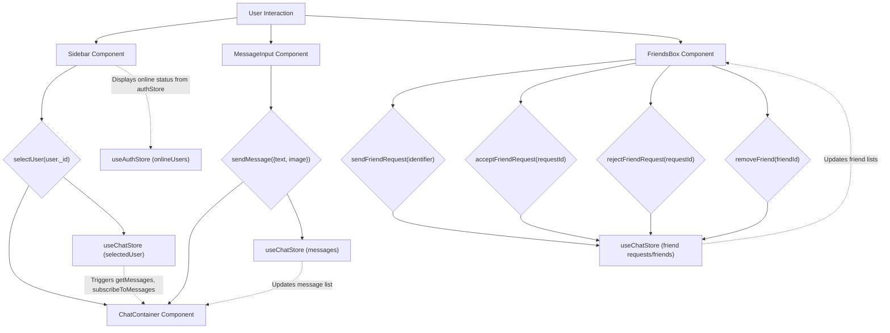
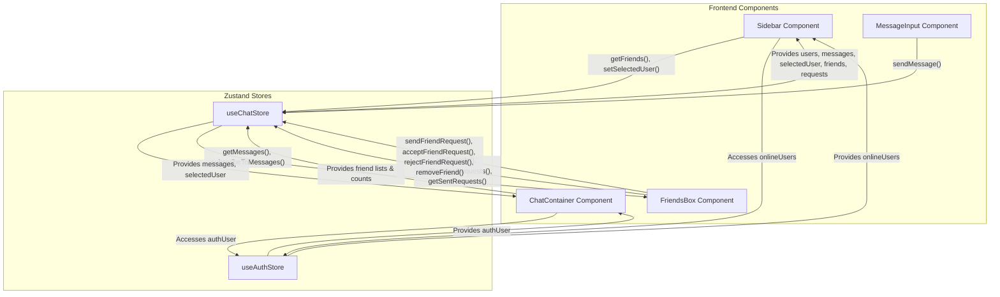

# UI Components

The UI Components section details the core reusable React components that construct the user interface of the chat application. These components are designed for modularity and maintainability, each handling a specific part of the user experience, from displaying messages to managing friend relationships. They leverage Zustand for state management and interact with the backend API to fetch and update data.

## Core Components Overview

The application's frontend is built using several key components, each responsible for a distinct part of the user interface and functionality. These components are designed to be intuitive and responsive, providing a seamless chat experience.

*   **`ChatContainer.jsx`**: Manages the display of messages for a selected chat, including loading states and real-time updates.
*   **`FriendsBox.jsx`**: Provides an interface for managing friend requests and existing friends, allowing users to send, accept, reject, and remove friends.
*   **`MessageInput.jsx`**: Handles user input for sending messages, including text and image attachments.
*   **`Sidebar.jsx`**: Displays a list of friends, indicating their online status, and allows users to select a chat.

## ChatContainer Component

The `ChatContainer` component is the central hub for displaying ongoing conversations. It dynamically renders messages, manages scrolling, and integrates with the global chat state to ensure real-time message updates.

### Features

*   **Dynamic Message Display**: Renders individual chat messages, distinguishing between sent and received messages.
*   **Real-time Updates**: Subscribes to message updates using a WebSocket connection managed by the `useChatStore`.
*   **Auto-Scroll**: Automatically scrolls to the latest message using `useRef` and `useEffect`.
*   **Loading State**: Displays a skeleton loader while messages are being fetched.
*   **Image Previews**: Displays image attachments within messages.

### Implementation Details

The `ChatContainer` relies heavily on the `useChatStore` to access and manipulate chat-related state, such as `messages`, `selectedUser`, and `isMessagesLoading`. It also uses `useAuthStore` to identify the current authenticated user (`authUser`) for styling purposes.

Messages are fetched when a `selectedUser` changes, and a subscription for real-time messages is established, which is cleaned up upon component unmount or `selectedUser` change.

```jsx title="frontend/src/components/ChatContainer.jsx" {26-30}
import { useEffect } from "react";
import { useChatStore } from "../store/useChatStore";
import ChatHeader from "./ChatHeader";
import MessageInput from "./MessageInput";
import MessageSkeleton from "./skeletons/MessageSkeleton";
import { useAuthStore } from "../store/useAuthStore";
import { formatMessageTime } from "../lib/utils";
import { useRef } from "react";

const ChatContainer = () => {
    const { messages, getMessages, isMessagesLoading, selectedUser, subscribeToMessages, unsubscribeFromMessages } =
        useChatStore();
    const { authUser } = useAuthStore();
    const messageEndRef = useRef(null);


    useEffect(() => {
        getMessages(selectedUser._id);
        subscribeToMessages();

        return () => unsubscribeFromMessages();
    }, [selectedUser._id, getMessages, subscribeToMessages, unsubscribeFromMessages]);
    
    useEffect(() => {
        if(messageEndRef.current && messages){
            messageEndRef.current.scrollIntoView({behaviour : "smooth"})
        }
    }, [messages])

    if (isMessagesLoading)
        return (
            <div className="flex-1 flex flex-col overflow-auto">
                <ChatHeader />
                <MessageSkeleton />
                <MessageInput />
            </div>
        );
    return (
        <div className="flex-1 flex flex-col overflow-auto">
            <ChatHeader />
            <div className="flex-1 overflow-y-auto p-4 space-y-4">
                {messages.map((message) => (
                    <div
                        key={message._id}
                        className={`chat ${message.senderId == authUser._id ? "chat-end": "chat-start"} `}
                        ref={messageEndRef}
                    >
                        <div className="chat-image avatar">
                            <div className="size-9 rounded-full border">
                                
                            </div>
                        </div>
                        <div className="chat-header mb-1">
                            <time className="text-xs opacity-50 ml-1">{formatMessageTime(message.createdAt)}</time>
                        </div>
                        <div className="chat-bubble flex flex-col">
                            {message.image && (
                                
                            )}
                            {message.text && <p>{message.text}</p>}
                        </div>
                    </div>
                ))}
            </div>
            <MessageInput />
        </div>
    );
};

export default ChatContainer;
```
[View on GitHub](https://github.com/shinymack/Chat-App-MERN/blob/main/frontend/src/components/ChatContainer.jsx)

The `useEffect` hooks manage data fetching, real-time message subscriptions, and auto-scrolling to the latest message, providing a dynamic user experience.

## FriendsBox Component

The `FriendsBox` component provides a modal interface for managing friend relationships within the application. It allows users to view their friends, pending requests, and sent requests, as well as send new friend requests and respond to existing ones.

### Features

*   **Tabbed Navigation**: Organizes friend management into "Friends," "Pending," and "Sent" tabs.
*   **Friend Request Management**: Supports sending new friend requests, accepting incoming requests, and rejecting them.
*   **Friend Removal**: Allows users to remove existing friends.
*   **Dynamic Counts**: Displays the number of items in each tab (friends, pending, sent).

### Implementation Details

`FriendsBox` interacts extensively with the `useChatStore` to access and modify friend-related data. It uses local state (`activeTab`, `identifier`) to manage the current view and the input for sending requests. All friend-related data (`users` (friends), `pendingRequests`, `sentRequests`) are fetched when the component mounts.

```jsx title="frontend/src/components/FriendsBox.jsx" {26-30,103-107}
import { useEffect, useState } from 'react';
import { useChatStore } from '../store/useChatStore';
import { X, UserPlus, Check, Trash2 } from 'lucide-react';

const FriendsBox = () => {
    const { 
        toggleFriendsBox, 
        getFriends, users,
        getPendingRequests, pendingRequests,
        getSentRequests, sentRequests,
        sendFriendRequest, acceptFriendRequest, rejectFriendRequest, removeFriend
    } = useChatStore();

    const [activeTab, setActiveTab] = useState('friends');
    const [identifier, setIdentifier] = useState('');

    useEffect(() => {
        // Fetch all necessary data when the component mounts
        getFriends();
        getPendingRequests();
        getSentRequests();
    }, [getFriends, getPendingRequests, getSentRequests]);

    const handleAddFriend = (e) => {
        e.preventDefault();
        if (identifier.trim()) {
            sendFriendRequest(identifier);
            setIdentifier('');
        }
    };

    const renderContent = () => {
        switch (activeTab) {
            case 'pending':
                return (
                    <div className="space-y-2">
                        {pendingRequests.length > 0 ? pendingRequests.map(req => (
                            <div key={req._id} className="flex items-center justify-between p-2 rounded-lg bg-base-200">
                                <div className="flex items-center gap-3">
                                    
                                    <span>{req.username}</span>
                                </div>
                                <div className="flex gap-2">
                                    <button onClick={() => acceptFriendRequest(req._id)} className="btn btn-xs btn-success btn-circle"><Check size={16}/></button>
                                    <button onClick={() => rejectFriendRequest(req._id)} className="btn btn-xs btn-error btn-circle"><X size={16}/></button>
                                </div>
                            </div>
                        )) : <p className="text-center text-base-content/60 py-4">No pending requests.</p>}
                    </div>
                );
            case 'sent':
                return (
                    <div className="space-y-2">
                        {sentRequests.length > 0 ? sentRequests.map(req => (
                             <div key={req._id} className="flex items-center justify-between p-2 rounded-lg bg-base-200">
                                <div className="flex items-center gap-3">
                                    
                                    <span>{req.username}</span>
                                </div>
                                <span className="text-sm text-base-content/50">Pending</span>
                            </div>
                        )) : <p className="text-center text-base-content/60 py-4">No sent requests.</p>}
                    </div>
                );
            case 'friends':
            default:
                return (
                    <div className="space-y-2">
                        {users.length > 0 ? users.map(friend => (
                            <div key={friend._id} className="flex items-center justify-between p-2 rounded-lg bg-base-200">
                               <div className="flex items-center gap-3">
                                    
                                    <span>{friend.username}</span>
                                </div>
                                <button onClick={() => removeFriend(friend._id)} className="btn btn-xs btn-ghost btn-circle text-error"><Trash2 size={16}/></button>
                            </div>
                        )) : <p className="text-center text-base-content/60 py-4">You have no friends yet.</p>}
                    </div>
                );
        }
    };

    return (
        <div className="fixed inset-0 bg-black/50 z-50 flex items-center justify-center">
            <div className="bg-base-100 rounded-lg w-full max-w-md p-6 relative flex flex-col gap-4">
                <button onClick={toggleFriendsBox} className="btn btn-sm btn-circle btn-ghost absolute top-2 right-2"><X /></button>
                
                <h2 className="text-xl font-bold">Manage Friends</h2>

                {/* Add Friend Form */}
                <form onSubmit={handleAddFriend} className="flex gap-2">
                    <input 
                        type="text" 
                        placeholder="Enter username or email" 
                        className="input input-bordered w-full"
                        value={identifier}
                        onChange={(e) => setIdentifier(e.target.value)}
                    />
                    <button type="submit" className="btn btn-primary"><UserPlus /></button>
                </form>

                {/* Tabs */}
                <div role="tablist" className="tabs tabs-boxed">
                    <a role="tab" className={`tab ${activeTab === 'friends' ? 'tab-active' : ''}`} onClick={() => setActiveTab('friends')}>Friends ({users.length})</a>
                    <a role="tab" className={`tab ${activeTab === 'pending' ? 'tab-active' : ''}`} onClick={() => setActiveTab('pending')}>Pending ({pendingRequests.length})</a>
                    <a role="tab" className={`tab ${activeTab === 'sent' ? 'tab-active' : ''}`} onClick={() => setActiveTab('sent')}>Sent ({sentRequests.length})</a>
                </div>

                {/* Tab Content */}
                <div className="overflow-y-auto max-h-60 pr-2">
                    {renderContent()}
                </div>
            </div>
        </div>
    );
};

export default FriendsBox;
```
[View on GitHub](https://github.com/shinymack/Chat-App-MERN/blob/main/frontend/src/components/FriendsBox.jsx)

The `useEffect` fetches all relevant data when the component mounts, ensuring the friend lists and request counts are up-to-date. The tab system and `renderContent` function dynamically switch between displaying friends, pending requests, and sent requests.

## MessageInput Component

The `MessageInput` component provides the interface for users to compose and send messages, including support for attaching images.

### Features

*   **Text Input**: Standard input field for typing messages.
*   **Image Attachment**: Allows users to select and preview image files before sending.
*   **Image Preview Management**: Displays a thumbnail of the selected image and an option to remove it.
*   **Send Button**: Sends the message (text and/or image) to the chat.
*   **Input Validation**: Prevents sending empty messages.

### Implementation Details

This component manages local state for `text` and `imagePreview`. It uses a `useRef` to control the hidden file input element, enabling a custom button for image selection. The `sendMessage` action from `useChatStore` is called to dispatch the message to the backend.

```jsx title="frontend/src/components/MessageInput.jsx" {26-30,95-103}
import { useRef, useState } from "react";
import { useChatStore } from "../store/useChatStore";
import { Image, Send, X } from "lucide-react";
import toast from "react-hot-toast";

const MessageInput = () => {
    const [text, setText] = useState("");
    const [imagePreview, setImagePreview] = useState(null);
    const fileInputRef = useRef(null);
    const { sendMessage } = useChatStore();

    const handleImageChange = (e) => {
        const file = e.target.files[0];
        if (!file.type.startsWith("image/")) {
            toast.error("Please select an image file");
            return;
        }

        const reader = new FileReader();
        reader.onloadend = () => {
            setImagePreview(reader.result);
        };
        reader.readAsDataURL(file);
    };

    const removeImage = () => {
        setImagePreview(null);
        if (fileInputRef.current) fileInputRef.current.value = "";
    };

    const handleSendMessage = async (e) => {
        e.preventDefault();
        if (!text.trim() && !imagePreview) return;

        try {
            await sendMessage({
                text: text.trim(),
                image: imagePreview,
            });

            setText("");
            setImagePreview(null);
            if (fileInputRef.current) fileInputRef.current.value = ""; // Fix: set value to empty string
        } catch (error) {
            console.error("Failed to send message", error);
        }
    };

    return (
        <div className="p-4 w-full">
            {imagePreview && (
                <div className="mb-3 flex items-center gap-2">
                    <div className="relative">
                        
                        <button
                            onClick={removeImage}
                            className="absolute -top-1.5 -right-1.5 w-5 h-5 rounded-full bg-base-300
              flex items-center justify-center"
                            type="button"
                        >
                            <X className="size-3" />
                        </button>
                    </div>
                </div>
            )}

            <form
                onSubmit={handleSendMessage}
                className="flex items-center gap-2"
            >
                <div className="flex flex-1 gap-2">
                    <input
                        type="text"
                        className="w-full input input-bordered rounded-lg input-sm sm:input-md"
                        placeholder="Type a message..."
                        value={text}
                        onChange={(e) => setText(e.target.value)}
                    />
                    <input
                        type="file"
                        accept="image/*"
                        className="hidden"
                        ref={fileInputRef}
                        onChange={handleImageChange}
                    />

                    <button
                        type="button"
                        className={`hidden sm:flex btn btn-circle
                            ${
                                imagePreview
                                    ? "text-emerald-500"
                                    : "text-zinc-400"
                            }`}
                        onClick={
                            () => {
                                if (fileInputRef.current) {
                                    fileInputRef.current.click();
                                } else {
                                    console.error("fileInputRef is not attached");
                                }
                        }
                        }
                    >
                        <Image size={20} />
                    </button>
                </div>

                <button
                    type="submit"
                    className="btn btn-sm btn-circle"
                    disabled={!text.trim() && !imagePreview}
                >
                    <Send size={22} />
                </button>
            </form>
        </div>
    );
};

export default MessageInput;
```
[View on GitHub](https://github.com/shinymack/Chat-App-MERN/blob/main/frontend/src/components/MessageInput.jsx)

The `handleImageChange` function reads the selected image file and sets it as a preview using `FileReader`. The `handleSendMessage` function constructs the message payload and dispatches it via the `sendMessage` action from the Zustand store.

## Sidebar Component

The `Sidebar` component provides navigation and a list of friends, allowing users to select a chat. It also shows the online status of friends and offers a filter to display only online users.

### Features

*   **Friend List Display**: Shows a list of friends with their profile pictures and usernames.
*   **Online Status Indicator**: Displays a visual indicator for online friends.
*   **Chat Selection**: Allows users to select a friend to open a chat conversation with them.
*   **Online Filter**: Provides a checkbox to filter the list to show only online friends.
*   **Responsive Layout**: Adjusts visibility based on whether a chat is selected (hidden on small screens when a chat is open).

### Implementation Details

The `Sidebar` fetches the list of friends using `getFriends` from `useChatStore`. It also subscribes to `onlineUsers` from `useAuthStore` to display real-time online status. The `selectedUser` state from `useChatStore` determines which chat is currently active.

```jsx title="frontend/src/components/Sidebar.jsx" {23-28,47-51}
import { useEffect, useState } from "react";
import { useChatStore } from "../store/useChatStore";
import SidebarSkeleton from "./skeletons/SidebarSkeleton";
import { Users } from "lucide-react";
import { useAuthStore } from "../store/useAuthStore";

const Sidebar = () => {
    const { getFriends, users, selectedUser, setSelectedUser, isUsersLoading } =
        useChatStore();

    const { onlineUsers } = useAuthStore();
    const [showOnlineOnly, setShowOnlineOnly] = useState(false);
    useEffect(() => {
        getFriends();
    }, [getFriends]);
    const filteredUsers = showOnlineOnly
        ? users.filter((user) => onlineUsers.includes(user._id))
        : users;
    if (isUsersLoading) return <SidebarSkeleton />;
    return (
        <div className={`h-full sm:w-72 sm:border-r border-base-300  flex-col transition-all duration-200 ${selectedUser ?
                                    "hidden sm:flex w-[100vw] "
                                    : ""}`}>
            <div className="border-b border-base-300  p-5">
                <div className="flex items-center gap-2">
                    <Users className="size-6"></Users>
                    <span className="font-medium  lg:block">
                        Friends
                    </span>
                </div>
                {/* Online toggle filter remaining */}
                <div className="mt-3 lg:flex items-center gap-2">
                    <label className="cursor-pointer flex items-center gap-2">
                        <input
                            type="checkbox"
                            checked={showOnlineOnly}
                            onChange={(e) =>
                                setShowOnlineOnly(e.target.checked)
                            }
                            className="checkbox checkbox-sm"
                        />
                        <span className="text-sm">Show online only</span>
                    </label>
                    <span className="text-xs text-zinc-500">
                          ({users.filter(friend => onlineUsers.includes(friend._id)).length} online)
                    </span>
                </div>
                <div className="overflow-y-scroll h-[calc(100vh-14rem)] w-full flex flex-col py-3">
                    {filteredUsers.map((user) => (
                        <button
                            key={user._id}
                            onClick={() => setSelectedUser(user)}
                            className={`sm:w-full w-[88vw] p-3 flex items-center gap-3 hover:bg-base-300 transition-colors
                            ${
                                selectedUser?._id === user._id
                                    ? "bg-base-300 ring-1 ring-base-300"
                                    : ""
                            }`}
                        >
                            <div className="relative mx-0">
                                
                                {onlineUsers.includes(user._id) && (
                                    <span className="absolute bottom-0 right-0 size-3 bg-green-500 rounded-full ring-2 ring-zinc-900" />
                                )}
                            </div>
                            <div className=" block text-left min-w-0">
                                <div className=" font-medium truncate">
                                    {user.username}
                                </div>
                                <div className="text-sm text-zinc-400">
                                    {onlineUsers.includes(user._id)
                                        ? "Online"
                                        : "Offline"}
                                </div>
                            </div>
                        </button>
                    ))}
                </div>
                {filteredUsers.length == 0 && (
                    <div className="text-center text-zinc-500 py-4">No online friends</div>
                )}
            </div>
        </div>
    );
};

export default Sidebar;
```
[View on GitHub](https://github.com/shinymack/Chat-App-MERN/blob/main/frontend/src/components/Sidebar.jsx)

The component utilizes `useEffect` to fetch friends on mount and `useState` for the `showOnlineOnly` filter. The `filteredUsers` derived state ensures the list updates instantly when the filter is toggled.

## Component Interaction Flow

The UI components interact with each other and the global state management system (`useChatStore`, `useAuthStore`) to provide a dynamic and responsive user experience.





### Explanation of Interactions

*   **`User Interaction`** is the starting point for any action within the UI.
*   When a user clicks on a friend in the **`Sidebar Component`**, it calls `setSelectedUser` (via `E`) in the `useChatStore`.
*   This selection (L) then triggers the **`ChatContainer Component`** (F) to `getMessages` for the `selectedUser` and `subscribeToMessages` for real-time updates.
*   Messages sent via the **`MessageInput Component`** (C) call `sendMessage` (G) which updates the `messages` in `useChatStore` (M), eventually rendering in the `ChatContainer`.
*   The **`FriendsBox Component`** (D) handles all friend-related actions (H, I, J, K), updating the `useChatStore` (N) which then reflects changes in the `FriendsBox` itself (e.g., updated friend lists, request counts).
*   The `Sidebar` also displays real-time online status by reading `onlineUsers` from the `useAuthStore` (O).

## Key Integration Points

The UI components are tightly integrated through a combination of React's component lifecycle, local state, and the centralized Zustand stores (`useChatStore`, `useAuthStore`).

*   **Zustand State Management**: The `useChatStore` and `useAuthStore` act as single sources of truth for chat-related data (messages, selected user, friends, requests) and authentication/user status (authenticated user, online users), respectively. This ensures consistency across different components.
*   **Real-time Communication**: The `ChatContainer` and `Sidebar` demonstrate subscription patterns to real-time events. `ChatContainer` subscribes to message updates, while `Sidebar` reflects the `onlineUsers` state which is updated by WebSocket events handled in `useAuthStore`.
*   **Component Composition**: Components like `ChatContainer` and `Sidebar` use helper components (e.g., `MessageSkeleton`, `SidebarSkeleton`) for improved user experience during loading. `ChatContainer` also integrates `ChatHeader` and `MessageInput`.
*   **Event Handling**: User interactions, such as sending messages, accepting friend requests, or selecting a chat, are handled by component-specific functions that then dispatch actions to the Zustand stores.

This modular structure allows for independent development and testing of components while maintaining a coherent and responsive user interface through a well-defined state management layer.





Next: [Frontend Pages and Routing](./3.2_frontend-pages-and-routing.mdx)