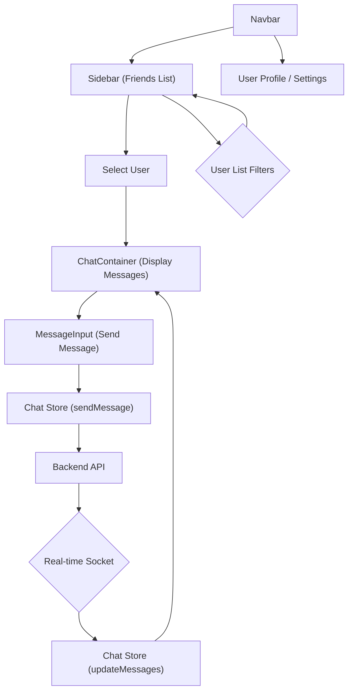

# User Interface Components

The chat application's user interface is built using a set of reusable React components located within the `frontend/src/components` directory. These components are responsible for rendering various parts of the application, from displaying messages and user lists to handling input and navigation. This document details the core UI components, their functionalities, and how they interact.

## Core UI Components Overview

The following components are essential for the application's user experience:

*   **`ChatContainer.jsx`**: Manages the display of messages within a chat conversation, handling message loading, scrolling, and rendering individual messages.
*   **`MessageInput.jsx`**: Provides the interface for users to type and send messages, including text and image attachments.
*   **`Navbar.jsx`**: The primary navigation bar, offering links to profiles, settings, and friend management.
*   **`Sidebar.jsx`**: Displays a list of friends or users, allowing selection to initiate or switch conversations.

### `ChatContainer.jsx`

The `ChatContainer` component is the central hub for displaying active chat conversations. It dynamically renders messages, manages scrolling to the latest message, and integrates with the `MessageInput` for sending new messages.

**Key Features:**

*   **Message Display**: Iterates through an array of messages to render each one, distinguishing between messages sent by the authenticated user and those from the selected contact.
*   **Real-time Updates**: Subscribes to message updates to ensure new messages are immediately displayed.
*   **Auto-Scroll**: Automatically scrolls to the bottom of the chat window when new messages arrive.
*   **Loading State**: Displays a skeleton loader while messages are being fetched.

```jsx title="frontend/src/components/ChatContainer.jsx"
// Fetches messages and subscribes to real-time updates
useEffect(() => {
    getMessages(selectedUser._id);
    subscribeToMessages();

    return () => unsubscribeFromMessages();
}, [selectedUser._id, getMessages, subscribeToMessages, unsubscribeFromMessages]);

// Scrolls to the latest message whenever messages array changes
useEffect(() => {
    if(messageEndRef.current && messages){
        messageEndRef.current.scrollIntoView({behaviour : "smooth"})
    }
}, [messages])
```
The `ChatContainer` uses two `useEffect` hooks: one for fetching messages and subscribing to real-time updates based on the `selectedUser`, and another to automatically scroll to the bottom of the chat whenever new messages are added.

[View on GitHub](https://github.com/shinymack/Chat-App-MERN/blob/main/frontend/src/components/ChatContainer.jsx#L18-L30)

```jsx title="frontend/src/components/ChatContainer.jsx"
// Rendering individual messages based on sender and current user
{messages.map((message) => (
    <div
        key={message._id}
        className={`chat ${message.senderId == authUser._id ? "chat-end": "chat-start"} `}
        ref={messageEndRef}
    >
        <div className="chat-image avatar">
            <div className="size-9 rounded-full border">
                
            </div>
        </div>
        <div className="chat-header mb-1">
            <time className="text-xs opacity-50 ml-1">{formatMessageTime(message.createdAt)}</time>
        </div>
        <div className="chat-bubble flex flex-col">
            {message.image && (
                
            )}
            {message.text && <p>{message.text}</p>}
        </div>
    </div>
))}
```
Each message is rendered conditionally based on whether the `senderId` matches the `authUser._id`, applying appropriate CSS classes (`chat-end` or `chat-start`) to position the message bubble. It also handles displaying image attachments.

[View on GitHub](https://github.com/shinymack/Chat-App-MERN/blob/main/frontend/src/components/ChatContainer.jsx#L41-L68)

### `MessageInput.jsx`

This component provides the user interface for composing and sending messages. It supports both text and image attachments.

**Key Features:**

*   **Text Input**: A standard input field for typing messages.
*   **Image Attachment**: Allows users to select and preview images before sending.
*   **Send Functionality**: Triggers the `sendMessage` action from the chat store.
*   **Preview Management**: Displays a preview of the attached image and allows removal.

```jsx title="frontend/src/components/MessageInput.jsx"
// Handles image file selection and sets up a preview
const handleImageChange = (e) => {
    const file = e.target.files[0];
    if (!file.type.startsWith("image/")) {
        toast.error("Please select an image file");
        return;
    }

    const reader = new FileReader();
    reader.onloadend = () => {
        setImagePreview(reader.result);
    };
    reader.readAsDataURL(file);
};
```
The `handleImageChange` function is responsible for validating the selected file (ensuring it's an image) and generating a data URL for the image preview.

[View on GitHub](https://github.com/shinymack/Chat-App-MERN/blob/main/frontend/src/components/MessageInput.jsx#L15-L26)

```jsx title="frontend/src/components/MessageInput.jsx"
// Submits the message (text and/or image)
const handleSendMessage = async (e) => {
    e.preventDefault();
    if (!text.trim() && !imagePreview) return; // Prevent sending empty messages

    try {
        await sendMessage({
            text: text.trim(),
            image: imagePreview,
        });

        setText(""); // Clear input field
        setImagePreview(null); // Clear image preview
        if (fileInputRef.current) fileInputRef.current = ""; // Reset file input
    } catch (error) {
        console.error("Failed to send message", error);
    }
};
```
The `handleSendMessage` function asynchronously sends the message content (text and/or image). After successful transmission, it resets the input fields and image preview.

[View on GitHub](https://github.com/shinymack/Chat-App-MERN/blob/main/frontend/src/components/MessageInput.jsx#L34-L49)

### `Navbar.jsx`

The `Navbar` component provides global navigation and user authentication features, prominently displayed at the top of the application.

**Key Features:**

*   **Brand Logo/Link**: Navigates to the home screen.
*   **Friends Toggle**: Opens/closes the friends list sidebar.
*   **Profile/Settings Links**: Directs users to their profile and application settings.
*   **Logout Functionality**: Allows users to sign out of the application.

```jsx title="frontend/src/components/Navbar.jsx"
// Navbar structure with conditional rendering for authenticated user links
<header
    className=" bg-base-100 border-b border-base-300 fixed w-full top-0 z-40
        backdrop-blur-lg bg-base-100/80"
>
    <div className="container mx-auto px-4 h-16">
        <div className="flex items-center justify-between h-full">
            <div className="flex items-center gap-8">
                <Link
                    to="/"
                    className="flex items-center gap-2.5 hover:opacity-80 transition-all"
                >
                    <div className="size-9 rounded-lg bg-primary/10 flex items-center justify-center">
                        <MessageSquare className="size-5 text-primary"></MessageSquare>
                    </div>
                    <h1 className="text-lg font-bold">ShinyChat</h1>
                </Link>
            </div>
            <div className="flex items-center gap-4">
                <button className="btn btn-sm gap-2" onClick={toggleFriendsBox}>
                    <Users className="size-5" />
                    <span className="hidden sm:inline">Friends</span>
                </button>
                <Link to={"/settings"}
                className={`btn btn-sm gap-2 transition-colors`}>
                <Settings className="size-4"/>
                <span className="hidden sm:inline">Settings</span>

                </Link>
                {authUser && ( // Links only visible if user is authenticated
                <>
                    <Link to={"/profile"} className={`btn btn-sm gap-2`}>
                    <User className="size-5" />
                    <span className="hidden sm:inline">Profile</span>
                    </Link>

                    <button className="btn btn-sm flex gap-2 items-center" onClick={logout}>
                    <LogOut className="size-5" />
                    <span className="hidden sm:inline">Logout</span>
                    </button>
                </>
                )}
            </div>
        </div>
    </div>
</header>
```
The `Navbar` includes a brand link, a button to toggle the friends list, and conditional links for `Settings`, `Profile`, and `Logout` that are only visible when a user is authenticated (`authUser` is present).

[View on GitHub](https://github.com/shinymack/Chat-App-MERN/blob/main/frontend/src/components/Navbar.jsx#L14-L63)

### `Sidebar.jsx`

The `Sidebar` component displays a list of available users or friends, allowing the authenticated user to select a contact to chat with.

**Key Features:**

*   **User List Display**: Shows a list of users fetched from the application's state.
*   **User Selection**: Allows clicking on a user to set them as the `selectedUser`, triggering the display of their chat history in `ChatContainer`.
*   **Online Status Indicator**: Displays a visual indicator for online users.
*   **Online Filter**: Provides an option to filter the list to show only online users.

```jsx title="frontend/src/components/Sidebar.jsx"
// Fetches friends list upon component mount
useEffect(() => {
    getFriends();
}, [getFriends]);

// Filters users based on the 'showOnlineOnly' state
const filteredUsers = showOnlineOnly
    ? users.filter((user) => onlineUsers.includes(user._id))
    : users;
```
The `Sidebar` uses `useEffect` to fetch the list of friends when the component mounts. It also dynamically filters this list based on the `showOnlineOnly` state and the `onlineUsers` array from the authentication store.

[View on GitHub](https://github.com/shinymack/Chat-App-MERN/blob/main/frontend/src/components/Sidebar.jsx#L15-L21)

```jsx title="frontend/src/components/Sidebar.jsx"
// Rendering logic for each user in the sidebar
{filteredUsers.map((user) => (
    <button
        key={user._id}
        onClick={() => setSelectedUser(user)}
        className={`sm:w-full w-[88vw] p-3 flex items-center gap-3 hover:bg-base-300 transition-colors
        ${
            selectedUser?._id === user._id
                ? "bg-base-300 ring-1 ring-base-300"
                : ""
        }`}
    >
        <div className="relative mx-0">
            
            {onlineUsers.includes(user._id) && ( // Online status indicator
                <span className="absolute bottom-0 right-0 size-3 bg-green-500 rounded-full ring-2 ring-zinc-900" />
            )}
        </div>
        <div className=" block text-left min-w-0">
            <div className=" font-medium truncate">
                {user.username}
            </div>
            <div className="text-sm text-zinc-400">
                {onlineUsers.includes(user._id)
                    ? "Online"
                    : "Offline"}
            </div>
        </div>
    </button>
))}
```
This snippet shows how `Sidebar` maps through `filteredUsers` to render each user as a clickable button. It highlights the currently selected user and displays an online/offline status indicator based on the `onlineUsers` array.

[View on GitHub](https://github.com/shinymack/Chat-App-MERN/blob/main/frontend/src/components/Sidebar.jsx#L50-L86)

## Component Interaction Flow

The UI components interact dynamically to provide a seamless chat experience.





This diagram illustrates the primary flow: The "Navbar" can open the "Sidebar" (friends list). From the "Sidebar", a user selection triggers "ChatContainer" to display messages. "MessageInput" allows sending messages, which interact with the "Chat Store" and "Backend API". Real-time updates from the "Backend API" via a socket update the "Chat Store" and consequently the "ChatContainer". The "Sidebar" also includes user list filters.

## Data Flow within UI Components

The components extensively use Zustand stores (`useChatStore`, `useAuthStore`) for state management, facilitating a clear data flow.

```mermaid
flowchart LR
    A["User Action"] --> B["MessageInput Component"];
    B -- "sends message data" --> C["useChatStore (sendMessage)"];
    C -- "calls API" --> D["Backend API"];
    D -- "message saved & emitted" --> E["WebSocket Server"];
    E -- "real-time message" --> F["useChatStore (subscribeToMessages)"];
    F -- "updates 'messages' state" --> G["ChatContainer Component"];
    G -- "renders new message" --> H["User Interface"];

    I["User Selects Friend"] --> J["Sidebar Component"];
    J -- "sets 'selectedUser'" --> K["useChatStore"];
    K --> G;
    K -- "triggers 'getMessages'" --> C;
    C -- "fetches historical messages" --> D;
```





This flowchart details the data flow. A "User Action" in "MessageInput" triggers `sendMessage` in `useChatStore`, which interacts with the "Backend API". Messages are then propagated via the "WebSocket Server" back to `useChatStore` (through `subscribeToMessages`), ultimately updating the "ChatContainer" and the "User Interface". Similarly, selecting a friend in the "Sidebar" updates `selectedUser` in `useChatStore`, which then triggers message fetching and updates "ChatContainer".

## Key Integration Points

*   **Zustand Stores**: Both `ChatContainer`, `MessageInput`, `Navbar`, and `Sidebar` heavily rely on `useChatStore` and `useAuthStore` for managing application state (e.g., `selectedUser`, `messages`, `authUser`, `onlineUsers`). This centralized state management ensures consistency and simplifies data propagation across components.
*   **Real-time Communication**: The `ChatContainer` component, through `useChatStore`, integrates with WebSocket services to receive real-time message updates, ensuring that conversations are always current without manual refreshing.
*   **Conditional Rendering**: Components like `ChatContainer` and `Sidebar` use conditional rendering to display loading skeletons or filtered content based on data availability and user preferences, enhancing perceived performance and user experience.
*   **Router Integration**: The `Navbar` component uses `react-router-dom`'s `Link` component for declarative navigation, allowing users to move between different sections of the application seamlessly.

These UI components collectively form the interactive core of the chat application, demonstrating a modular and state-driven approach to building a responsive and feature-rich user interface.

Next: [Pages and Navigation](./3.2_pages-and-navigation.mdx)