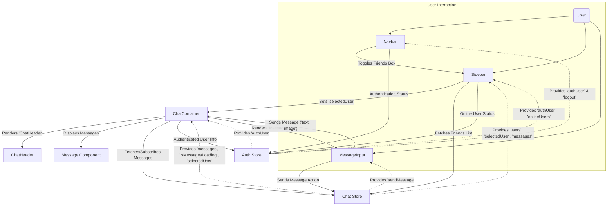
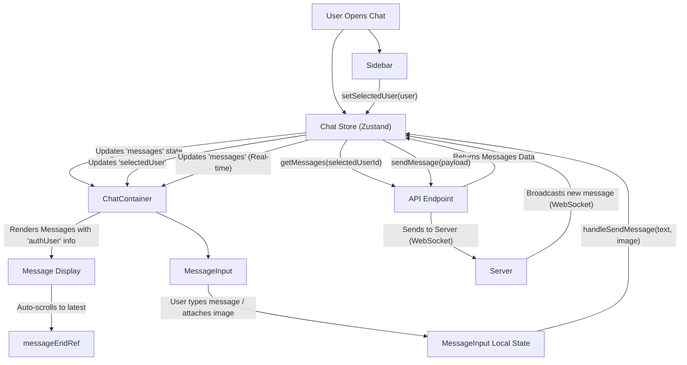

# User Interface Components

<TOC />

This section provides an in-depth look at the primary User Interface (UI) components that construct the ShinyChat application's visual layout and handle user interactions. These components are built with React and leverage a combination of local state, global state management (Zustand), and utility functions to deliver a seamless user experience.

Each component is designed for reusability and maintainability, encapsulating specific parts of the UI and their associated logic. We'll explore their responsibilities, dependencies, and how they integrate to form the complete application interface.

## Core UI Components

The application's UI is composed of several key components, each serving a distinct purpose:

*   **Navbar**: Provides global navigation and user-specific actions.
*   **Sidebar**: Displays a list of friends and allows selection of a chat partner.
*   **ChatContainer**: Renders the conversation history for the selected user.
*   **MessageInput**: Facilitates sending text and image messages.

Let's delve into each component's functionality and implementation details.

### Navbar

The `Navbar` component serves as the application's global header, offering navigation links and user-related actions such as logging out. It dynamically displays profile and logout options if a user is authenticated.

**Key Features:**

*   **Branding & Home Link**: Displays the application logo and name, linking to the home page.
*   **Friend List Toggle**: Includes a button to toggle the visibility of the friends list (Sidebar), crucial for responsive layouts.
*   **Navigation Links**: Provides links to "Settings" and "Profile" pages.
*   **Authentication State**: Conditionally renders "Profile" and "Logout" buttons based on the user's authentication status, utilizing `useAuthStore`.

**Integration Points:**

The `Navbar` interacts with the `useAuthStore` to determine the authentication status and trigger the `logout` action. It also uses `useChatStore` to control the visibility of the `Sidebar` via `toggleFriendsBox`.

```jsx twoslash {5,10,19-21,28}
// frontend/src/components/Navbar.jsx
import { Link } from "react-router-dom";
import { useAuthStore } from "../store/useAuthStore";
import { LogOut, MessageSquare, Settings, User, Users } from "lucide-react";
import { useChatStore } from "../store/useChatStore"; // [tl]

const Navbar = () => {
  const { logout, authUser } = useAuthStore(); // [tl]
  const { toggleFriendsBox } = useChatStore(); // [tl]

  return (
    <header className="bg-base-100 border-b border-base-300 fixed w-full top-0 z-40 backdrop-blur-lg bg-base-100/80">
      <div className="container mx-auto px-4 h-16">
        <div className="flex items-center justify-between h-full">
          <div className="flex items-center gap-8">
            <Link to="/" className="flex items-center gap-2.5 hover:opacity-80 transition-all">
              <div className="size-9 rounded-lg bg-primary/10 flex items-center justify-center">
                <MessageSquare className="size-5 text-primary"></MessageSquare>
              </div>
              <h1 className="text-lg font-bold">ShinyChat</h1>
            </Link>
          </div>
          <div className="flex items-center gap-4">
            <button className="btn btn-sm gap-2" onClick={toggleFriendsBox}> {/* [tl] */}
              <Users className="size-5" />
              <span className="hidden sm:inline">Friends</span>
            </button>
            <Link to={"/settings"} className={`btn btn-sm gap-2 transition-colors`}>
              <Settings className="size-4" />
              <span className="hidden sm:inline">Settings</span>
            </Link>
            {authUser && ( // [tl]
              <>
                <Link to={"/profile"} className={`btn btn-sm gap-2`}>
                  <User className="size-5" />
                  <span className="hidden sm:inline">Profile</span>
                </Link>
                <button className="btn btn-sm flex gap-2 items-center" onClick={logout}>
                  <LogOut className="size-5" />
                  <span className="hidden sm:inline">Logout</span>
                </button>
              </>
            )}
          </div>
        </div>
      </div>
    </header>
  );
};

export default Navbar;
```
[View on GitHub](https://github.com/shinymack/Chat-App-MERN/blob/main/frontend/src/components/Navbar.jsx)

### Sidebar

The `Sidebar` component lists the user's friends, allowing them to select a friend to chat with. It also provides a filter to display only online users and indicates the online status of each friend.

**Key Features:**

*   **Friend List Display**: Renders a scrollable list of friends retrieved from `useChatStore`.
*   **Online/Offline Status**: Visually indicates if a friend is online using `onlineUsers` from `useAuthStore` and a small status indicator.
*   **Online-Only Filter**: A checkbox allows users to filter the list to show only currently online friends.
*   **User Selection**: Clicking on a friend sets them as the `selectedUser` in `useChatStore`, triggering the `ChatContainer` to display their messages.
*   **Responsive Hiding**: The sidebar intelligently hides itself on smaller screens when a user is selected, prioritizing the chat view.

**Integration Points:**

The `Sidebar` heavily relies on `useChatStore` to `getFriends`, access the `users` list, `selectedUser`, and update the `setSelectedUser` state. It also subscribes to `onlineUsers` from `useAuthStore` to display real-time online statuses.

```jsx twoslash {6-7,10-12,23-26,50-51}
// frontend/src/components/Sidebar.jsx
import { useEffect, useState } from "react";
import { useChatStore } from "../store/useChatStore";
import SidebarSkeleton from "./skeletons/SidebarSkeleton";
import { Users } from "lucide-react";
import { useAuthStore } from "../store/useAuthStore"; // [tl]

const Sidebar = () => {
    const { getFriends, users, selectedUser, setSelectedUser, isUsersLoading } =
        useChatStore(); // [tl]

    const { onlineUsers } = useAuthStore(); // [tl]
    const [showOnlineOnly, setShowOnlineOnly] = useState(false);

    useEffect(() => {
        getFriends();
    }, [getFriends]);

    const filteredUsers = showOnlineOnly
        ? users.filter((user) => onlineUsers.includes(user._id))
        : users;

    if (isUsersLoading) return <SidebarSkeleton />;
    return (
        <div className={`h-full sm:w-72 sm:border-r border-base-300  flex-col transition-all duration-200 ${selectedUser ? "hidden sm:flex w-[100vw]" : ""}`}> {/* [tl] */}
            <div className="border-b border-base-300  p-5">
                <div className="flex items-center gap-2">
                    <Users className="size-6"></Users>
                    <span className="font-medium  lg:block">Friends</span>
                </div>
                <div className="mt-3 lg:flex items-center gap-2">
                    <label className="cursor-pointer flex items-center gap-2">
                        <input
                            type="checkbox"
                            checked={showOnlineOnly}
                            onChange={(e) => setShowOnlineOnly(e.target.checked)}
                            className="checkbox checkbox-sm"
                        />
                        <span className="text-sm">Show online only</span>
                    </label>
                    <span className="text-xs text-zinc-500">
                          ({users.filter(friend => onlineUsers.includes(friend._id)).length} online)
                    </span>
                </div>
                <div className="overflow-y-scroll h-[calc(100vh-14rem)] w-full flex flex-col py-3">
                    {filteredUsers.map((user) => (
                        <button
                            key={user._id}
                            onClick={() => setSelectedUser(user)} // [tl]
                            className={`sm:w-full w-[88vw] p-3 flex items-center gap-3 hover:bg-base-300 transition-colors ${selectedUser?._id === user._id ? "bg-base-300 ring-1 ring-base-300" : ""}`}
                        >
                            <div className="relative mx-0">
                                
                                {onlineUsers.includes(user._id) && ( // [tl]
                                    <span className="absolute bottom-0 right-0 size-3 bg-green-500 rounded-full ring-2 ring-zinc-900" />
                                )}
                            </div>
                            <div className="block text-left min-w-0">
                                <div className="font-medium truncate">{user.username}</div>
                                <div className="text-sm text-zinc-400">
                                    {onlineUsers.includes(user._id) ? "Online" : "Offline"}
                                </div>
                            </div>
                        </button>
                    ))}
                </div>
                {filteredUsers.length == 0 && (
                    <div className="text-center text-zinc-500 py-4">No online friends</div>
                )}
            </div>
        </div>
    );
};

export default Sidebar;
```
[View on GitHub](https://github.com/shinymack/Chat-App-MERN/blob/main/frontend/src/components/Sidebar.jsx)

### ChatContainer

The `ChatContainer` is the central component for displaying messages. It fetches and renders messages for the `selectedUser`, handles real-time updates, and ensures the chat automatically scrolls to the newest message.

**Key Features:**

*   **Message Display**: Renders individual messages, distinguishing between sent and received messages.
*   **Real-time Updates**: Uses `subscribeToMessages` and `unsubscribeFromMessages` from `useChatStore` to listen for new messages via WebSockets.
*   **Automatic Scrolling**: Utilizes `useRef` and `useEffect` to automatically scroll to the bottom of the chat when new messages arrive.
*   **Message Header**: Includes `ChatHeader` to display information about the selected chat partner.
*   **Message Input Integration**: Incorporates `MessageInput` at the bottom for sending new messages.
*   **Loading State**: Displays a `MessageSkeleton` while messages are being loaded.

**Integration Points:**

This component is tightly coupled with `useChatStore` for message data (`messages`), loading status (`isMessagesLoading`), and real-time subscription methods. It also uses `useAuthStore` to identify the `authUser` and differentiate between sent and received messages.

```jsx twoslash {7,11-13,20-22,24-28,30-34,51}
// frontend/src/components/ChatContainer.jsx
import { useEffect, useRef } from "react"; // [tl]
import { useChatStore } from "../store/useChatStore";
import ChatHeader from "./ChatHeader";
import MessageInput from "./MessageInput";
import MessageSkeleton from "./skeletons/MessageSkeleton";
import { useAuthStore } from "../store/useAuthStore"; // [tl]
import { formatMessageTime } from "../lib/utils";

const ChatContainer = () => {
    const { messages, getMessages, isMessagesLoading, selectedUser, subscribeToMessages, unsubscribeFromMessages } =
        useChatStore(); // [tl]
    const { authUser } = useAuthStore(); // [tl]
    const messageEndRef = useRef(null); // [tl]

    useEffect(() => {
        if (selectedUser?._id) { // Only fetch if a user is selected
            getMessages(selectedUser._id);
            subscribeToMessages();
        }

        return () => {
            if (selectedUser?._id) { // Only unsubscribe if a user was selected
                unsubscribeFromMessages();
            }
        };
    }, [selectedUser?._id, getMessages, subscribeToMessages, unsubscribeFromMessages]); // [tl] dependency array

    useEffect(() => {
        if (messageEndRef.current && messages) {
            messageEndRef.current.scrollIntoView({ behavior: "smooth" }); // [tl]
        }
    }, [messages]); // [tl]

    if (isMessagesLoading)
        return (
            <div className="flex-1 flex flex-col overflow-auto">
                <ChatHeader />
                <MessageSkeleton />
                <MessageInput />
            </div>
        );
    return (
        <div className="flex-1 flex flex-col overflow-auto">
            <ChatHeader />
            <div className="flex-1 overflow-y-auto p-4 space-y-4">
                {messages.map((message) => (
                    <div
                        key={message._id}
                        className={`chat ${message.senderId == authUser._id ? "chat-end" : "chat-start"} `} // [tl]
                        ref={messageEndRef}
                    >
                        <div className="chat-image avatar">
                            <div className="size-9 rounded-full border">
                                
                            </div>
                        </div>
                        <div className="chat-header mb-1">
                            <time className="text-xs opacity-50 ml-1">{formatMessageTime(message.createdAt)}</time>
                        </div>
                        <div className="chat-bubble flex flex-col">
                            {message.image && (
                                
                            )}
                            {message.text && <p>{message.text}</p>}
                        </div>
                    </div>
                ))}
            </div>
            <MessageInput />
        </div>
    );
};

export default ChatContainer;
```
[View on GitHub](https://github.com/shinymack/Chat-App-MERN/blob/main/frontend/src/components/ChatContainer.jsx)

### MessageInput

The `MessageInput` component provides the interface for users to compose and send messages. It supports both text and image attachments, including a preview functionality for images.

**Key Features:**

*   **Text Input**: A standard input field for typing messages.
*   **Image Attachment**: Allows users to select an image file to include with their message.
*   **Image Preview & Removal**: Displays a preview of the selected image and a button to remove it before sending.
*   **Send Button**: Submits the message (text and/or image) using the `sendMessage` action from `useChatStore`.
*   **Validation**: Prevents sending empty messages (no text and no image).
*   **Input Reset**: Clears the text input and image preview after a message is sent.

**Integration Points:**

The `MessageInput` component interacts directly with `useChatStore` to dispatch the `sendMessage` action. It also uses local state (`useState`) to manage the current text input and the selected image preview.

```jsx twoslash {6,11-12,41,86}
// frontend/src/components/MessageInput.jsx
import { useRef, useState } from "react";
import { useChatStore } from "../store/useChatStore"; // [tl]
import { Image, Send, X } from "lucide-react";
import toast from "react-hot-toast";

const MessageInput = () => {
    const [text, setText] = useState("");
    const [imagePreview, setImagePreview] = useState(null);
    const fileInputRef = useRef(null);
    const { sendMessage } = useChatStore(); // [tl]

    const handleImageChange = (e) => {
        const file = e.target.files[0];
        if (!file || !file.type.startsWith("image/")) {
            toast.error("Please select an image file");
            return;
        }

        const reader = new FileReader();
        reader.onloadend = () => {
            setImagePreview(reader.result);
        };
        reader.readAsDataURL(file);
    };

    const removeImage = () => {
        setImagePreview(null);
        if (fileInputRef.current) fileInputRef.current.value = "";
    };

    const handleSendMessage = async (e) => {
        e.preventDefault();
        if (!text.trim() && !imagePreview) return;

        try {
            await sendMessage({ // [tl]
                text: text.trim(),
                image: imagePreview,
            });

            setText("");
            setImagePreview(null);
            if (fileInputRef.current) fileInputRef.current.value = ""; // Correctly reset file input
        } catch (error) {
            console.error("Failed to send message", error);
        }
    };

    return (
        <div className="p-4 w-full">
            {imagePreview && (
                <div className="mb-3 flex items-center gap-2">
                    <div className="relative">
                        
                        <button
                            onClick={removeImage}
                            className="absolute -top-1.5 -right-1.5 w-5 h-5 rounded-full bg-base-300 flex items-center justify-center"
                            type="button"
                        >
                            <X className="size-3" />
                        </button>
                    </div>
                </div>
            )}

            <form onSubmit={handleSendMessage} className="flex items-center gap-2">
                <div className="flex flex-1 gap-2">
                    <input
                        type="text"
                        className="w-full input input-bordered rounded-lg input-sm sm:input-md"
                        placeholder="Type a message..."
                        value={text}
                        onChange={(e) => setText(e.target.value)}
                    />
                    <input
                        type="file"
                        accept="image/*"
                        className="hidden"
                        ref={fileInputRef}
                        onChange={handleImageChange}
                    />
                    <button
                        type="button"
                        className={`hidden sm:flex btn btn-circle ${imagePreview ? "text-emerald-500" : "text-zinc-400"}`}
                        onClick={() => fileInputRef.current?.click()} // [tl]
                    >
                        <Image size={20} />
                    </button>
                </div>

                <button
                    type="submit"
                    className="btn btn-sm btn-circle"
                    disabled={!text.trim() && !imagePreview}
                >
                    <Send size={22} />
                </button>
            </form>
        </div>
    );
};

export default MessageInput;
```
[View on GitHub](https://github.com/shinymack/Chat-App-MERN/blob/main/frontend/src/components/MessageInput.jsx)

## Component Interaction Flow

The UI components interact dynamically to provide a responsive and intuitive chat experience. The state management solution (Zustand) plays a crucial role in orchestrating these interactions.





## Chat Data Flow Diagram

This diagram illustrates the primary data flow related to chat functionality, focusing on how messages are fetched, displayed, and sent across the main components.





## Key Integration Points

The seamless operation of these UI components relies heavily on a well-defined architecture, particularly concerning state management and data fetching.

*   **Zustand for Global State**: The `useChatStore` and `useAuthStore` hooks, built with Zustand, centralize the application's global state. This allows components like `Navbar`, `Sidebar`, and `ChatContainer` to access and modify shared data (e.g., `authUser`, `selectedUser`, `messages`, `onlineUsers`) without prop drilling.
*   **Real-time Communication**: The `ChatContainer` actively subscribes to real-time message updates via WebSockets, managed through `useChatStore`. This ensures that conversations are always up-to-date for both the sender and receiver.
*   **Modular Design**: Each component is responsible for a specific part of the UI. For instance, `MessageInput` handles message composition, while `ChatContainer` focuses on message display. This separation of concerns enhances readability, testability, and reusability.
*   **Dynamic UI**: Components like `Sidebar` adapt their display based on `selectedUser` status, demonstrating responsive design principles. The `Navbar` also reacts to authentication changes, providing a personalized experience.
*   **Utility Functions**: Helper functions like `formatMessageTime` (`frontend/src/lib/utils/formatMessageTime.js` - [View on GitHub](https://github.com/shinymack/Chat-App-MERN/blob/main/frontend/src/lib/utils/formatMessageTime.js)) are used across components to maintain consistent data formatting and avoid duplication.

These UI components, combined with robust state management and real-time capabilities, form the foundation of a modern and interactive chat application.

Next: [Frontend State Management and Utilities](./3.2_frontend-state-management-and-utilities.mdx)