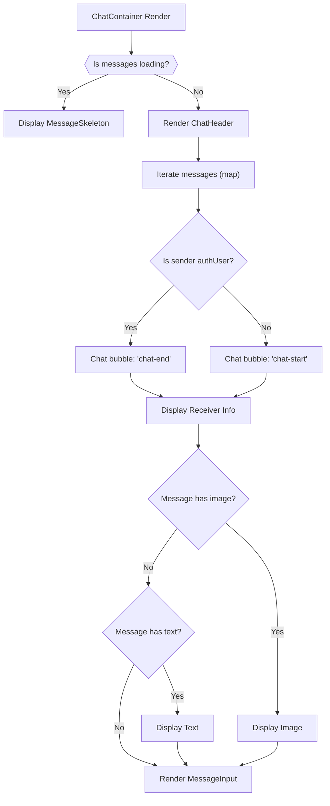

# User Interface Components

This section provides an in-depth look into the core React components that constitute the application's user interface. These components are designed for reusability and encapsulate specific functionalities related to chat, user management, and message interaction. Each component plays a vital role in rendering a dynamic and interactive user experience.

## ChatContainer

The `ChatContainer` component is responsible for displaying the main chat interface, including messages, the chat header, and the message input area. It dynamically renders messages, manages real-time message updates, and ensures the chat view automatically scrolls to the latest message.

### Key Features:

*   **Message Display**: Iterates through fetched messages to render individual chat bubbles.
*   **Real-time Updates**: Subscribes to and unsubscribes from message updates using the `useChatStore`.
*   **Dynamic Scrolling**: Automatically scrolls to the latest message when new messages arrive or when the component mounts.
*   **Loading State**: Displays a `MessageSkeleton` while messages are being loaded.
*   **User Context**: Differentiates between sender and receiver messages based on `authUser` and `selectedUser` IDs.
*   **Media Handling**: Renders image attachments within messages.

### Component Structure:

```jsx
// frontend/src/components/ChatContainer.jsx
import { useEffect, useRef } from "react";
import { useChatStore } from "../store/useChatStore";
import ChatHeader from "./ChatHeader";
import MessageInput from "./MessageInput";
import MessageSkeleton from "./skeletons/MessageSkeleton";
import { useAuthStore } from "../store/useAuthStore";
import { formatMessageTime } from "../lib/utils";

const ChatContainer = () => {
    // ... component logic ...
};

export default ChatContainer;
```

*   **`useEffect` for Message Fetching and Subscription**:
    This hook handles fetching messages for the currently `selectedUser` and sets up a real-time message subscription. It also ensures proper cleanup by unsubscribing when the component unmounts or `selectedUser` changes.

    ```jsx
    // frontend/src/components/ChatContainer.jsx lines 17-23
    useEffect(() => {
        getMessages(selectedUser._id);
        subscribeToMessages();

        return () => unsubscribeFromMessages();
    }, [selectedUser._id, getMessages, subscribeToMessages, unsubscribeFromMessages]);
    ```
    [View on GitHub](https://github.com/shinymack/Chat-App-MERN/blob/main/frontend/src/components/ChatContainer.jsx#L17-L23)

*   **`useEffect` for Auto-Scrolling**:
    This effect uses a `useRef` to automatically scroll the chat view to the bottom whenever the `messages` array updates, providing a smooth user experience.

    ```jsx
    // frontend/src/components/ChatContainer.jsx lines 25-29
    useEffect(() => {
        if(messageEndRef.current && messages){
            messageEndRef.current.scrollIntoView({behaviour : "smooth"})
        }
    }, [messages])
    ```
    [View on GitHub](https://github.com/shinymack/Chat-App-MERN/blob/main/frontend/src/components/ChatContainer.jsx#L25-L29)

### Chat Message Rendering Flow





## FriendsBox

The `FriendsBox` component provides a modal interface for users to manage their friends, including sending, accepting, rejecting, and removing friend requests. It features a tabbed navigation for different friend states: "Friends," "Pending Requests," and "Sent Requests."

### Key Features:

*   **Friend Management**: Functionality to send friend requests, accept, reject, and remove friends.
*   **Tabbed Navigation**: Organizes friends, pending requests, and sent requests into separate tabs.
*   **Real-time Data Fetching**: Fetches all necessary friend-related data (`users`, `pendingRequests`, `sentRequests`) upon mounting.
*   **Responsive UI**: Appears as a fixed overlay, ensuring focus on friend management.
*   **Input Validation**: Basic validation for friend request identifier.

### Component Structure:

```jsx
// frontend/src/components/FriendsBox.jsx
import { useEffect, useState } from 'react';
import { useChatStore } from '../store/useChatStore';
import { X, UserPlus, Check, Trash2 } from 'lucide-react';

const FriendsBox = () => {
    // ... component logic ...
};

export default FriendsBox;
```

*   **Initial Data Fetching**:
    On component mount, `useEffect` ensures that all relevant friend data from `useChatStore` is fetched, keeping the UI updated.

    ```jsx
    // frontend/src/components/FriendsBox.jsx lines 17-22
    useEffect(() => {
        getFriends();
        getPendingRequests();
        getSentRequests();
    }, [getFriends, getPendingRequests, getSentRequests]);
    ```
    [View on GitHub](https://github.com/shinymack/Chat-App-MERN/blob/main/frontend/src/components/FriendsBox.jsx#L17-L22)

*   **Conditional Content Rendering**:
    The `renderContent` function dynamically displays the appropriate list of users or requests based on the `activeTab` state.

    ```jsx
    // frontend/src/components/FriendsBox.jsx lines 29-93
    const renderContent = () => {
        switch (activeTab) {
            case 'pending':
                // ... render pending requests ...
            case 'sent':
                // ... render sent requests ...
            case 'friends':
            default:
                // ... render friends list ...
        }
    };
    ```
    [View on GitHub](https://github.com/shinymack/Chat-App-MERN/blob/main/frontend/src/components/FriendsBox.jsx#L29-L93)

## MessageInput

The `MessageInput` component provides an interface for users to compose and send messages, supporting both text and image attachments. It includes functionality for image preview, removal, and submitting messages to the chat.

### Key Features:

*   **Text Input**: Allows users to type and send text messages.
*   **Image Attachment**: Supports attaching images with a preview feature.
*   **Image Preview & Removal**: Displays a preview of the attached image and allows users to remove it before sending.
*   **Validation**: Prevents sending empty messages (no text and no image).
*   **Integration**: Uses `sendMessage` from `useChatStore` to send messages.

### Component Structure:

```jsx
// frontend/src/components/MessageInput.jsx
import { useRef, useState } from "react";
import { useChatStore } from "../store/useChatStore";
import { Image, Send, X } from "lucide-react";
import toast from "react-hot-toast";

const MessageInput = () => {
    // ... component logic ...
};

export default MessageInput;
```

*   **Handling Image Selection**:
    This function processes image file selection, validates the file type, and reads the image as a data URL for preview.

    ```jsx
    // frontend/src/components/MessageInput.jsx lines 13-22
    const handleImageChange = (e) => {
        const file = e.target.files[0];
        if (!file.type.startsWith("image/")) {
            toast.error("Please select an image file");
            return;
        }

        const reader = new FileReader();
        reader.onloadend = () => {
            setImagePreview(reader.result);
        };
        reader.readAsDataURL(file);
    };
    ```
    [View on GitHub](https://github.com/shinymack/Chat-App-MERN/blob/main/frontend/src/components/MessageInput.jsx#L13-L22)

*   **Sending Messages**:
    The `handleSendMessage` function constructs the message payload (text and/or image) and dispatches it via `useChatStore`. It also clears the input fields after successful submission.

    ```jsx
    // frontend/src/components/MessageInput.jsx lines 32-46
    const handleSendMessage = async (e) => {
        e.preventDefault();
        if (!text.trim() && !imagePreview) return;

        try {
            await sendMessage({
                text: text.trim(),
                image: imagePreview,
            });

            setText("");
            setImagePreview(null);
            if (fileInputRef.current) fileInputRef.current = "";
        } catch (error) {
            console.error("Failed to send message", error);
        }
    };
    ```
    [View on GitHub](https://github.com/shinymack/Chat-App-MERN/blob/main/frontend/src/components/MessageInput.jsx#L32-L46)

## Sidebar

The `Sidebar` component displays a list of the user's friends, allowing them to select a friend to initiate or view a chat. It also includes a toggle to filter for online friends and displays the online status of each friend.

### Key Features:

*   **Friends List**: Displays all friends fetched from `useChatStore`.
*   **User Selection**: Allows selecting a friend, which updates the `selectedUser` state in `useChatStore`.
*   **Online Status Indicator**: Visually indicates if a friend is online using a green dot and "Online"/"Offline" text.
*   **Online Filter**: A checkbox to show only online friends.
*   **Loading State**: Displays `SidebarSkeleton` while friends are being loaded.
*   **Responsive Display**: Adapts its visibility based on whether a user is selected on smaller screens.

### Component Structure:

```jsx
// frontend/src/components/Sidebar.jsx
import { useEffect, useState } from "react";
import { useChatStore } from "../store/useChatStore";
import SidebarSkeleton from "./skeletons/SidebarSkeleton";
import { Users } from "lucide-react";
import { useAuthStore } from "../store/useAuthStore";

const Sidebar = () => {
    // ... component logic ...
};

export default Sidebar;
```

*   **Fetching Friends**:
    This `useEffect` hook ensures that the list of friends is fetched when the component mounts, populating the sidebar.

    ```jsx
    // frontend/src/components/Sidebar.jsx lines 14-16
    useEffect(() => {
        getFriends();
    }, [getFriends]);
    ```
    [View on GitHub](https://github.com/shinymack/Chat-App-MERN/blob/main/frontend/src/components/Sidebar.jsx#L14-L16)

*   **Filtering Online Users**:
    The `filteredUsers` computed property dynamically adjusts the list of displayed friends based on the `showOnlineOnly` state and the `onlineUsers` array from `useAuthStore`.

    ```jsx
    // frontend/src/components/Sidebar.jsx lines 17-19
    const filteredUsers = showOnlineOnly
        ? users.filter((user) => onlineUsers.includes(user._id))
        : users;
    ```
    [View on GitHub](https://github.com/shinymack/Chat-App-MERN/blob/main/frontend/src/components/Sidebar.jsx#L17-L19)

## Key Integration Points

These UI components are tightly integrated with the application's global state management, primarily through Zustand stores (`useChatStore` and `useAuthStore`). This approach centralizes data and logic, ensuring consistency across the application.

### Component Interaction Flow


```mermaid
graph TD
    A["Sidebar Component"] -->| "Selects Friend" | B["useChatStore (setSelectedUser)"]
    B -->| "Selected User Update" | C["ChatContainer Component"]
    C -->| "Fetch Messages for selectedUser" | D["useChatStore (getMessages)"]
    C -->| "Subscribe to Messages" | E["useChatStore (subscribeToMessages)"]
    F["MessageInput Component"] -->| "Sends Message (text/image)" | G["useChatStore (sendMessage)"]
    G -->| "New Message Received" | C
    H["FriendsBox Component"] -->| "Add/Accept/Reject/Remove Friend" | I["useChatStore (friend actions)"]
    I -->| "Friends List Update" | H
    I -->| "Friends List Update" | A
    J["useAuthStore"] -->| "Online Users" | A
    J -->| "Auth User Info" | C
```


This diagram illustrates the primary data flow and interaction between the main UI components and the Zustand stores. For instance, selecting a friend in the `Sidebar` directly impacts the `ChatContainer` by triggering message fetches and subscriptions for that specific friend. Similarly, actions performed in the `FriendsBox` update the global `useChatStore` state, which then reflects in the `Sidebar`'s friend list. The `useAuthStore` provides essential user authentication and online status information, crucial for rendering accurate friend statuses in the `Sidebar` and message details in the `ChatContainer`.

Next: [Pages and Navigation](./3.2_pages-and-navigation.mdx)