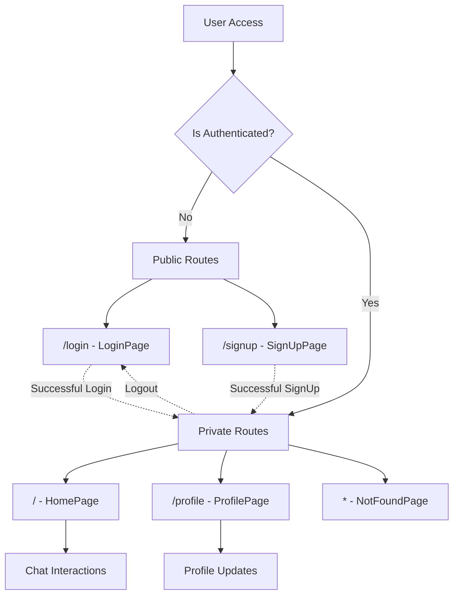
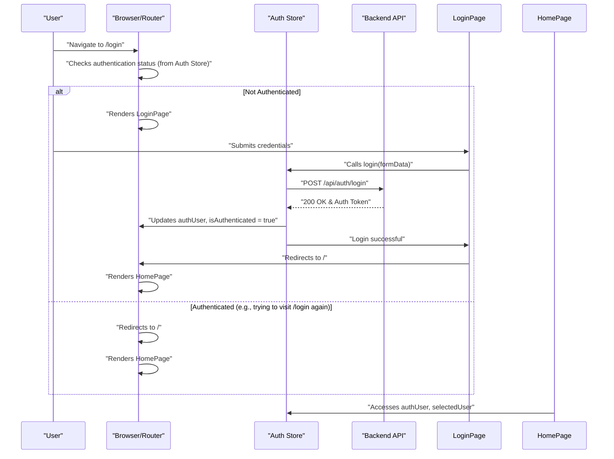

 
---
title: "Frontend Pages and Routing"
description: "Details the main application pages and how navigation between them is handled."
sidebar_position: 32
---

# Frontend Pages and Routing

The frontend of the application is built with React and utilizes `react-router-dom` for navigation, defining distinct pages for core functionalities like authentication, the main chat interface, and user profile management. This section outlines the primary pages, their responsibilities, and how users navigate through the application.

## Core Application Pages

The application structure is organized around several key pages, each serving a specific purpose:

*   **`HomePage.jsx`**: The main interface for chat interactions, displaying the sidebar, chat conversations, and a friends list.
*   **`LoginPage.jsx`**: Handles user authentication, allowing existing users to sign in.
*   **`SignUpPage.jsx`**: Manages new user registration, enabling users to create a new account.
*   **`ProfilePage.jsx`**: Displays and allows users to update their profile information, including profile picture and username.

These pages are designed to be intuitive, providing a seamless user experience across different application states.

### `HomePage.jsx` - The Main Chat Interface

The `HomePage` component serves as the central hub for user interactions. It dynamically renders the chat interface based on the user's selection, integrating various components to provide a complete chat experience.

```jsx
import ChatContainer from "../components/ChatContainer";
import FriendsBox from "../components/FriendsBox";
import NoChatSelected from "../components/NoChatSelected";
import Sidebar from "../components/Sidebar";
import { useChatStore } from "../store/useChatStore"

const HomePage = () => {
  const { selectedUser } = useChatStore();
  const { isFriendsBoxOpen } = useChatStore();
  return (
      <div className="h-screen bg-base-200">
      <div className="flex items-center justify-center pt-20 px-4 w-full">
        <div className="bg-base-100 rounded-lg shadow-xl w-full max-w-6xl h-[calc(100vh-8rem)]">
          <div className="flex h-full rounded-lg overflow-hidden w-full">
            <Sidebar />
            {!selectedUser ? <NoChatSelected /> : <ChatContainer />}
            {isFriendsBoxOpen && <FriendsBox />}
          </div>
        </div>
      </div>
    </div>
  )
}

export default HomePage
```
This snippet illustrates the conditional rendering within `HomePage`. If a user is not `selectedUser`, the `NoChatSelected` component is displayed, prompting the user to pick a chat. Otherwise, the `ChatContainer` is rendered. The `Sidebar` is always present for navigation, and `FriendsBox` appears conditionally.

[View on GitHub](https://github.com/shinymack/Chat-App-MERN/blob/main/frontend/src/pages/HomePage.jsx#L11-L26)

### `LoginPage.jsx` - User Authentication

The `LoginPage` provides a form for users to enter their credentials and sign in. It also supports Google OAuth for a quicker sign-in process and offers a link to the `SignUpPage` for new users.

```jsx
// ... other imports
import { Link } from "react-router-dom";
import AuthImagePattern from "../components/AuthImagePattern";
import { FcGoogle } from "react-icons/fc";

const LoginPage = () => {
  const [showPassword, setShowPassword] = useState(false);
  const [formData, setFormData] = useState({
    email: "",
    password: "",
  })
  const { login, isLoggingIn } = useAuthStore();

  const handleSubmit = async (e) => {
    e.preventDefault();
    login(formData);
  }
  const backendDomain = import.meta.env.VITE_BACKEND_URL;
  const googleAuthUrl = `${backendDomain}/api/auth/google`;
  return (
    <div className="h-screen grid lg:grid-cols-2">
      {/* Left Side - Form */}
      <div className="flex flex-col justify-center items-center p-6 sm:p-12">
        <div className="w-full max-w-md space-y-8">
          {/* Logo */}
          <div className="text-center mb-8">
            <div className="flex flex-col items-center gap-2 group">
              <div
                className="w-12 h-12 rounded-xl bg-primary/10 flex items-center justify-center group-hover:bg-primary/20
              transition-colors"
              >
                <MessageSquare className="w-6 h-6 text-primary" />
              </div>
              <h1 className="text-2xl font-bold mt-2">Welcome Back</h1>
              <p className="text-base-content/60">Sign in to your account</p>
            </div>
          </div>

          {/* Form */}
          <form onSubmit={handleSubmit} className="space-y-6">
            {/* ... email and password input fields ... */}
            <button type="submit" className="btn btn-primary w-full" disabled={isLoggingIn}>
              {isLoggingIn ? (
                <>
                  <Loader2 className="h-5 w-5 animate-spin" />
                  Loading...
                </>
              ) : (
                "Sign in"
              )}
            </button>
          </form>
          <div className="divider text-base-content/60 my-4">OR</div>

          <a
            href={googleAuthUrl} // Link to your backend Google auth route
            className="btn btn-primary btn-outline w-full"
          >
            <FcGoogle className="size-5 mr-2" />
            Sign in with Google
          </a>

          <div className="text-center">
            <p className="text-base-content/60">
              Don&apos;t have an account?{" "}
              <Link to="/signup" className="link link-primary">
                Create account
              </Link>
            </p>
          </div>
        </div>
      </div>
      {/* ... Right Side - Image/Pattern ... */}
    </div>
  )
}

export default LoginPage
```
The `LoginPage` uses `useAuthStore` to handle the login logic, including showing a loading state (`isLoggingIn`). It also includes a `Link` component for navigation to the `/signup` route.

[View on GitHub](https://github.com/shinymack/Chat-App-MERN/blob/main/frontend/src/pages/LoginPage.jsx#L8-L125)

### `SignUpPage.jsx` - New User Registration

Similar to `LoginPage`, the `SignUpPage` facilitates new user registration, complete with form validation, a loading indicator, Google OAuth option, and a link back to the login page.

```jsx
// ... other imports
import { Link } from "react-router-dom";
import AuthImagePattern from "../components/AuthImagePattern";
import toast from "react-hot-toast";
import { FcGoogle } from "react-icons/fc";

const SignUpPage = () => {
  const [showPassword, setShowPassword] = useState(false);
  const [formData, setFormData] = useState({
    username: "",
    email: "",
    password: "",
  });

  const { signup, IsSigningUp } = useAuthStore();

  const validateForm = () => {
    if(!formData.username.trim()) return toast.error("Username is required");
    if(!formData.email.trim()) return toast.error("Email is required");
    if (!/\S+@\S+\.\S+/.test(formData.email)) return toast.error("Invalid email format");
    if (!formData.password) return toast.error("Password is required");
    if (formData.password.length < 6) return toast.error("Password must be at least 6 characters");

    return true;
  };

  const handleSubmit = (e) => {
    e.preventDefault();

    const success = validateForm();
    if(success===true) signup(formData);
  };
  
  const backendDomain = import.meta.env.VITE_BACKEND_URL;
  const googleAuthUrl = `${backendDomain}/api/auth/google`;
  return (
    <div className="min-h-screen grid lg:grid-cols-2">
      {/* left side */}
      <div className="flex flex-col justify-center items-center p-6 sm:p-12">
        {/* ... Logo and form elements ... */}
            <button type="submit" className="btn btn-primary w-full" disabled={IsSigningUp}>
              {IsSigningUp ? (
                <>
                  <Loader2 className="size-5 animate-spin" />
                  Loading...
                </>
              ) : (
                "Create Account"
              )}
            </button>
          </form>
          <div className="divider text-base-content/60 my-4">OR</div>

          <a
            href={googleAuthUrl} // Link to your backend Google auth route
            className="btn btn-primary btn-outline w-full" 
          >
            <FcGoogle className="size-5 mr-2" /> 
            Sign up with Google
          </a>

          <div className="text-center">
            <p className="text-base-content/60">
              Already have an account?{" "}
              <Link to="/login" className="link link-primary">
                Sign in
              </Link>
            </p>
          </div>
        </div>
      </div>
      {/* ... right side ... */}
    </div>
  );
};
export default SignUpPage;
```
The `SignUpPage` includes client-side form validation using `toast` for user feedback and dispatches the `signup` action from `useAuthStore`.

[View on GitHub](https://github.com/shinymack/Chat-App-MERN/blob/main/frontend/src/pages/SignUpPage.jsx#L9-L149)

### `ProfilePage.jsx` - User Profile Management

The `ProfilePage` allows users to view and update their profile details, such as their profile picture and username. It features a debounced username availability check for a smooth editing experience.

```jsx
// ... imports
import toast from "react-hot-toast";
import { axiosInstance } from "../lib/axios"; // Assuming you have this configured instance

const ProfilePage = () => {
	const { authUser, isUpdatingProfile, updateProfile } = useAuthStore();
	const [selectedImg, setSelectedImg] = useState(null);

	const [isEditingUsername, setIsEditingUsername] = useState(false);
	const [newUsername, setNewUsername] = useState(authUser?.username || "");
	const [usernameStatus, setUsernameStatus] = useState({
		checking: false,
		available: true,
		message: "",
	});
	const debounceTimeout = useRef(null);

	const handleImageUpload = async (e) => {
		const file = e.target.files[0];
		if (!file) return;

		const reader = new FileReader();
		reader.readAsDataURL(file);

		reader.onload = async () => {
			const base64Image = reader.result;
			setSelectedImg(base64Image);
			await updateProfile({ profilePic: base64Image });
		};
	};

	// --- Debounced Username Check ---
	useEffect(() => {
		clearTimeout(debounceTimeout.current);
		if (!newUsername.trim() || newUsername.trim().length < 3) {
			setUsernameStatus({ checking: false, available: false, message: "Must be 3+ characters." });
			return;
		}
		if (newUsername === authUser.username) {
			setUsernameStatus({ checking: false, available: true, message: "" });
			return;
		}

		setUsernameStatus((prev) => ({ ...prev, checking: true, message: "Checking..." }));
		debounceTimeout.current = setTimeout(async () => {
			try {
				const res = await axiosInstance.get(`/auth/username/check/${newUsername}`);
				setUsernameStatus({
					checking: false,
					available: res.data.available,
					message: res.data.message,
				});
			} catch (error) {
				const message = error.response?.data?.message || "Error checking username.";
				setUsernameStatus({ checking: false, available: false, message });
			}
		}, 500); // 500ms debounce delay
		return () => clearTimeout(debounceTimeout.current);
	}, [newUsername, authUser.username]);
	// ---------------------------------

	const handleSaveUsername = async () => {
		if (!usernameStatus.available || newUsername === authUser.username) {
			toast.error("Cannot save. Username is either unavailable or unchanged.");
			return;
		}
		await updateProfile({ username: newUsername });
		setIsEditingUsername(false);
	};

	const handleCancelEdit = () => {
		setIsEditingUsername(false);
		setNewUsername(authUser.username);
		setUsernameStatus({ checking: false, available: true, message: "" });
	};

	return (
		<div className="h-screen pt-20">
			<div className="max-w-2xl mx-auto p-4 py-8">
				<div className="bg-base-300 rounded-xl p-6 space-y-8">
					{/* ... profile pic section ... */}
					{/* User Info section  */}
					<div className="space-y-6">
						<div className="space-y-1.5">
							<div className="text-sm text-zinc-400 flex items-center gap-2">
								<User className="w-4 h-4" />
								Username
							</div>
							{!isEditingUsername ? (
								<div className="flex items-center gap-2">
									<p className="px-4 py-2.5 bg-base-200 rounded-lg border flex-grow">
										{authUser?.username}
									</p>
									<button onClick={() => setIsEditingUsername(true)} className="btn btn-ghost btn-sm">
										<Edit className="w-4 h-4" />
									</button>
								</div>
							) : (
								<div className="space-y-2">
									<div className="flex items-center gap-2">
										<input
											type="text"
											value={newUsername}
											onChange={(e) => setNewUsername(e.target.value.toLowerCase())}
											className="input input-bordered w-full"
										/>
										<button onClick={handleSaveUsername} className="btn btn-success btn-sm" disabled={!usernameStatus.available || usernameStatus.checking || isUpdatingProfile}>
											{isUpdatingProfile ? <Loader2 className="w-4 h-4 animate-spin" /> : <Save className="w-4 h-4" />}
										</button>
										<button onClick={handleCancelEdit} className="btn btn-error btn-sm">
											<X className="w-4 h-4" />
										</button>
									</div>
									<div className={`text-xs h-4 ${usernameStatus.available ? 'text-green-500' : 'text-error'}`}>
										{usernameStatus.checking ? <Loader2 className="w-3 h-3 animate-spin inline-block mr-1" /> : null}
										{usernameStatus.message}
									</div>
								</div>
							)}
						</div>
						{/* ... email and account info sections ... */}
					</div>
				</div>
			</div>
		</div>
	);
};

export default ProfilePage;
```
The `ProfilePage` showcases dynamic UI based on `isEditingUsername` state, and a `useEffect` hook with `useRef` to debounce the username availability check, preventing excessive API calls while typing.

[View on GitHub](https://github.com/shinymack/Chat-App-MERN/blob/main/frontend/src/pages/ProfilePage.jsx#L42-L215)

## Routing Structure

The application's routing is managed by `react-router-dom`, defining protected and public routes to ensure a secure and controlled user experience.





This diagram illustrates the primary routing flow: users are directed to public routes (login/signup) if not authenticated, and to private routes (home, profile) if authenticated.

## Key Integration Points

### Authentication Flow and Redirection

The authentication process, encompassing both login and signup, is tightly integrated with `react-router-dom` and the `useAuthStore` Zustand store. Upon successful authentication, users are automatically redirected to the `HomePage`. Conversely, if an authenticated user attempts to access login or signup pages, they are redirected away, typically to the `HomePage`.





This sequence diagram details the user authentication flow, from navigating to the login page, submitting credentials, interacting with the `Auth Store` and `Backend API`, to being redirected upon successful authentication.

### Conditional Component Rendering

Many components on the `HomePage` are rendered conditionally based on the application state, managed by Zustand stores. For example, `ChatContainer` or `NoChatSelected` is displayed based on `selectedUser`, and `FriendsBox` visibility is controlled by `isFriendsBoxOpen`. This approach ensures a responsive and contextually relevant UI.

### Username Availability Check

The `ProfilePage` implements an efficient username availability check. When a user edits their username, a `debounceTimeout` is used to delay API calls to the backend, ensuring that the availability check (`GET /auth/username/check/:username`) only happens after the user has paused typing for a short duration. This optimizes network usage and enhances user experience by providing real-time feedback without overwhelming the server.

Next: [State Management and Utilities](./3.3_state-management-and-utilities.mdx)
```