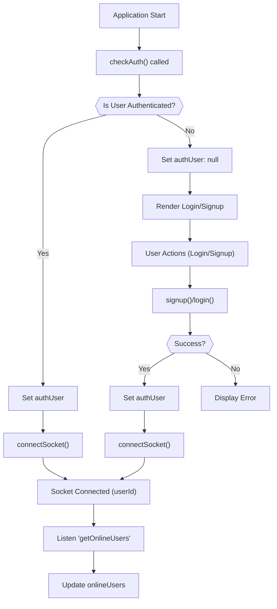
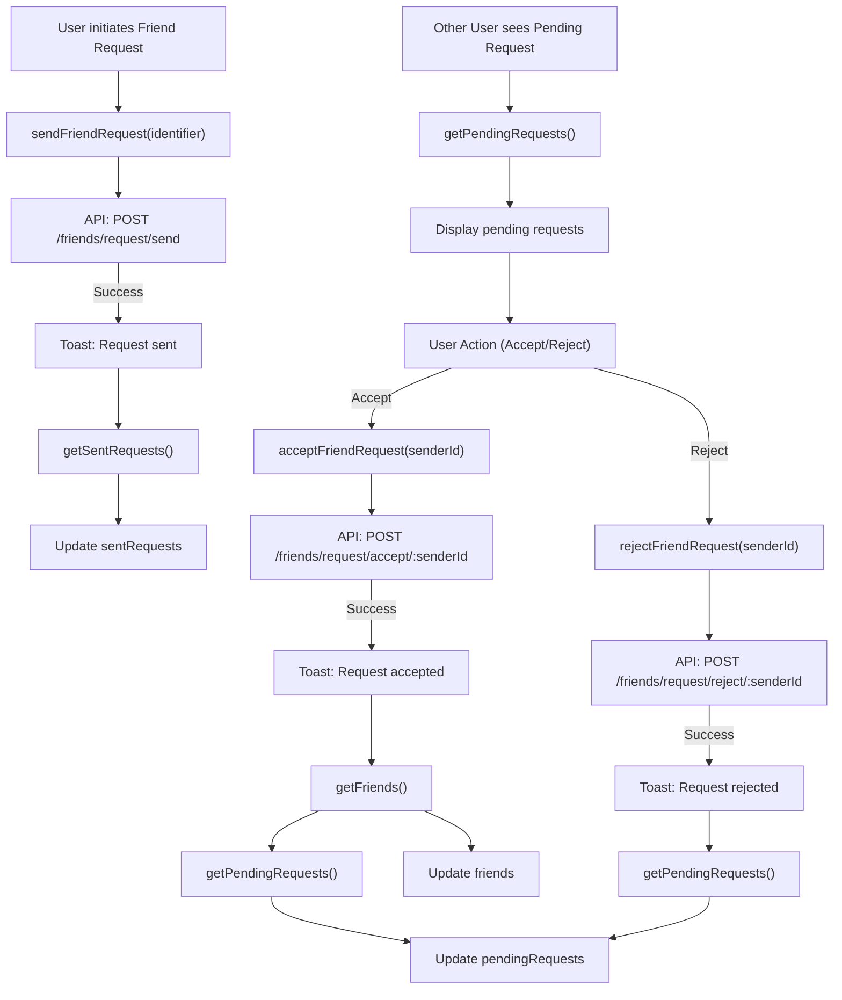

# Frontend State Management and Utilities
<TOC />

This section delves into how the frontend manages its global state using Zustand and provides an overview of various utility functions that support core operations. Effective state management is crucial for a responsive and scalable user interface, especially in dynamic applications like chat systems.

## Global State Management with Zustand

Zustand is a lightweight, fast, and scalable state-management solution for React. It offers a simple API, making it easy to create and consume stores without boilerplate. The application leverages Zustand for managing authentication, chat-related data, and theme settings.

### Authentication and User State (`useAuthStore`)

The `useAuthStore` is central to managing user authentication status, user profiles, and WebSocket connections. It handles all authentication-related API calls and maintains the application's understanding of the current user's online status.

#### Key Responsibilities:

*   **Authentication Flow**: Manages user signup, login, logout, and persistent session checking.
*   **User Profile**: Stores the currently authenticated user's data.
*   **Online Users**: Tracks users currently online via WebSocket.
*   **Socket Management**: Establishes and disconnects the WebSocket connection for real-time features.

#### Core Actions:

-   `checkAuth()`: Verifies the user's authentication status upon application load.
-   `signup(data)`: Registers a new user.
-   `login(data)`: Authenticates an existing user.
-   `logout()`: Clears the user session.
-   `updateProfile(data)`: Updates the authenticated user's profile information.
-   `connectSocket()`: Initiates a WebSocket connection for the authenticated user.
-   `disconnectSocket()`: Terminates the WebSocket connection.

Here's an example of how `checkAuth` initializes the user state and connects the socket:

```javascript
// frontend/src/store/useAuthStore.js
export const useAuthStore = create((set, get) => ({
    authUser: null,
    isCheckingAuth: true,
    socket: null,

    checkAuth: async () => {
        try {
            const res = await axiosInstance.get("/auth/check");
            set({ authUser: res.data });
            get().connectSocket(); // Connect socket upon successful authentication
        } catch (error) {
            set({ authUser: null });
            console.log("Error in checkAuth: ", error);
        } finally {
            set({ isCheckingAuth: false });
        }
    },
    // ... other actions
}));
```
[View on GitHub](https://github.com/shinymack/Chat-App-MERN/blob/main/frontend/src/store/useAuthStore.js#L20-L33)

The `connectSocket` method ensures that the WebSocket connection is established with the user's ID, enabling real-time updates for online users and messages.

```javascript
// frontend/src/store/useAuthStore.js
    connectSocket: () => {
        const { authUser } = get();
        if(!authUser || get().socket?.connected) return;

        const socket = io(BASE_URL, {
            query: {
                userId : authUser._id,
            },
        });
        socket.connect();
        set({socket: socket});

        socket.on("getOnlineUsers", (userIds) => {
            set({onlineUsers: userIds})
        }); 
    },
```
[View on GitHub](https://github.com/shinymack/Chat-App-MERN/blob/main/frontend/src/store/useAuthStore.js#L104-L119)

#### Authentication Flow Diagram





### Chat and Friend Management (`useChatStore`)

The `useChatStore` manages all chat-related data, including messages, user lists, friend requests, and the currently selected chat partner. It orchestrates interactions with the `/friends` and `/messages` API endpoints.

#### Key Responsibilities:

*   **Message Handling**: Fetches and sends messages for a selected user.
*   **User/Friend List**: Manages the list of friends.
*   **Friend Requests**: Handles sending, receiving, accepting, and rejecting friend requests.
*   **Selected User**: Keeps track of the currently active chat partner.
*   **Real-time Messages**: Subscribes and unsubscribes from WebSocket events for new messages.

#### Core Actions:

-   `getFriends()`: Fetches the list of user's friends.
-   `getPendingRequests()`: Fetches incoming friend requests.
-   `getSentRequests()`: Fetches outgoing friend requests.
-   `sendFriendRequest(identifier)`: Sends a new friend request.
-   `acceptFriendRequest(senderId)`: Accepts a pending friend request.
-   `rejectFriendRequest(senderId)`: Rejects a pending friend request.
-   `removeFriend(friendId)`: Removes a friend.
-   `getMessages(userId)`: Retrieves chat messages for a specific user.
-   `sendMessage(messageData)`: Sends a new message to the selected user.
-   `subscribeToMessages()`: Listens for incoming real-time messages.
-   `unsubscribeFromMessages()`: Stops listening for new messages.
-   `setSelectedUser(user)`: Sets the user currently being chatted with.

Here's an illustration of the `acceptFriendRequest` logic:

```javascript
// frontend/src/store/useChatStore.js
    acceptFriendRequest: async (senderId) => {
        try {
            const res = await axiosInstance.post(`/friends/request/accept/${senderId}`);
            toast.success(res.data.message);
            // Refresh both friends and pending requests lists
            get().getFriends();
            get().getPendingRequests();
        } catch (error) {
            toast.error(error.response?.data?.message || "Failed to accept request");
        }
    },
```
[View on GitHub](https://github.com/shinymack/Chat-App-MERN/blob/main/frontend/src/store/useChatStore.js#L95-L105)

The real-time message subscription is vital for a dynamic chat experience. It leverages the `socket` instance from `useAuthStore`.

```javascript
// frontend/src/store/useChatStore.js
    subscribeToMessages: () => {
        const { selectedUser } = get();
        if(!selectedUser) return;
        
        const socket = useAuthStore.getState().socket; // Access socket from auth store
        socket.on("newMessage", (newMessage) => {
            if(newMessage.senderId !== selectedUser._id) return
            set({
                messages: [...get().messages, newMessage]
            })
        })
    },
```
[View on GitHub](https://github.com/shinymack/Chat-App-MERN/blob/main/frontend/src/store/useChatStore.js#L182-L194)

#### Friend Request Flow Diagram





### Theme Management (`useThemeStore`)

The `useThemeStore` is a simple Zustand store responsible for managing the application's UI theme (e.g., dark or light mode). It persists the theme preference in local storage.

#### Key Responsibilities:

*   **Theme Storage**: Stores the current theme setting.
*   **Persistence**: Saves the theme preference to `localStorage`.

#### Core Actions:

-   `setTheme(theme)`: Updates the current theme and saves it to local storage.

```javascript
// frontend/src/store/useThemeStore.js
import { create } from "zustand";

export const useThemeStore = create((set) => ({
    theme: localStorage.getItem("chat-theme") || "dark",
    setTheme: (theme) => {
        localStorage.setItem("chat-theme", theme);
        set({theme});
    }
}))
```
[View on GitHub](https://github.com/shinymack/Chat-App-MERN/blob/main/frontend/src/store/useThemeStore.js)

## Utility Functions (`utils.js`)

The `utils.js` file houses general-purpose utility functions that can be used across different components and modules in the frontend.

### Message Time Formatting (`formatMessageTime`)

The `formatMessageTime` function provides a consistent way to format timestamps for chat messages, displaying them in a user-friendly local time string.

```javascript
// frontend/src/lib/utils.js
export function formatMessageTime(date) {
    return new Date(date).toLocaleTimeString("en-US", {
        year: "numeric",
        month: "short",
        day:"2-digit",
        hour: "2-digit",
        minute: "2-digit",
        hour12: true,
    });
}
```
[View on GitHub](https://github.com/shinymack/Chat-App-MERN/blob/main/frontend/src/lib/utils.js#L1-L10)

## Key Integration Points

*   **Zustand for Global State**: Zustand simplifies managing complex global states like user authentication, chat messages, and user lists. Its hook-based approach makes state consumption straightforward in React components.
*   **Axios for API Calls**: All state-related API interactions (e.g., `signup`, `getMessages`, `sendFriendRequest`) are handled through `axiosInstance`, ensuring consistent API request handling and error management.
*   **Socket.IO for Real-time**: The `useAuthStore` manages the core WebSocket connection, which is then utilized by `useChatStore` for real-time message updates and by the application for online user tracking. This centralizes socket management and ensures consistent behavior.
*   **Toast Notifications**: `react-hot-toast` is integrated directly into the store actions to provide immediate user feedback for operations like login, signup, and sending friend requests, enhancing the user experience.
*   **Local Storage for Persistence**: `useThemeStore` demonstrates how Zustand can easily integrate with browser APIs like `localStorage` for persisting user preferences across sessions.

This modular approach to state management and utilities ensures a clean, maintainable, and scalable frontend architecture.

Next: [Frontend Pages and Routing](./3.3_frontend-pages-and-routing.mdx)