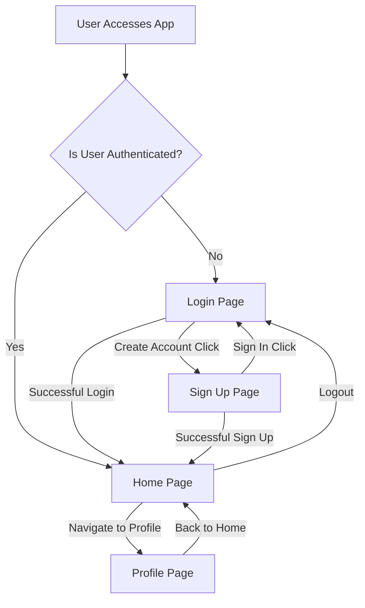
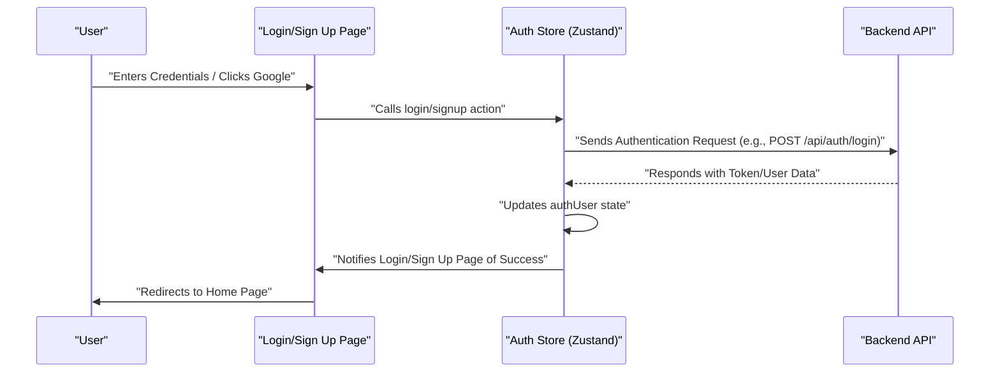

# Pages and Navigation

The user interface of the application is structured around several core pages, each serving a distinct purpose in the user's journey. These pages facilitate authentication, provide the main chat experience, and allow users to manage their profiles. This document outlines the key pages, their primary functionalities, and how users navigate between them.

## Core Application Pages

The frontend of the application is organized into the following main pages:

### 1. Home Page (`HomePage.jsx`)

The Home Page is the central hub for authenticated users, providing the main chat interface. It dynamically displays chat conversations or a placeholder when no chat is selected.

-   **Purpose**: Display the chat interface, user's friends list, and active conversations.
-   **Key Components**:
    -   `Sidebar`: For navigating conversations and accessing friends.
    -   `ChatContainer`: Displays messages for the currently selected chat.
    -   `FriendsBox`: A modal or slide-out for managing friends.
    -   `NoChatSelected`: A placeholder component shown when no chat is active.
-   **State Integration**: Leverages `useChatStore` to determine the selected user (`selectedUser`) and manage the visibility of the friends list (`isFriendsBoxOpen`).
-   **Navigation Context**: Typically the first page a user sees after successful login.

```jsx filename="frontend/src/pages/HomePage.jsx" {12-16}
import ChatContainer from "../components/ChatContainer";
import FriendsBox from "../components/FriendsBox";
import NoChatSelected from "../components/NoChatSelected";
import Sidebar from "../components/Sidebar";
import { useChatStore } from "../store/useChatStore"

const HomePage = () => {
  const { selectedUser } = useChatStore();
  const { isFriendsBoxOpen } = useChatStore();
  return (
      <div className="h-screen bg-base-200">
      <div className="flex items-center justify-center pt-20 px-4 w-full">
        <div className="bg-base-100 rounded-lg shadow-xl w-full max-w-6xl h-[calc(100vh-8rem)]">
          <div className="flex h-full rounded-lg overflow-hidden w-full">
            <Sidebar />
            {!selectedUser ? <NoChatSelected /> : <ChatContainer />}
            {isFriendsBoxOpen && <FriendsBox />}

          </div>

        </div>
      </div>
    </div>
  )
}

export default HomePage
```

-   **Explanation**: This snippet shows the main structure of the `HomePage.jsx`. It conditionally renders either `NoChatSelected` or `ChatContainer` based on whether a `selectedUser` is present in the chat store, providing a dynamic user experience.
-   [View on GitHub](https://github.com/shinymack/Chat-App-MERN/blob/main/frontend/src/pages/HomePage.jsx#L12-L16)

### 2. Login Page (`LoginPage.jsx`)

The Login Page is responsible for authenticating existing users. It provides forms for email/password login and integrates with Google OAuth for alternative authentication.

-   **Purpose**: Allow users to sign in to their accounts.
-   **Features**:
    -   Email and password input fields with password visibility toggle.
    -   "Sign In" button with loading indicator.
    -   "Sign in with Google" button for OAuth.
    -   Link to the `/signup` page for new users.
-   **State Integration**: Uses `useAuthStore` for `login` functionality and `isLoggingIn` state.
-   **Navigation**: Redirects to the Home Page upon successful login. Provides a link to the `SignUpPage`.

```jsx filename="frontend/src/pages/LoginPage.jsx" {32-38}
          {/* Form */}
          <form onSubmit={handleSubmit} className="space-y-6">
            <div className="form-control">
              <label className="label">
                <span className="label-text font-medium">Email</span>
              </label>
              <div className="relative">
                <div className="absolute inset-y-0 left-0 pl-3 flex items-center pointer-events-none">
                  <Mail className="h-5 w-5 text opacity-40" />
                </div>
                <input
                  type="email"
                  className={`input input-bordered w-full pl-10`}
                  placeholder="you@example.com"
                  value={formData.email}
                  onChange={(e) => setFormData({ ...formData, email: e.target.value })}
                />
              </div>
            </div>
```

-   **Explanation**: This snippet illustrates the email input field within the login form, demonstrating the use of `formData` for state management and an `onChange` handler to update the input's value.
-   [View on GitHub](https://github.com/shinymack/Chat-App-MERN/blob/main/frontend/src/pages/LoginPage.jsx#L32-L38)

```jsx filename="frontend/src/pages/LoginPage.jsx" {91-95}
          <div className="text-center">
            <p className="text-base-content/60">
              Don&apos;t have an account?{" "}
              <Link to="/signup" className="link link-primary">
                Create account
              </Link>
            </p>
          </div>
```

-   **Explanation**: This section highlights the navigation link from the Login Page to the SignUp Page, crucial for user onboarding.
-   [View on GitHub](https://github.com/shinymack/Chat-App-MERN/blob/main/frontend/src/pages/LoginPage.jsx#L91-L95)

### 3. Profile Page (`ProfilePage.jsx`)

The Profile Page allows authenticated users to view and update their personal information, such as their profile picture and username.

-   **Purpose**: Manage user profile details.
-   **Features**:
    -   Display of current profile picture, username, and email.
    -   Option to upload a new profile picture.
    -   Ability to edit username with real-time availability check (debounced).
    -   Display of account information (e.g., "Member Since," "Account Status").
-   **State Integration**: Utilizes `useAuthStore` for `authUser`, `isUpdatingProfile`, and `updateProfile`. Employs local state for managing `selectedImg`, `isEditingUsername`, `newUsername`, and `usernameStatus`.
-   **API Interaction**: Interacts with a backend API (`/auth/username/check/`) for username availability validation.

```jsx filename="frontend/src/pages/ProfilePage.jsx" {126-146}
							{!isEditingUsername ? (
								<div className="flex items-center gap-2">
									<p className="px-4 py-2.5 bg-base-200 rounded-lg border flex-grow">
										{authUser?.username}
									</p>
									<button onClick={() => setIsEditingUsername(true)} className="btn btn-ghost btn-sm">
										<Edit className="w-4 h-4" />
									</button>
								</div>
							) : (
								<div className="space-y-2">
									<div className="flex items-center gap-2">
										<input
											type="text"
											value={newUsername}
											onChange={(e) => setNewUsername(e.target.value.toLowerCase())}
											className="input input-bordered w-full"
										/>
										<button onClick={handleSaveUsername} className="btn btn-success btn-sm" disabled={!usernameStatus.available || usernameStatus.checking || isUpdatingProfile}>
											{isUpdatingProfile ? <Loader2 className="w-4 h-4 animate-spin" /> : <Save className="w-4 h-4" />}
										</button>
										<button onClick={handleCancelEdit} className="btn btn-error btn-sm">
											<X className="w-4 h-4" />
										</button>
									</div>
									<div className={`text-xs h-4 ${usernameStatus.available ? 'text-green-500' : 'text-error'}`}>
										{usernameStatus.checking ? <Loader2 className="w-3 h-3 animate-spin inline-block mr-1" /> : null}
										{usernameStatus.message}
									</div>
								</div>
							)}
```

-   **Explanation**: This complex snippet shows the conditional rendering logic for the username field. Users can switch between a display mode and an edit mode. In edit mode, an input field appears with save and cancel buttons, along with real-time feedback on username availability.
-   [View on GitHub](https://github.com/shinymack/Chat-App-MERN/blob/main/frontend/src/pages/ProfilePage.jsx#L126-L146)

### 4. Sign Up Page (`SignUpPage.jsx`)

The Sign Up Page enables new users to create an account by providing a username, email, and password. It also offers Google OAuth for streamlined registration.

-   **Purpose**: Facilitate new user registration.
-   **Features**:
    -   Username, email, and password input fields.
    -   Password visibility toggle.
    -   "Create Account" button with loading indicator.
    -   "Sign up with Google" button for OAuth.
    -   Link to the `/login` page for existing users.
-   **State Integration**: Uses `useAuthStore` for `signup` functionality and `IsSigningUp` state.
-   **Validation**: Includes client-side validation for input fields (e.g., email format, password length).
-   **Navigation**: Redirects to the Home Page upon successful registration. Provides a link to the `LoginPage`.

```jsx filename="frontend/src/pages/SignUpPage.jsx" {21-26}
  const validateForm = () => {
    if(!formData.username.trim()) return toast.error("Username is required");
    if(!formData.email.trim()) return toast.error("Email is required");
    if (!/\S+@\S+\.\S+/.test(formData.email)) return toast.error("Invalid email format");
    if (!formData.password) return toast.error("Password is required");
    if (formData.password.length < 6) return toast.error("Password must be at least 6 characters");

    return true;
  };
```

-   **Explanation**: This function provides client-side validation for the signup form fields, ensuring basic requirements are met before attempting to register.
-   [View on GitHub](https://github.com/shinymack/Chat-App-MERN/blob/main/frontend/src/pages/SignUpPage.jsx#L21-L26)

```jsx filename="frontend/src/pages/SignUpPage.jsx" {101-105}
          <div className="text-center">
            <p className="text-base-content/60">
              Already have an account?{" "}
              <Link to="/login" className="link link-primary">
                Sign in
              </Link>
            </p>
          </div>
```

-   **Explanation**: This snippet displays the navigation link from the Sign Up Page to the Login Page, offering an option for users who already possess an account.
-   [View on GitHub](https://github.com/shinymack/Chat-App-MERN/blob/main/frontend/src/pages/SignUpPage.jsx#L101-L105)

## Page Flow and Navigation

The application's navigation primarily revolves around authentication status. React Router Dom is used to manage client-side routing, ensuring a smooth transition between pages without full page reloads.





-   **Explanation**: This diagram illustrates the typical user flow through the main application pages, emphasizing the role of authentication in directing navigation paths between the Login, Sign Up, Home, and Profile pages.

## Key Integration Points

### Authentication Flow

The authentication pages (`LoginPage`, `SignUpPage`) are deeply integrated with the `useAuthStore` (Zustand) for managing user sessions, login/signup processes, and user data. Upon successful authentication (either login or signup), the user is redirected to the `HomePage`.





-   **Explanation**: This sequence diagram details the interaction between the user, authentication pages, the `Auth Store`, and the Backend API during the authentication process. It highlights how the `Auth Store` centralizes authentication logic and state management.

### Dynamic Content on Home Page

The `HomePage` dynamically renders components based on `useChatStore`. When `selectedUser` is `null`, it shows `NoChatSelected`. Otherwise, it displays `ChatContainer`, ensuring that the UI adapts to the user's active selections. The `FriendsBox` is also conditionally rendered based on `isFriendsBoxOpen`, offering a flexible layout.

### Profile Updates

The `ProfilePage` integrates with `useAuthStore` to update user details. The username editing feature demonstrates a common pattern of debounced input for API calls to prevent excessive requests, ensuring efficient resource usage while providing a responsive user experience.

These core pages form the backbone of the application's user experience, guiding users from initial authentication through active engagement and profile management.

---

Next: [State Management and Utilities](./3.3_state-management-and-utilities.mdx)