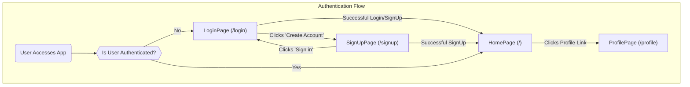

# Pages and Navigation

The Chat-App frontend is structured around several key pages, each serving a distinct purpose within the user journey. These pages are primarily responsible for rendering specific UI layouts and interacting with global state management stores and backend APIs to fetch or update data. Navigation between these pages is handled using client-side routing, typically managed by `react-router-dom`, although the main `App.jsx` routing configuration is not explicitly shown here, its usage is evident through the `Link` component.

## Core Application Pages

The application features several critical pages:

*   **Login Page**: Handles user authentication, allowing existing users to sign in.
*   **Sign Up Page**: Facilitates new user registration.
*   **Home Page**: The main application interface where users can view chats, interact with contacts, and access core messaging features.
*   **Profile Page**: Allows authenticated users to view and update their profile information, such as their username and profile picture.

### Authentication Flow and Page Transitions

The authentication state plays a crucial role in directing users to the appropriate pages. Upon successful login or registration, users are typically redirected to the `HomePage`. Conversely, if a user attempts to access protected routes without authentication, they are redirected to the `LoginPage`.





## Page Details

### 1. Home Page

The `HomePage` serves as the central hub for the chat application. It's designed to display the main chat interface, including a sidebar for navigation and contact lists, a chat container for active conversations, and a friends box for managing contacts.

**Key Components and Functionality:**

*   **Sidebar**: Provides access to different sections or features.
*   **ChatContainer**: Displays messages for the currently selected chat.
*   **NoChatSelected**: A placeholder component shown when no chat is active.
*   **FriendsBox**: A pop-up or expandable component for managing friends.
*   **`useChatStore`**: Utilizes Zustand for global state management to determine which user is currently selected for chatting and whether the `FriendsBox` should be open.

```jsx
// frontend/src/pages/HomePage.jsx
import ChatContainer from "../components/ChatContainer";
import FriendsBox from "../components/FriendsBox";
import NoChatSelected from "../components/NoChatSelected";
import Sidebar from "../components/Sidebar";
import { useChatStore } from "../store/useChatStore" // Accesses chat-related state

const HomePage = () => {
  const { selectedUser } = useChatStore(); // Determines which chat to display
  const { isFriendsBoxOpen } = useChatStore(); // Controls visibility of FriendsBox

  return (
      <div className="h-screen bg-base-200">
      <div className="flex items-center justify-center pt-20 px-4 w-full">
        <div className="bg-base-100 rounded-lg shadow-xl w-full max-w-6xl h-[calc(100vh-8rem)]">
          <div className="flex h-full rounded-lg overflow-hidden w-full">
            <Sidebar />
            {!selectedUser ? <NoChatSelected /> : <ChatContainer />} {/* Conditional rendering */}
            {isFriendsBoxOpen && <FriendsBox />} {/* Conditional rendering */}
          </div>
        </div>
      </div>
    </div>
  )
}

export default HomePage
```
[View on GitHub](https://github.com/shinymack/Chat-App-MERN/blob/main/frontend/src/pages/HomePage.jsx)

### 2. Login Page

The `LoginPage` provides the interface for users to log into their accounts using email and password, or through Google authentication. It manages local form state and interacts with the authentication store for sign-in logic.

**Key Features:**

*   **Email and Password Fields**: Standard input fields with validation.
*   **Show/Hide Password**: Toggles password visibility for user convenience.
*   **Google Authentication**: Integration with Google OAuth via a backend endpoint.
*   **Loading State**: Displays a loading spinner while authentication is in progress.
*   **Navigation to Sign Up**: A link to transition to the `SignUpPage`.
*   **`useAuthStore`**: Manages the `login` action and `isLoggingIn` state.

```jsx
// frontend/src/pages/LoginPage.jsx
import { useState } from "react"
import { useAuthStore } from "../store/useAuthStore"; // Accesses authentication state and actions
import { Eye, EyeOff, Loader2, Lock, Mail, MessageSquare } from "lucide-react";
import { Link } from "react-router-dom"; // For client-side navigation
import AuthImagePattern from "../components/AuthImagePattern";
import { FcGoogle } from "react-icons/fc";

const LoginPage = () => {
  const [showPassword, setShowPassword] = useState(false);
  const [formData, setFormData] = useState({
    email: "",
    password: "",
  })
  const { login, isLoggingIn } = useAuthStore(); // Login function and loading state

  const handleSubmit = async (e) => {
    e.preventDefault();
    login(formData); // Calls the login action from the auth store
  }
  const backendDomain = import.meta.env.VITE_BACKEND_URL;
  const googleAuthUrl = `${backendDomain}/api/auth/google`; // Google OAuth endpoint

  return (
    <div className="h-screen grid lg:grid-cols-2">
      {/* ... (form content) ... */}
      <form onSubmit={handleSubmit} className="space-y-6">
        {/* ... (email and password inputs) ... */}
        <button type="submit" className="btn btn-primary w-full" disabled={isLoggingIn}>
          {isLoggingIn ? (
            <>
              <Loader2 className="h-5 w-5 animate-spin" />
              Loading...
            </>
          ) : (
            "Sign in"
          )}
        </button>
      </form>
      <div className="divider text-base-content/60 my-4">OR</div>
      <a
        href={googleAuthUrl} // Link to your backend Google auth route
        className="btn btn-primary btn-outline w-full"
      >
        <FcGoogle className="size-5 mr-2" />
        Sign in with Google
      </a>
      <div className="text-center">
        <p className="text-base-content/60">
          Don&apos;t have an account?{" "}
          <Link to="/signup" className="link link-primary"> {/* Navigation to SignUpPage */}
            Create account
          </Link>
        </p>
      </div>
    </div>
  )
}

export default LoginPage
```
[View on GitHub](https://github.com/shinymack/Chat-App-MERN/blob/main/frontend/src/pages/LoginPage.jsx)

### 3. Profile Page

The `ProfilePage` enables authenticated users to view and update their profile details. It specifically allows users to change their profile picture and username.

**Key Features:**

*   **Profile Picture Upload**: Users can upload new profile images, which are converted to base64 and sent to the backend.
*   **Username Editing**: Users can edit their username with a debounced check for availability, preventing multiple rapid requests to the backend.
*   **Display User Information**: Shows the user's current username, email, membership date, and account status.
*   **`useAuthStore`**: Manages the `authUser` object and the `updateProfile` action, including `isUpdatingProfile` loading state.
*   **`axiosInstance`**: Used for making direct API calls, specifically for the debounced username availability check.

```jsx
// frontend/src/pages/ProfilePage.jsx
import { useState, useEffect, useRef } from "react";
import { useAuthStore } from "../store/useAuthStore"; // Accesses authenticated user and profile update actions
import { Camera, Mail, User, Edit, Save, X, Loader2 } from "lucide-react";
import toast from "react-hot-toast";
import { axiosInstance } from "../lib/axios"; // For direct API calls

const ProfilePage = () => {
	const { authUser, isUpdatingProfile, updateProfile } = useAuthStore();
	const [selectedImg, setSelectedImg] = useState(null);

	const [isEditingUsername, setIsEditingUsername] = useState(false);
	const [newUsername, setNewUsername] = useState(authUser?.username || "");
	const [usernameStatus, setUsernameStatus] = useState({
		checking: false,
		available: true,
		message: "",
	});
	const debounceTimeout = useRef(null);

	const handleImageUpload = async (e) => {
		const file = e.target.files[0];
		if (!file) return;

		const reader = new FileReader();
		reader.readAsDataURL(file);

		reader.onload = async () => {
			const base64Image = reader.result;
			setSelectedImg(base64Image);
			await updateProfile({ profilePic: base64Image }); // Calls updateProfile action
		};
	};

	// --- Debounced Username Check ---
	useEffect(() => {
		clearTimeout(debounceTimeout.current);
		// ... (username validation and API call logic) ...
		if (newUsername === authUser.username) {
			setUsernameStatus({ checking: false, available: true, message: "" });
			return;
		}
		debounceTimeout.current = setTimeout(async () => {
			try {
				const res = await axiosInstance.get(`/auth/username/check/${newUsername}`); // API call for username check
				setUsernameStatus({
					checking: false,
					available: res.data.available,
					message: res.data.message,
				});
			} catch (error) { /* ... */ }
		}, 500);
		return () => clearTimeout(debounceTimeout.current);
	}, [newUsername, authUser.username]);
	// ---------------------------------

	const handleSaveUsername = async () => {
		// ... (validation logic) ...
		await updateProfile({ username: newUsername }); // Calls updateProfile action
		setIsEditingUsername(false);
	};

	return (
		<div className="h-screen pt-20">
			{/* ... (profile UI content) ... */}
            <p className="text-sm text-zinc-400">
                {isUpdatingProfile ? "Updating profile..." : "Click the camera icon to update your photo"}
            </p>
			{!isEditingUsername ? (
				<div className="flex items-center gap-2">
					<p className="px-4 py-2.5 bg-base-200 rounded-lg border flex-grow">
						{authUser?.username}
					</p>
					<button onClick={() => setIsEditingUsername(true)} className="btn btn-ghost btn-sm">
						<Edit className="w-4 h-4" />
					</button>
				</div>
			) : (
				<div className="space-y-2">
					<div className="flex items-center gap-2">
						<input
							type="text"
							value={newUsername}
							onChange={(e) => setNewUsername(e.target.value.toLowerCase())}
							className="input input-bordered w-full"
						/>
						<button onClick={handleSaveUsername} className="btn btn-success btn-sm" disabled={!usernameStatus.available || usernameStatus.checking || isUpdatingProfile}>
							{isUpdatingProfile ? <Loader2 className="w-4 h-4 animate-spin" /> : <Save className="w-4 h-4" />}
						</button>
						<button onClick={handleCancelEdit} className="btn btn-error btn-sm">
							<X className="w-4 h-4" />
						</button>
					</div>
					<div className={`text-xs h-4 ${usernameStatus.available ? 'text-green-500' : 'text-error'}`}>
						{usernameStatus.checking ? <Loader2 className="w-3 h-3 animate-spin inline-block mr-1" /> : null}
						{usernameStatus.message}
					</div>
				</div>
			)}
		</div>
	);
};

export default ProfilePage;
```
[View on GitHub](https://github.com/shinymack/Chat-App-MERN/blob/main/frontend/src/pages/ProfilePage.jsx)

### 4. Sign Up Page

The `SignUpPage` allows new users to create an account by providing a username, email, and password. Similar to the `LoginPage`, it also supports Google authentication.

**Key Features:**

*   **User Registration Form**: Collects username, email, and password.
*   **Form Validation**: Client-side validation for required fields, email format, and password strength.
*   **Show/Hide Password**: Toggles password visibility.
*   **Google Authentication**: Directs users to the backend for Google OAuth.
*   **Loading State**: Indicates when the registration process is active.
*   **Navigation to Login**: A `Link` component to direct users to the `LoginPage` if they already have an account.
*   **`useAuthStore`**: Invokes the `signup` action and uses the `IsSigningUp` state.

```jsx
// frontend/src/pages/SignUpPage.jsx
import { useState } from "react";
import { useAuthStore } from "../store/useAuthStore"; // Accesses authentication state and actions
import { MessageSquare, User, Mail, Lock, EyeOff, Eye, Loader2 } from "lucide-react";
import { Link } from "react-router-dom"; // For client-side navigation
import AuthImagePattern from "../components/AuthImagePattern";
import toast from "react-hot-toast";

import { FcGoogle } from "react-icons/fc";
const SignUpPage = () => {
  const [showPassword, setShowPassword] = useState(false);
  const [formData, setFormData] = useState({
    username: "",
    email: "",
    password: "",
  });

  const { signup, IsSigningUp } = useAuthStore(); // Signup function and loading state

  const validateForm = () => { /* ... (validation logic) ... */ return true; };

  const handleSubmit = (e) => {
    e.preventDefault();
    const success = validateForm();
    if(success===true) signup(formData); // Calls the signup action from the auth store
  };

  const backendDomain = import.meta.env.VITE_BACKEND_URL;
  const googleAuthUrl = `${backendDomain}/api/auth/google`; // Google OAuth endpoint

  return (
    <div className="min-h-screen grid lg:grid-cols-2">
      {/* ... (form content) ... */}
      <form onSubmit={handleSubmit} className="space-y-6">
        {/* ... (username, email, password inputs) ... */}
        <button type="submit" className="btn btn-primary w-full" disabled={IsSigningUp}>
          {IsSigningUp ? (
            <>
              <Loader2 className="size-5 animate-spin" />
              Loading...
            </>
          ) : (
            "Create Account"
          )}
        </button>
      </form>
      <div className="divider text-base-content/60 my-4">OR</div>

      <a
        href={googleAuthUrl} // Link to your backend Google auth route
        className="btn btn-primary btn-outline w-full"
      >
        <FcGoogle className="size-5 mr-2" />
        Sign up with Google
      </a>

      <div className="text-center">
        <p className="text-base-content/60">
          Already have an account?{" "}
          <Link to="/login" className="link link-primary"> {/* Navigation to LoginPage */}
            Sign in
          </Link>
        </p>
      </div>
    </div>
  );
};
export default SignUpPage;
```
[View on GitHub](https://github.com/shinymack/Chat-App-MERN/blob/main/frontend/src/pages/SignUpPage.jsx)

## Key Integration Points

The navigation and page rendering in the application are deeply integrated with global state management, particularly for authentication and real-time chat data.


```mermaid
graph TD
    A["React App"] --> B{"Router (react-router-dom)"}
    B -- "Unauthenticated" --> C["LoginPage"]
    B -- "Unauthenticated" --> D["SignUpPage"]
    B -- "Authenticated" --> E["ProtectedRoute"]
    E --> F["HomePage"]
    E --> G["ProfilePage"]

    C -- "Successful Login/SignUp" -->|"Triggers useAuthStore.login/signup"| B
    D -- "Successful SignUp" -->|"Triggers useAuthStore.signup"| B

    F -->|"Renders based on selectedUser from useChatStore"| H("ChatContainer / NoChatSelected")
    F -->|"Renders based on isFriendsBoxOpen from useChatStore"| I("FriendsBox")
    F --> J("Sidebar")

    G -- "Update ProfilePic/Username" -->|"Calls useAuthStore.updateProfile"| K("Backend API (/api/auth/profile)")
    G -- "Check Username Availability" -->|"Calls axiosInstance.get('/auth/username/check')"| L("Backend API (/api/auth/username/check)")

    subgraph "State Management (Zustand)"
        M["useAuthStore"]
        N["useChatStore"]
    end

    C -- "Uses" --> M
    D -- "Uses" --> M
    F -- "Uses" --> N
    G -- "Uses" --> M
    M -- "Updates authUser, isLoggingIn, isSigningUp, isUpdatingProfile" --> C, D, G
    N -- "Updates selectedUser, isFriendsBoxOpen" --> F
```


1.  **Authentication-driven Routing**: The `useAuthStore`'s `authUser` state is paramount. A higher-level routing component (e.g., in `App.jsx`) would conditionally render `LoginPage`/`SignUpPage` for unauthenticated users and `HomePage`/`ProfilePage` for authenticated users. This ensures protected routes are only accessible to logged-in users.
2.  **Modular Page Structure**: Each page imports specific components and state management hooks (`useAuthStore`, `useChatStore`) relevant to its functionality, promoting a clean separation of concerns.
3.  **Conditional Rendering**: `HomePage` dynamically renders `ChatContainer` or `NoChatSelected` based on the `selectedUser` from `useChatStore`, and `FriendsBox` based on `isFriendsBoxOpen`, providing a responsive user experience.
4.  **Backend Integration**: Pages like `LoginPage`, `SignUpPage`, and `ProfilePage` directly interact with backend API endpoints for core functionalities like user authentication, profile updates, and username availability checks. The `axiosInstance` and environment variables for backend URLs centralize API access.
5.  **User Experience with Loading States**: All authentication-related pages (Login, SignUp, Profile) leverage loading states (`isLoggingIn`, `IsSigningUp`, `isUpdatingProfile`) from `useAuthStore` to provide visual feedback to the user, improving perceived performance and preventing multiple submissions.

Next: [Frontend State Management and Utilities](./3.3_frontend-state-management-and-utilities.mdx)