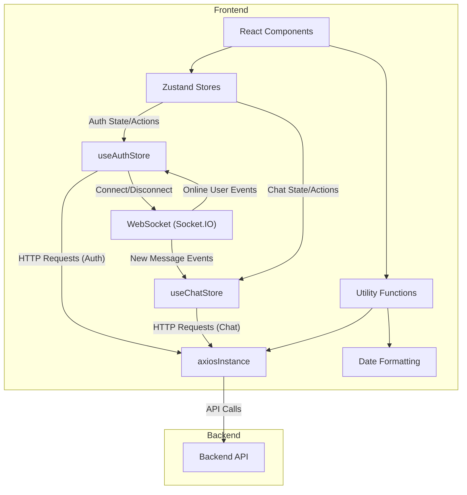
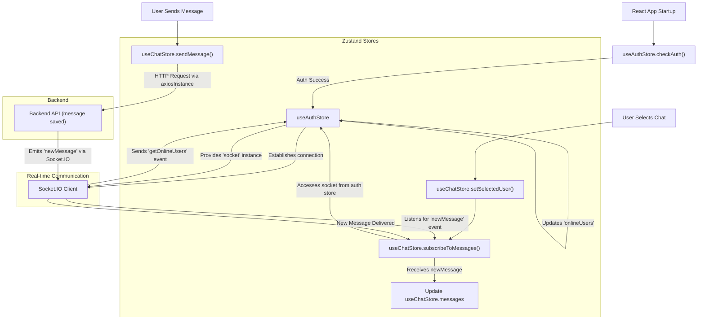

 # State Management and Utilities

This document delves into the client-side state management architecture and utility functions implemented within the frontend. The application leverages [Zustand](https://zustand-bear.pm/) for efficient and scalable state management, along with dedicated utility functions for common tasks like API interactions and data formatting.

## Zustand Stores

Zustand is a lightweight, fast, and scalable state management solution for React, offering a simple API for creating and consuming stores. This application primarily uses two Zustand stores: `useAuthStore` for authentication and user-related state, and `useChatStore` for chat-specific data and interactions.

### `useAuthStore`

The `useAuthStore` is responsible for managing authentication status, user information, and WebSocket connections. It centralizes authentication logic, providing functions for checking session, signing up, logging in, logging out, and updating user profiles.

**Key Responsibilities:**

*   **Authentication State**: Holds the `authUser` object, which contains details of the currently logged-in user.
*   **Loading States**: Manages boolean flags (`isSigningUp`, `isLoggingIn`, `isUpdatingProfile`, `isCheckingAuth`) to indicate ongoing asynchronous operations.
*   **Online Users**: Tracks `onlineUsers` fetched via WebSocket events.
*   **Socket Management**: Initializes and manages the WebSocket connection (`socket`) for real-time features.

**Core Functions:**

*   `checkAuth()`: Verifies the user's authentication status with the backend and initializes the WebSocket connection if authenticated.
*   `signup(data)`: Handles user registration.
*   `login(data)`: Manages user login.
*   `logout()`: Clears authentication state and disconnects the WebSocket.
*   `updateProfile(data)`: Allows authenticated users to update their profile information.
*   `connectSocket()`: Establishes a WebSocket connection to the server, passing the `userId` as a query parameter. It also sets up a listener for `getOnlineUsers` events.
*   `disconnectSocket()`: Terminates the active WebSocket connection.

Here's an excerpt from the `useAuthStore` demonstrating the socket connection logic:

```javascript
// frontend/src/store/useAuthStore.js
import { create } from "zustand";
import { io } from "socket.io-client";

const BASE_URL = import.meta.env.MODE == "development" ? "http://localhost:5001": "/";

export const useAuthStore = create((set, get) => ({
    authUser: null,
    socket: null,
    onlineUsers: [],

    connectSocket: () => {
        const { authUser } = get();
        if(!authUser || get().socket?.connected) return;

        const socket = io(BASE_URL, {
            query: {
                userId : authUser._id,
            },
        });
        socket.connect();
        set({socket: socket});

        socket.on("getOnlineUsers", (userIds) => {
            set({onlineUsers: userIds})
        }); 
    },

    disconnectSocket : () => {
        if(get().socket?.connected) get().socket.disconnect();
    }
}));
```
[View on GitHub](https://github.com/shinymack/Chat-App-MERN/blob/main/frontend/src/store/useAuthStore.js#L46-L68)

### `useChatStore`

The `useChatStore` manages all chat-related data, including messages, user lists, friend requests, and selected chat partners. It orchestrates interactions for message exchange and friend management.

**Key Responsibilities:**

*   **Chat Data**: Stores `messages` for the active conversation and a `users` list of friends.
*   **Friend Requests**: Manages `pendingRequests` (incoming) and `sentRequests` (outgoing).
*   **Selected User**: Keeps track of the `selectedUser` for the current chat.
*   **Loading States**: Indicators like `isUsersLoading` and `isMessagesLoading`.
*   **UI State**: `isFriendBoxOpen` for toggling the friend management UI.

**Core Functions:**

*   `getFriends()`: Fetches the list of friends.
*   `getPendingRequests()`: Retrieves incoming friend requests.
*   `getSentRequests()`: Fetches outgoing friend requests.
*   `sendFriendRequest(identifier)`: Sends a new friend request.
*   `acceptFriendRequest(senderId)`: Accepts a pending friend request.
*   `rejectFriendRequest(senderId)`: Rejects a pending friend request.
*   `removeFriend(friendId)`: Removes an existing friend.
*   `getMessages(userId)`: Fetches chat messages for a specific user.
*   `sendMessage(messageData)`: Sends a new message to the `selectedUser`.
*   `subscribeToMessages()`: Subscribes to the `newMessage` WebSocket event, updating messages if the sender is the `selectedUser`. It accesses the `socket` instance from `useAuthStore`.
*   `unsubscribeFromMessages()`: Cleans up the `newMessage` event listener.
*   `setSelectedUser(user)`: Sets the currently selected user for chat.

An example of `useChatStore`'s `subscribeToMessages` function, demonstrating cross-store access:

```javascript
// frontend/src/store/useChatStore.js
import { create } from "zustand";
import { useAuthStore } from "./useAuthStore";

export const useChatStore = create((set, get) => ({
    messages:[],
    selectedUser: null,

    subscribeToMessages: () => {
        const { selectedUser } = get();
        if(!selectedUser) return;
        
        // Accessing socket from useAuthStore
        const socket = useAuthStore.getState().socket; 
        
        socket.on("newMessage", (newMessage) => {
            if(newMessage.senderId !== selectedUser._id) return
            set({
                messages: [...get().messages, newMessage]
            })
        })
    },

    unsubscribeFromMessages: () => {
        const socket = useAuthStore.getState().socket;
        socket.off("newMessage");
    },
    
    setSelectedUser: (selectedUser) => set({selectedUser})
}));
```
[View on GitHub](https://github.com/shinymack/Chat-App-MERN/blob/main/frontend/src/store/useChatStore.js#L145-L162)

## Utility Functions

Beyond state management, the application employs several utility functions to streamline common operations.

### `axiosInstance`

A pre-configured Axios instance (`axiosInstance`) is used for all HTTP requests to the backend. This instance sets the `baseURL` dynamically based on the environment (development or production) and ensures `withCredentials: true` for proper cookie handling, which is crucial for session-based authentication.

```javascript
// frontend/src/lib/axios.js
import axios from "axios";

export const axiosInstance = axios.create({
    baseURL: import.meta.env.MODE == "development" ? "http://localhost:5001/api": "/api",
    withCredentials: true,
});
```
[View on GitHub](https://github.com/shinymack/Chat-App-MERN/blob/main/frontend/src/lib/axios.js#L3-L7)

### `formatMessageTime`

This utility function simplifies date and time formatting for messages, ensuring a consistent and user-friendly display across the application.

```javascript
// frontend/src/lib/utils.js
export function formatMessageTime(date) {
    return new Date(date).toLocaleTimeString("en-US", {
        year: "numeric",
        month: "short",
        day:"2-digit",
        hour: "2-digit",
        minute: "2-digit",
        hour12: true,
    });
}
```
[View on GitHub](https://github.com/shinymack/Chat-App-MERN/blob/main/frontend/src/lib/utils.js#L2-L10)

## Client-Side Architecture Flow

The following diagram illustrates the high-level interaction between React components, Zustand stores, utility functions, and the backend.





## State Management Interaction with WebSocket

The diagram below details how the `useAuthStore` and `useChatStore` interact with the WebSocket connection for real-time updates.





## Key Integration Points

*   **Centralized API Client**: `axiosInstance` serves as the single point for all backend API calls, simplifying request configuration and error handling.
*   **Cross-Store Communication**: `useChatStore` accesses the `socket` instance managed by `useAuthStore` to subscribe to real-time events. This pattern demonstrates effective communication between distinct Zustand stores.
*   **Lifecycle Management**: WebSocket connections are tightly coupled with the authentication state (`connectSocket` on login/auth check, `disconnectSocket` on logout), ensuring resources are managed efficiently.
*   **Real-time Updates**: The integration of Socket.IO via `useAuthStore` and `useChatStore` provides a seamless real-time chat experience, updating online users and messages without requiring page refreshes.
*   **Asynchronous Operations with Zustand**: All API interactions are wrapped in Zustand store actions, clearly defining state transitions (e.g., `isLoggingIn` set to `true` before API call, `false` after).

Next: [Styling and Configuration](./3.3_styling-and-configuration.mdx)