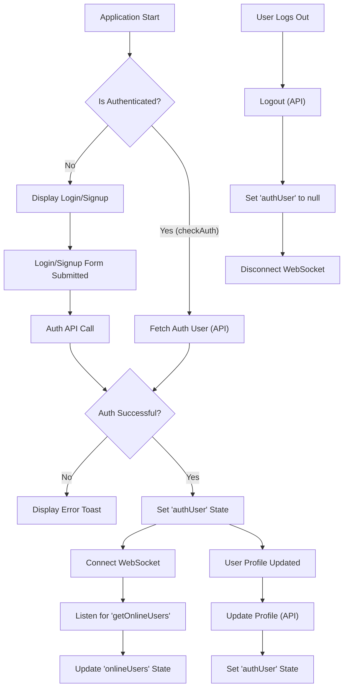
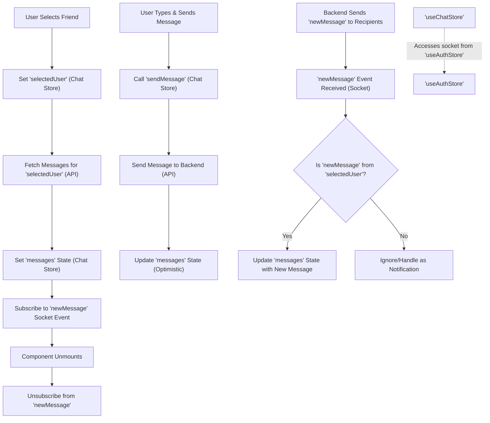

 # State Management

This document details the global state management within the application, which leverages [Zustand](https://zustand-bear.github.io/zustand/) for a lightweight and flexible approach. Global state is compartmentalized into distinct stores: `useAuthStore` for authentication and user-related data, `useChatStore` for chat messages, friend management, and user interactions, and `useThemeStore` for managing the application's visual theme.

Zustand was chosen for its simplicity, minimal boilerplate, and hook-based API, which integrates seamlessly with React. It provides a straightforward mechanism for creating, updating, and consuming global state throughout the application, ensuring a predictable and maintainable state architecture.

## 1. Authentication and User State (`useAuthStore`)

The `useAuthStore` is responsible for managing all aspects related to user authentication, profile information, and the WebSocket connection for real-time features. It provides actions for common authentication flows like signup, login, logout, and profile updates, alongside handling the initial authentication check and maintaining the socket connection.

*   **File Location**: `frontend/src/store/useAuthStore.js`
*   **Purpose**: Handles user authentication, profile management, and WebSocket connection lifecycle.
*   **Key States**:
    *   `authUser`: Stores the currently authenticated user's object. `null` if not authenticated.
    *   `isSigningUp`, `isLoggingIn`, `isUpdatingProfile`, `isCheckingAuth`: Boolean flags indicating the status of various asynchronous operations.
    *   `onlineUsers`: An array of user IDs currently online, received via WebSocket.
    *   `socket`: The WebSocket client instance, used for real-time communication.
*   **Key Actions**:
    *   `checkAuth()`: Verifies authentication status on application load.
    *   `signup(data)`: Registers a new user.
    *   `login(data)`: Authenticates an existing user.
    *   `logout()`: Clears authentication status and disconnects the socket.
    *   `updateProfile(data)`: Updates the authenticated user's profile information.
    *   `connectSocket()`: Establishes a WebSocket connection for the authenticated user.
    *   `disconnectSocket()`: Terminates the active WebSocket connection.

### 1.1 Store Initialization and Core State

The store is initialized using Zustand's `create` function, defining initial states and methods for state mutation.

```javascript
// frontend/src/store/useAuthStore.js
import { create } from "zustand";
import { axiosInstance } from "../lib/axios";
import toast from "react-hot-toast";
import { io } from "socket.io-client";

const BASE_URL = import.meta.env.MODE == "development" ? "http://localhost:5001": "/";

export const useAuthStore = create((set, get) => ({
    authUser: null,
    isSigningUp: false,
    isLoggingIn: false,
    isUpdatingProfile: false,
    isCheckingAuth: true,
    onlineUsers: [],
    socket: null,
    // ... actions
}));
```
[View on GitHub](https://github.com/shinymack/Chat-App-MERN/blob/main/frontend/src/store/useAuthStore.js#L1-L23)

### 1.2 Authentication Flow

The `checkAuth`, `signup`, `login`, and `logout` actions manage the user's authentication lifecycle, interacting with the backend API and updating the `authUser` state. Each action also handles UI feedback via `react-hot-toast` and manages loading states.

```javascript
// frontend/src/store/useAuthStore.js
// ...
    checkAuth: async () => {
        try {
            const res = await axiosInstance.get("/auth/check");
            set({ authUser: res.data });
            get().connectSocket(); // Connect socket upon successful auth
        } catch (error) {
            set({ authUser: null });
            console.log("Error in checkAuth: ", error);
        } finally {
            set({ isCheckingAuth: false });
        }
    },

    signup: async (data) => {
        set({ isSigningUp: true });
        try {
            const res = await axiosInstance.post("/auth/signup", data);
            set({ authUser: res.data });
            toast.success("Account created successfully");
            get().connectSocket();
        } catch (error) {
            toast.error(error.response.data.message);
        } finally {
            set({ isSigningUp: false });
        }
    },
// ...
```
[View on GitHub](https://github.com/shinymack/Chat-App-MERN/blob/main/frontend/src/store/useAuthStore.js#L25-L60)

### 1.3 WebSocket Integration

The `useAuthStore` also manages the application's primary WebSocket connection. This connection is established upon successful authentication (`checkAuth`, `signup`, `login`) and disconnected upon logout. It listens for global events, such as `getOnlineUsers`, to update the `onlineUsers` state.

```javascript
// frontend/src/store/useAuthStore.js
// ...
    connectSocket: () => {
        const { authUser } = get();
        if(!authUser || get().socket?.connected) return;

        const socket = io(BASE_URL, {
            query: {
                userId : authUser._id,
            },
        });
        socket.connect();
        set({socket: socket});

        socket.on("getOnlineUsers", (userIds) => {
            set({onlineUsers: userIds})
        }); 
    },

    disconnectSocket : () => {
        if(get().socket?.connected) get().socket.disconnect();
    }
}));
```
[View on GitHub](https://github.com/shinymack/Chat-App-MERN/blob/main/frontend/src/store/useAuthStore.js#L104-L122)

### Authentication and Socket Flow





## 2. Chat and Friend Management State (`useChatStore`)

The `useChatStore` manages all data related to chat functionalities, including messages, user lists (friends), and friend requests. It encapsulates the logic for fetching and sending messages, as well as managing the friend network (sending, accepting, rejecting, and removing friends).

*   **File Location**: `frontend/src/store/useChatStore.js`
*   **Purpose**: Manages chat messages, friend lists, and friend request lifecycles.
*   **Key States**:
    *   `messages`: Array of messages for the currently selected chat.
    *   `users`: Array of friends the authenticated user has.
    *   `pendingRequests`: Array of friend requests received by the user.
    *   `sentRequests`: Array of friend requests sent by the user.
    *   `selectedUser`: The user object for the currently active chat.
    *   `isUsersLoading`, `isMessagesLoading`: Boolean flags for loading states.
    *   `isFriendBoxOpen`: Boolean to control the visibility of the friend management UI.
*   **Key Actions**:
    *   `toggleFriendsBox()`: Toggles the `isFriendBoxOpen` state.
    *   `getFriends()`: Fetches the list of friends.
    *   `getPendingRequests()`: Fetches incoming friend requests.
    *   `getSentRequests()`: Fetches outgoing friend requests.
    *   `sendFriendRequest(identifier)`: Sends a friend request.
    *   `acceptFriendRequest(senderId)`: Accepts a friend request.
    *   `rejectFriendRequest(senderId)`: Rejects a friend request.
    *   `removeFriend(friendId)`: Removes an existing friend.
    *   `getMessages(userId)`: Fetches messages for a specific user.
    *   `sendMessage(messageData)`: Sends a new message.
    *   `subscribeToMessages()`: Listens for new incoming messages via WebSocket.
    *   `unsubscribeFromMessages()`: Stops listening for new messages.
    *   `setSelectedUser(user)`: Sets the user for the active chat.

### 2.1 Friend Management

Actions for managing friends and friend requests involve API calls and subsequent updates to the `users`, `pendingRequests`, and `sentRequests` states. Notifications are provided via `react-hot-toast`.

```javascript
// frontend/src/store/useChatStore.js
// ...
    getFriends: async () => {
        set({isUsersLoading: true});
        try {
            const res = await axiosInstance.get("/friends/list");
            set({ users: res.data});
        } catch (error) {
            toast.error(error.response?.data?.message || "Failed to fetch friends");
        } finally {
            set({ isUsersLoading: false});
        }
    },
    sendFriendRequest: async (identifier) => {
        try {
            const res = await axiosInstance.post("/friends/request/send", { identifier });
            toast.success(res.data.message);
            get().getSentRequests(); // Refresh sent requests list
        } catch (error) {
            toast.error(error.response?.data?.message || "Failed to send request");
        }
    },
    acceptFriendRequest: async (senderId) => {
        try {
            const res = await axiosInstance.post(`/friends/request/accept/${senderId}`);
            toast.success(res.data.message);
            get().getFriends();
            get().getPendingRequests(); // Refresh both lists
        } catch (error) {
            toast.error(error.response?.data?.message || "Failed to accept request");
        }
    },
// ...
```
[View on GitHub](https://github.com/shinymack/Chat-App-MERN/blob/main/frontend/src/store/useChatStore.js#L23-L84)

### 2.2 Message Handling and Real-time Updates

The `getMessages` and `sendMessage` actions handle communication with the backend API for message history and sending new messages. Real-time message reception is managed through WebSocket listeners (`subscribeToMessages`, `unsubscribeFromMessages`).

```javascript
// frontend/src/store/useChatStore.js
// ...
    getMessages: async (userId) => {
        set({isMessagesLoading: true});
        try {
            const res = await axiosInstance.get(`/messages/${userId}`);
            set({messages: res.data});
        } catch (error) {
            toast.error(error.response.data.message);
        } finally {
            set({isMessagesLoading: false});
        }
    },
    sendMessage: async (messageData) => {
        const {selectedUser, messages} = get();
        try {
            const res = await axiosInstance.post(`/messages/send/${selectedUser._id}`, messageData);
            set({messages : [...messages, res.data]});
        } catch (error){
            toast.error(error.response.data.message);
        }
    },

    subscribeToMessages: () => {
        const { selectedUser } = get();
        if(!selectedUser) return;
        
        const socket = useAuthStore.getState().socket; // Accessing socket from another store
        socket.on("newMessage", (newMessage) => {
            if(newMessage.senderId !== selectedUser._id) return
            set({
                messages: [...get().messages, newMessage]
            })
        })
    },

    unsubscribeFromMessages: () => {
        const socket = useAuthStore.getState().socket;
        socket.off("newMessage");
    },
    
    setSelectedUser: (selectedUser) => set({selectedUser})
}));
```
[View on GitHub](https://github.com/shinymack/Chat-App-MERN/blob/main/frontend/src/store/useChatStore.js#L86-L131)

### Chat Message Flow





## 3. Theme Management (`useThemeStore`)

The `useThemeStore` is a simple Zustand store dedicated to managing the application's visual theme. It stores the current theme preference and provides an action to update it, persisting the choice in `localStorage`.

*   **File Location**: `frontend/src/store/useThemeStore.js`
*   **Purpose**: Manages the application's color theme (e.g., 'dark', 'light').
*   **Key States**:
    *   `theme`: A string indicating the current theme. Defaults to "dark" or the value from `localStorage`.
*   **Key Actions**:
    *   `setTheme(theme)`: Updates the `theme` state and persists it to `localStorage`.

```javascript
// frontend/src/store/useThemeStore.js
import { create } from "zustand";

export const useThemeStore = create((set) => ({
    theme: localStorage.getItem("chat-theme") || "dark",
    setTheme: (theme) => {
        localStorage.setItem("chat-theme", theme);
        set({theme});
    }
}))
```
[View on GitHub](https://github.com/shinymack/Chat-App-MERN/blob/main/frontend/src/store/useThemeStore.js#L1-L9)

## Key Integration Points

The Zustand stores are designed to be largely independent but interact at specific, well-defined points to facilitate a cohesive application flow:

*   **Auth and Socket**: The `useAuthStore` is the central point for managing the WebSocket connection. `useChatStore` depends on the `socket` instance provided by `useAuthStore` to subscribe to and unsubscribe from message-related events. This is achieved by directly accessing the `socket` state from `useAuthStore` using `useAuthStore.getState().socket`, ensuring that `useChatStore` doesn't need to manage its own socket lifecycle but rather consumes the one established by authentication.

*   **User Context**: Both `useAuthStore` (`authUser`) and `useChatStore` (`selectedUser`, `users`) deal with user data. The `authUser` from `useAuthStore` determines the context for all other operations, ensuring that chat and friend management actions are performed for the currently logged-in user.

*   **Global State Access**: Zustand's `get()` function within store actions allows a store to access its own current state. For cross-store access, `OtherStore.getState()` is used, as seen when `useChatStore` accesses `useAuthStore.getState().socket`. This pattern keeps stores focused on their primary responsibilities while enabling necessary inter-store communication.

*   **Decoupling with Actions**: While `useChatStore` needs to reset `selectedUser` upon a friend removal, and potentially other states upon logout, these are handled by specific actions within `useChatStore` or by setting states to `null` in `useAuthStore`'s `logout` action. This maintains a clear separation of concerns, where each store primarily manages its own domain.

*   **Persistence**: The `useThemeStore` demonstrates basic state persistence using `localStorage`, ensuring that user preferences are retained across sessions without requiring server interaction.

This modular state management approach with Zustand promotes clarity, testability, and scalability, allowing developers to quickly understand and modify specific parts of the application's global state without affecting others.

Next: [Page Routes and Layouts](./3.3_page-routes-and-layouts.mdx)