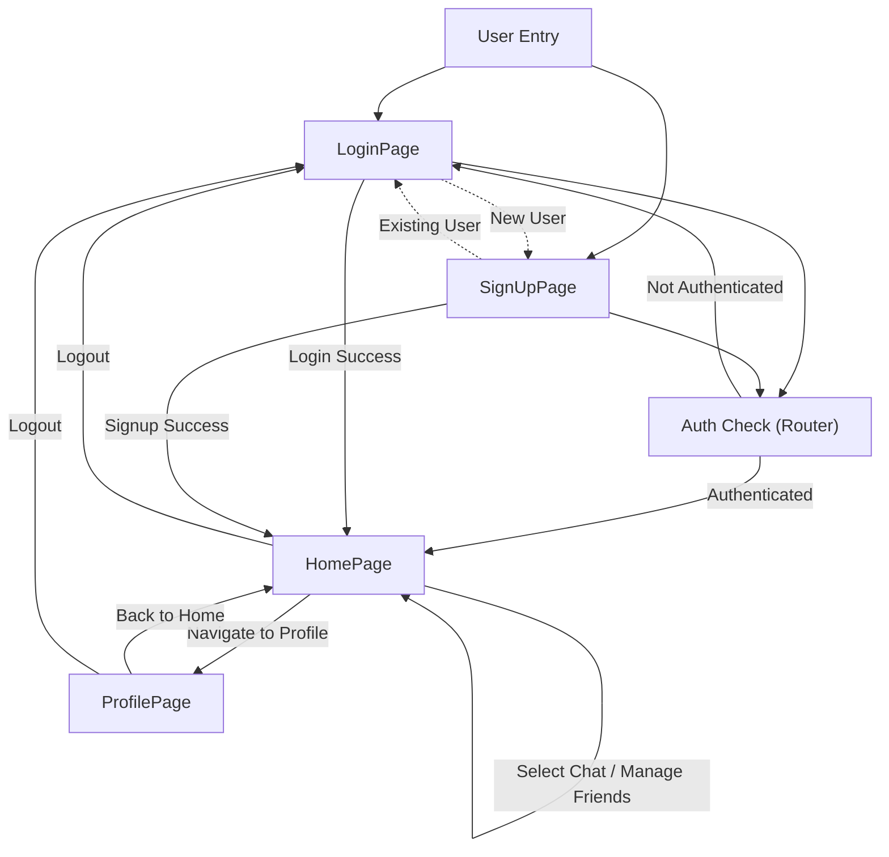
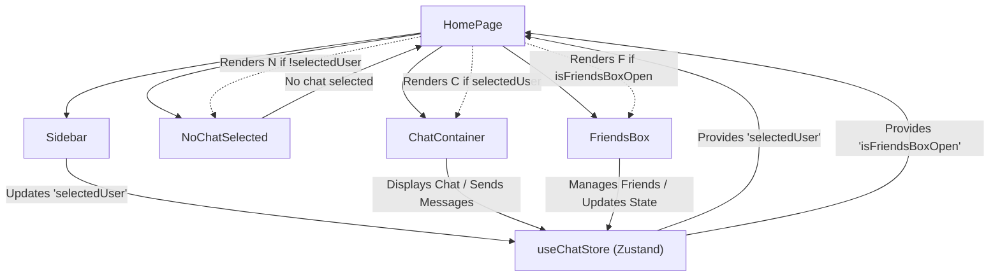

 
---
title: "Frontend Pages and Routing"
description: "Describes the main application pages and their respective functionalities and navigation."
sidebar_position: 33
---

# Frontend Pages and Routing

<TOC />

This section details the primary user-facing pages within the chat application's frontend. Each page serves a distinct purpose, from user authentication to the core messaging experience and profile management. We will explore their functionalities, component structures, and how they contribute to the overall user journey.

## Authentication Pages

The application provides dedicated pages for user authentication, including `LoginPage` for existing users to sign in and `SignUpPage` for new users to register. Both pages support email/password authentication and Google OAuth for convenience.

### LoginPage (frontend/src/pages/LoginPage.jsx)

The `LoginPage` facilitates user login. It presents a form for email and password input and also integrates with Google for single sign-on. The page uses the `useAuthStore` Zustand store to manage authentication state and actions.

#### Key Features:

*   **Email/Password Login:** Users can log in with their registered email and password.
*   **Password Visibility Toggle:** A button to show/hide the password for better usability.
*   **Google OAuth:** Integration for quick sign-in using Google accounts.
*   **Navigation to SignUp:** A link to redirect users to the `SignUpPage` if they don't have an account.
*   **Loading State:** Visual feedback (spinner) during login attempts.

#### Code Snippets:

**Login Form Submission:**
This snippet shows how the form data is collected and passed to the `login` action from the authentication store.

```jsx title="frontend/src/pages/LoginPage.jsx" {21-25}
import { useState } from "react"
import { useAuthStore } from "../store/useAuthStore";
// ... (other imports)

const LoginPage = () => {
  const [showPassword, setShowPassword] = useState(false);
  const [formData, setFormData] = useState({
    email: "",
    password: "",
  })
  const { login, isLoggingIn } = useAuthStore();

  const handleSubmit = async (e) => {
    e.preventDefault();
    login(formData);
  }
  // ... (rest of component)
}
export default LoginPage
```
[View on GitHub](https://github.com/shinymack/Chat-App-MERN/blob/main/frontend/src/pages/LoginPage.jsx#L14-L25)

**Google OAuth Integration:**
The `googleAuthUrl` is constructed using an environment variable, linking directly to the backend's Google authentication endpoint.

```jsx title="frontend/src/pages/LoginPage.jsx" {26-28}
// ... (previous snippet)

  const backendDomain = import.meta.env.VITE_BACKEND_URL;
  const googleAuthUrl = `${backendDomain}/api/auth/google`;
  return (
    <div className="h-screen grid lg:grid-cols-2">
    {/* ... (rest of component) */}
    </div>
  )
}
export default LoginPage
```
[View on GitHub](https://github.com/shinymack/Chat-App-MERN/blob/main/frontend/src/pages/LoginPage.jsx#L26-L28)

### SignUpPage (frontend/src/pages/SignUpPage.jsx)

The `SignUpPage` allows new users to create an account. It collects a username, email, and password, performing client-side validation before attempting registration. Like the `LoginPage`, it integrates with Google OAuth.

#### Key Features:

*   **User Registration:** Form for username, email, and password.
*   **Client-Side Validation:** Basic checks for required fields, email format, and password length.
*   **Password Visibility Toggle:** Allows users to view their password while typing.
*   **Google OAuth:** Option to sign up using a Google account.
*   **Navigation to Login:** A link to redirect users to the `LoginPage` if they already have an account.
*   **Loading State:** Visual feedback during the registration process.

#### Code Snippets:

**Form Validation Logic:**
This function performs basic client-side validation before submitting the signup request, using `react-hot-toast` for user feedback.

```jsx title="frontend/src/pages/SignUpPage.jsx" {18-27}
// ... (imports)

const SignUpPage = () => {
  const [showPassword, setShowPassword] = useState(false);
  const [formData, setFormData] = useState({
    username: "",
    email: "",
    password: "",
  });

  const { signup, IsSigningUp } = useAuthStore();

  const validateForm = () => {
    if(!formData.username.trim()) return toast.error("Username is required");
    if(!formData.email.trim()) return toast.error("Email is required");
    if (!/\S+@\S+\.\S+/.test(formData.email)) return toast.error("Invalid email format");
    if (!formData.password) return toast.error("Password is required");
    if (formData.password.length < 6) return toast.error("Password must be at least 6 characters");

    return true;
  };

  const handleSubmit = (e) => {
    e.preventDefault();

    const success = validateForm();
    if(success===true) signup(formData);
  };
  // ... (rest of component)
}
export default SignUpPage;
```
[View on GitHub](https://github.com/shinymack/Chat-App-MERN/blob/main/frontend/src/pages/SignUpPage.jsx#L18-L35)

## Main Application Pages

Once authenticated, users are directed to the main application interface, starting with the `HomePage`, which serves as the central hub for messaging. Users can also access their profile information via the `ProfilePage`.

### HomePage (frontend/src/pages/HomePage.jsx)

The `HomePage` is the primary interface for users to interact with the chat application. It dynamically displays different components based on the user's current selection, creating a responsive chat experience.

#### Key Features:

*   **Sidebar:** Displays a list of user's friends/chats for selection.
*   **Chat Container:** Appears when a user selects a chat, showing messages and input for new messages.
*   **No Chat Selected View:** A placeholder displayed when no chat is active.
*   **Friends Box:** A modal or panel for managing friends, shown conditionally.
*   **Centralized State Management:** Utilizes `useChatStore` for managing selected chat, friends box visibility, and other chat-related states.

#### Code Snippets:

**Conditional Rendering of Chat Components:**
This snippet demonstrates how `HomePage` uses `selectedUser` and `isFriendsBoxOpen` from `useChatStore` to render the appropriate chat components.

```jsx title="frontend/src/pages/HomePage.jsx" {13-14}
import ChatContainer from "../components/ChatContainer";
import FriendsBox from "../components/FriendsBox";
import NoChatSelected from "../components/NoChatSelected";
import Sidebar from "../components/Sidebar";
import { useChatStore } from "../store/useChatStore"

const HomePage = () => {
  const { selectedUser } = useChatStore();
  const { isFriendsBoxOpen } = useChatStore();
  return (
      <div className="h-screen bg-base-200">
      {/* ... (layout div) */}
          <div className="flex h-full rounded-lg overflow-hidden w-full">
            <Sidebar />
            {!selectedUser ? <NoChatSelected /> : <ChatContainer />}
            {isFriendsBoxOpen && <FriendsBox />}
          </div>
        {/* ... (closing divs) */}
    </div>
  )
}
export default HomePage
```
[View on GitHub](https://github.com/shinymack/Chat-App-MERN/blob/main/frontend/src/pages/HomePage.jsx#L13-L14)

### ProfilePage (frontend/src/pages/ProfilePage.jsx)

The `ProfilePage` allows users to view and update their profile information, including their profile picture and username. It also displays basic account statistics.

#### Key Features:

*   **Profile Picture Upload:** Users can upload a new profile picture.
*   **Username Editing:** Allows users to change their username with real-time availability checking.
*   **Email Display:** Shows the user's registered email (currently read-only).
*   **Account Information:** Displays metadata like "Member Since" and "Account Status."
*   **Loading States:** Provides feedback during profile updates and username availability checks.
*   **Debounced Username Check:** Implements a debounced mechanism to check username availability against the backend to reduce API calls.

#### Code Snippets:

**Profile Picture Upload Handler:**
This function handles file selection and converts the image to a base64 string before calling the `updateProfile` action.

```jsx title="frontend/src/pages/ProfilePage.jsx" {26-37}
// ... (imports)

const ProfilePage = () => {
	const { authUser, isUpdatingProfile, updateProfile } = useAuthStore();
	const [selectedImg, setSelectedImg] = useState(null);

	// ... (username state, etc.)

	const handleImageUpload = async (e) => {
		const file = e.target.files[0];
		if (!file) return;

		const reader = new FileReader();
		reader.readAsDataURL(file);

		reader.onload = async () => {
			const base64Image = reader.result;
			setSelectedImg(base64Image);
			await updateProfile({ profilePic: base64Image });
		};
	};
	// ... (rest of component)
}
export default ProfilePage;
```
[View on GitHub](https://github.com/shinymack/Chat-App-MERN/blob/main/frontend/src/pages/ProfilePage.jsx#L26-L37)

**Debounced Username Availability Check:**
This `useEffect` hook uses a debounce timer to call the backend and check if a new username is available, improving user experience by not flooding the server with requests.

```jsx title="frontend/src/pages/ProfilePage.jsx" {41-65}
// ... (previous snippet)
	// --- Debounced Username Check ---
	useEffect(() => {
		clearTimeout(debounceTimeout.current);

		if (!newUsername.trim() || newUsername.trim().length < 3) {
			setUsernameStatus({ checking: false, available: false, message: "Must be 3+ characters." });
			return;
		}

		if (newUsername === authUser.username) {
			setUsernameStatus({ checking: false, available: true, message: "" });
			return;
		}

		setUsernameStatus((prev) => ({ ...prev, checking: true, message: "Checking..." }));

		debounceTimeout.current = setTimeout(async () => {
			try {
				const res = await axiosInstance.get(`/auth/username/check/${newUsername}`);
				setUsernameStatus({
					checking: false,
					available: res.data.available,
					message: res.data.message,
				});
			} catch (error) {
				const message = error.response?.data?.message || "Error checking username.";
				setUsernameStatus({ checking: false, available: false, message });
			}
		}, 500); // 500ms debounce delay

		return () => clearTimeout(debounceTimeout.current);
	}, [newUsername, authUser.username]);
	// ---------------------------------
// ... (rest of component)
```
[View on GitHub](https://github.com/shinymack/Chat-App-MERN/blob/main/frontend/src/pages/ProfilePage.jsx#L41-L65)

## Frontend Routing and Page Flow

The frontend routing is managed using `react-router-dom`, defining the paths for each page and controlling access based on authentication status.

### Page Navigation Flow

The following diagram illustrates the typical navigation paths between the main frontend pages.





### HomePage Internal Component Flow

The `HomePage` dynamically renders components based on the user's interactions and the global state managed by `useChatStore`.





## Key Integration Points

*   **Zustand Stores:** All authentication and chat-related states are centrally managed using `useAuthStore` and `useChatStore`. This ensures consistent state across components and efficient data flow.
*   **React Router:** `react-router-dom` handles client-side routing, enabling seamless navigation between pages without full page reloads. Protected routes ensure that only authenticated users can access the main application pages.
*   **Backend API:** All authentication actions (login, signup, profile updates) and data fetching (username checks, chat messages, user lists) interact with the backend API via `axiosInstance`.
*   **Environment Variables:** Sensitive backend URLs and other configuration details are managed using environment variables (`import.meta.env.VITE_BACKEND_URL`) for flexible deployment and security.

Next: [Development and Configuration](./4_development-and-configuration.mdx)
```