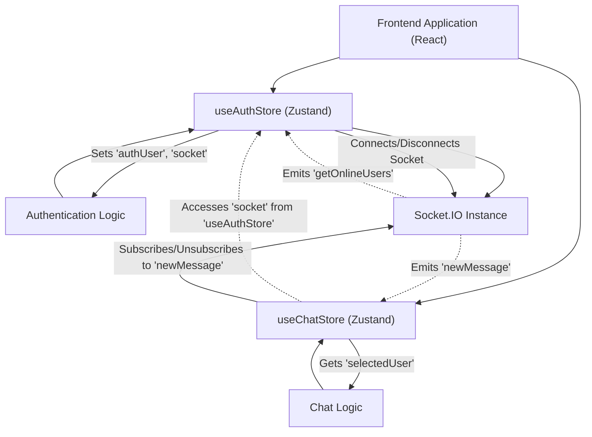
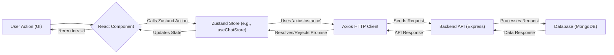

# Frontend State Management and Utilities

This section details the frontend architecture for managing application state and handling network requests. We utilize **Zustand** for its lightweight and flexible state management capabilities, **Axios** for robust HTTP client operations, and **Socket.IO** for real-time communication. This combination provides a powerful and maintainable way to handle complex UI states, user authentication, chat functionalities, and theme preferences.

## State Management with Zustand

Zustand is a small, fast, and scalable state-management solution using simplified flux principles. It's built on a hook-based API, making it seamless to integrate with React components.

### 1. `useAuthStore`

The `useAuthStore` manages all authentication-related state and actions, including user data, login/signup processes, profile updates, and real-time user status via Socket.IO.

**Key Responsibilities:**

*   **User Authentication:** Handles user login, signup, logout, and persistent authentication checks.
*   **User Profile Management:** Facilitates updating the authenticated user's profile.
*   **Socket.IO Connection:** Manages the lifecycle of the Socket.IO connection for the authenticated user, enabling real-time features like online user status.
*   **Loading States:** Tracks various loading states (`isSigningUp`, `isLoggingIn`, `isUpdatingProfile`, `isCheckingAuth`) to provide feedback to the user.
*   **Online Users:** Stores a list of currently online user IDs received from the socket.

**Core Actions & State:**

*   `authUser`: The currently authenticated user object.
*   `isCheckingAuth`: Indicates if an initial authentication check is in progress.
*   `onlineUsers`: An array of user IDs that are currently online.
*   `socket`: The Socket.IO client instance.
*   `checkAuth()`: Verifies user authentication status on application load.
*   `signup(data)`: Registers a new user.
*   `login(data)`: Authenticates an existing user.
*   `logout()`: Clears user session and disconnects the socket.
*   `updateProfile(data)`: Updates the `authUser`'s profile.
*   `connectSocket()`: Initiates a Socket.IO connection for the authenticated user.
*   `disconnectSocket()`: Terminates the Socket.IO connection.

```javascript
// frontend/src/store/useAuthStore.js
import { create } from "zustand";
import { axiosInstance } from "../lib/axios";
import toast from "react-hot-toast";
import { io } from "socket.io-client";

const BASE_URL = import.meta.env.MODE == "development" ? "http://localhost:5001": "/";

export const useAuthStore = create((set, get) => ({
    authUser: null,
    isSigningUp: false,
    isLoggingIn: false,
    isUpdatingProfile: false,
    isCheckingAuth: true,
    onlineUsers: [],
    socket: null,

    checkAuth: async () => {
        try {
            const res = await axiosInstance.get("/auth/check");
            set({ authUser: res.data });
            get().connectSocket(); // Connect socket on successful auth
        } catch (error) {
            set({ authUser: null });
            console.log("Error in checkAuth: ", error);
        } finally {
            set({ isCheckingAuth: false });
        }
    },

    connectSocket: () => {
        const { authUser } = get();
        if(!authUser || get().socket?.connected) return;

        const socket = io(BASE_URL, {
            query: {
                userId : authUser._id,
            },
        });
        socket.connect();
        set({socket: socket});

        socket.on("getOnlineUsers", (userIds) => {
            set({onlineUsers: userIds})
        }); 
    },

    disconnectSocket : () => {
        if(get().socket?.connected) get().socket.disconnect();
    }
}));
```
[View on GitHub](https://github.com/shinymack/Chat-App-MERN/blob/main/frontend/src/store/useAuthStore.js#L1-L86)

### 2. `useChatStore`

The `useChatStore` manages all chat-related state and actions, including friend lists, friend requests, message retrieval, and sending messages. It also integrates with `useAuthStore` to utilize the shared Socket.IO instance for real-time message updates.

**Key Responsibilities:**

*   **Friend Management:** Handles fetching, sending, accepting, rejecting, and removing friend requests and managing the list of friends.
*   **Message Management:** Fetches chat messages for a selected user and sends new messages.
*   **Selected User:** Keeps track of the currently selected user for chat.
*   **Real-time Messaging:** Subscribes to `newMessage` events from the Socket.IO instance to update chat messages in real-time.

**Core Actions & State:**

*   `messages`: An array of chat messages for the `selectedUser`.
*   `users`: A list of friends.
*   `pendingRequests`: Friend requests received by the current user.
*   `sentRequests`: Friend requests sent by the current user.
*   `selectedUser`: The user object currently selected for chatting.
*   `getFriends()`: Fetches the list of friends.
*   `getPendingRequests()`: Fetches friend requests awaiting approval.
*   `sendFriendRequest(identifier)`: Sends a friend request.
*   `acceptFriendRequest(senderId)`: Accepts a pending friend request.
*   `getMessages(userId)`: Fetches chat messages for a specific user.
*   `sendMessage(messageData)`: Sends a new message to the `selectedUser`.
*   `subscribeToMessages()`: Listens for new messages via Socket.IO.
*   `unsubscribeFromMessages()`: Stops listening for new messages.

```javascript
// frontend/src/store/useChatStore.js
import toast from "react-hot-toast";
import { create } from "zustand";
import { axiosInstance } from "../lib/axios";
import { useAuthStore } from "./useAuthStore"; // Accessing auth store for socket

export const useChatStore = create((set, get) => ({
    messages:[],
    users: [],
    pendingRequests: [],
    sentRequests: [],
    selectedUser: null,
    isUsersLoading: false,
    isMessagesLoading: false,
    isFriendBoxOpen: false,

    toggleFriendsBox: () => set(state => ({ isFriendsBoxOpen: !state.isFriendBoxOpen })),

    getFriends: async () => {
        set({isUsersLoading: true});
        try {
            const res = await axiosInstance.get("/friends/list");
            set({ users: res.data});
        } catch (error) {
            toast.error(error.response?.data?.message || "Failed to fetch friends");
        } finally {
            set({ isUsersLoading: false});
        }
    },
    // ... other friend request and management actions ...

    getMessages: async (userId) => {
        set({isMessagesLoading: true});
        try {
            const res = await axiosInstance.get(`/messages/${userId}`);
            set({messages: res.data});
        } catch (error) {
            toast.error(error.response.data.message);
        } finally {
            set({isMessagesLoading: false});
        }
    },
    sendMessage: async (messageData) => {
        const {selectedUser, messages} = get();
        try {
            const res = await axiosInstance.post(`/messages/send/${selectedUser._id}`, messageData);
            set({messages : [...messages, res.data]});
        } catch (error){
            toast.error(error.response.data.message);
        }
    },

    subscribeToMessages: () => {
        const { selectedUser } = get();
        if(!selectedUser) return;
        
        const socket = useAuthStore.getState().socket; // Access socket from useAuthStore
        if (!socket) return; // Ensure socket exists

        socket.on("newMessage", (newMessage) => {
            if(newMessage.senderId !== selectedUser._id) return
            set({
                messages: [...get().messages, newMessage]
            })
        })
    },

    unsubscribeFromMessages: () => {
        const socket = useAuthStore.getState().socket;
        if (socket) {
            socket.off("newMessage");
        }
    },
    
    setSelectedUser: (selectedUser) => set({selectedUser})
}));
```
[View on GitHub](https://github.com/shinymack/Chat-App-MERN/blob/main/frontend/src/store/useChatStore.js#L1-L157)

### 3. `useThemeStore`

The `useThemeStore` is a simple Zustand store that manages the application's theme preference, persisting it to `localStorage`.

**Key Responsibilities:**

*   **Theme Management:** Stores and updates the current theme (e.g., "dark", "light").
*   **Persistence:** Saves the theme preference to `localStorage` for continuity across sessions.

**Core Actions & State:**

*   `theme`: The current theme string.
*   `setTheme(theme)`: Updates the theme and persists it.

```javascript
// frontend/src/store/useThemeStore.js
import { create } from "zustand";

export const useThemeStore = create((set) => ({
    theme: localStorage.getItem("chat-theme") || "dark", // Initialize from localStorage
    setTheme: (theme) => {
        localStorage.setItem("chat-theme", theme); // Persist to localStorage
        set({theme});
    }
}))
```
[View on GitHub](https://github.com/shinymack/Chat-App-MERN/blob/main/frontend/src/store/useThemeStore.js#L1-L9)

### Zustand Store Interactions

The following diagram illustrates how the `useAuthStore` and `useChatStore` interact, especially concerning the shared Socket.IO instance for real-time features.





## Axios HTTP Client Utility

`axiosInstance` is a pre-configured Axios client that simplifies making HTTP requests to the backend API. It abstracts away base URL configuration and ensures credentials are sent with each request for authenticated sessions.

**Key Features:**

*   **Base URL Configuration:** Automatically uses the correct API base URL based on the environment (development or production).
*   **Credential Handling:** Includes `withCredentials: true` to ensure cookies (e.g., session cookies) are sent and received with cross-origin requests, which is crucial for maintaining user sessions.

```javascript
// frontend/src/lib/axios.js
import axios from "axios";

export const axiosInstance = axios.create({
    baseURL: import.meta.env.MODE == "development" ? "http://localhost:5001/api": "/api",
    withCredentials: true, // Important for sending cookies with requests
});
```
[View on GitHub](https://github.com/shinymack/Chat-App-MERN/blob/main/frontend/src/lib/axios.js#L1-L6)

## Frontend Request Flow

This diagram illustrates a typical request flow for a user action within the frontend, such as sending a friend request or a chat message.





## Key Integration Points

*   **Centralized API Calls**: All API interactions go through `axiosInstance`, ensuring consistent base URL, credential handling, and error interception. This promotes a clean separation of concerns and simplifies API request management.
*   **Authentication & Real-time**: The `useAuthStore` is the central hub for user authentication and the lifecycle of the Socket.IO connection. Upon successful login or initial authentication check, the socket is connected, and online user status is updated in real-time. When a user logs out, the socket is gracefully disconnected.
*   **Chat Features & Socket.IO**: The `useChatStore` leverages the Socket.IO instance provided by `useAuthStore` to listen for new messages. This pattern avoids creating multiple socket connections and ensures a single source of truth for the real-time communication channel. When a user selects a chat, `subscribeToMessages` is called, and `unsubscribeFromMessages` is called when they leave the chat, efficiently managing real-time event listeners.
*   **Global State Access**: Zustand's `get()` function allows actions within a store to access the current state of that store or even other stores (`useAuthStore.getState().socket`), facilitating powerful inter-store communication without complex dependencies.
*   **User Feedback**: Integrated `react-hot-toast` across all stores provides immediate and consistent feedback for operations like successful logins, profile updates, and error messages, enhancing the user experience.
*   **Environment Handling**: The `baseURL` in `axiosInstance` and the `BASE_URL` for Socket.IO intelligently adapt based on `import.meta.env.MODE`, supporting both development and production environments seamlessly.