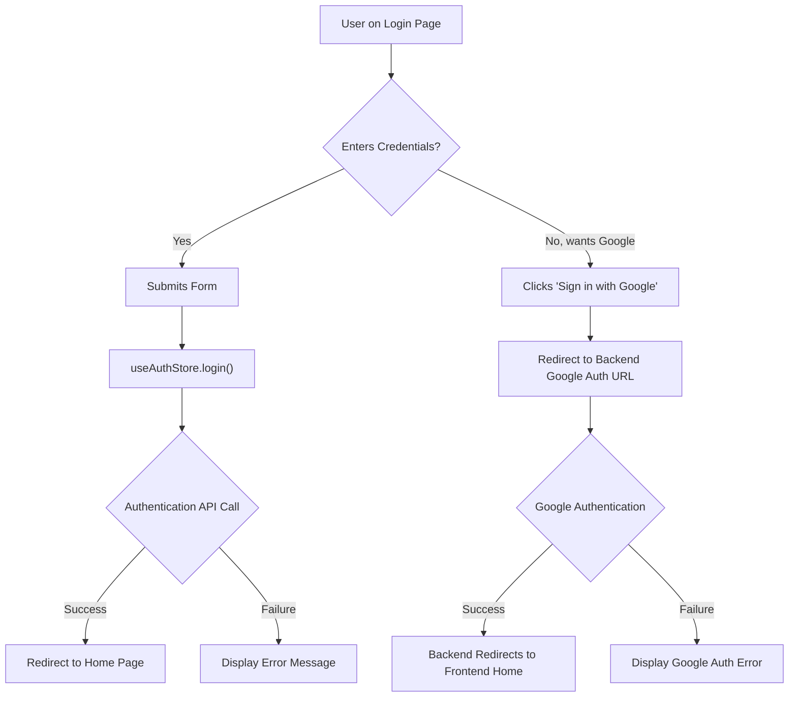

 # Page Routes and Layouts

This section details the primary user-facing pages of the chat application, outlining their purpose, key components, and routing logic. Understanding these pages is crucial for comprehending the user experience flow and the overall architecture of the frontend.

The application leverages React Router for declarative navigation, allowing users to move seamlessly between different views such as the Home, Login, Sign Up, and Profile pages. Each page is designed with a specific function in mind, integrating various components and state management solutions to deliver a cohesive user interface.

## Core Application Pages

The frontend application consists of several key pages, each serving a distinct purpose:

*   **Home Page**: The main chat interface where users interact with their friends and send messages.
*   **Login Page**: Allows existing users to sign in to their accounts.
*   **Sign Up Page**: Enables new users to create an account.
*   **Profile Page**: Displays user-specific information and allows for profile updates.

### HomePage

The `HomePage` serves as the central hub for user interaction after successful authentication. It displays the chat interface, including a sidebar for navigation, a dynamic chat container, and an optional friends list.

**Relevant File**: `frontend/src/pages/HomePage.jsx`

<br />

#### Key Components and Functionality:

*   **Layout**: The page utilizes a flexible layout to arrange the `Sidebar`, `ChatContainer`, and `FriendsBox`.
*   **Dynamic Content**: The main content area dynamically renders either a `NoChatSelected` component (when no chat is active) or a `ChatContainer` (when a user is selected).
*   **State Management**: It uses `useChatStore` to manage the currently `selectedUser` and the visibility of the `isFriendsBoxOpen` state, which controls the `FriendsBox` component.

```jsx
// frontend/src/pages/HomePage.jsx
import ChatContainer from "../components/ChatContainer";
import FriendsBox from "../components/FriendsBox";
import NoChatSelected from "../components/NoChatSelected";
import Sidebar from "../components/Sidebar";
import { useChatStore } from "../store/useChatStore"

const HomePage = () => {
  const { selectedUser } = useChatStore();
  const { isFriendsBoxOpen } = useChatStore();
  return (
      <div className="h-screen bg-base-200">
      <div className="flex items-center justify-center pt-20 px-4 w-full">
        <div className="bg-base-100 rounded-lg shadow-xl w-full max-w-6xl h-[calc(100vh-8rem)]">
          <div className="flex h-full rounded-lg overflow-hidden w-full">
            <Sidebar />
            {!selectedUser ? <NoChatSelected /> : <ChatContainer />}
            {isFriendsBoxOpen && <FriendsBox />}
          </div>
        </div>
      </div>
    </div>
  )
}

export default HomePage
```
[View on GitHub](https://github.com/shinymack/Chat-App-MERN/blob/main/frontend/src/pages/HomePage.jsx)

<br />

### LoginPage

The `LoginPage` provides the interface for existing users to authenticate. It supports both email/password login and Google OAuth.

**Relevant File**: `frontend/src/pages/LoginPage.jsx`

<br />

#### Key Features:

*   **Form Handling**: Manages email and password input fields using React's `useState` hook.
*   **Password Visibility Toggle**: Allows users to show/hide their password for ease of input.
*   **Authentication Logic**: Integrates with `useAuthStore` to handle the `login` action and track the `isLoggingIn` state for UI feedback.
*   **Google OAuth**: Provides a direct link for Google-based authentication, redirecting to the backend's Google auth endpoint.
*   **Navigation**: Includes a link to the `SignUpPage` for new users.
*   **Styling**: Uses the `AuthImagePattern` component for a consistent background design on the right side.

```jsx
// frontend/src/pages/LoginPage.jsx (lines 20-23)
  const { login, isLoggingIn } = useAuthStore();

  const handleSubmit = async (e) => {
    e.preventDefault();
    login(formData);
  }
```
This snippet demonstrates the integration with the `useAuthStore` to handle the login process. The `handleSubmit` function prevents default form submission and calls the `login` action from the store.
[View on GitHub](https://github.com/shinymack/Chat-App-MERN/blob/main/frontend/src/pages/LoginPage.jsx#L20-L23)

```jsx
// frontend/src/pages/LoginPage.jsx (lines 80-84)
          <a
            href={googleAuthUrl} // Link to your backend Google auth route
            className="btn btn-primary btn-outline w-full"
          >
            <FcGoogle className="size-5 mr-2" />
            Sign in with Google
          </a>
```
This snippet shows the button for Google OAuth, which links directly to the backend's Google authentication route.
[View on GitHub](https://github.com/shinymack/Chat-App-MERN/blob/main/frontend/src/pages/LoginPage.jsx#L80-L84)

<br />

#### Login Page Flow





<br />

### ProfilePage

The `ProfilePage` allows authenticated users to view and update their profile information, specifically their profile picture and username.

**Relevant File**: `frontend/src/pages/ProfilePage.jsx`

<br />

#### Key Features:

*   **Profile Picture Upload**: Users can upload a new profile picture, which is then updated via the `updateProfile` action in `useAuthStore`.
*   **Username Editing**: Users can edit their username with a debounced availability check against the backend.
*   **State Management**: `useAuthStore` provides `authUser` data, `isUpdatingProfile` status, and the `updateProfile` action.
*   **Real-time Validation**: The username input triggers an API call to check username availability, providing immediate feedback.
*   **Account Information Display**: Shows static information like email, member since date, and account status.

```jsx
// frontend/src/pages/ProfilePage.jsx (lines 22-34)
	const handleImageUpload = async (e) => {
		const file = e.target.files[0];
		if (!file) return;

		const reader = new FileReader();
		reader.readAsDataURL(file);

		reader.onload = async () => {
			const base64Image = reader.result;
			setSelectedImg(base64Image);
			// Let's call updateProfile from here
			await updateProfile({ profilePic: base64Image });
		};
	};
```
This snippet illustrates the `handleImageUpload` function, which reads a selected image file, converts it to a base64 string, updates the local state, and then dispatches the `updateProfile` action with the new profile picture data.
[View on GitHub](https://github.com/shinymack/Chat-App-MERN/blob/main/frontend/src/pages/ProfilePage.jsx#L22-L34)

```jsx
// frontend/src/pages/ProfilePage.jsx (lines 42-65)
	useEffect(() => {
		// Clear any existing timer when newUsername changes
		clearTimeout(debounceTimeout.current);

		if (!newUsername.trim() || newUsername.trim().length < 3) {
			setUsernameStatus({ checking: false, available: false, message: "Must be 3+ characters." });
			return;
		}

		if (newUsername === authUser.username) {
			setUsernameStatus({ checking: false, available: true, message: "" });
			return;
		}

		setUsernameStatus((prev) => ({ ...prev, checking: true, message: "Checking..." }));

		debounceTimeout.current = setTimeout(async () => {
			try {
				const res = await axiosInstance.get(`/auth/username/check/${newUsername}`);
				setUsernameStatus({
					checking: false,
					available: res.data.available,
					message: res.data.message,
				});
			} catch (error) {
				const message = error.response?.data?.message || "Error checking username.";
				setUsernameStatus({ checking: false, available: false, message });
			}
		}, 500); // 500ms debounce delay

		// Cleanup function to clear timeout on component unmount
		return () => clearTimeout(debounceTimeout.current);
	}, [newUsername, authUser.username]);
```
This `useEffect` hook implements a debounced username availability check. It prevents an API call on every keystroke, waiting for a 500ms pause before making a request to the backend to validate the new username.
[View on GitHub](https://github.com/shinymack/Chat-App-MERN/blob/main/frontend/src/pages/ProfilePage.jsx#L42-L65)

<br />

### SignUpPage

The `SignUpPage` is designed for new users to register an account, similar to the `LoginPage` it supports both email/password registration and Google OAuth.

**Relevant File**: `frontend/src/pages/SignUpPage.jsx`

<br />

#### Key Features:

*   **Form Handling**: Collects username, email, and password.
*   **Client-side Validation**: Performs basic validation before submitting the form to the backend (e.g., required fields, email format, password length).
*   **Authentication Logic**: Uses `useAuthStore` to perform the `signup` action and displays a loading state (`IsSigningUp`).
*   **Google OAuth**: Offers an alternative registration method via Google.
*   **Navigation**: Provides a link back to the `LoginPage` for users who already have an account.
*   **Styling**: Shares the `AuthImagePattern` component for consistent branding.

```jsx
// frontend/src/pages/SignUpPage.jsx (lines 20-30)
  const { signup, IsSigningUp } = useAuthStore();

  const validateForm = () => {
    if(!formData.username.trim()) return toast.error("Username is required");
    if(!formData.email.trim()) return toast.error("Email is required");
    if (!/\S+@\S+\.\S+/.test(formData.email)) return toast.error("Invalid email format");
    if (!formData.password) return toast.error("Password is required");
    if (formData.password.length < 6) return toast.error("Password must be at least 6 characters");

    return true;
  };
```
This snippet shows the `validateForm` function that performs client-side validation using `react-hot-toast` for user feedback before the `signup` action is dispatched.
[View on GitHub](https://github.com/shinymack/Chat-App-MERN/blob/main/frontend/src/pages/SignUpPage.jsx#L20-L30)

```jsx
// frontend/src/pages/SignUpPage.jsx (lines 100-104)
          <a
            href={googleAuthUrl} // Link to your backend Google auth route
            className="btn btn-primary btn-outline w-full"
          >
            <FcGoogle className="size-5 mr-2" /> 
            Sign up with Google
          </a>
```
Similar to the Login Page, this snippet shows the Google OAuth button for signing up, linking to the backend's Google authentication endpoint.
[View on GitHub](https://github.com/shinymack/Chat-App-MERN/blob/main/frontend/src/pages/SignUpPage.jsx#L100-L104)

<br />

## Key Integration Points

The routing and page layouts are intrinsically linked to the application's state management and backend API.

*   **Authentication Flow**: The `LoginPage` and `SignUpPage` are critical entry points, relying heavily on the `useAuthStore` for user authentication, session management, and redirection to the `HomePage` upon success. This ensures that unauthenticated users are correctly routed to the login/signup flows and authenticated users are kept within the application.
*   **Protected Routes**: While not explicitly detailed in the provided code, typically, the `HomePage` and `ProfilePage` would be protected routes, only accessible if a user is authenticated. This is generally handled by a global routing guard or higher-order component that checks the `useAuthStore` for an authenticated user.
*   **Dynamic UI**: The `HomePage` demonstrates dynamic UI rendering based on chat selection (`selectedUser` from `useChatStore`). This pattern is common in single-page applications where large sections of the UI change based on user interaction or application state.
*   **Backend Interactions**: The `LoginPage`, `SignUpPage`, and `ProfilePage` all interact with the backend API for authentication, user creation, and profile updates. The `axiosInstance` and environment variables (`VITE_BACKEND_URL`) facilitate these secure communications.

The careful design of these pages and their integration points ensures a smooth and secure user experience, guiding users through authentication, chat, and profile management workflows.

Next: [Styling and Theming](./3.4_styling-and-theming.mdx)