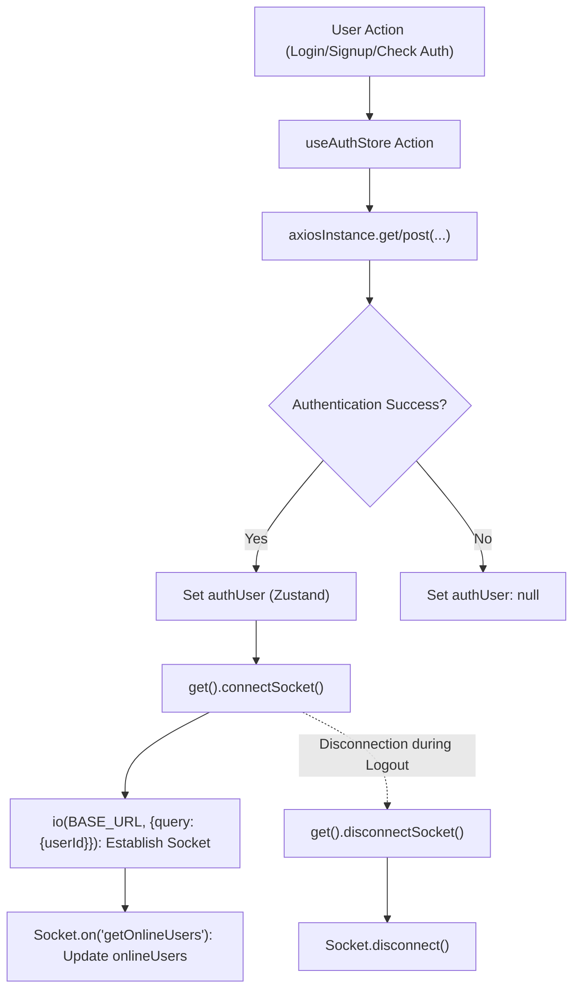
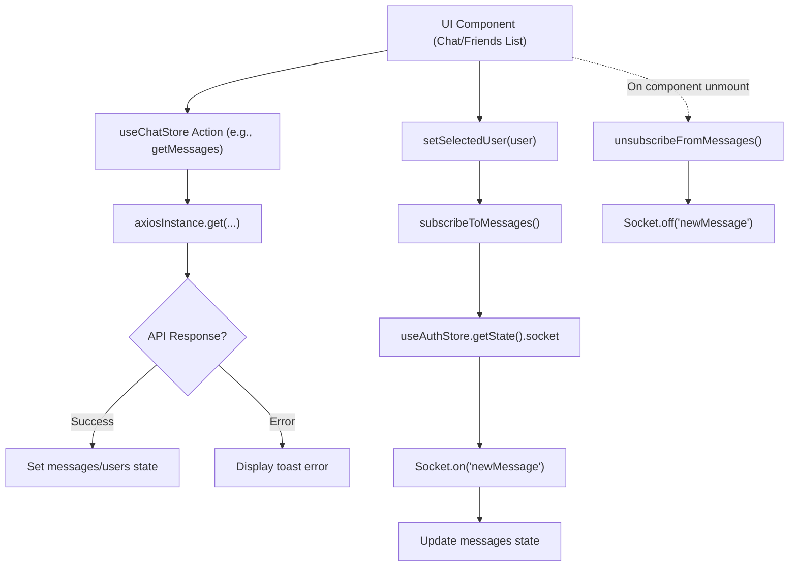

# State Management and Utilities

This document details the frontend's approach to global state management and client-side utility functions. The application leverages [Zustand](https://zustand-bears.smashicons.com/) for a lightweight and scalable state management solution, complemented by essential utility functions for API interaction and data formatting.

## Global State Management

The application utilizes Zustand to manage its global state, specifically for user authentication and chat-related functionalities. Zustand is chosen for its simplicity, small bundle size, and performance, offering a hook-based API similar to React's `useState` but with global access.

### `useAuthStore` (Authentication and Socket Management)

The `useAuthStore` is the central hub for managing user authentication status, user profile data, and WebSocket connectivity. It handles user lifecycle events such as signup, login, logout, profile updates, and maintains the list of online users.

**Key Responsibilities:**

*   **Authentication State**: Stores the authenticated user object (`authUser`), and manages loading states (`isSigningUp`, `isLoggingIn`, `isUpdatingProfile`, `isCheckingAuth`).
*   **API Interactions**: Contains asynchronous actions for `checkAuth`, `signup`, `login`, `logout`, and `updateProfile`, all interacting with the backend authentication endpoints via `axiosInstance`.
*   **Socket Management**: Establishes and disconnects a WebSocket connection for the authenticated user, enabling real-time features like tracking online users.
*   **Online Users**: Maintains a list of `onlineUsers` received from the WebSocket.

```javascript showLineNumbers {10-18,34-40}
// frontend/src/store/useAuthStore.js
import { create } from "zustand";
import { axiosInstance } from "../lib/axios";
import toast from "react-hot-toast";
import { io } from "socket.io-client";

const BASE_URL = import.meta.env.MODE == "development" ? "http://localhost:5001": "/";

export const useAuthStore = create((set, get) => ({
    authUser: null,
    isSigningUp: false,
    isLoggingIn: false,
    isUpdatingProfile: false,
    isCheckingAuth: true,
    onlineUsers: [],
    socket: null,

    checkAuth: async () => {
        try {
            const res = await axiosInstance.get("/auth/check");
            set({ authUser: res.data });
            get().connectSocket(); // Connect socket after successful auth
        } catch (error) {
            set({ authUser: null });
            console.log("Error in checkAuth: ", error);
        } finally {
            set({ isCheckingAuth: false });
        }
    },

    connectSocket: () => {
        const { authUser } = get();
        if(!authUser || get().socket?.connected) return;

        const socket = io(BASE_URL, {
            query: {
                userId : authUser._id,
            },
        });
        socket.connect();
        set({socket: socket});

        socket.on("getOnlineUsers", (userIds) => {
            set({onlineUsers: userIds})
        }); 
    },
    // ... other actions (signup, login, logout, updateProfile)
}));
```

[View on GitHub](https://github.com/shinymack/Chat-App-MERN/blob/main/frontend/src/store/useAuthStore.js)

The `connectSocket` action is crucial for initializing the WebSocket connection. It ensures that a connection is established only when a user is authenticated and if a socket isn't already active.





### `useChatStore` (Chat and Friend Management)

The `useChatStore` manages all chat-related data and actions, including messages, user lists (friends), and friend request functionalities. It also handles the currently selected user for chat.

**Key Responsibilities:**

*   **Chat State**: Stores `messages` for the selected conversation, `users` (friends), `pendingRequests`, `sentRequests`, and the `selectedUser` for the current chat.
*   **Loading States**: Manages `isUsersLoading` and `isMessagesLoading` to provide UI feedback.
*   **Friend Management**: Provides actions to `getFriends`, `getPendingRequests`, `getSentRequests`, `sendFriendRequest`, `acceptFriendRequest`, `rejectFriendRequest`, and `removeFriend`.
*   **Message Management**: Contains actions to `getMessages` for a specific user and `sendMessage`.
*   **Real-time Messaging**: Subscribes to and unsubscribes from WebSocket `newMessage` events to update chat messages in real-time, leveraging the `socket` instance from `useAuthStore`.

```javascript showLineNumbers {13-18,127-133}
// frontend/src/store/useChatStore.js
import toast from "react-hot-toast";
import { create } from "zustand";
import { axiosInstance } from "../lib/axios";
import { useAuthStore } from "./useAuthStore"; // Import useAuthStore

export const useChatStore = create((set, get) => ({
    messages:[],
    users: [],
    pendingRequests: [],
    sentRequests: [],
    selectedUser: null,
    isUsersLoading: false,
    isMessagesLoading: false,
    isFriendBoxOpen: false,

    toggleFriendsBox: () => set(state => ({ isFriendsBoxOpen: !state.isFriendBoxOpen })),

    getFriends: async () => { /* ... API call ... */ },
    getPendingRequests: async () => { /* ... API call ... */ },
    getSentRequests: async () => { /* ... API call ... */ },
    sendFriendRequest: async (identifier) => { /* ... API call ... */ },
    acceptFriendRequest: async (senderId) => { /* ... API call ... */ },
    rejectFriendRequest: async (senderId) => { /* ... API call ... */ },
    removeFriend: async (friendId) => { /* ... API call ... */ },
    getMessages: async (userId) => { /* ... API call ... */ },
    sendMessage: async (messageData) => { /* ... API call ... */ },

    subscribeToMessages: () => {
        const { selectedUser } = get();
        if(!selectedUser) return;
        
        // Access the socket instance from useAuthStore
        const socket = useAuthStore.getState().socket; 
        if(!socket) {
            console.warn("Socket not available in useAuthStore for message subscription.");
            return;
        }
        socket.on("newMessage", (newMessage) => {
            if(newMessage.senderId !== selectedUser._id) return
            set({
                messages: [...get().messages, newMessage]
            })
        })
    },

    unsubscribeFromMessages: () => {
        const socket = useAuthStore.getState().socket;
        if(socket) socket.off("newMessage");
    },
    
    setSelectedUser: (selectedUser) => set({selectedUser})
}));
```

[View on GitHub](https://github.com/shinymack/Chat-App-MERN/blob/main/frontend/src/store/useChatStore.js)

The `subscribeToMessages` and `unsubscribeFromMessages` actions demonstrate how `useChatStore` integrates with the WebSocket connection managed by `useAuthStore`. This cross-store communication allows real-time message updates without duplicating socket logic.





## Client-Side Utilities

### `axiosInstance` (API Client)

The `axios.js` file configures a custom Axios instance, `axiosInstance`, which serves as the primary HTTP client for all API requests from the frontend to the backend.

**Key Features:**

*   **Base URL Configuration**: Dynamically sets the `baseURL` based on the environment (`development` or production), ensuring correct API endpoint resolution.
*   **Credentials Handling**: `withCredentials: true` ensures that cookies (including session cookies for authentication) are sent with every request, maintaining user sessions.

```javascript showLineNumbers {4-7}
// frontend/src/lib/axios.js
import axios from "axios";

export const axiosInstance = axios.create({
    baseURL: import.meta.env.MODE == "development" ? "http://localhost:5001/api": "/api",
    withCredentials: true,
});
```

[View on GitHub](https://github.com/shinymack/Chat-App-MERN/blob/main/frontend/src/lib/axios.js)

This centralized Axios instance simplifies API calls throughout the application and ensures consistent configuration for credential handling.

### `formatMessageTime` (Date/Time Formatting)

The `utils.js` file contains general utility functions, with `formatMessageTime` being an example of how dates and times are standardized for display in the chat interface.

**Key Feature:**

*   **Consistent Date Formatting**: Takes a date string and returns a human-readable, localized time string including year, month, day, hour, and minute.

```javascript showLineNumbers {2-9}
// frontend/src/lib/utils.js
export function formatMessageTime(date) {
    return new Date(date).toLocaleTimeString("en-US", {
        year: "numeric",
        month: "short",
        day:"2-digit",
        hour: "2-digit",
        minute: "2-digit",
        hour12: true,
    });
}
```

[View on GitHub](https://github.com/shinymack/Chat-App-MERN/blob/main/frontend/src/lib/utils.js)

This function ensures that message timestamps are presented clearly and consistently across the application.

## Key Integration Points

*   **Zustand for Global State**: `useAuthStore` and `useChatStore` encapsulate distinct but related domains of application state. They provide a clear separation of concerns while allowing necessary interactions (e.g., `useChatStore` accessing `useAuthStore`'s socket).
*   **Centralized API Client**: The `axiosInstance` provides a single point of configuration for all HTTP requests, ensuring consistent handling of `baseURL` and `withCredentials`. This makes API calls cleaner and more robust.
*   **Real-time Communication**: The WebSocket connection is managed by `useAuthStore` and exposed for `useChatStore` to subscribe to real-time events, enabling dynamic updates for online users and new messages.
*   **Modular Utilities**: Small, focused utility functions like `formatMessageTime` are kept in `lib/utils.js` to avoid cluttering components or state stores with formatting logic, promoting reusability and maintainability.

Next: [Development and Configuration](./4_development-and-configuration.mdx)