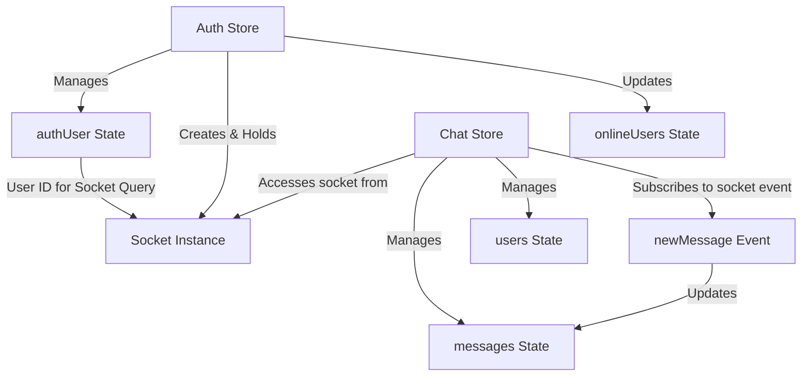
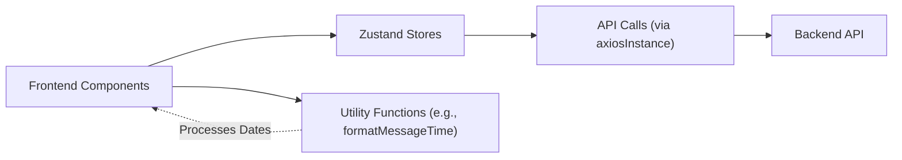

# State Management and Utilities

This section details the frontend's approach to global state management using Zustand, a fast and scalable state-management solution, and outlines the common client-side utility functions that enhance application functionality and communication with the backend.

## Zustand State Management

Zustand is employed for its simplicity and efficiency in managing global state across React components. It provides a straightforward API for creating stores, subscribing to state changes, and performing actions. The application primarily utilizes two main Zustand stores: `useAuthStore` for authentication and user-related state, and `useChatStore` for chat, messaging, and friend management.

### Authentication and User State (`useAuthStore`)

The `useAuthStore` manages all authentication-related state, including the currently authenticated user, authentication status, and integration with real-time functionalities via WebSockets.

**Key Responsibilities:**

*   **`authUser`**: Stores the currently logged-in user's data.
*   **Loading States**: `isSigningUp`, `isLoggingIn`, `isUpdatingProfile`, `isCheckingAuth` provide feedback on asynchronous operations.
*   **`onlineUsers`**: An array of user IDs currently online, received via WebSocket.
*   **`socket`**: The WebSocket connection instance, enabling real-time communication.

**Core Actions:**

*   **`checkAuth()`**: Verifies the user's authentication status with the backend on application load.
*   **`signup(data)`**: Handles user registration, setting `authUser` on success.
*   **`login(data)`**: Manages user login, setting `authUser` on successful authentication.
*   **`logout()`**: Clears `authUser` and disconnects the WebSocket.
*   **`updateProfile(data)`**: Allows authenticated users to update their profile information.
*   **`connectSocket()`**: Establishes a WebSocket connection, attaching the `userId` for identification.
*   **`disconnectSocket()`**: Closes the active WebSocket connection.

**Example: `useAuthStore` Initialization**

```javascript
// frontend/src/store/useAuthStore.js
import { create } from "zustand";
import { axiosInstance } from "../lib/axios";
import toast from "react-hot-toast";
import { io } from "socket.io-client";

const BASE_URL = import.meta.env.MODE == "development" ? "http://localhost:5001": "/";

export const useAuthStore = create((set, get) => ({
    authUser: null,
    isSigningUp: false,
    isLoggingIn: false,
    isUpdatingProfile: false,
    isCheckingAuth: true,
    onlineUsers: [],
    socket: null,

    // ... (actions like checkAuth, signup, login, logout, updateProfile)

    connectSocket: () => {
        const { authUser } = get();
        if(!authUser || get().socket?.connected) return;

        const socket = io(BASE_URL, {
            query: {
                userId : authUser._id,
            },
        });
        socket.connect();
        set({socket: socket});

        socket.on("getOnlineUsers", (userIds) => {
            set({onlineUsers: userIds})
        }); 
    },

    disconnectSocket : () => {
        if(get().socket?.connected) get().socket.disconnect();
    }
}));
```
[View on GitHub](https://github.com/shinymack/Chat-App-MERN/blob/main/frontend/src/store/useAuthStore.js#L1-L84)

### Chat and Friend Management (`useChatStore`)

The `useChatStore` handles all state related to messaging, friend lists, and friend requests. It integrates with `useAuthStore` to utilize the established WebSocket connection.

**Key Responsibilities:**

*   **`messages`**: Stores messages for the currently selected chat.
*   **`users`**: List of friends of the authenticated user.
*   **`pendingRequests`**: Incoming friend requests.
*   **`sentRequests`**: Outgoing friend requests.
*   **`selectedUser`**: The friend whose chat is currently open.
*   **Loading States**: `isUsersLoading`, `isMessagesLoading`.
*   **`isFriendBoxOpen`**: Toggles the visibility of the friend management UI.

**Core Actions:**

*   **`getFriends()`**: Fetches the authenticated user's friend list.
*   **`getPendingRequests()`**: Retrieves incoming friend requests.
*   **`getSentRequests()`**: Retrieves outgoing friend requests.
*   **`sendFriendRequest(identifier)`**: Initiates a friend request to another user.
*   **`acceptFriendRequest(senderId)`**: Accepts an incoming friend request.
*   **`rejectFriendRequest(senderId)`**: Rejects an incoming friend request.
*   **`removeFriend(friendId)`**: Removes a friend from the user's list.
*   **`getMessages(userId)`**: Fetches chat messages with a specific user.
*   **`sendMessage(messageData)`**: Sends a new message to the `selectedUser`.
*   **`subscribeToMessages()`**: Listens for "newMessage" events via WebSocket.
*   **`unsubscribeFromMessages()`**: Stops listening for "newMessage" events.
*   **`setSelectedUser(user)`**: Sets the user whose chat is currently active.

**Example: `useChatStore` and WebSocket Subscription**

```javascript
// frontend/src/store/useChatStore.js
import toast from "react-hot-toast";
import { create } from "zustand";
import { axiosInstance } from "../lib/axios";
import { useAuthStore } from "./useAuthStore"; // Import useAuthStore

export const useChatStore = create((set, get) => ({
    messages:[],
    users: [],
    pendingRequests: [],
    sentRequests: [],
    selectedUser: null,
    isUsersLoading: false,
    isMessagesLoading: false,
    isFriendBoxOpen: false,

    toggleFriendsBox: () => set(state => ({ isFriendsBoxOpen: !state.isFriendBoxOpen })),

    // ... (actions for friends, requests, messages)

    subscribeToMessages: () => {
        const { selectedUser } = get();
        if(!selectedUser) return;
        
        // Access the socket from useAuthStore
        const socket = useAuthStore.getState().socket; 
        socket.on("newMessage", (newMessage) => {
            if(newMessage.senderId !== selectedUser._id) return
            set({
                messages: [...get().messages, newMessage]
            })
        })
    },

    unsubscribeFromMessages: () => {
        const socket = useAuthStore.getState().socket;
        socket.off("newMessage");
    },
    
    setSelectedUser: (selectedUser) => set({selectedUser})
}));
```
[View on GitHub](https://github.com/shinymack/Chat-App-MERN/blob/main/frontend/src/store/useChatStore.js#L1-L149)

### Zustand State Interaction Flow

The following diagram illustrates how the authentication and chat stores interact, particularly regarding WebSocket management and data flow.





## Client-Side Utility Functions

A collection of small, reusable functions and configurations that facilitate common tasks within the frontend.

### Axios Instance (`axios.js`)

A custom Axios instance (`axiosInstance`) is configured to streamline API requests, ensuring consistent base URL usage and credential handling.

**Purpose:**

*   **`baseURL`**: Dynamically set based on the environment (development or production).
*   **`withCredentials: true`**: Ensures that cookies (e.g., session cookies for authentication) are sent with every request, crucial for maintaining user sessions.

**Configuration:**

```javascript
// frontend/src/lib/axios.js
import axios from "axios";

export const axiosInstance = axios.create({
    baseURL: import.meta.env.MODE == "development" ? "http://localhost:5001/api": "/api",
    withCredentials: true,
});
```
[View on GitHub](https://github.com/shinymack/Chat-App-MERN/blob/main/frontend/src/lib/axios.js#L1-L6)

### General Utilities (`utils.js`)

The `utils.js` file houses general-purpose utility functions that can be used across various components.

**Purpose:**

*   **`formatMessageTime(date)`**: Formats a given date into a readable time string, including year, month, day, hour, and minute.

**Example: `formatMessageTime`**

```javascript
// frontend/src/lib/utils.js
export function formatMessageTime(date) {
    return new Date(date).toLocaleTimeString("en-US", {
        year: "numeric",
        month: "short",
        day:"2-digit",
        hour: "2-digit",
        minute: "2-digit",
        hour12: true,
    });
}
```
[View on GitHub](https://github.com/shinymack/Chat-App-MERN/blob/main/frontend/src/lib/utils.js#L1-L9)

### Utility and API Interaction Flow

This diagram illustrates how the Axios instance and general utilities fit into the broader application flow.





## Key Integration Points

*   **Zustand for Global State**: Both `useAuthStore` and `useChatStore` provide a centralized, reactive way to manage application-wide data, eliminating prop-drilling and ensuring components always have access to the latest state.
*   **Centralized API Calls**: The `axiosInstance` ensures that all HTTP requests are made consistently, handling base URL resolution and credential management automatically. This promotes code reusability and simplifies API interaction.
*   **WebSocket Integration**: `useAuthStore` is the single source of truth for the WebSocket connection, which `useChatStore` then subscribes to for real-time updates. This prevents multiple socket connections and manages their lifecycle efficiently.
*   **Utility Helper**: `utils.js` encapsulates common formatting or manipulation logic, keeping components clean and focused on their primary responsibilities.

By adhering to these patterns, the frontend maintains a clear separation of concerns, robust state management, and efficient communication with the backend services.

Next: [Development and Configuration](./4_development-and-configuration.mdx)