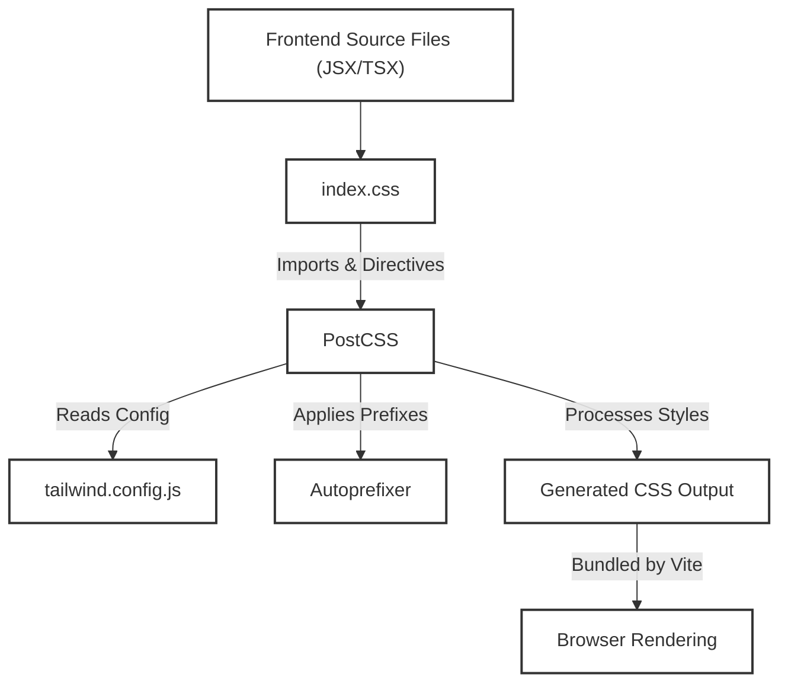
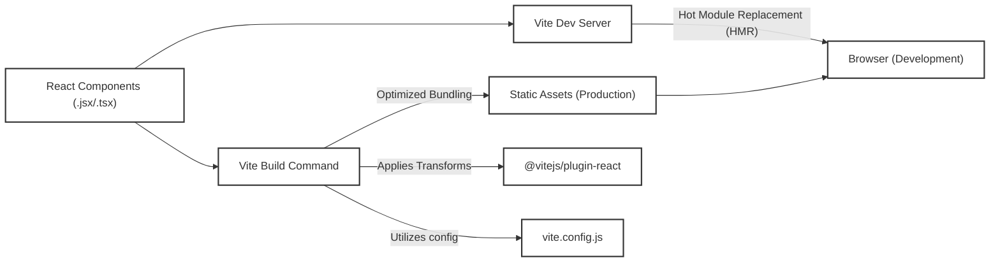

 # Styling and Configuration

This document details the frontend styling architecture and core project configurations, primarily focusing on Tailwind CSS, PostCSS, and Vite. These tools are integrated to provide a modern, efficient, and highly customizable development experience for the user interface.

## Frontend Styling with Tailwind CSS and DaisyUI

The frontend of the application leverages [Tailwind CSS](https://tailwindcss.com/) for utility-first styling, complemented by [DaisyUI](https://daisyui.com/), a Tailwind CSS component library that provides pre-built, semantic components and theme management. This combination allows for rapid UI development while maintaining full control over the styling details.

### Tailwind CSS Configuration

The `frontend/tailwind.config.js` file is the central hub for customizing Tailwind CSS. It defines which files Tailwind should scan for classes, extends the default theme, and integrates plugins like DaisyUI.

```javascript
// frontend/tailwind.config.js
import daisyui from "daisyui"

/** @type {import('tailwindcss').Config} */
export default {
  content: [
    "./index.html",
    "./src/**/*.{js,ts,jsx,tsx}",
  ],
  theme: {
    extend: {
      fontFamily : {
        chivo : ['Chivo', 'sans-serif'],
      }
    },
  },
  plugins: [daisyui],
  daisyui : {
    themes: [
      "light", "dark", "cupcake", "bumblebee", "emerald", "corporate",
      "synthwave", "retro", "cyberpunk", "valentine", "halloween", "garden",
      "forest", "aqua", "lofi", "pastel", "fantasy", "wireframe", "black",
      "luxury", "dracula", "cmyk", "autumn", "business", "acid", "lemonade",
      "night", "coffee", "winter", "dim", "nord", "sunset",
    ],
  }
}
```
[View on GitHub](https://github.com/shinymack/Chat-App-MERN/blob/main/frontend/tailwind.config.js)

**Explanation:**
*   **`content`**: Specifies the files where Tailwind CSS should look for class names. This is crucial for Tailwind's tree-shaking process, ensuring only used CSS is bundled.
*   **`theme.extend`**: Allows adding custom typography, colors, spacing, etc., without overriding Tailwind's defaults. Here, a custom `chivo` font family is defined.
*   **`plugins`**: Integrates additional Tailwind CSS plugins. DaisyUI is included here, providing a vast collection of styled components.
*   **`daisyui.themes`**: Configures the available themes for DaisyUI, enabling easy theme switching throughout the application. A wide range of themes are enabled, offering diverse aesthetic choices.

### PostCSS Configuration

PostCSS is a tool for transforming CSS with JavaScript plugins. In this project, it's used to process Tailwind CSS and add vendor prefixes. The `frontend/postcss.config.js` file defines which PostCSS plugins are active.

```javascript
// frontend/postcss.config.js
export default {
  plugins: {
    tailwindcss: {},
    autoprefixer: {},
  },
}
```
[View on GitHub](https://github.com/shinymack/Chat-App-MERN/blob/main/frontend/postcss.config.js)

**Explanation:**
*   **`tailwindcss`**: This plugin integrates Tailwind CSS into the PostCSS pipeline, processing the `@tailwind` directives in `index.css` and generating the necessary utility classes.
*   **`autoprefixer`**: Automatically adds vendor prefixes to CSS rules, ensuring cross-browser compatibility without manual intervention.

### Global Stylesheet

The `frontend/src/index.css` file is the entry point for all global styles and Tailwind CSS directives. It imports external fonts and tells Tailwind where to inject its base, component, and utility styles.

```css
/* frontend/src/index.css */
@import url('https://fonts.googleapis.com/css2?family=Chivo:ital,wght@0,100..900;1,100..900&display=swap');
@tailwind base;
@tailwind components;
@tailwind utilities;


@layer base {
    body {
        @apply font-chivo;
    }
}
```
[View on GitHub](https://github.com/shinymack/Chat-App-MERN/blob/main/frontend/src/index.css)

**Explanation:**
*   **`@import url(...)`**: Imports the "Chivo" font from Google Fonts, making it available for use in the application.
*   **`@tailwind base;`**: Injects Tailwind's base styles, which normalize CSS and provide a solid foundation.
*   **`@tailwind components;`**: Injects Tailwind's component classes, including those from DaisyUI if configured.
*   **`@tailwind utilities;`**: Injects Tailwind's utility classes, which form the core of the utility-first approach.
*   **`@layer base { ... }`**: This custom layer applies the `font-chivo` utility class to the `body` element, ensuring the custom font is used throughout the application by default.

### Styling Workflow Diagram

The following diagram illustrates the flow of how styles are processed and applied in the frontend:





## Frontend Project Configuration with Vite

Vite is used as the build tool for the frontend, offering a fast development experience with features like hot module replacement (HMR) and optimized builds for production.

### Vite Configuration

The `frontend/vite.config.js` file configures Vite's behavior, including plugins and build options.

```javascript
// frontend/vite.config.js
import { defineConfig } from 'vite'
import react from '@vitejs/plugin-react'

// https://vitejs.dev/config/
export default defineConfig({
  plugins: [react()],
})
```
[View on GitHub](https://github.com/shinymack/Chat-App-MERN/blob/main/frontend/vite.config.js)

**Explanation:**
*   **`defineConfig`**: A helper from Vite that provides type intelisense for the configuration object.
*   **`plugins: [react()]`**: Includes the official `@vitejs/plugin-react` plugin. This plugin provides React-specific optimizations, Babel transformations, and Fast Refresh (HMR) support for React components.

### Frontend Build Process Diagram

This diagram illustrates how Vite processes and builds the frontend application:





## Key Integration Points

The integration of these tools provides a robust and flexible frontend development environment:

*   **Tailwind CSS and DaisyUI**: This combination streamlines UI development significantly. Tailwind's utility-first approach offers granular control, while DaisyUI provides a component library that adheres to modern design principles, reducing the need to build complex components from scratch. The extensive theme support in DaisyUI allows for quick aesthetic changes and ensures brand consistency across different parts of the application.
*   **PostCSS Pipeline**: PostCSS acts as the middleware for CSS processing. It intelligently integrates Tailwind CSS, handling `@tailwind` directives and `apply` rules. Furthermore, `autoprefixer` ensures that the generated CSS works seamlessly across various browsers, reducing compatibility headaches for developers.
*   **Vite for Development and Build**: Vite's architecture provides incredibly fast development server startup times and hot module replacement, which dramatically improves developer productivity. For production, Vite performs an optimized build, ensuring that the application bundles are small and performant, leading to faster load times for users. The `plugin-react` integrates seamlessly, providing the necessary Babel transformations and Fast Refresh features critical for React development.
*   **Font Integration**: The custom font `Chivo` is imported globally and applied to the `body` via a PostCSS `@layer base` directive. This ensures consistent typography throughout the application from the very start, aligning with design specifications and enhancing the overall user experience.

By combining these technologies, the frontend is equipped with a powerful, efficient, and maintainable styling and build system, capable of supporting both rapid prototyping and scalable production deployments.