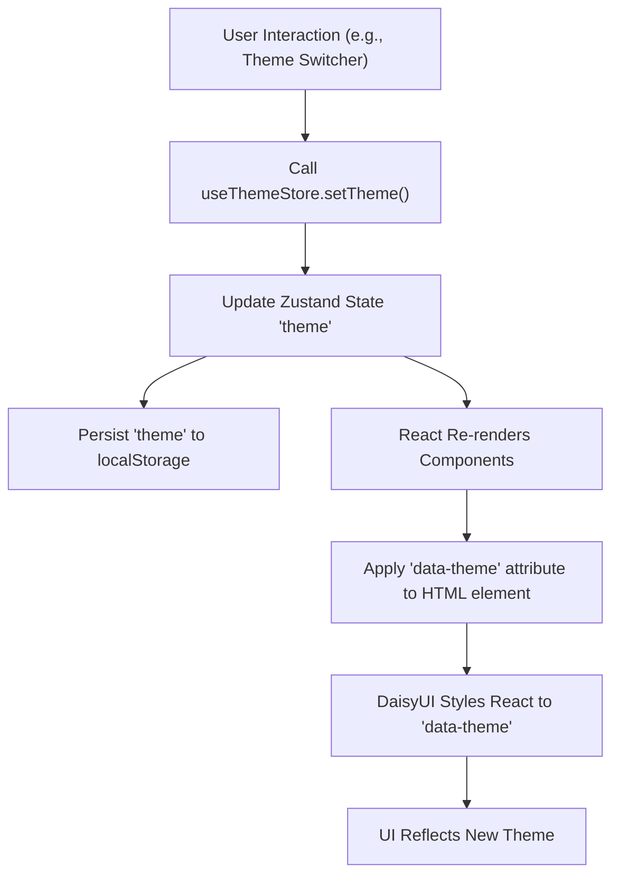

 # Styling and Theming

This section details the comprehensive styling and theming approach implemented in the frontend of the application. It leverages a powerful combination of **Tailwind CSS** for utility-first styling, **PostCSS** for processing, **DaisyUI** for pre-built components and themes, and **Zustand** for efficient client-side theme management. This setup ensures a highly customizable, maintainable, and responsive user interface across various themes.

## Core Styling Principles

The application adopts a modern, utility-first CSS methodology complemented by global styles for foundational elements and font integration.

*   **Utility-First with Tailwind CSS**: Direct application of CSS classes for rapid UI development and design consistency.
*   **Component Styling with DaisyUI**: Integration of DaisyUI themes and components simplifies complex UI elements and provides a robust theming system out-of-the-box.
*   **Global Styles**: Custom `index.css` for base styles, font imports, and integrating Tailwind's layers.
*   **Theme Management**: Zustand is used for dynamic theme switching and persistence.

## Tailwind CSS Configuration

The `tailwind.config.js` file is the central hub for customizing Tailwind CSS. It defines the paths for scanning for Tailwind classes, extends the default theme, and integrates DaisyUI as a plugin.

```javascript
// frontend/tailwind.config.js
import daisyui from "daisyui"


/** @type {import('tailwindcss').Config} */
export default {
  content: [
    "./index.html",
    "./src/**/*.{js,ts,jsx,tsx}",
  ],
  theme: {
    extend: {
      fontFamily : {
        chivo : ['Chivo', 'sans-serif'],
      }
    },
  },
  plugins: [daisyui],
  daisyui : {
 themes: [
      "light",
      "dark",
      "cupcake",
      "bumblebee",
      "emerald",
      "corporate",
      "synthwave",
      "retro",
      "cyberpunk",
      "valentine",
      "halloween",
      "garden",
      "forest",
      "aqua",
      "lofi",
      "pastel",
      "fantasy",
      "wireframe",
      "black",
      "luxury",
      "dracula",
      "cmyk",
      "autumn",
      "business",
      "acid",
      "lemonade",
      "night",
      "coffee",
      "winter",
      "dim",
      "nord",
      "sunset",
    ],
  }
}
```
[View on GitHub](https://github.com/shinymack/Chat-App-MERN/blob/main/frontend/tailwind.config.js)

### Key Configuration Points:

*   **`content`**: Specifies files where Tailwind should scan for class names to generate only the necessary CSS, ensuring optimal bundle size.
*   **`theme.extend.fontFamily`**: Adds a custom `chivo` font family, making it available throughout the application via `font-chivo`.
*   **`plugins: [daisyui]`**: Integrates the DaisyUI plugin, providing access to its component classes and theming capabilities.
*   **`daisyui.themes`**: An extensive list of available DaisyUI themes, allowing for easy switching between a wide range of aesthetic presets.

## PostCSS Configuration

`postcss.config.js` is essential for processing CSS with plugins like Tailwind CSS and Autoprefixer. Autoprefixer automatically adds vendor prefixes to CSS rules, ensuring broad browser compatibility.

```javascript
// frontend/postcss.config.js
export default {
  plugins: {
    tailwindcss: {},
    autoprefixer: {},
  },
}
```
[View on GitHub](https://github.com/shinymack/Chat-App-MERN/blob/main/frontend/postcss.config.js)

### Plugins:

*   **`tailwindcss`**: Integrates Tailwind CSS into the PostCSS pipeline, allowing it to process and generate CSS based on the configuration.
*   **`autoprefixer`**: Automatically adds vendor prefixes to CSS rules, improving cross-browser compatibility.

## Global Styles and Fonts

The `index.css` file serves as the entry point for global styles. It imports external fonts, includes Tailwind's base, components, and utilities layers, and applies a custom font to the `body` element.

```css
/* frontend/src/index.css */
@import url('https://fonts.googleapis.com/css2?family=Chivo:ital,wght@0,100..900;1,100..900&display=swap');
@tailwind base;
@tailwind components;
@tailwind utilities;


@layer base {
    body {
        @apply font-chivo;
    }
}
```
[View on GitHub](https://github.com/shinymack/Chat-App-MERN/blob/main/frontend/src/index.css)

### Explanation:

*   **`@import url(...)`**: Imports the "Chivo" font from Google Fonts, making it available for use in the application.
*   **`@tailwind base;`, `@tailwind components;`, `@tailwind utilities;`**: These directives inject Tailwind's core styles, pre-built components, and utility classes into the stylesheet.
*   **`@layer base { ... }`**: This custom `@layer` rule targets the `body` element and applies the `font-chivo` utility class. This effectively sets "Chivo" as the default font for the entire application, overriding browser defaults.

## Theme Management with Zustand

Theme switching functionality is handled by a Zustand store, `useThemeStore.js`. This lightweight state management solution allows for dynamic theme changes that persist across browser sessions using `localStorage`.

```javascript
// frontend/src/store/useThemeStore.js
import { create } from "zustand";

export const useThemeStore = create((set) => ({
    theme: localStorage.getItem("chat-theme") || "dark",
    setTheme: (theme) => {
        localStorage.setItem("chat-theme", theme);
        set({theme});
    }
}))
```
[View on GitHub](https://github.com/shinymack/Chat-App-MERN/blob/main/frontend/src/store/useThemeStore.js)

### Store Breakdown:

*   **`theme` state**: Initializes the theme from `localStorage` (key: `"chat-theme"`) or defaults to `"dark"` if no theme is found.
*   **`setTheme` action**: A function that updates the `theme` state and simultaneously stores the new theme in `localStorage`, ensuring persistence.

## Theme Integration Flow

The interaction between Zustand, DaisyUI, and the application's components forms a robust theming system.





## Key Integration Points

The synergy between these tools creates a powerful and flexible styling architecture:

*   **Dynamic Theming**: The `data-theme` attribute on the `<html>` tag (usually set by a React effect based on `useThemeStore`) is the crucial link that tells DaisyUI which theme to apply. DaisyUI then dynamically injects the appropriate CSS variables, changing the appearance of all DaisyUI components and any elements styled with Tailwind's semantic classes (e.g., `bg-primary`, `text-base-content`).
*   **Component-Driven Styling**: DaisyUI provides semantic component classes (e.g., `btn`, `card`) that automatically adapt to the active theme, significantly reducing the amount of custom CSS required for complex components.
*   **Font Consistency**: By importing the "Chivo" font and applying it globally within `@layer base`, the application maintains a consistent typography across all themes, ensuring a cohesive brand identity.
*   **Build Optimization**: Tailwind CSS's JIT (Just-In-Time) mode (implicitly enabled by modern Tailwind configurations) and PostCSS's processing ensure that only the CSS utilities and components actually used in the project are included in the final bundle, leading to optimized performance.

This integrated approach streamlines development, enhances maintainability, and provides an excellent user experience through customizable themes.

Next: [Development and Deployment](./4_development-and-deployment.mdx)