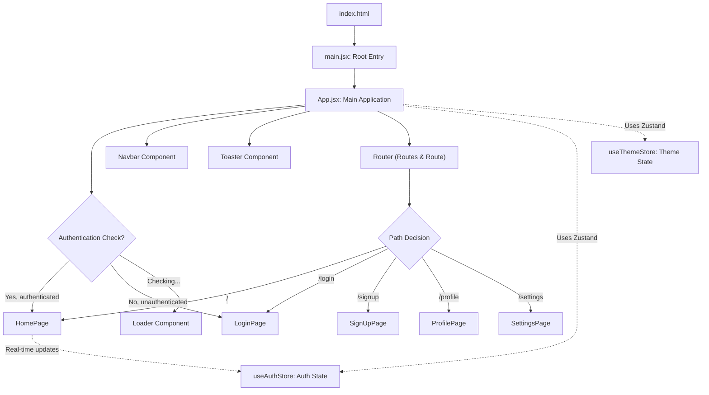
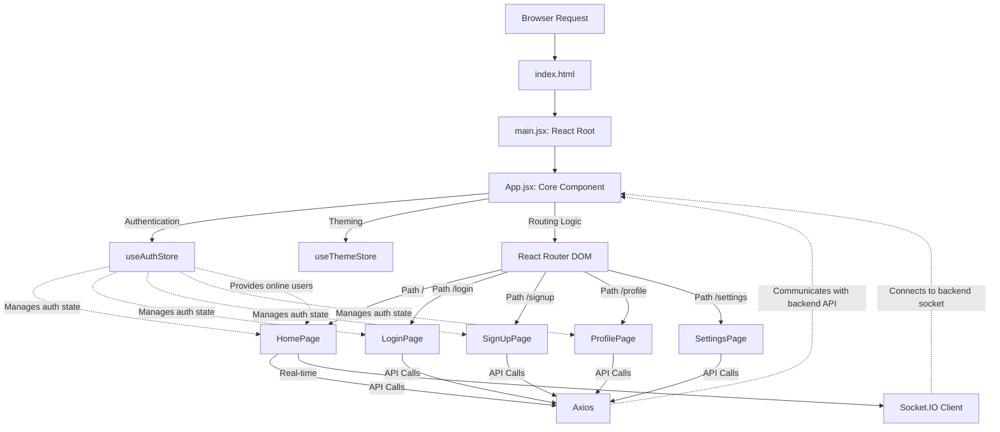

 # Frontend Application

The frontend application provides the client-side user interface for the Chatty application. Built with React and Vite, it delivers a fast and responsive experience, allowing users to interact with the backend services for chat functionalities, authentication, and profile management. This document outlines the core structure, key technologies, and main components that comprise the frontend.

## Core Technologies and Dependencies

The Chatty frontend leverages a modern JavaScript ecosystem to ensure robustness, performance, and developer experience.

### Development Environment

The project is bootstrapped with **Vite**, a next-generation frontend tooling that offers extremely fast hot module replacement and an optimized build process. This significantly speeds up development iterations.

### Core Frameworks

*   **React**: The primary library for building the user interface. It enables a component-based architecture for reusable and maintainable UI elements.
*   **React Router DOM**: Handles client-side routing, allowing navigation between different pages without full page reloads.
*   **Zustand**: A minimalistic state management solution used to manage global application state, such as authentication status and theme preferences.

### Styling and UI

*   **Tailwind CSS**: A utility-first CSS framework for rapidly building custom designs directly in your markup.
*   **DaisyUI**: A Tailwind CSS component library that provides pre-built UI components, accelerating development while maintaining a consistent design system.
*   **Lucide React** and **React Icons**: Icon libraries for incorporating scalable vector graphics into the UI.

### Communication and Utilities

*   **Axios**: A promise-based HTTP client used for making requests to the backend API.
*   **Socket.IO Client**: Facilitates real-time, bidirectional communication between the client and the server for instant messaging and online user status updates.
*   **React Hot Toast**: A simple and customizable toast notification library for displaying transient messages to the user.

A complete list of dependencies can be found in the `package.json` file.

```json
{
  "name": "frontend",
  "private": true,
  "version": "0.0.0",
  "type": "module",
  "scripts": {
    "dev": "vite",
    "build": "vite build",
    "lint": "eslint .",
    "preview": "vite preview",
    "mobile": "vite --host"
  },
  "dependencies": {
    "axios": "^1.7.9",
    "cors": "^2.8.5",
    "lucide-react": "^0.471.1",
    "react": "^18.3.1",
    "react-dom": "^18.3.1",
    "react-hot-toast": "^2.5.1",
    "react-icons": "^5.5.0",
    "react-router-dom": "^7.1.1",
    "socket.io-client": "^4.8.1",
    "zustand": "^5.0.3"
  },
  "devDependencies": {
    "@eslint/js": "^9.17.0",
    "@types/react": "^18.3.18",
    "@types/react-dom": "^18.3.5",
    "@vitejs/plugin-react": "^4.3.4",
    "autoprefixer": "^10.4.20",
    "daisyui": "^4.12.23",
    "eslint": "^9.17.0",
    "eslint-plugin-react": "^7.37.2",
    "eslint-plugin-react-hooks": "^5.0.0",
    "eslint-plugin-react-refresh": "^0.4.16",
    "globals": "^15.14.0",
    "postcss": "^8.5.0",
    "tailwindcss": "^3.4.17",
    "vite": "^6.3.5"
  }
}
```
[View on GitHub](https://github.com/shinymack/Chat-App-MERN/blob/main/frontend/package.json)

## Application Entry Point (`main.jsx`)

The `frontend/src/main.jsx` file serves as the entry point for the entire React application. It initializes the React root, wraps the main `App` component with `BrowserRouter` for client-side routing, and ensures strict mode for identifying potential issues during development.

```jsx
import { StrictMode } from 'react'
import { createRoot } from 'react-dom/client'
import './index.css' // Global CSS imports
import App from './App.jsx' // Main App component
import { BrowserRouter } from 'react-router-dom' // Router setup

createRoot(document.getElementById('root')).render(
  <StrictMode>
    <BrowserRouter>
      <App />
    </BrowserRouter>
  </StrictMode>,
)
```
[View on GitHub](https://github.com/shinymack/Chat-App-MERN/blob/main/frontend/src/main.jsx)

This setup ensures that all components within `App` have access to routing functionalities provided by `react-router-dom`. The global `index.css` is also imported here, applying base styles and Tailwind CSS directives.

## The Main Application Component (`App.jsx`)

The `frontend/src/App.jsx` file is the heart of the frontend application. It contains the main application logic, global state management, routing definitions, and the layout structure, including the `Navbar` and a `Toaster` for notifications.

### Global State Management

The `App` component utilizes Zustand for managing global state. Specifically, it interacts with:

*   `useAuthStore`: Manages user authentication status, including checking the authentication state on load and storing the authenticated user's data. It also tracks `onlineUsers` for real-time presence.
*   `useThemeStore`: Manages the application's theme, allowing users to switch between different visual modes.

An `useEffect` hook calls `checkAuth()` from the `useAuthStore` when the component mounts, ensuring the user's authentication status is verified upon application load.

```jsx
import Navbar from './components/Navbar'
import { Routes, Route, Navigate } from 'react-router-dom'
import { useEffect } from 'react'
import HomePage from './pages/HomePage'
import SignUpPage from './pages/SignUpPage' 
import LoginPage from './pages/LoginPage' 
import SettingsPage from './pages/SettingsPage' 
import ProfilePage from './pages/ProfilePage'

import { useThemeStore } from './store/useThemeStore'
import { useAuthStore } from './store/useAuthStore'; 
import { Loader } from 'lucide-react'
import { Toaster } from 'react-hot-toast'

const App = () => {
  const { authUser, checkAuth, isCheckingAuth, onlineUsers } = useAuthStore();
  const { theme } = useThemeStore();
  useEffect(() => {
    checkAuth();
  }, [checkAuth]);

  // ... (rest of the component)
}
```
[View on GitHub](https://github.com/shinymack/Chat-App-MERN/blob/main/frontend/src/App.jsx#L2-L24)

### Authentication Loading State

While `checkAuth` is in progress and no `authUser` is found, a loading spinner is displayed to provide visual feedback to the user, preventing a flicker or incomplete UI render.

```jsx
  if(isCheckingAuth && !authUser) return (
      <div className='flex items-center justify-center h-screen'>
        <Loader className='size-10 animate-spin' />
      </div>
  )
```
[View on GitHub](https://github.com/shinymack/Chat-App-MERN/blob/main/frontend/src/App.jsx#L26-L30)

### Routing Structure

The `App` component defines the main routes for the application using `react-router-dom`. It utilizes `Routes` and `Route` components to map paths to specific page components. `Navigate` is used to redirect users based on their authentication status, ensuring authenticated users are directed away from login/signup pages and unauthenticated users are directed to them.

```jsx
    <div className='' data-theme={theme}>

      <Navbar />

      <Toaster />
      <Routes>
        <Route path='/' element={authUser ? <HomePage />: <Navigate to='/login' />} />
        <Route path='/signup' element={ !authUser ? <SignUpPage />: <Navigate to='/' />} />
        <Route path='/login' element={!authUser ? <LoginPage />: <Navigate to='/' />} />
        <Route path='/settings' element={<SettingsPage />} />
        <Route path='/profile' element={authUser ? <ProfilePage />: <Navigate to='/login' />} />

      </Routes>

    </div> 
```
[View on GitHub](https://github.com/shinymack/Chat-App-MERN/blob/main/frontend/src/App.jsx#L32-L46)

This routing setup includes:
*   `/`: The primary chat interface (`HomePage`), accessible only to authenticated users. Unauthenticated users are redirected to `/login`.
*   `/signup`: User registration page, accessible only to unauthenticated users. Authenticated users are redirected to `/`.
*   `/login`: User authentication page, accessible only to unauthenticated users. Authenticated users are redirected to `/`.
*   `/settings`: Application settings page (`SettingsPage`), accessible to all users (authentication might be handled within the page for specific features).
*   `/profile`: User profile page (`ProfilePage`), accessible only to authenticated users. Unauthenticated users are redirected to `/login`.

## Frontend Application Flow

The following diagram illustrates the high-level flow of the frontend application from initialization to routing and state management.





## Key Integration Points

### User Authentication and Session Management

The frontend heavily relies on the `useAuthStore` (a Zustand store) to manage the user's authentication status. Upon application load, `checkAuth()` is called to verify if a valid user session exists. This typically involves an API call to the backend. The `authUser` state determines which pages a user can access, enforced by `react-router-dom`'s `Navigate` component.

```jsx
  const { authUser, checkAuth, isCheckingAuth, onlineUsers } = useAuthStore();
  const { theme } = useThemeStore();
  useEffect(() => {
    checkAuth(); // Call to verify session on mount
  }, [checkAuth]);
```
[View on GitHub](https://github.com/shinymack/Chat-App-MERN/blob/main/frontend/src/App.jsx#L20-L24)

### Real-time Communication

Although not explicitly shown in the provided `App.jsx`, the `onlineUsers` state from `useAuthStore` indicates an integration with Socket.IO. This implies that other components, likely `HomePage`, leverage `socket.io-client` to establish a WebSocket connection with the backend. This connection enables real-time features such as instant message delivery and live updates of user presence.

### Theming System

The `useThemeStore` allows dynamic theme switching. The `theme` variable from this store is applied to the root `div` of the `App` component using `data-theme={theme}`, which is a feature leveraged by DaisyUI and Tailwind CSS for theme management. This ensures that the entire application's UI reflects the chosen theme.

```jsx
    <div className='' data-theme={theme}>
      {/* ... application content */}
    </div> 
```
[View on GitHub](https://github.com/shinymack/Chat-App-MERN/blob/main/frontend/src/App.jsx#L32)

### Build Process (`index.html` & Vite)

The `index.html` file is the static entry point for the browser. It includes the necessary meta tags, title, and a `div` with `id="root"` where the React application will be mounted. Critically, it includes `<script type="module" src="/src/main.jsx"></script>`, which tells Vite to load and process the `main.jsx` as a module, initiating the React application.

```html
<!doctype html>
<html lang="en">
  <head>
    <meta charset="UTF-8" />
    <link rel="icon" type="image/svg+xml+png" href="/icon.png" />
    <meta name="viewport" content="width=device-width, initial-scale=1.0" />
    <title>Chatty</title>
  </head>
  <body>
    <div id="root"></div>
    <script type="module" src="/src/main.jsx"></script>
  </body>
</html>
```
[View on GitHub](https://github.com/shinymack/Chat-App-MERN/blob/main/frontend/index.html)

This simple `index.html` highlights Vite's efficiency, as it dynamically injects the necessary development server scripts and handles the module bundling, keeping the client-side HTML clean and minimal.

### Overall Frontend Architecture





This architecture provides a clear separation of concerns, with `App.jsx` orchestrating the main layout and routing, while individual pages handle their specific functionalities and interact with global state stores and backend services.

Next: [UI Components and Pages](./3.1_ui-components-and-pages.mdx)