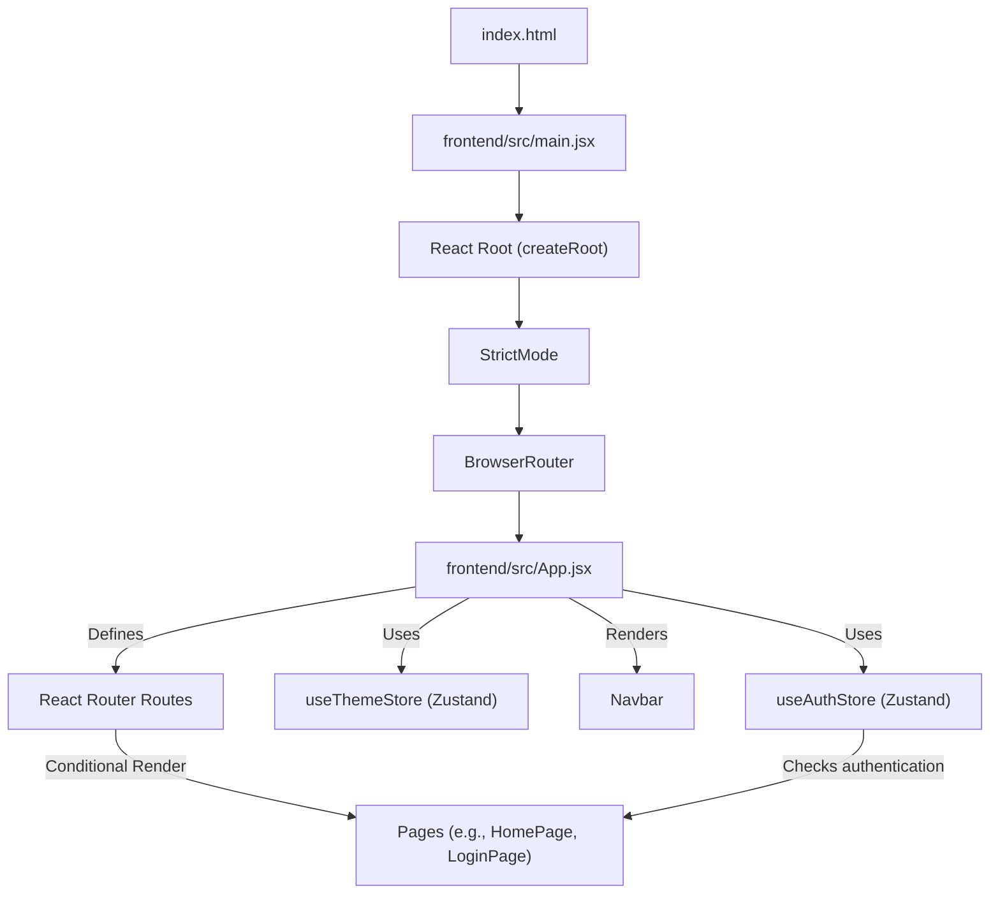
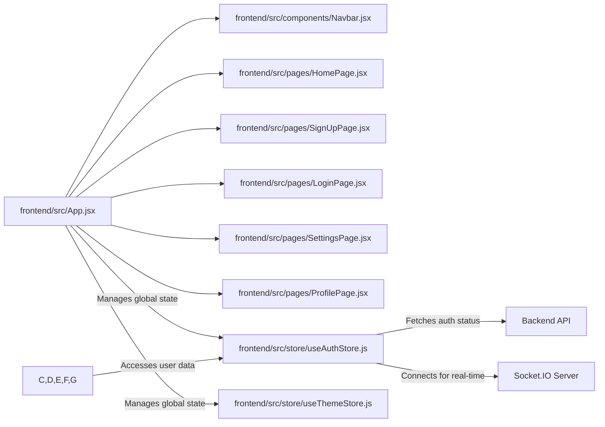

 
---
title: "Frontend Architecture and Implementation"
description: "Detailed exploration of the frontend structure, technologies, and user interface components."
sidebar_position: 3
---

# Frontend Architecture and Implementation
<TOC />

This document provides a comprehensive overview of the frontend architecture, detailing its core technologies, structural components, and key integration points. The frontend is built as a single-page application (SPA) using React, leveraging modern tooling and state management patterns to deliver a responsive and interactive user experience for the Chatty application.

## Core Technologies and Libraries

The Chatty frontend is developed using a robust set of technologies and libraries, meticulously selected for performance, scalability, and developer experience.

### React with Vite
The application's foundation is **React**, a declarative, component-based JavaScript library for building user interfaces. **Vite** serves as the build tool, providing an extremely fast development server and optimized production builds. This combination ensures quick development cycles and efficient delivery.

```json title="frontend/package.json (dependencies excerpt)" {1-2,5-6}
{
  "name": "frontend",
  "private": true,
  "version": "0.0.0",
  "type": "module",
  "scripts": {
    "dev": "vite",
    "build": "vite build",
    "lint": "eslint .",
    "preview": "vite preview",
    "mobile": "vite --host"
  },
  "dependencies": {
    "axios": "^1.7.9",
    "cors": "^2.8.5",
    "lucide-react": "^0.471.1",
    "react": "^18.3.1",
    "react-dom": "^18.3.1",
    "react-hot-toast": "^2.5.1",
    "react-icons": "^5.5.0",
    "react-router-dom": "^7.1.1",
    "socket.io-client": "^4.8.1",
    "zustand": "^5.0.3"
  },
  "devDependencies": {
    // ...
    "vite": "^6.3.5"
  }
}
```
[View on GitHub](https://github.com/shinymack/Chat-App-MERN/blob/main/frontend/package.json)

### Routing with React Router DOM
**React Router DOM** is employed for declarative routing within the application. It enables navigation between different views (pages) without full page reloads, providing a smooth SPA experience. The primary routes are defined within `App.jsx`.

```jsx title="frontend/src/App.jsx (Routing excerpt)" {33-38}
// ...
import { Routes, Route, Navigate } from 'react-router-dom'
// ...

const App = () => {
  const { authUser, checkAuth, isCheckingAuth, onlineUsers } = useAuthStore();
  const { theme } = useThemeStore();
  useEffect(() => {
    checkAuth();
  }, [checkAuth]);

  // ... loader and theme setup

  return (
    <div className='' data-theme={theme}>
      <Navbar />
      <Toaster />
      <Routes>
        <Route path='/' element={authUser ? <HomePage />: <Navigate to='/login' />} />
        <Route path='/signup' element={ !authUser ? <SignUpPage />: <Navigate to='/' />} />
        <Route path='/login' element={!authUser ? <LoginPage />: <Navigate to='/' />} />
        <Route path='/settings' element={<SettingsPage />} />
        <Route path='/profile' element={authUser ? <ProfilePage />: <Navigate to='/login' />} />
      </Routes>
    </div> 
  )
}

export default App
```
[View on GitHub](https://github.com/shinymack/Chat-App-MERN/blob/main/frontend/src/App.jsx#L33-L38)

### State Management with Zustand
**Zustand** is a small, fast, and scalable state-management solution used for managing global application state, such as user authentication status (`useAuthStore`) and theme preferences (`useThemeStore`). Its hook-based API integrates seamlessly with React components.

```jsx title="frontend/src/App.jsx (Zustand store usage)" {14-15}
// ...
import { useThemeStore } from './store/useThemeStore'
import { useAuthStore } from './store/useAuthStore'; 
// ...

const App = () => {
  const { authUser, checkAuth, isCheckingAuth, onlineUsers } = useAuthStore();
  const { theme } = useThemeStore();
  useEffect(() => {
    checkAuth();
  }, [checkAuth]);

  // ...
}
```
[View on GitHub](https://github.com/shinymack/Chat-App-MERN/blob/main/frontend/src/App.jsx#L14-L15)

### UI Components and Styling
**DaisyUI** (a Tailwind CSS component library) along with **Tailwind CSS** provides a highly customizable and utility-first approach to styling. This allows for rapid UI development and ensures a consistent design language across the application. Icon libraries like `lucide-react` and `react-icons` are used for visual cues.

```json title="frontend/package.json (UI/Styling excerpt)" {7-8,12}
{
  // ...
  "dependencies": {
    "axios": "^1.7.9",
    "cors": "^2.8.5",
    "lucide-react": "^0.471.1",
    // ...
    "react-icons": "^5.5.0",
    // ...
  },
  "devDependencies": {
    // ...
    "autoprefixer": "^10.4.20",
    "daisyui": "^4.12.23",
    // ...
    "postcss": "^8.5.0",
    "tailwindcss": "^3.4.17",
    // ...
  }
}
```
[View on GitHub](https://github.com/shinymack/Chat-App-MERN/blob/main/frontend/package.json)

### Real-time Communication with Socket.IO Client
For real-time features, such as instant messaging and online user presence, **Socket.IO Client** is integrated. It establishes a WebSocket connection with the backend, facilitating bidirectional communication.

```json title="frontend/package.json (Socket.IO client excerpt)" {1}
{
  // ...
  "dependencies": {
    // ...
    "socket.io-client": "^4.8.1",
    "zustand": "^5.0.3"
  },
  // ...
}
```
[View on GitHub](https://github.com/shinymack/Chat-App-MERN/blob/main/frontend/package.json)

## Frontend Application Flow

The application's lifecycle begins with `main.jsx`, which renders the root React component, `App.jsx`, wrapped in essential providers.

```jsx title="frontend/src/main.jsx"
import { StrictMode } from 'react'
import { createRoot } from 'react-dom/client'
import './index.css'
import App from './App.jsx'
import { BrowserRouter } from 'react-router-dom'

createRoot(document.getElementById('root')).render(
  <StrictMode>
    <BrowserRouter>
      <App />
    </BrowserRouter>
  </StrictMode>,
)
```
[View on GitHub](https://github.com/shinymack/Chat-App-MERN/blob/main/frontend/src/main.jsx)

The `App.jsx` component then handles global concerns like authentication checks, theme management, and rendering the main navigation (`Navbar`) and routes.





## Frontend Component Structure

The frontend adheres to a component-based architecture, promoting reusability and maintainability.

-   **`App.jsx`**: The main entry point for React components, responsible for global setup, routing, and conditional rendering based on authentication status.
-   **`pages/`**: Contains top-level components, each representing a distinct view or "page" of the application (e.g., `HomePage`, `LoginPage`, `SignUpPage`, `SettingsPage`, `ProfilePage`).
-   **`components/`**: Houses reusable UI components shared across different pages (e.g., `Navbar`).
-   **`store/`**: Manages global application state using Zustand, abstracting state logic into manageable stores (`useAuthStore`, `useThemeStore`).





## Key Integration Points

### Authentication Flow
The `App.jsx` component initializes an authentication check (`checkAuth`) using `useAuthStore` on mount. This ensures the user's login status is verified against the backend. Based on the `authUser` state, routes are conditionally rendered, directing authenticated users to the `HomePage` and unauthenticated users to the `LoginPage` or `SignUpPage`.

```jsx title="frontend/src/App.jsx (Auth Check & Loader)" {18-23,28-30}
// ...
import { useAuthStore } from './store/useAuthStore'; 
import { Loader } from 'lucide-react'
import { Toaster } from 'react-hot-toast'

const App = () => {
  const { authUser, checkAuth, isCheckingAuth, onlineUsers } = useAuthStore();
  const { theme } = useThemeStore();
  useEffect(() => {
    checkAuth();
  }, [checkAuth]);

  // ... console logs

  if(isCheckingAuth && !authUser) return (
      <div className='flex items-center justify-center h-screen'>
        <Loader className='size-10 animate-spin' />
      </div>
  )

  return (
    <div className='' data-theme={theme}>
      <Navbar />
      <Toaster />
      <Routes>
        <Route path='/' element={authUser ? <HomePage />: <Navigate to='/login' />} />
        <Route path='/signup' element={ !authUser ? <SignUpPage />: <Navigate to='/' />} />
        <Route path='/login' element={!authUser ? <LoginPage />: <Navigate to='/' />} />
        <Route path='/settings' element={<SettingsPage />} />
        <Route path='/profile' element={authUser ? <ProfilePage />: <Navigate to='/login' />} />
      </Routes>
    </div> 
  )
}
// ...
```
[View on GitHub](https://github.com/shinymack/Chat-App-MERN/blob/main/frontend/src/App.jsx#L18-L23)

### Real-time Features
The `useAuthStore` not only manages authentication but also handles the Socket.IO client connection. This centralizes real-time communication concerns. Upon successful authentication, the frontend establishes a WebSocket connection to the backend to receive updates on online users, chat messages, and other real-time events.

### API Communication
All interactions with the backend API (e.g., user login, signup, fetching messages) are handled via `axios`. This library provides a promise-based HTTP client, simplifying API requests and error handling.

### Global Notifications
**React Hot Toast** is integrated for displaying transient notifications to the user. This provides immediate feedback for actions like successful login, error messages, or new message alerts, enhancing the user experience. The `Toaster` component is rendered once in `App.jsx` to make toasts available globally.

Next: [User Interface Components](./3.1_user-interface-components.mdx)
```