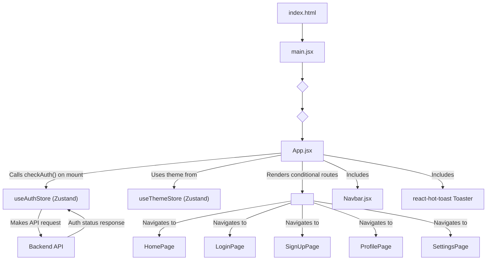
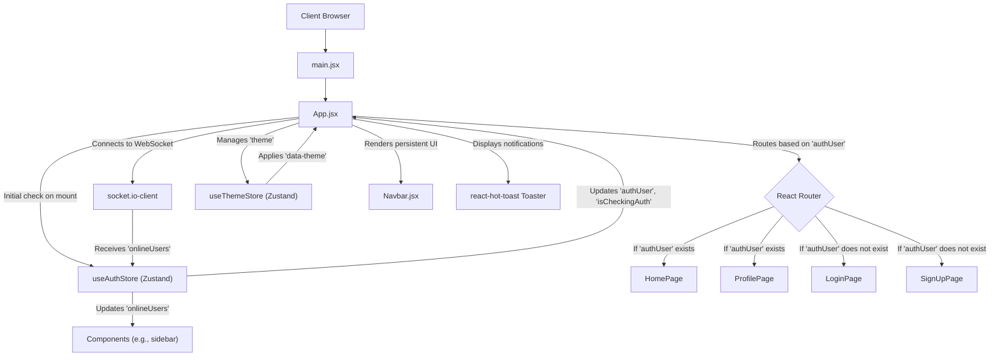

 # Frontend Development

The frontend of the application is a Single-Page Application (SPA) built with React, leveraging Vite for a fast development experience. It provides the user interface for interacting with the backend services, handling user authentication, real-time messaging, and displaying dynamic content.

## Core Technologies and Setup

The frontend is bootstrapped using Vite, a next-generation frontend tooling that offers extremely fast Hot Module Replacement (HMR) and optimized builds. React is used for building the declarative user interface, providing a component-based architecture for modular and reusable UI elements.

### Key Dependencies

The `frontend/package.json` file outlines all the project's dependencies and development scripts.

```json filename="frontend/package.json"
{
  "name": "frontend",
  "private": true,
  "version": "0.0.0",
  "type": "module",
  "scripts": {
    "dev": "vite",
    "build": "vite build",
    "lint": "eslint .",
    "preview": "vite preview",
    "mobile": "vite --host"
  },
  "dependencies": {
    "axios": "^1.7.9",
    "cors": "^2.8.5",
    "lucide-react": "^0.471.1",
    "react": "^18.3.1",
    "react-dom": "^18.3.1",
    "react-hot-toast": "^2.5.1",
    "react-icons": "^5.5.0",
    "react-router-dom": "^7.1.1",
    "socket.io-client": "^4.8.1",
    "zustand": "^5.0.3"
  },
  "devDependencies": {
    "@eslint/js": "^9.17.0",
    "@types/react": "^18.3.18",
    "@types/react-dom": "^18.3.5",
    "@vitejs/plugin-react": "^4.3.4",
    "autoprefixer": "^10.4.20",
    "daisyui": "^4.12.23",
    "eslint": "^9.17.0",
    "eslint-plugin-react": "^7.37.2",
    "eslint-plugin-react-hooks": "^5.0.0",
    "eslint-plugin-react-refresh": "^0.4.16",
    "globals": "^15.14.0",
    "postcss": "^8.5.0",
    "tailwindcss": "^3.4.17",
    "vite": "^6.3.5"
  }
}
```
[View on GitHub](https://github.com/shinymack/Chat-App-MERN/blob/main/frontend/package.json)

*   **`axios`**: A promise-based HTTP client for making API requests to the backend.
*   **`lucide-react`**, **`react-icons`**: Icon libraries used throughout the application for visual elements.
*   **`react-router-dom`**: Essential for declarative routing within the React application, enabling navigation between different pages.
*   **`socket.io-client`**: The client-side library for establishing and managing real-time WebSocket connections with the backend.
*   **`zustand`**: A small, fast, and scalable state-management solution used for global state (e.g., authentication, theme, online users).
*   **`daisyui`**, **`tailwindcss`**: CSS framework and utility-first CSS framework for styling the application, providing a consistent and responsive design.

### Vite Configuration

The `frontend/vite.config.js` file defines the build configuration for the frontend, primarily enabling the React plugin.

```javascript filename="frontend/vite.config.js"
import { defineConfig } from 'vite'
import react from '@vitejs/plugin-react'

// https://vite.dev/config/
export default defineConfig({
  plugins: [react()],
})
```
[View on GitHub](https://github.com/shinymack/Chat-App-MERN/blob/main/frontend/vite.config.js)

This minimal configuration indicates that Vite should use `@vitejs/plugin-react` to handle React-specific optimizations and transformations, such as JSX compilation and fast refresh.

## Application Entry Point and Initialization

The application's entry point is `frontend/src/main.jsx`, which renders the root React component (`App`) into the DOM.

```jsx filename="frontend/src/main.jsx"
import { StrictMode } from 'react'
import { createRoot } from 'react-dom/client'
import './index.css'
import App from './App.jsx'
import { BrowserRouter } from 'react-router-dom'

createRoot(document.getElementById('root')).render(
  <StrictMode>
    <BrowserRouter>
      <App />
    </BrowserRouter>
  </StrictMode>,
)
```
[View on GitHub](https://github.com/shinymack/Chat-App-MERN/blob/main/frontend/src/main.jsx)

*   **`StrictMode`**: A React feature that helps identify potential problems in an application by activating additional checks and warnings during development.
*   **`BrowserRouter`**: From `react-router-dom`, this component enables client-side routing, allowing the application to manage URL changes without full page reloads. It wraps the entire `App` component to provide routing context.

## Core Application Structure (`App.jsx`)

The `frontend/src/App.jsx` component is the heart of the frontend application. It manages global concerns such as authentication status, theme, and routing.

```jsx filename="frontend/src/App.jsx"
// import React from 'react'
import Navbar from './components/Navbar'
import { Routes, Route, Navigate } from 'react-router-dom'
import { useEffect } from 'react'
import HomePage from './pages/HomePage'
import SignUpPage from './pages/SignUpPage'
import LoginPage from './pages/LoginPage'
import SettingsPage from './pages/SettingsPage'
import ProfilePage from './pages/ProfilePage'


import { useThemeStore } from './store/useThemeStore'
import { useAuthStore } from './store/useAuthStore';
import { Loader } from 'lucide-react'
import { Toaster } from 'react-hot-toast'

const App = () => {
  const { authUser, checkAuth, isCheckingAuth, onlineUsers } = useAuthStore();
  const { theme } = useThemeStore();
  useEffect(() => {
    checkAuth();
  }, [checkAuth]);

  console.log("authUser: ", {authUser});

  console.log({onlineUsers})

  if(isCheckingAuth && !authUser) return (
      <div className='flex items-center justify-center h-screen'>
        <Loader className='size-10 animate-spin' />
      </div>
  )

  return (
    <div className='' data-theme={theme}>

      <Navbar />

      <Toaster />
      <Routes>
        <Route path='/' element={authUser ? <HomePage />: <Navigate to='/login' />} />
        <Route path='/signup' element={ !authUser ? <SignUpPage />: <Navigate to='/' />} />
        <Route path='/login' element={!authUser ? <LoginPage />: <Navigate to='/' />} />
        <Route path='/settings' element={<SettingsPage />} />
        <Route path='/profile' element={authUser ? <ProfilePage />: <Navigate to='/login' />} />

      </Routes>

    </div>
  )
}

export default App
```
[View on GitHub](https://github.com/shinymack/Chat-App-MERN/blob/main/frontend/src/App.jsx)

*   **Authentication Check**: On initial load, an `useEffect` hook calls `checkAuth` from `useAuthStore` to verify the user's authentication status. A loading spinner (`Loader`) is displayed during this check.
*   **Global State Management**: `useAuthStore` and `useThemeStore` (both powered by Zustand) manage global authentication state (e.g., `authUser`, `isCheckingAuth`, `onlineUsers`) and the current theme respectively.
*   **Routing**: The `Routes` component from `react-router-dom` defines the application's various routes. Conditional rendering with `Navigate` ensures users are redirected based on their authentication status (e.g., authenticated users redirected from login/signup to home).
*   **`Navbar`**: A common component rendered across all pages.
*   **`Toaster`**: Provides toast notifications using `react-hot-toast` for user feedback.

### Frontend Application Flow

The following diagram illustrates the initial bootstrapping and key data flows within the frontend.





### Frontend State Management and Routing

This diagram provides a high-level view of how authentication state, user online status, and routing interact within the frontend application.





## Key Integration Points

*   **Authentication Flow**: The `App.jsx` component is critical for orchestrating the initial authentication check. Based on `authUser` from `useAuthStore`, it directs users to appropriate pages (`HomePage` for authenticated users, `LoginPage` for unauthenticated). This centralizes authentication logic and ensures secure route access.
*   **Real-time Updates**: `socket.io-client` integrates with `useAuthStore` to manage `onlineUsers`. This allows any component subscribing to `useAuthStore` to react to real-time changes in user presence without complex prop drilling.
*   **Global Theme Management**: `useThemeStore` provides a simple mechanism for toggling the application's visual theme, directly controlled by `App.jsx`'s `data-theme` attribute, leveraging DaisyUI's theming capabilities.

Next: [UI Components and Structure](./3.1_ui-components-and-structure.mdx)