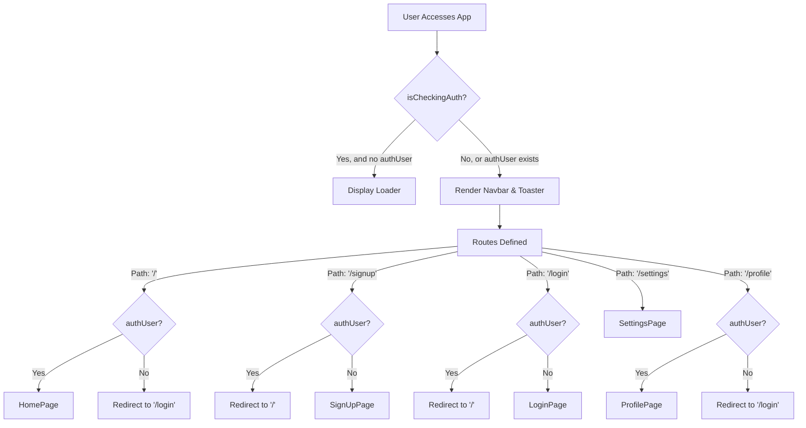
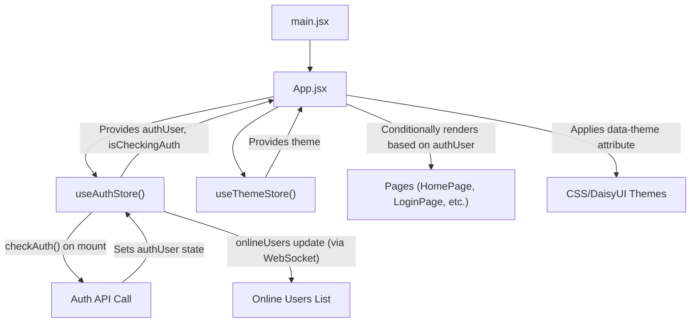

# Frontend Implementation and UI

The frontend of the application is a Single-Page Application (SPA) built with React, leveraging modern web development practices to deliver a responsive and intuitive user experience. This document provides a comprehensive guide to its structure, core technologies, component hierarchy, and key integration points.

## Core Technologies

The frontend is built upon a robust stack designed for speed, scalability, and maintainability:

*   **React**: A JavaScript library for building user interfaces, enabling a component-based architecture.
*   **React Router Dom**: For declarative routing, managing navigation between different views within the SPA.
*   **Zustand**: A fast, scalable, and tiny state-management solution, used for global state (authentication, theme, online users).
*   **Tailwind CSS**: A utility-first CSS framework for rapidly building custom designs directly in markup.
*   **DaisyUI**: A Tailwind CSS component library that provides pre-built components and themes, enhancing development speed and consistency.

## Application Entry Point (`main.jsx`)

The `main.jsx` file serves as the entry point for the React application. It initializes the React root, wraps the `App` component within `StrictMode` for development checks, and sets up client-side routing using `BrowserRouter` from `react-router-dom`. This ensures that the application's URL paths are managed effectively without full page reloads.

```jsx title="frontend/src/main.jsx"
import { StrictMode } from 'react'
import { createRoot } from 'react-dom/client'
import './index.css'
import App from './App.jsx'
import { BrowserRouter } from 'react-router-dom'

createRoot(document.getElementById('root')).render(
  <StrictMode>
    <BrowserRouter>
      <App />
    </BrowserRouter>
  </StrictMode>,
)
```

[View on GitHub](https://github.com/shinymack/Chat-App-MERN/blob/main/frontend/src/main.jsx)

## Main Application Component (`App.jsx`)

The `App.jsx` file is the central hub of the frontend application. It orchestrates routing, manages global state pertinent to authentication and theming, and conditionally renders components based on user authentication status.

### Key Responsibilities:

*   **Authentication Check**: Utilizes `useAuthStore` to check the user's authentication status (`checkAuth`) on initial load. A loading spinner is displayed while authentication is being verified.
*   **Theme Management**: Integrates with `useThemeStore` to apply the user's selected theme dynamically to the root `div` element, making use of DaisyUI's theme capabilities.
*   **Global Navigation**: Renders the `Navbar` component, which is persistent across all routes.
*   **Routing Logic**: Defines routes using `react-router-dom`'s `Routes` and `Route` components. It implements protected routes, redirecting unauthenticated users from private pages (e.g., `/`) to public pages (e.g., `/login`) and vice-versa.
*   **Toast Notifications**: Includes `Toaster` from `react-hot-toast` for displaying user feedback like success messages or errors.

```jsx title="frontend/src/App.jsx"
// import React from 'react' // React is implicitly imported by JSX transform
import Navbar from './components/Navbar'
import { Routes, Route, Navigate } from 'react-router-dom'
import { useEffect } from 'react'
import HomePage from './pages/HomePage'
import SignUpPage from './pages/SignUpPage'
import LoginPage from './pages/LoginPage'
import SettingsPage from './pages/SettingsPage'
import ProfilePage from './pages/ProfilePage'


import { useThemeStore } from './store/useThemeStore'
import { useAuthStore } from './store/useAuthStore';
import { Loader } from 'lucide-react'
import { Toaster } from 'react-hot-toast'

const App = () => {
  const { authUser, checkAuth, isCheckingAuth, onlineUsers } = useAuthStore();
  const { theme } = useThemeStore();
  useEffect(() => {
    checkAuth();
  }, [checkAuth]);

  console.log("authUser: ", {authUser});

  console.log({onlineUsers})

  if(isCheckingAuth && !authUser) return (
      <div className='flex items-center justify-center h-screen'>
        <Loader className='size-10 animate-spin' />
      </div>
  )

  return (
    <div className='' data-theme={theme}>

      <Navbar />

      <Toaster />
      <Routes>
        <Route path='/' element={authUser ? <HomePage />: <Navigate to='/login' />} />
        <Route path='/signup' element={ !authUser ? <SignUpPage />: <Navigate to='/' />} />
        <Route path='/login' element={!authUser ? <LoginPage />: <Navigate to='/' />} />
        <Route path='/settings' element={<SettingsPage />} />
        <Route path='/profile' element={authUser ? <ProfilePage />: <Navigate to='/login' />} />

      </Routes>

    </div>
  )
}

export default App
```

[View on GitHub](https://github.com/shinymack/Chat-App-MERN/blob/main/frontend/src/App.jsx)

### Authentication and Routing Flow

The routing within `App.jsx` demonstrates how `react-router-dom` is used to protect routes:





## Styling and Theming (`index.css` & `tailwind.config.js`)

The application's visual aesthetics are managed through a combination of Tailwind CSS and DaisyUI, configured in `index.css` and `tailwind.config.js`.

### `index.css`

This global CSS file imports Tailwind's base, components, and utilities, alongside a custom Google Font, "Chivo". The `@layer base` directive ensures that `font-chivo` is applied as the default font across the entire application body.

```css title="frontend/src/index.css"
@import url('https://fonts.googleapis.com/css2?family=Chivo:ital,wght@0,100..900;1,100..900&display=swap');
@tailwind base;
@tailwind components;
@tailwind utilities;


@layer base {
    body {
        @apply font-chivo;
    }
}
```

[View on GitHub](https://github.com/shinymack/Chat-App-MERN/blob/main/frontend/src/index.css)

### `tailwind.config.js`

This configuration file extends Tailwind's default settings and integrates DaisyUI.

*   **Content**: Specifies which files to scan for Tailwind classes, ensuring optimal CSS bundling.
*   **Theme Extension**: Adds a custom `chivo` font family, aligning with the `@import` in `index.css`.
*   **Plugins**: Includes the `daisyui` plugin, which provides a rich collection of UI components and the ability to switch between numerous themes.
*   **DaisyUI Themes**: Lists a comprehensive array of DaisyUI themes, enabling users to customize the application's appearance from a wide selection (e.g., "light", "dark", "synthwave", "garden", "dracula", etc.). The `App.jsx` dynamically applies the selected theme using the `data-theme` attribute.

```javascript title="frontend/src/tailwind.config.js"
import daisyui from "daisyui"


/** @type {import('tailwindcss').Config} */
export default {
  content: [
    "./index.html",
    "./src/**/*.{js,ts,jsx,tsx}",
  ],
  theme: {
    extend: {
      fontFamily : {
        chivo : ['Chivo', 'sans-serif'],
      }
    },
  },
  plugins: [daisyui],
  daisyui : {
    themes: [
      "light",
      "dark",
      "cupcake",
      "bumblebee",
      "emerald",
      "corporate",
      "synthwave",
      "retro",
      "cyberpunk",
      "valentine",
      "halloween",
      "garden",
      "forest",
      "aqua",
      "lofi",
      "pastel",
      "fantasy",
      "wireframe",
      "black",
      "luxury",
      "dracula",
      "cmyk",
      "autumn",
      "business",
      "acid",
      "lemonade",
      "night",
      "coffee",
      "winter",
      "dim",
      "nord",
      "sunset",
    ],
  }
}
```

[View on GitHub](https://github.com/shinymack/Chat-App-MERN/blob/main/frontend/tailwind.config.js)

## State Management Flow

The application utilizes Zustand for efficient and reactive state management, particularly for global states like authentication and theme.





## Key Integration Points

### User Authentication and Routing

The `App.jsx` component is the central orchestrator for user authentication and routing. The `useEffect` hook, calling `checkAuth` from `useAuthStore`, ensures that the user's login status is verified every time the component mounts. This proactive check prevents unauthorized access to protected routes and provides a seamless experience for authenticated users.

The conditional rendering of routes using `authUser ? <Component /> : <Navigate to='/login' />` is a critical pattern for safeguarding user data and ensuring proper application flow. For example, if an unauthenticated user attempts to access the root path (`/`), they are immediately redirected to the `/login` page. Conversely, if an authenticated user tries to visit `/login` or `/signup`, they are redirected to the homepage.

### Theming System

The integration of DaisyUI and `useThemeStore` allows for a dynamic and extensive theming system. The `data-theme` attribute on the root `div` in `App.jsx` is automatically picked up by DaisyUI, which applies the corresponding CSS variables and styles. This enables users to personalize their interface without requiring complex CSS manipulations or page reloads, enhancing user engagement and accessibility. The vast array of themes available in `tailwind.config.js` offers significant flexibility.

### Component Structure

The frontend adheres to a component-based architecture:
*   **`App.jsx`**: The root component, handling global concerns like routing and authentication.
*   **`Navbar.jsx`**: A global component providing navigation.
*   **`pages/*`**: High-level components representing distinct views or routes (e.g., `HomePage`, `LoginPage`). These pages often aggregate smaller, reusable components.
*   **`components/*`**: Reusable UI components shared across different pages (e.g., input fields, buttons, chat messages).
*   **`store/*`**: Zustand stores for global state management (`useAuthStore`, `useThemeStore`).

This clear separation of concerns makes the codebase modular, easier to understand, and maintain.

Next: [User Interface Components](./3.1_user-interface-components.mdx)