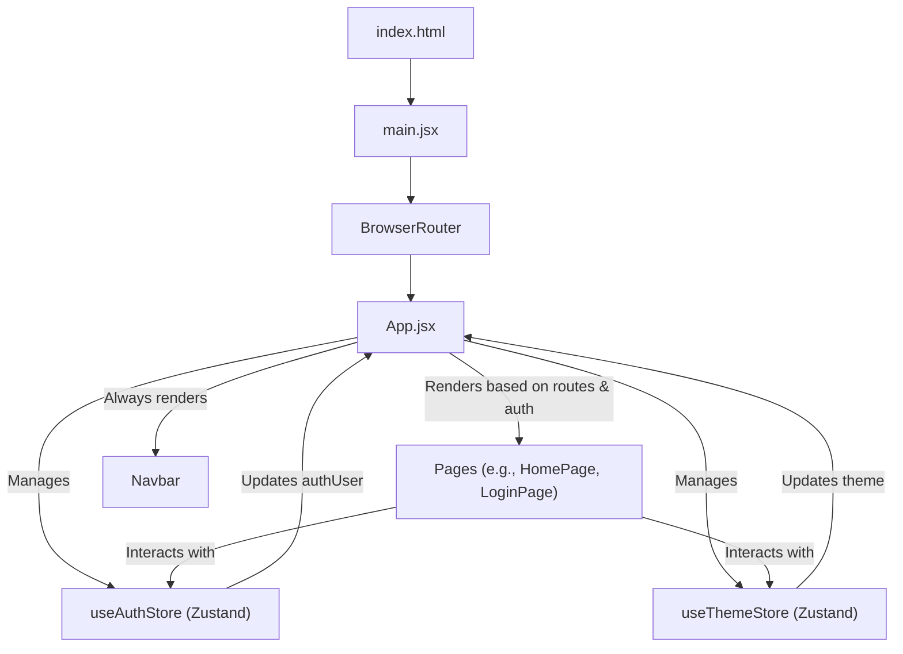
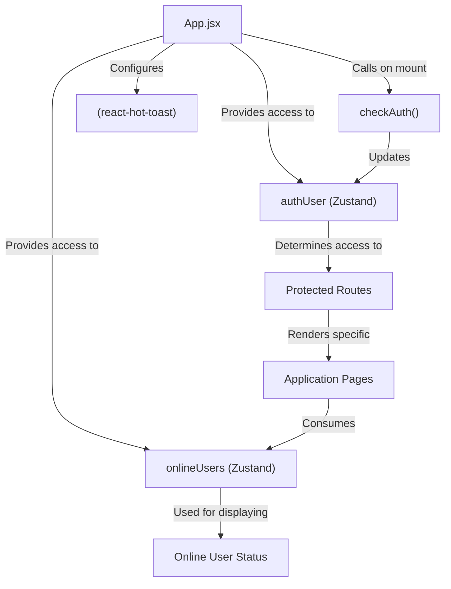

# Frontend Implementation and UI

The frontend of the Chatty application is built using React, providing a dynamic and responsive user interface for real-time communication. This section details the core architecture, key dependencies, routing mechanisms, and initial setup that orchestrate the client-side experience.

## Core Technologies and Setup

The application leverages a modern React ecosystem, managed by Vite for fast development and optimized builds. Essential libraries handle routing, state management, UI components, and API interactions.

### Project Initialization

The `frontend/index.html` file serves as the entry point for the React application. It defines the basic HTML structure, including the root `div` where the React app will mount. The `script type="module" src="/src/main.jsx"` line indicates that `main.jsx` is the primary JavaScript file responsible for bootstrapping the React application.

```html
<!doctype html>
<html lang="en">
  <head>
    <meta charset="UTF-8" />
    <link rel="icon" type="image/svg+xml+png" href="/icon.png" />
    <meta name="viewport" content="width=device-width, initial-scale=1.0" />
    <title>Chatty</title>
  </head>
  <body>
    <div id="root"></div>
    <script type="module" src="/src/main.jsx"></script>
  </body>
</html>
```

The `main.jsx` file is where the React application is rendered into the DOM. It wraps the main `App` component within `React.StrictMode` for identifying potential problems and `BrowserRouter` from `react-router-dom` to enable client-side routing.

```jsx
import { StrictMode } from 'react'
import { createRoot } from 'react-dom/client'
import './index.css'
import App from './App.jsx'
import { BrowserRouter } from 'react-router-dom'

createRoot(document.getElementById('root')).render(
  <StrictMode>
    <BrowserRouter>
      <App />
    </BrowserRouter>
  </StrictMode>,
)
```

[View main.jsx on GitHub](https://github.com/shinymack/Chat-App-MERN/blob/main/frontend/src/main.jsx)

### Dependencies

The `frontend/package.json` file lists all the dependencies and development dependencies required for the project. These packages are crucial for various functionalities, from UI components to network communication.

| Category          | Package             | Description                                                                  |
| :---------------- | :------------------ | :--------------------------------------------------------------------------- |
| **Core React**    | `react`, `react-dom`| Core libraries for building user interfaces.                                 |
| **Routing**       | `react-router-dom`  | Declarative routing for React applications.                                  |
| **State Mgmt.**   | `zustand`           | A small, fast, and scalable state management solution.                       |
| **HTTP Client**   | `axios`             | Promise-based HTTP client for the browser and Node.js.                      |
| **Real-time**     | `socket.io-client`  | Client-side library for Socket.IO, enabling real-time bidirectional communication. |
| **UI Components** | `lucide-react`, `react-icons`, `daisyui`, `tailwindcss` | Icon libraries and a utility-first CSS framework with a component library. |
| **Notifications** | `react-hot-toast`   | Lightweight and customizable toast notifications.                            |
| **Build Tool**    | `vite`              | Next-generation frontend tooling, provides a fast development experience.    |
| **Linters**       | `eslint`            | Static analysis tool to identify problematic patterns in JavaScript code.    |

```json
{
  "name": "frontend",
  "private": true,
  "version": "0.0.0",
  "type": "module",
  "scripts": {
    "dev": "vite",
    "build": "vite build",
    "lint": "eslint .",
    "preview": "vite preview",
    "mobile": "vite --host"
  },
  "dependencies": {
    "axios": "^1.7.9",
    "cors": "^2.8.5",
    "lucide-react": "^0.471.1",
    "react": "^18.3.1",
    "react-dom": "^18.3.1",
    "react-hot-toast": "^2.5.1",
    "react-icons": "^5.5.0",
    "react-router-dom": "^7.1.1",
    "socket.io-client": "^4.8.1",
    "zustand": "^5.0.3"
  },
  "devDependencies": {
    "@eslint/js": "^9.17.0",
    "@types/react": "^18.3.18",
    "@types/react-dom": "^18.3.5",
    "@vitejs/plugin-react": "^4.3.4",
    "autoprefixer": "^10.4.20",
    "daisyui": "^4.12.23",
    "eslint": "^9.17.0",
    "eslint-plugin-react": "^7.37.2",
    "eslint-plugin-react-hooks": "^5.0.0",
    "eslint-plugin-react-refresh": "^0.4.16",
    "globals": "^15.14.0",
    "postcss": "^8.5.0",
    "tailwindcss": "^3.4.17",
    "vite": "^6.3.5"
  }
}
```

[View package.json on GitHub](https://github.com/shinymack/Chat-App-MERN/blob/main/frontend/package.json)

## Application Structure (`App.jsx`)

The `App.jsx` component is the central hub of the frontend application. It manages global state (authentication, theme), defines application routes, and conditionally renders components based on user authentication status.

### Authentication and Theme Management

The `App` component utilizes Zustand for state management, specifically `useAuthStore` for user authentication and `useThemeStore` for managing the application's theme. An `useEffect` hook is used to call `checkAuth()` on component mount, ensuring the user's authentication status is verified upon loading the application.

```jsx
import { useThemeStore } from './store/useThemeStore'
import { useAuthStore } from './store/useAuthStore'; 
import { Loader } from 'lucide-react'
import { Toaster } from 'react-hot-toast'

const App = () => {
  const { authUser, checkAuth, isCheckingAuth, onlineUsers } = useAuthStore();
  const { theme } = useThemeStore();
  useEffect(() => {
    checkAuth();
  }, [checkAuth]);

  // ... rest of the component
```

[View App.jsx (lines 20-27) on GitHub](https://github.com/shinymack/Chat-App-MERN/blob/main/frontend/src/App.jsx#L20-L27)

During the authentication check, a loading spinner (`Loader`) is displayed to provide visual feedback to the user. The application's theme, obtained from `useThemeStore`, is applied to the root `div` using `data-theme={theme}`, allowing for dynamic theme switching.

### Routing

`App.jsx` defines the main routes using `react-router-dom`. Routes are protected, redirecting unauthenticated users from private pages (e.g., `/`, `/profile`) to the login page and authenticated users from authentication pages (e.g., `/signup`, `/login`) to the home page.

```jsx
// ... inside App component return statement
<Routes>
  <Route path='/' element={authUser ? <HomePage />: <Navigate to='/login' />} />
  <Route path='/signup' element={ !authUser ? <SignUpPage />: <Navigate to='/' />} />
  <Route path='/login' element={!authUser ? <LoginPage />: <Navigate to='/' />} />
  <Route path='/settings' element={<SettingsPage />} />
  <Route path='/profile' element={authUser ? <ProfilePage />: <Navigate to='/login' />} />
</Routes>
```

[View App.jsx (lines 39-45) on GitHub](https://github.com/shinymack/Chat-App-MERN/blob/main/frontend/src/App.jsx#L39-L45)

### Frontend Component Flow

The following diagram illustrates the high-level flow of components and state within the frontend application, highlighting the roles of `App.jsx`, `BrowserRouter`, and the state stores.





## Key Integration Points

The frontend's implementation focuses on a clean separation of concerns, with `App.jsx` acting as the orchestrator for routing and global state provisioning.

*   **Authentication Flow**: The `checkAuth` function from `useAuthStore` is critical for establishing the user's session status. Its execution at the root `App` component ensures that all subsequent route protections and component renderings are based on an accurate authentication state. This is a common pattern for persistent login sessions.
*   **Global State Management**: Utilizing Zustand for `useAuthStore` and `useThemeStore` allows for efficient and predictable state management. These stores provide a centralized way to manage application-wide data, such as the authenticated user object or the currently selected theme, making them accessible to any component that needs them without prop drilling.
*   **Real-time Capabilities**: While not directly visible in `App.jsx`, the presence of `socket.io-client` in `package.json` signifies the application's capability to handle real-time communication. The integration of `socket.io-client` with `useAuthStore` (as hinted by `onlineUsers` in `App.jsx`) suggests that the socket connection and its state are managed centrally, likely within the authentication store to link socket connections to authenticated users.

The diagram below outlines the interaction between the `App` component and its core dependencies for authentication and real-time features.





Next: [User Interface Components](./3.1_user-interface-components.mdx)