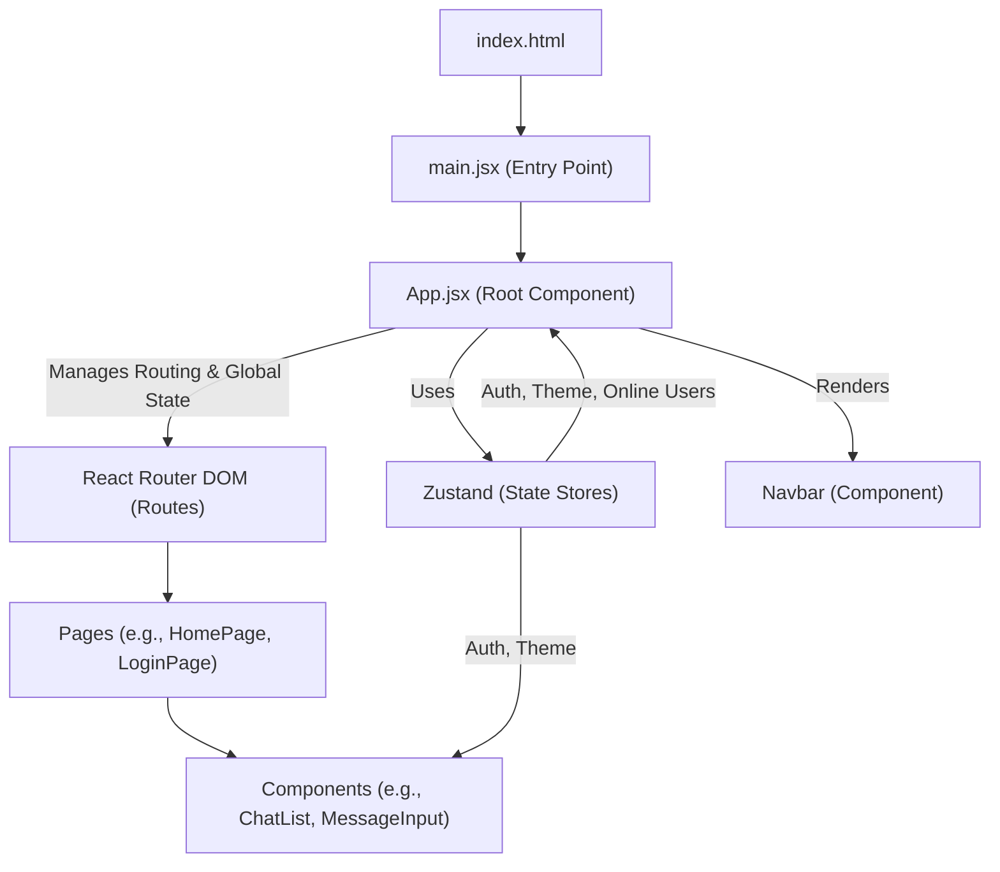
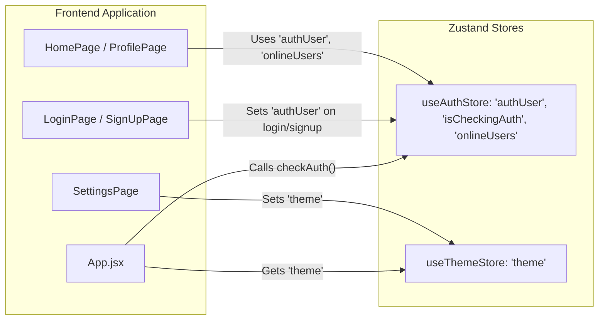

 
---
title: "Frontend Implementation"
description: "Covers the client-side architecture, technology stack, and overall structure of the user interface."
sidebar_position: 3
---

# Frontend Implementation

The frontend of the Chatty application is built as a single-page application (SPA) using React, providing a dynamic and responsive user interface. This section details the core technologies, architectural patterns, and file structure that define the client-side experience.

The application leverages modern web development tools like Vite for rapid development and optimized builds, along with a robust state management system to handle user authentication, theme settings, and real-time chat data.

## Technology Stack

The client-side is primarily built with React, augmented by a collection of powerful libraries and tools:

*   **React**: A declarative, component-based JavaScript library for building user interfaces.
*   **Vite**: A next-generation frontend tooling that provides an extremely fast development experience with features like hot module replacement (HMR) and optimized build processes.
*   **React Router DOM**: Declarative routing for React applications, enabling navigation between different views without full page reloads.
*   **Zustand**: A fast, scalable, and tiny state-management solution for React. It's used for managing global states like authentication status, online users, and theme preferences.
*   **Tailwind CSS & DaisyUI**: A utility-first CSS framework (Tailwind) combined with a component library (DaisyUI) that provides ready-made, styled UI components, facilitating rapid and consistent UI development.
*   **Axios**: A promise-based HTTP client for making API requests to the backend.
*   **Socket.IO Client**: A JavaScript client for Socket.IO, enabling real-time, bidirectional event-based communication between the browser and the server.
*   **Lucide React & React Icons**: Icon libraries used for incorporating scalable vector graphics throughout the UI.
*   **React Hot Toast**: A lightweight and customizable notification system for displaying toast messages.

This stack ensures a modern, efficient, and scalable frontend architecture capable of delivering a rich user experience for a real-time chat application.

## Core Application Structure

The frontend application follows a modular structure, centered around React components and hooks for state management. The main entry point is `main.jsx`, which renders the root `App` component within a `BrowserRouter` for client-side routing.

### Entry Point: `main.jsx`

This file is the initial script executed by the browser, responsible for bootstrapping the React application. It sets up strict mode for development and integrates `react-router-dom` for navigation.

```jsx title="frontend/src/main.jsx"
import { StrictMode } from 'react'
import { createRoot } from 'react-dom/client'
import './index.css'
import App from './App.jsx'
import { BrowserRouter } from 'react-router-dom'

createRoot(document.getElementById('root')).render(
  <StrictMode>
    <BrowserRouter>
      <App />
    </BrowserRouter>
  </StrictMode>,
)
```

The `StrictMode` component helps in highlighting potential problems in an application, while `BrowserRouter` enables navigation between different routes within the application.
[View on GitHub](https://github.com/shinymack/Chat-App-MERN/blob/main/frontend/src/main.jsx)

### Root Component: `App.jsx`

The `App.jsx` component is the heart of the application, managing global state (authentication, theme), rendering the main navigation bar, and defining the routing logic. It uses `useAuthStore` and `useThemeStore` from Zustand to manage application-wide states.

```jsx title="frontend/src/App.jsx"
import Navbar from './components/Navbar'
import { Routes, Route, Navigate } from 'react-router-dom'
import { useEffect } from 'react'
import HomePage from './pages/HomePage'
import SignUpPage from './pages/SignUpPage'
import LoginPage from './pages/LoginPage'
import SettingsPage from './pages/SettingsPage'
import ProfilePage from './pages/ProfilePage'

import { useThemeStore } from './store/useThemeStore'
import { useAuthStore } from './store/useAuthStore';
import { Loader } from 'lucide-react'
import { Toaster } from 'react-hot-toast'

const App = () => {
  const { authUser, checkAuth, isCheckingAuth, onlineUsers } = useAuthStore();
  const { theme } = useThemeStore();
  useEffect(() => {
    checkAuth();
  }, [checkAuth]);

  // Conditional rendering for authentication check
  if(isCheckingAuth && !authUser) return (
      <div className='flex items-center justify-center h-screen'>
        <Loader className='size-10 animate-spin' />
      </div>
  )

  return (
    <div className='' data-theme={theme}>
      <Navbar />
      <Toaster />
      <Routes>
        <Route path='/' element={authUser ? <HomePage />: <Navigate to='/login' />} />
        <Route path='/signup' element={ !authUser ? <SignUpPage />: <Navigate to='/' />} />
        <Route path='/login' element={!authUser ? <LoginPage />: <Navigate to='/' />} />
        <Route path='/settings' element={<SettingsPage />} />
        <Route path='/profile' element={authUser ? <ProfilePage />: <Navigate to='/login' />} />
      </Routes>
    </div>
  )
}

export default App
```
[View on GitHub](https://github.com/shinymack/Chat-App-MERN/blob/main/frontend/src/App.jsx)

The `useEffect` hook calls `checkAuth()` on component mount to verify the user's authentication status, preventing unauthorized access to protected routes. Conditional rendering (`isCheckingAuth` and `authUser`) displays a loader while authentication is being verified.

### HTML Structure: `index.html`

The `index.html` file serves as the single entry point for the web application. It's a minimal HTML scaffold where the React app (`main.jsx`) is injected.

```html title="frontend/index.html"
<!doctype html>
<html lang="en">
  <head>
    <meta charset="UTF-8" />
    <link rel="icon" type="image/svg+xml+png" href="/icon.png" />
    <meta name="viewport" content="width=device-width, initial-scale=1.0" />
    <title>Chatty</title>
  </head>
  <body>
    <div id="root"></div>
    <script type="module" src="/src/main.jsx"></script>
  </body>
</html>
```

The `<div id="root"></div>` is where the entire React application is mounted. The `<script type="module" src="/src/main.jsx"></script>` tag indicates that `main.jsx` is the entry point script for the modern JavaScript module system.
[View on GitHub](https://github.com/shinymack/Chat-App-MERN/blob/main/frontend/index.html)

### Dependencies and Scripts: `package.json`

The `package.json` file outlines all the project's dependencies (runtime and development) and defines various scripts for development, building, and linting.

```json title="frontend/package.json"
{
  "name": "frontend",
  "private": true,
  "version": "0.0.0",
  "type": "module",
  "scripts": {
    "dev": "vite",
    "build": "vite build",
    "lint": "eslint .",
    "preview": "vite preview",
    "mobile": "vite --host"
  },
  "dependencies": {
    "axios": "^1.7.9",
    "cors": "^2.8.5",
    "lucide-react": "^0.471.1",
    "react": "^18.3.1",
    "react-dom": "^18.3.1",
    "react-hot-toast": "^2.5.1",
    "react-icons": "^5.5.0",
    "react-router-dom": "^7.1.1",
    "socket.io-client": "^4.8.1",
    "zustand": "^5.0.3"
  },
  "devDependencies": {
    "@eslint/js": "^9.17.0",
    "@types/react": "^18.3.18",
    "@types/react-dom": "^18.3.5",
    "@vitejs/plugin-react": "^4.3.4",
    "autoprefixer": "^10.4.20",
    "daisyui": "^4.12.23",
    "eslint": "^9.17.0",
    "eslint-plugin-react": "^7.37.2",
    "eslint-plugin-react-hooks": "^5.0.0",
    "eslint-plugin-react-refresh": "^0.4.16",
    "globals": "^15.14.0",
    "postcss": "^8.5.0",
    "tailwindcss": "^3.4.17",
    "vite": "^6.3.5"
  }
}
```
[View on GitHub](https://github.com/shinymack/Chat-App-MERN/blob/main/frontend/package.json)

Key scripts include `dev` for starting the Vite development server, `build` for creating optimized production assets, and `mobile` for exposing the development server to the network, useful for testing on mobile devices.

## Frontend Architecture Overview

The frontend architecture prioritizes clear separation of concerns, component reusability, and efficient state management.





This diagram illustrates the flow from the initial HTML document to the main React application, highlighting how the `App.jsx` component orchestrates routing, global state, and the rendering of core UI elements and pages.

## State Management with Zustand

Zustand is central to managing the frontend's global state. It provides a simple, yet powerful, API for creating stores. The application uses distinct stores for authentication and theme management.

*   `useAuthStore`: Manages user authentication status (`authUser`), whether the app is currently checking authentication (`isCheckingAuth`), and a list of `onlineUsers` for real-time presence.
*   `useThemeStore`: Manages the current theme of the application, allowing users to switch between different UI themes.

This separation keeps related state logic encapsulated and easily accessible across components without prop drilling.





This flowchart details how different parts of the frontend application interact with the Zustand stores for state management. `App.jsx` initializes authentication and retrieves the current theme, while login/signup pages update the authentication state, and other pages consume it.

## Key Integration Points

*   **Authentication Flow**: The `App.jsx` component is critical for orchestrating the authentication flow. On initial load, `checkAuth()` is invoked. If a user is authenticated, they are directed to the `HomePage`; otherwise, they are redirected to `LoginPage` or `SignUpPage`. This conditional rendering ensures that protected routes are only accessible to authenticated users.
*   **Real-time Communication**: While the provided files don't show direct `socket.io-client` usage within `App.jsx`, its presence in `package.json` indicates that real-time features like chat messaging and online user status updates are handled by establishing a WebSocket connection, typically integrated within a dedicated hook or service that leverages `useAuthStore` to pass authentication tokens.
*   **Theme Management**: The `data-theme={theme}` attribute on the root `div` in `App.jsx` is a key integration point for DaisyUI. By changing the `theme` value in `useThemeStore`, the entire application's visual theme can be dynamically updated, showcasing the power of centralized state management for UI customization.
*   **Routing and Navigation**: `React Router DOM` is used extensively to manage navigation. The `Navbar` component, rendered globally in `App.jsx`, provides the primary navigation links, while `Routes` and `Route` components dynamically load pages based on the URL. The `Navigate` component is crucial for enforcing authentication-based route protection.

Next: [UI Components](./3.1_ui-components.mdx)
```