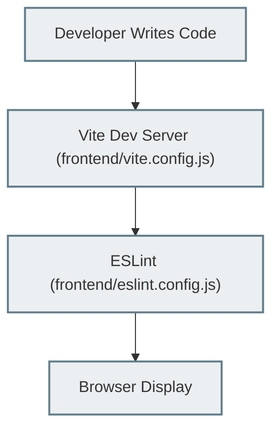
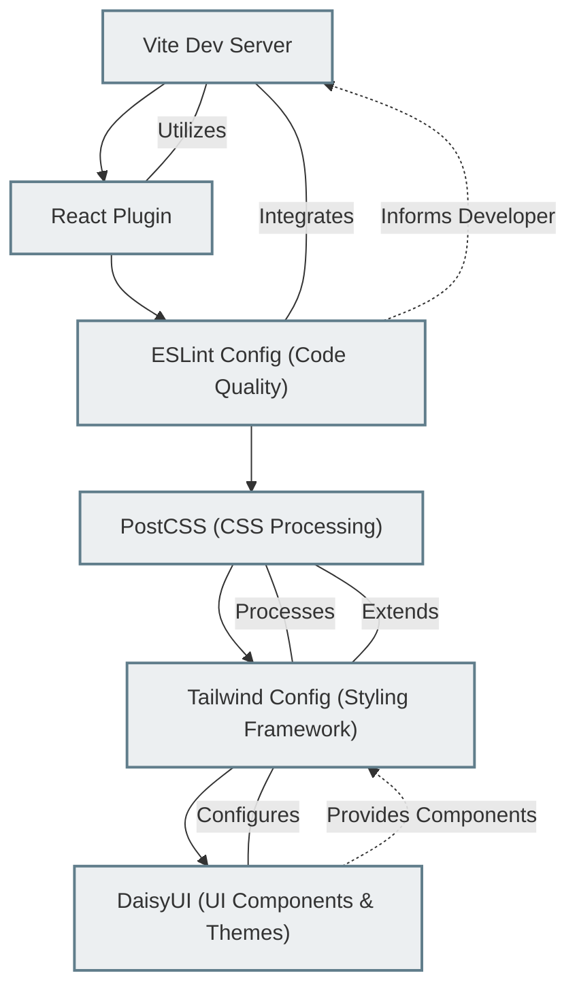

 
---
title: "Development and Configuration"
description: "Provides information on development environment setup, build tools, and configuration files."
sidebar_position: 4
---

# Development and Configuration

This section details the core configuration files that govern the development environment, build processes, and styling for the frontend application. Understanding these files is crucial for setting up a local development environment, customizing styling, and maintaining code quality. The primary tools discussed here include Vite for fast development, ESLint for code linting, PostCSS and Tailwind CSS for styling, and DaisyUI for UI components.

## Development Environment Setup

The frontend utilizes Vite as its build tool, providing a fast and efficient development experience. React is the primary library for building the user interface.

### Vite Configuration (`frontend/vite.config.js`)

Vite is a next-generation frontend tooling that offers an extremely fast development server and optimized build process. The `vite.config.js` file is where Vite's behavior is configured.

**Key Features:**
*   **Rapid Development Server:** Leverages native ES modules for quick cold starts and hot module replacement (HMR).
*   **Optimized Builds:** Uses Rollup under the hood for highly optimized production builds.
*   **Plugin-based:** Highly extensible through plugins, such as `@vitejs/plugin-react` for React support.

The primary configuration simply enables React support:

```javascript filename="frontend/vite.config.js"
import { defineConfig } from 'vite'
import react from '@vitejs/plugin-react'

// https://vitejs.dev/config/
export default defineConfig({
  plugins: [react()],
})
```
This snippet demonstrates the minimal setup required to get Vite running with React. The `defineConfig` helper provides type intellisense and ensures proper configuration.

[View on GitHub](https://github.com/shinymack/Chat-App-MERN/blob/main/frontend/vite.config.js)

### Code Quality with ESLint (`frontend/eslint.config.js`)

ESLint is a static code analysis tool used to identify problematic patterns found in JavaScript code. It helps enforce coding standards and catch potential issues early in the development cycle. The `eslint.config.js` file defines the rules and configurations for linting.

**Key Features:**
*   **Syntax and Style Enforcement:** Ensures consistent code style across the project.
*   **Error Prevention:** Catches common programming errors and anti-patterns.
*   **React Specific Rules:** Integrates `eslint-plugin-react`, `eslint-plugin-react-hooks`, and `eslint-plugin-react-refresh` for React best practices.

```javascript filename="frontend/eslint.config.js"
import js from '@eslint/js'
import globals from 'globals'
import react from 'eslint-plugin-react'
import reactHooks from 'eslint-plugin-react-hooks'
import reactRefresh from 'eslint-plugin-react-refresh'

export default [
  { ignores: ['dist'] }, // Ignores the 'dist' directory
  {
    files: ['**/*.{js,jsx}'], // Applies to JS and JSX files
    languageOptions: {
      ecmaVersion: 2020,
      globals: globals.browser,
      parserOptions: {
        ecmaVersion: 'latest',
        ecmaFeatures: { jsx: true },
        sourceType: 'module',
      },
    },
    settings: { react: { version: '18.3' } }, // Specifies React version
    plugins: {
      react,
      'react-hooks': reactHooks,
      'react-refresh': reactRefresh,
    },
    rules: {
      ...js.configs.recommended.rules,
      ...react.configs.recommended.rules,
      ...react.configs['jsx-runtime'].rules,
      ...reactHooks.configs.recommended.rules,
      'react/jsx-no-target-blank': 'off', // Disables rule for target="_blank" without rel="noreferrer noopener"
      'react-refresh/only-export-components': [
        'warn',
        { allowConstantExport: true },
      ],
      "react/prop-types" : "off", // Disables prop-types checking
    },
  },
]
```
This configuration sets up ESLint to lint JavaScript and JSX files, enabling browser globals, and integrating recommended rules from standard JavaScript, React, and React Hooks. Notably, `react/prop-types` is turned `off`, indicating the project likely uses TypeScript or relies on other forms of prop validation. The `react-refresh/only-export-components` rule is configured to allow constant exports, which is common in Vite's React Fast Refresh setup.

[View on GitHub](https://github.com/shinymack/Chat-App-MERN/blob/main/frontend/eslint.config.js)

## Styling and Theming

The application's styling is managed using Tailwind CSS, enhanced by PostCSS for processing, and integrated with DaisyUI for a rich set of pre-built UI components.

### PostCSS Configuration (`frontend/postcss.config.js`)

PostCSS is a tool for transforming CSS with JavaScript. It allows the use of plugins to extend CSS capabilities, such as adding vendor prefixes or compiling future CSS syntax.

**Key Features:**
*   **Plugin Ecosystem:** Supports a wide range of plugins for CSS transformations.
*   **Tailwind CSS Integration:** Essential for processing Tailwind CSS directives.
*   **Autoprefixing:** Automatically adds vendor prefixes to CSS rules for browser compatibility.

```javascript filename="frontend/postcss.config.js"
export default {
  plugins: {
    tailwindcss: {},
    autoprefixer: {},
  },
}
```
This configuration tells PostCSS to use the `tailwindcss` plugin to process Tailwind directives and the `autoprefixer` plugin to automatically add vendor prefixes to CSS rules, ensuring broader browser compatibility.

[View on GitHub](https://github.com/shinymack/Chat-App-MERN/blob/main/frontend/postcss.config.js)

### Tailwind CSS Configuration (`frontend/tailwind.config.js`)

Tailwind CSS is a utility-first CSS framework for rapidly building custom user interfaces. It provides a highly customizable set of low-level utility classes that can be combined to create complex designs.

**Key Features:**
*   **Utility-First:** Composes styles directly in HTML with utility classes.
*   **Highly Customizable:** Extends default themes, adds custom fonts, and configures plugins.
*   **DaisyUI Integration:** Integrates seamlessly with DaisyUI for ready-made components.

```javascript filename="frontend/tailwind.config.js"
import daisyui from "daisyui"

/** @type {import('tailwindcss').Config} */
export default {
  content: [
    "./index.html",
    "./src/**/*.{js,ts,jsx,tsx}",
  ],
  theme: {
    extend: {
      fontFamily : {
        chivo : ['Chivo', 'sans-serif'],
      }
    },
  },
  plugins: [daisyui],
  daisyui : {
 themes: [
      "light", "dark", "cupcake", "bumblebee", "emerald", "corporate", "synthwave", "retro",
      "cyberpunk", "valentine", "halloween", "garden", "forest", "aqua", "lofi", "pastel",
      "fantasy", "wireframe", "black", "luxury", "dracula", "cmyk", "autumn", "business",
      "acid", "lemonade", "night", "coffee", "winter", "dim", "nord", "sunset",
    ],
  }
}
```
This `tailwind.config.js` file is comprehensive. It specifies the files where Tailwind should look for classes (`content`), extends the default theme with a custom `chivo` font family, and integrates the `daisyui` plugin. The `daisyui` configuration is particularly extensive, listing all available themes, which allows the application to support a wide range of aesthetic options easily.

[View on GitHub](https://github.com/shinymack/Chat-App-MERN/blob/main/frontend/tailwind.config.js)

### Frontend Development Workflow

This diagram illustrates the typical development workflow for the frontend, highlighting the roles of Vite and other configuration files.





## Key Integration Points

The configuration files described above work in concert to provide a robust and efficient development and styling environment.

*   **Vite and React:** The `vite.config.js` with `@vitejs/plugin-react` provides the foundational build setup for React applications, enabling fast refresh and optimized bundling.
*   **ESLint and Development:** `eslint.config.js` integrates directly into the development workflow, often with IDE extensions, to provide real-time feedback on code quality and adherence to project standards, ensuring maintainable code.
*   **PostCSS, Tailwind CSS, and DaisyUI:** These three tools form the core of the application's styling system. `postcss.config.js` acts as the processing pipeline for `tailwind.config.js`, allowing Tailwind's utility classes to be compiled. DaisyUI, configured within `tailwind.config.js`, provides a layer of pre-built, themeable components that leverage Tailwind's utility classes, significantly speeding up UI development and ensuring a consistent look and feel across numerous themes.
*   **Font Integration:** The custom `chivo` font family defined in `tailwind.config.js` allows for specific typographic branding, which can be easily applied across components using Tailwind's utility classes.
*   **Theming Flexibility:** The extensive list of DaisyUI themes in `tailwind.config.js` provides immense flexibility for customizing the application's appearance without modifying core CSS. This allows users or developers to switch themes easily, offering a highly adaptable user experience.

### Configuration Dependencies

This diagram illustrates how the various frontend configuration files depend on and interact with each other.





This diagram visually represents the relationships, showing how Vite is foundational, ESLint enforces quality, and PostCSS processes Tailwind, which in turn configures DaisyUI for components and theming.
```