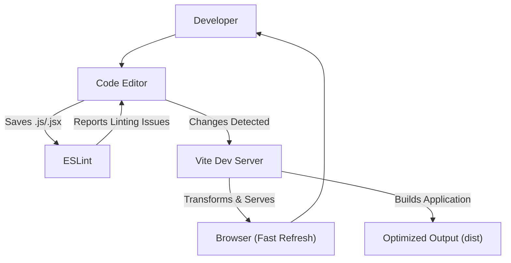
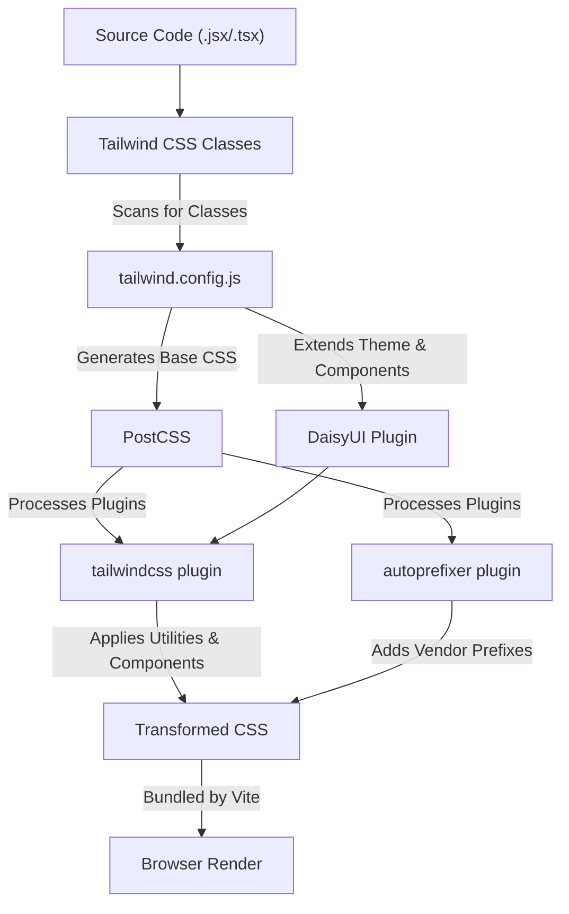

# Development and Configuration

<TOC />

This section provides comprehensive guidelines for establishing and managing the development environment, detailing the build processes, and configuring styling across the application. Understanding these configurations is crucial for consistent development, efficient debugging, and maintaining the project's aesthetic and functional standards.

We'll delve into the setup for frontend tooling, including the build system, linting, and styling frameworks, ensuring a smooth development workflow and robust code quality.

## Core Development Environment Setup

The frontend development environment is primarily powered by [Vite](https://vitejs.dev/), a next-generation frontend tooling that provides an extremely fast development server and optimized build process. Alongside Vite, we integrate [React](https://react.dev/) for UI development, supported by various plugins and configurations for a streamlined experience.

### Vite Configuration

The `vite.config.js` file is the central point for configuring Vite, influencing how the application is built and served. For this project, a minimal configuration is used, leveraging the official React plugin.

```javascript showLineNumbers
// frontend/vite.config.js
import { defineConfig } from 'vite'
import react from '@vitejs/plugin-react'

// https://vitejs.dev/config/
export default defineConfig({
  plugins: [react()],
})
```
This snippet defines the basic Vite configuration. The `defineConfig` helper from Vite ensures type-safety and provides autocompletion. The `plugins` array is where various Vite plugins are registered; here, `@vitejs/plugin-react` is essential for enabling React fast refresh and JSX transformations.

For more details, refer to the [Vite Configuration documentation](https://vitejs.dev/config/) or view the file on GitHub: [frontend/vite.config.js](https://github.com/shinymack/Chat-App-MERN/blob/main/frontend/vite.config.js).

### Linting with ESLint

Maintaining code quality and consistency is paramount. [ESLint](https://eslint.org/) is configured to enforce coding standards, identify potential errors, and ensure best practices for JavaScript and React development. The `eslint.config.js` file defines the rules and plugins specific to the project.

```javascript showLineNumbers
// frontend/eslint.config.js
import js from '@eslint/js'
import globals from 'globals'
import react from 'eslint-plugin-react'
import reactHooks from 'eslint-plugin-react-hooks'
import reactRefresh from 'eslint-plugin-react-refresh'

export default [
  { ignores: ['dist'] }, // Ignores the 'dist' directory
  {
    files: ['**/*.{js,jsx}'], // Applies rules to JS/JSX files
    languageOptions: {
      ecmaVersion: 2020,
      globals: globals.browser,
      parserOptions: {
        ecmaVersion: 'latest',
        ecmaFeatures: { jsx: true },
        sourceType: 'module',
      },
    },
    settings: { react: { version: '18.3' } }, // React version for plugin
    plugins: {
      react,
      'react-hooks': reactHooks,
      'react-refresh': reactRefresh,
    },
    rules: {
      ...js.configs.recommended.rules, // Standard JS recommended rules
      ...react.configs.recommended.rules, // React recommended rules
      ...react.configs['jsx-runtime'].rules, // JSX runtime specific rules
      ...reactHooks.configs.recommended.rules, // React Hooks specific rules
      'react/jsx-no-target-blank': 'off', // Custom rule override
      'react-refresh/only-export-components': [ // Warns about non-exported components in modules
        'warn',
        { allowConstantExport: true },
      ],
      "react/prop-types" : "off", // Disables prop-types checking
    },
  },
]
```
This extensive configuration sets up ESLint for a modern React application. Key aspects include:
*   **`ignores: ['dist']`**: Prevents linting of the build output directory.
*   **`files: ['**/*.{js,jsx}']`**: Ensures rules only apply to JavaScript and JSX files.
*   **`languageOptions`**: Configures JavaScript version (ECMAScript 2020), browser globals, and enables JSX parsing.
*   **`settings: { react: { version: '18.3' } }`**: Informs the React plugin about the installed React version.
*   **`plugins`**: Registers essential plugins for React (`eslint-plugin-react`), React Hooks (`eslint-plugin-react-hooks`), and React Fast Refresh (`eslint-plugin-react-refresh`).
*   **`rules`**: Combines recommended rules from ESLint, React, and React Hooks, then overrides specific rules like `'react/jsx-no-target-blank'` to `'off'` and `'react/prop-types'` to `'off'`, indicating a preference for explicit type checking (e.g., with TypeScript if implemented) or a specific project style. The `'react-refresh/only-export-components'` rule helps optimize Fast Refresh by warning about components not exported directly.

View the full ESLint configuration: [frontend/eslint.config.js](https://github.com/shinymack/Chat-App-MERN/blob/main/frontend/eslint.config.js).

### Development Workflow Diagram

This diagram illustrates the core development tools and their interactions, highlighting the flow from code editing to browser rendering.





## Styling and Theming Configuration

The application's visual consistency and theming capabilities are managed through [Tailwind CSS](https://tailwindcss.com/) combined with [DaisyUI](https://daisyui.com/), a component library based on Tailwind CSS. [PostCSS](https://postcss.org/) acts as a necessary intermediary for processing CSS with plugins like Autoprefixer.

### PostCSS Configuration

PostCSS is a tool for transforming CSS with JavaScript. It's an integral part of the styling pipeline, especially when working with Tailwind CSS.

```javascript showLineNumbers
// frontend/postcss.config.js
export default {
  plugins: {
    tailwindcss: {},
    autoprefixer: {},
  },
}
```
This configuration tells PostCSS to use two plugins:
*   **`tailwindcss`**: Processes Tailwind CSS directives and generates the necessary utility classes.
*   **`autoprefixer`**: Automatically adds vendor prefixes to CSS rules, ensuring compatibility across different browsers.

This simple setup ensures that our CSS is properly processed and optimized for production. View the PostCSS configuration: [frontend/postcss.config.js](https://github.com/shinymack/Chat-App-MERN/blob/main/frontend/postcss.config.js).

### Tailwind CSS and DaisyUI Setup

`tailwind.config.js` is where you customize Tailwind CSS and integrate DaisyUI, defining design tokens, custom utility classes, and theme settings.

```javascript showLineNumbers
// frontend/tailwind.config.js
import daisyui from "daisyui"


/** @type {import('tailwindcss').Config} */
export default {
  content: [
    "./index.html",
    "./src/**/*.{js,ts,jsx,tsx}",
  ],
  theme: {
    extend: {
      fontFamily : {
        chivo : ['Chivo', 'sans-serif'],
      }
    },
  },
  plugins: [daisyui],
  daisyui : {
 themes: [
      "light", "dark", "cupcake", "bumblebee", "emerald", "corporate", "synthwave",
      "retro", "cyberpunk", "valentine", "halloween", "garden", "forest", "aqua",
      "lofi", "pastel", "fantasy", "wireframe", "black", "luxury", "dracula",
      "cmyk", "autumn", "business", "acid", "lemonade", "night", "coffee",
      "winter", "dim", "nord", "sunset",
    ],
  }
}
```
This configuration file is critical for the application's visual design:
*   **`content`**: Specifies the files where Tailwind should look for classes. This is crucial for Tailwind's tree-shaking feature, which only includes used classes in the final CSS bundle, significantly reducing file size.
*   **`theme.extend`**: Allows extending Tailwind's default theme. Here, a custom font family named `chivo` is defined, which can then be used throughout the application via `font-chivo`.
*   **`plugins: [daisyui]`**: Integrates the DaisyUI plugin, which provides a rich set of pre-designed UI components and themes built on top of Tailwind CSS.
*   **`daisyui.themes`**: An array listing all the available DaisyUI themes. This allows the application to dynamically switch between a wide range of themes, offering extensive customization options and user preferences. The inclusion of themes like `"light"`, `"dark"`, `"synthwave"`, `"dracula"`, and many more provides a robust theming system.

By leveraging Tailwind CSS with DaisyUI, developers can rapidly build responsive and aesthetically pleasing user interfaces with consistent theming. View the full Tailwind CSS configuration: [frontend/tailwind.config.js](https://github.com/shinymack/Chat-App-MERN/blob/main/frontend/tailwind.config.js).

### Styling Pipeline Diagram

This diagram illustrates the journey of CSS from development to the final rendered output, showing how PostCSS, Tailwind CSS, and DaisyUI work together.





## Key Integration Points

The various configuration files and tools described above are not isolated; they are deeply integrated to form a cohesive development and build pipeline.

*   **Vite and ESLint**: Vite's development server works in tandem with ESLint. While Vite focuses on serving and building, ESLint ensures that the code being developed adheres to quality standards *before* it's even run or committed. Many IDEs integrate ESLint feedback directly, providing immediate alerts for issues.
*   **Vite and Styling**: Vite efficiently bundles the processed CSS from PostCSS (which includes Tailwind and Autoprefixer). During development, Vite's Hot Module Replacement (HMR) quickly updates styles in the browser without a full page reload, accelerating the UI development feedback loop.
*   **Tailwind CSS and PostCSS**: Tailwind CSS relies on PostCSS to transform its directives into actual CSS utility classes. The `postcss.config.js` acts as the bridge, ensuring Tailwind and other PostCSS plugins (like Autoprefixer) are applied correctly.
*   **Tailwind CSS and DaisyUI**: DaisyUI is a Tailwind CSS plugin, meaning it extends Tailwind's capabilities. Its components and themes are built directly using Tailwind's utility classes and design system, ensuring full compatibility and a seamless extension of Tailwind's philosophy. Customizations in `tailwind.config.js` (like `theme.extend` or `daisyui.themes`) directly influence the look and feel provided by DaisyUI.
*   **Code Consistency**: The `eslint.config.js` settings for React, React Hooks, and `react-refresh` work together to ensure that the React component code not only follows best practices but also plays well with Vite's Fast Refresh mechanism, providing a smooth and efficient development experience for React developers.

By carefully configuring these tools, the project establishes a robust and efficient environment that promotes high-quality code, consistent styling, and rapid development cycles. Each tool plays a vital role, and their seamless integration is key to the project's maintainability and scalability.