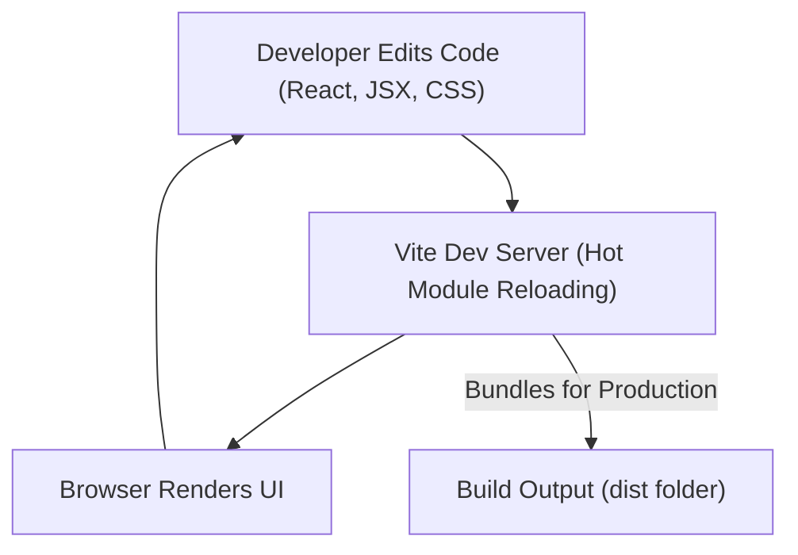

# Development and Configuration

This section details the setup and configuration of the frontend development environment, focusing on essential tools and frameworks used for building, linting, and styling the application. Understanding these configurations is crucial for contributors to maintain consistency, ensure code quality, and efficiently develop new features.

The frontend of this application leverages a modern web development stack including Vite for a fast development experience, React for the user interface, Tailwind CSS for utility-first styling, and ESLint for code quality enforcement. DaisyUI extends Tailwind CSS with ready-to-use component classes.

## Development Environment Setup

To begin development, ensure Node.js and npm/yarn are installed. The project's frontend dependencies are managed through `package.json`.

```bash
# Navigate to the frontend directory
cd frontend

# Install dependencies
npm install
# or
yarn install

# Start the development server
npm run dev
# or
yarn dev
```

This will launch the application in development mode, typically accessible at `http://localhost:5173`. Vite provides hot module reloading, ensuring changes are reflected instantly without a full page refresh.

## Frontend Build and Bundling with Vite

Vite is utilized as the build tool for its speed and efficient development server. It optimizes the development and production build processes, making it a cornerstone of the frontend architecture.

### Vite Configuration (`frontend/vite.config.js`)

The `vite.config.js` file is minimal, primarily integrating the React plugin to enable React-specific optimizations and JSX transformations.

```javascript
import { defineConfig } from 'vite'
import react from '@vitejs/plugin-react'

// https://vitejs.dev/config/
export default defineConfig({
  plugins: [react()],
})
```

**Explanation:**
*   `defineConfig`: Helper for Vite to ensure correct TypeScript intellisense.
*   `plugins: [react()]`: Integrates `@vitejs/plugin-react`, which provides Fast Refresh for React components and handles JSX syntax.

This straightforward setup demonstrates Vite's "zero-config" philosophy for many common use cases, especially with React.

[View on GitHub](https://github.com/shinymack/Chat-App-MERN/blob/main/frontend/vite.config.js)

### Frontend Development Flow

The following diagram illustrates the high-level flow of the frontend development process, highlighting the role of Vite.





## Styling with Tailwind CSS and DaisyUI

The application's styling system is built upon Tailwind CSS, a utility-first CSS framework, augmented by DaisyUI for pre-designed component classes and themes. PostCSS is used to process CSS with plugins like Tailwind CSS and Autoprefixer.

### PostCSS Configuration (`frontend/postcss.config.js`)

`postcss.config.js` defines the PostCSS plugins used to process CSS files.

```javascript
export default {
  plugins: {
    tailwindcss: {},
    autoprefixer: {},
  },
}
```

**Explanation:**
*   `tailwindcss`: Processes Tailwind CSS directives and generates the necessary CSS utilities.
*   `autoprefixer`: Automatically adds vendor prefixes to CSS rules, ensuring cross-browser compatibility.

[View on GitHub](https://github.com/shinymack/Chat-App-MERN/blob/main/frontend/postcss.config.js)

### Tailwind CSS Configuration (`frontend/tailwind.config.js`)

This file is central to customizing Tailwind CSS and integrating DaisyUI. It defines content paths, theme extensions, and DaisyUI specific configurations.

```javascript
import daisyui from "daisyui"


/** @type {import('tailwindcss').Config} */
export default {
  content: [
    "./index.html",
    "./src/**/*.{js,ts,jsx,tsx}",
  ],
  theme: {
    extend: {
      fontFamily : {
        chivo : ['Chivo', 'sans-serif'],
      }
    },
  },
  plugins: [daisyui],
  daisyui : {
 themes: [
      "light",
      "dark",
      "cupcake",
      "bumblebee",
      "emerald",
      "corporate",
      "synthwave",
      "retro",
      "cyberpunk",
      "valentine",
      "halloween",
      "garden",
      "forest",
      "aqua",
      "lofi",
      "pastel",
      "fantasy",
      "wireframe",
      "black",
      "luxury",
      "dracula",
      "cmyk",
      "autumn",
      "business",
      "acid",
      "lemonade",
      "night",
      "coffee",
      "winter",
      "dim",
      "nord",
      "sunset",
    ],
  }
}
```

**Explanation:**
*   `content`: Specifies files where Tailwind CSS should scan for class names to generate the final CSS bundle. This is crucial for tree-shaking unused styles.
*   `theme.extend`: Allows extending Tailwind's default theme. Here, a custom `chivo` font family is added.
*   `plugins: [daisyui]`: Integrates DaisyUI, providing a rich set of component classes.
*   `daisyui.themes`: Configures the available DaisyUI themes, enabling easy switching between different aesthetic styles. This project supports a wide array of themes, allowing for significant customization of the UI's appearance.

[View on GitHub](https://github.com/shinymack/Chat-App-MERN/blob/main/frontend/tailwind.config.js)

## Code Quality with ESLint

ESLint is configured to maintain code quality, consistency, and identify potential issues early in the development cycle. It integrates with React-specific rules and ensures best practices are followed.

### ESLint Configuration (`frontend/eslint.config.js`)

The `eslint.config.js` file defines the linting rules, plugins, and parsers for JavaScript and JSX files.

```javascript
import js from '@eslint/js'
import globals from 'globals'
import react from 'eslint-plugin-react'
import reactHooks from 'eslint-plugin-react-hooks'
import reactRefresh from 'eslint-plugin-react-refresh'

export default [
  { ignores: ['dist'] },
  {
    files: ['**/*.{js,jsx}'],
    languageOptions: {
      ecmaVersion: 2020,
      globals: globals.browser,
      parserOptions: {
        ecmaVersion: 'latest',
        ecmaFeatures: { jsx: true },
        sourceType: 'module',
      },
    },
    settings: { react: { version: '18.3' } },
    plugins: {
      react,
      'react-hooks': reactHooks,
      'react-refresh': reactRefresh,
    },
    rules: {
      ...js.configs.recommended.rules,
      ...react.configs.recommended.rules,
      ...react.configs['jsx-runtime'].rules,
      ...reactHooks.configs.recommended.rules,
      'react/jsx-no-target-blank': 'off',
      'react-refresh/only-export-components': [
        'warn',
        { allowConstantExport: true },
      ],
      "react/prop-types" : "off",

    },
  },
]
```

**Explanation:**
*   `ignores: ['dist']`: Prevents ESLint from checking the build output directory.
*   `files: ['**/*.{js,jsx}']`: Specifies that these rules apply to all `.js` and `.jsx` files.
*   `languageOptions`: Configures language settings:
    *   `ecmaVersion: 2020`: Sets the ECMAScript version.
    *   `globals: globals.browser`: Defines browser global variables (e.g., `window`, `document`).
    *   `parserOptions`: Further refines parsing options, enabling JSX and module parsing.
*   `settings: { react: { version: '18.3' } }`: Informs ESLint of the React version being used.
*   `plugins`: Registers ESLint plugins for React, React Hooks, and React Refresh.
*   `rules`: Overrides or extends recommended rule sets:
    *   `...js.configs.recommended.rules`: Includes ESLint's recommended JavaScript rules.
    *   `...react.configs.recommended.rules`: Includes React-specific recommended rules.
    *   `...react.configs['jsx-runtime'].rules`: Includes rules specific to the new JSX runtime.
    *   `...reactHooks.configs.recommended.rules`: Includes recommended rules for React Hooks.
    *   `react/jsx-no-target-blank: 'off'`: Disables a rule that enforces `rel="noreferrer"` on `target="_blank"` links (might be handled elsewhere or not a priority).
    *   `react-refresh/only-export-components`: Configures a warning for components that are not exported, which can interfere with React Fast Refresh. `allowConstantExport: true` permits constant exports.
    *   `"react/prop-types" : "off"`: Disables the rule requiring `propTypes` for React components. This suggests the project might use TypeScript or another form of type checking, or simply chooses not to enforce prop type validation at runtime.

[View on GitHub](https://github.com/shinymack/Chat-App-MERN/blob/main/frontend/eslint.config.js)

## Key Integration Points

The frontend configurations work in harmony to provide a robust and efficient development experience.

*   **Vite and React:** Vite's plugin for React streamlines JSX compilation and offers Fast Refresh, which is essential for rapid iteration during development.
*   **PostCSS, Tailwind CSS, and DaisyUI:** These tools form a powerful styling pipeline. PostCSS acts as the processor, Tailwind provides the utility classes and system, and DaisyUI layers on top with ready-to-use component styles and themes. This modular approach allows for both highly customized styling and quick component assembly.
*   **ESLint and Development Workflow:** ESLint is integrated to run during development, typically configured as a pre-commit hook or integrated into the IDE, ensuring that code quality standards are met before code is committed or pushed. The `react-refresh/only-export-components` rule directly supports Vite's Fast Refresh capability by warning developers about code structures that might break it. The decision to turn off `react/prop-types` might imply the use of TypeScript or a similar type-checking mechanism not explicitly detailed here, or a deliberate choice for quicker prototyping without strict type enforcement for props.

This configuration stack provides a solid foundation for building and maintaining a modern, performant, and scalable React application. The emphasis on speed (Vite), flexibility (Tailwind), and code quality (ESLint) ensures a productive development environment.