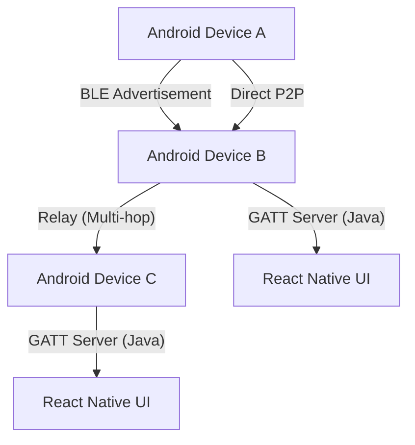

# Introduction

MeshChat is a decentralized, peer-to-peer (P2P) messaging application designed for Android. It enables seamless communication in environments where traditional network infrastructure—such as cellular towers, Wi-Fi routers, or internet gateways—is unavailable or compromised.

By leveraging **Bluetooth Low Energy (BLE)**, MeshChat allows devices to form a dynamic, self-healing mesh network. This ensures that messages can reach their destination even if the sender and receiver are not within direct radio range, by relaying data through intermediate nodes.

## Core Capabilities

- **Infrastructure-less Communication**: No SIM cards, servers, or internet connections required.
- **Automatic Discovery**: Devices utilize BLE scanning to detect and connect to peers automatically.
- **Multi-Hop Routing**: Messages are relayed through intermediate devices using a Time-to-Live (TTL) limited protocol to prevent infinite loops.
- **Hybrid Messaging**: Supports both private one-on-one encrypted-style communication and public broadcast channels.
- **Background Persistence**: Utilizes an Android Foreground Service to maintain BLE connectivity and message listening even when the app is not in the foreground.

## System Architecture

MeshChat employs a hybrid architecture, combining the flexibility of React Native with a custom Java-based BLE stack to overcome the limitations of standard cross-platform libraries.




## Technical Stack

| Layer | Technology | Purpose |
| :--- | :--- | :--- |
| **Framework** | React Native 0.73 | UI and Business Logic |
| **BLE Central** | `react-native-ble-plx` | Scanning and connecting to peers |
| **BLE Peripheral** | Custom Java (`BLEPeripheralModule`) | GATT server implementation for advertising and receiving |
| **Backgrounding** | Android Foreground Service | Maintaining network presence in background |
| **Persistence** | AsyncStorage | Local message history and state storage |

## Initial Setup

### Prerequisites

Because BLE hardware cannot be emulated, a **physical Android device** is required.

1. **Android SDK**: Ensure the Android SDK is installed and configured on your development machine.
2. **Developer Options**: Enable **USB Debugging** on your physical device.
3. **USB Connection**: Connect your device via USB and verify the connection:
   ```bash
   adb devices
   ```

### Environment Configuration

The project requires JDK 17. You must set the `JAVA_HOME` environment variable in every new terminal session:

```bash
export JAVA_HOME=$HOME/java/jdk-17.0.2
export PATH=$JAVA_HOME/bin:$PATH
```

### Installation and Execution

1. **Install Dependencies**:
   ```bash
   npm install
   ```

2. **Launch the Metro Bundler**:
   Start the JavaScript bundler in its own terminal window to handle Hot Reloading:
   ```bash
   npm start
   ```

3. **Deploy to Device**:
   In a separate terminal (with `JAVA_HOME` configured), run the application:
   ```bash
   npx react-native run-android
   ```

### Troubleshooting Connectivity

If the application fails to connect to the Metro server, use the Android Debug Bridge (ADB) to reverse the ports:

```bash
adb reverse tcp:8081 tcp:8081
```

To monitor real-time system logs and BLE events:

```bash
npx react-native log-android
```