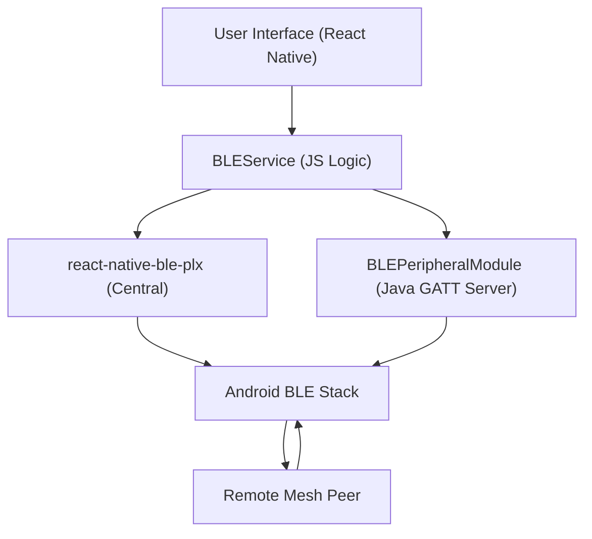

# Introduction

MeshChat is a decentralized, offline peer-to-peer (P2P) messaging application built for Android. It leverages Bluetooth Low Energy (BLE) to enable communication in environments where traditional network infrastructure—such as cellular towers, Wi-Fi routers, or internet gateways—is unavailable or compromised.

By combining a React Native frontend with a custom Java-based GATT server, MeshChat transforms mobile devices into both clients and relays, creating a resilient mesh network.

## Core Capabilities

- **Infrastructure-less Communication**: No SIM cards, servers, or internet connection required.
- **Automated Discovery**: Devices continuously scan for and connect to peers via BLE advertising.
- **Flexible Messaging**: Supports private 1-on-1 encrypted-style communication and public broadcast channels.
- **Multi-hop Relaying**: Messages can travel through intermediate nodes to reach a destination beyond the immediate radio range of the sender, utilizing a Time-to-Live (TTL) mechanism to prevent infinite loops.
- **Background Persistence**: Utilizes an Android Foreground Service to ensure the BLE stack remains active even when the app is not in the foreground.

## System Architecture

MeshChat operates by implementing both the **Central** (scanner) and **Peripheral** (advertiser/server) roles of the BLE specification simultaneously.



## Initial Setup

Because MeshChat interacts directly with hardware BLE APIs and requires a GATT server implementation, it **cannot be run on an emulator**. A physical Android device is required.

### 1. Environment Configuration
Ensure you have the Android SDK installed. You must configure your Java environment in every new terminal session to avoid build failures:

```bash
export JAVA_HOME=$HOME/java/jdk-17.0.2
export PATH=$JAVA_HOME/bin:$PATH
```

### 2. Device Preparation
1. Connect your Android device via USB.
2. Enable **Developer Options** and **USB Debugging** on the device.
3. Verify the connection via ADB:
   ```bash
   adb devices
   ```

### 3. Launching the Application

The development process requires two concurrent terminal sessions:

**Terminal 1: The Metro Bundler**
This server bundles the JavaScript code and pushes updates to the device via Hot Reload.
```bash
npm start
```

**Terminal 2: The Native Build**
Initialize the Java environment (see step 1) and deploy the APK to your device:
```bash
npx react-native run-android
```

### 4. Troubleshooting Connection
If the application fails to connect to the Metro server, synchronize the TCP ports using ADB:
```bash
adb reverse tcp:8081 tcp:8081