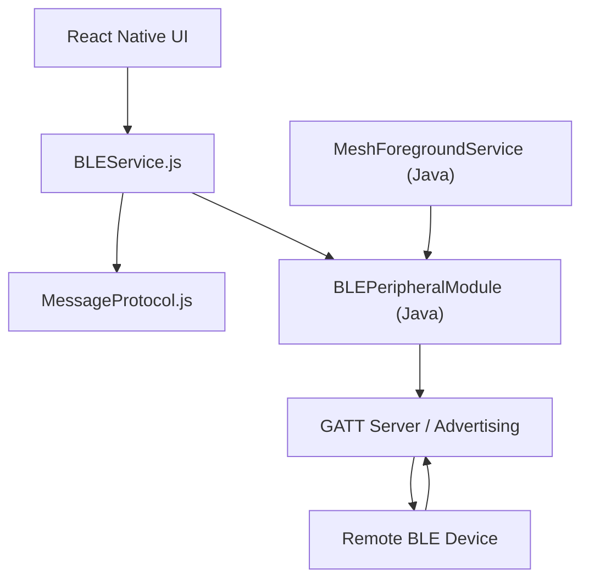

# Project Overview

MeshChat is an offline, peer-to-peer messaging application designed for Android devices. It leverages **Bluetooth Low Energy (BLE)** to create a decentralized mesh network, enabling communication without the need for internet connectivity, centralized servers, or SIM cards.

The system is designed for resilience and accessibility, allowing users to discover nearby peers automatically and exchange messages through a combination of direct connections and multi-hop relaying.

## Core Capabilities

- **Infrastructure-less Communication**: Operates entirely offline using BLE.
- **Automatic Peer Discovery**: Devices continuously scan for and connect to other MeshChat nodes.
- **Hybrid Messaging**: Supports both private 1-on-1 conversations and public broadcast channels.
- **Mesh Relaying**: Implements multi-hop routing, where intermediate devices relay messages to reach distant peers (limited by Time-to-Live/TTL).
- **Background Persistence**: Utilizes an Android Foreground Service to ensure the BLE GATT server remains active even when the app is not in the foreground.

## System Architecture

MeshChat employs a hybrid architecture, combining a React Native frontend with a custom Java-based BLE implementation to bypass the limitations of standard BLE libraries that often lack peripheral (server) support.



## Technical Stack

| Layer | Technology | Purpose |
| :--- | :--- | :--- |
| **Framework** | React Native 0.73 | Cross-platform UI and business logic |
| **BLE Central** | `react-native-ble-plx` | Scanning and connecting to other devices |
| **BLE Peripheral** | Custom Java API | Implementing the GATT server for advertising |
| **Backgrounding** | Android Foreground Service | Maintaining connectivity in the background |
| **Persistence** | AsyncStorage | Local storage of messages and peer data |

## High-Level Setup

### Prerequisites
- **Physical Android Device**: BLE functionality is not supported in Android emulators.
- **Java Development Kit (JDK)**: Version 17.0.2 is required.
- **Android SDK**: Configured via Android Studio.

### Installation & Execution

1. **Environment Configuration**
   Ensure your Java environment is set correctly in your terminal:
   ```bash
   export JAVA_HOME=$HOME/java/jdk-17.0.2
   export PATH=$JAVA_HOME/bin:$PATH
   ```

2. **Device Preparation**
   - Connect your device via USB.
   - Enable **USB Debugging** in Developer Options.
   - Verify connection: `adb devices`.

3. **Launch Development Server**
   Start the Metro bundler to package the JavaScript code:
   ```bash
   npm start
   ```

4. **Deploy Application**
   In a separate terminal, run the deployment command:
   ```bash
   npx react-native run-android
   ```

### Troubleshooting Connection
If the application fails to connect to the Metro server, synchronize the ports using ADB:
```bash
adb reverse tcp:8081 tcp:8081