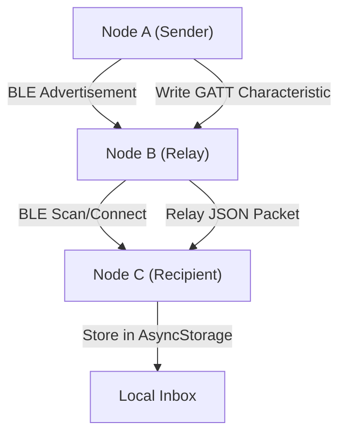

# Project Overview

MeshChat is a decentralized, peer-to-peer (P2P) messaging application designed for Android devices to communicate in environments where traditional network infrastructure—such as cellular towers, Wi-Fi routers, or internet gateways—is unavailable. 

By leveraging **Bluetooth Low Energy (BLE)**, MeshChat transforms individual smartphones into nodes within a mobile ad-hoc network (MANET), allowing messages to jump across multiple devices to reach a destination.

## Core Objectives

The primary goal of MeshChat is to ensure communication resilience. The project focuses on three main pillars:
- **Infrastructure Independence:** Zero reliance on SIM cards, centralized servers, or internet connectivity.
- **Automatic Topology:** Devices automatically discover and connect to peers using BLE scanning and advertising.
- **Extended Reach:** Implementing a multi-hop relay system where intermediate nodes forward messages to extend the network's effective range (governed by a Time-to-Live/TTL limit).

## High-Level Architecture

MeshChat employs a hybrid architecture. While the user interface and high-level mesh logic are handled in JavaScript via React Native, the critical BLE Peripheral capabilities are implemented in native Java to bypass the limitations of existing React Native libraries.

### Communication Flow

The system operates by simultaneously running a **BLE Central** (to scan and connect) and a **BLE Peripheral** (to advertise and host data).

## Technical Stack

| Layer | Technology | Purpose |
| :--- | :--- | :--- |
| **Framework** | React Native 0.73 | Cross-platform UI and application logic. |
| **BLE Central** | `react-native-ble-plx` | Scanning for peers and initiating connections. |
| **BLE Peripheral** | Custom Java (`BLEPeripheralModule`) | Implementing the GATT server for receiving data. |
| **Persistence** | `AsyncStorage` | Local caching of messages and peer identities. |
| **Background** | Android Foreground Service | Ensuring the BLE stack remains active when the app is minimized. |

## Key Configuration Requirements

To ensure the project builds and runs correctly, the environment must meet the following strict requirements:

- **JDK Version:** Java Development Kit (JDK) 17.0.2 is required for the Android build process.
- **Hardware:** A physical Android device is mandatory. BLE hardware cannot be accurately simulated in the Android Emulator.
- **Developer Settings:** USB Debugging must be enabled on the target device to allow the Metro bundler and ADB to deploy the application.