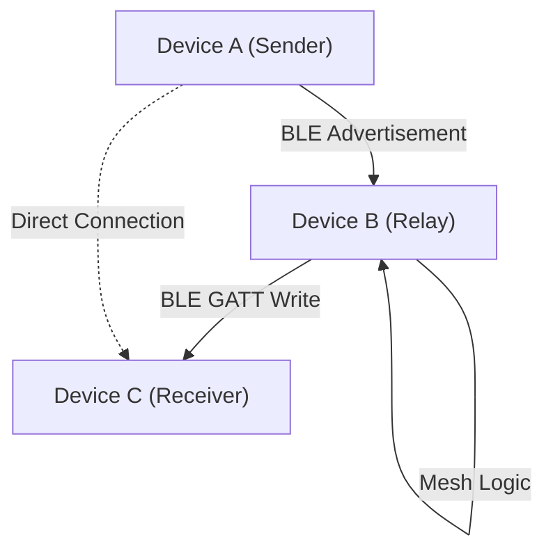

# Project Overview

MeshChat is a decentralized, offline peer-to-peer (P2P) communication platform designed for Android devices. By leveraging Bluetooth Low Energy (BLE), it enables users to send and receive messages without relying on traditional internet infrastructure, cellular networks, or centralized servers.

The application implements a mesh networking topology, allowing messages to relay through intermediate devices to reach distant peers, effectively extending the communication range beyond the physical limit of a single BLE connection.

## Core Capabilities

- **Infrastructure-less Communication**: Operates entirely offline; no SIM card or Wi-Fi required.
- **Automatic Peer Discovery**: Devices continuously scan and advertise via BLE to establish connections automatically.
- **Hybrid Messaging Modes**: 
  - **Private Messaging**: Encrypted 1-on-1 communication between specific peers.
  - **Public Broadcast**: Messages sent to a public channel for all nearby nodes to receive.
- **Multi-hop Relaying**: Implements a Time-to-Live (TTL) limited relay system, allowing messages to hop across multiple devices to reach a destination.

## System Architecture

MeshChat utilizes a hybrid architecture to overcome the limitations of standard React Native BLE libraries. While most libraries only support the **BLE Central** (scanner) role, MeshChat implements a custom Java module to handle the **BLE Peripheral** (GATT server) role, allowing the device to be discoverable by others.

## High-Level Project Structure

The project is divided between a JavaScript-based application layer and a native Android service layer to ensure background persistence and low-level hardware access.

### Application Layer (`/src`)
- **`services/`**: The core business logic.
    - `BLEService.js`: Manages scanning, connection lifecycles, and message queuing.
    - `MessageProtocol.js`: Handles the serialization and deserialization of JSON message packets.
    - `StorageService.js`: Manages local message persistence via `AsyncStorage`.
- **`screens/`**: The user interface components including the Inbox, individual Chat threads, and the Public broadcast channel.

### Native Layer (`/android`)
- **`BLEPeripheralModule.java`**: A custom native module that implements the GATT server and manages BLE advertising.
- **`MeshForegroundService.java`**: An Android Foreground Service that prevents the OS from killing the BLE process, ensuring the device remains discoverable and capable of relaying messages in the background.

## Technical Stack

| Layer | Technology | Purpose |
| :--- | :--- | :--- |
| **Framework** | React Native 0.73 | Cross-platform UI and application logic |
| **BLE Central** | `react-native-ble-plx` | Scanning and connecting to other peers |
| **BLE Peripheral**| Custom Java (GATT) | Advertising and hosting the BLE server |
| **Backgrounding** | Android Foreground Service | Persistent BLE availability |
| **Persistence** | AsyncStorage | Local caching of messages and peer IDs |
| **Language** | JavaScript / Java | Application logic and native hardware integration |