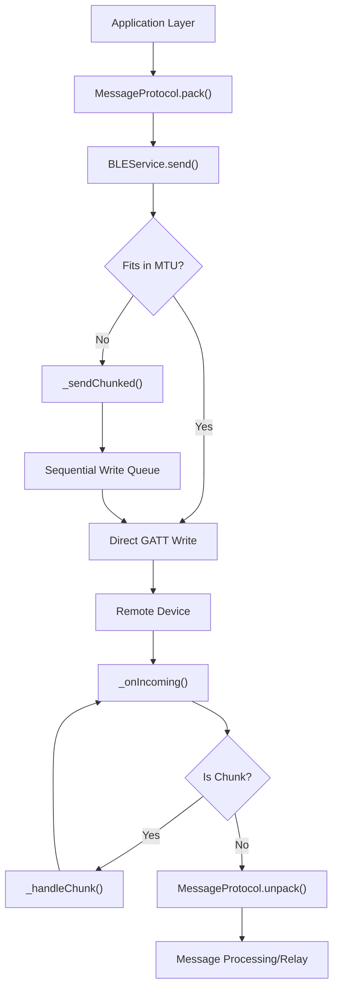

# Message Protocol

The MeshChat Message Protocol provides a unified packet format for bidirectional communication between nodes in the BLE mesh. It abstracts the underlying transport layer, ensuring that messages—whether direct or public—are consistently structured, validated, and routed.

## Packet Schema

All messages are serialized as JSON strings before transmission. The protocol supports two primary message types: `dm` (Direct Message) and `public` (Broadcast).

### Message Fields

| Field | Type | Description |
| :--- | :--- | :--- |
| `id` | `string` | Unique identifier for the message (used for deduplication). |
| `from` | `string` | The nickname of the original sender. |
| `type` | `string` | The message category: `dm` or `public`. |
| `to` | `string \| null` | Recipient identifier for DMs; `null` for public messages. |
| `payload` | `string` | The actual message content. |
| `ts` | `number` | Unix timestamp of message creation. |
| `ttl` | `number` | Time-to-Live: Maximum number of hops a public message can travel. |
| `hops` | `number` | Current hop count (increments as the message is relayed). |

## Transmission Lifecycle

The following diagram illustrates the flow of a message from the application layer through the protocol and transport services.

## Encoding and Transport

### Encoding Pipeline
1. **Packing**: `MessageProtocol.pack` generates a JSON object.
2. **Buffering**: The JSON string is converted to a UTF-8 `Buffer`.
3. **Transport Encoding**: For transmission via `react-native-ble-plx`, the buffer is converted to a **Base64** string.

### Handling MTU and Chunking
BLE has a limited Maximum Transmission Unit (MTU). To prevent packet loss or truncation of long messages, `BLEService` implements a chunking mechanism:

- **MTU Negotiation**: During connection, the service requests a specific MTU (defined in `BLEConstants`).
- **Fragmentation**: If a message exceeds the negotiated MTU, it is split into smaller fragments.
- **Chunk Header**: Each fragment is prefixed with a protocol header:
  `CHUNK:{sequence}:{total}:{messageId}:{data}`
- **Reassembly**: The receiver collects chunks in a `Map` keyed by `messageId`. Once all `total` parts are received, the payload is concatenated and passed to the unpacker.

## Mesh Routing and Relaying

MeshChat implements a "flood-fill" relay strategy for public messages to ensure reachability across multiple hops.

### Relay Logic
When a node receives a `public` message, it performs the following:
1. **Deduplication**: Checks the `_seen` set using the message `id`. If the message has been processed, it is dropped to prevent infinite loops.
2. **TTL Validation**: `MessageProtocol.relay()` checks the `ttl` (Time-to-Live).
   - If `ttl <= 0`, the message is dropped.
   - If `ttl > 0`, the `ttl` is decremented by 1 and the `hops` count is incremented by 1.
3. **Broadcasting**: The modified message is re-sent to all connected peers except the source that delivered the message.

### Write Queue Management
To avoid GATT congestion and "Device Busy" errors on Android, `BLEService` implements a per-connection **Write Queue**:
- Writes are executed sequentially (one at a time per device).
- Each write is wrapped in a `Promise.race` to handle timeouts.
- Failed writes are retried up to `WRITE_MAX_RETRIES` times with an exponential backoff delay.