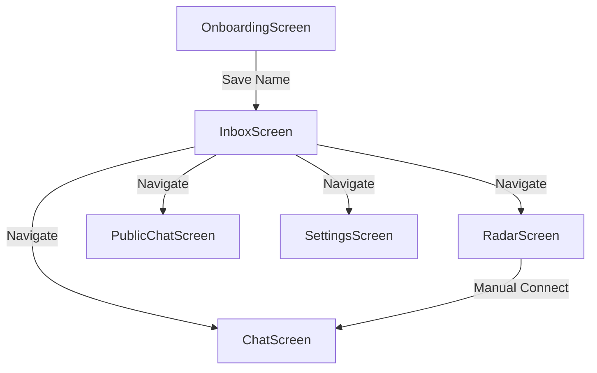

# Screen Implementations

MeshChat utilizes a specialized screen architecture designed for low-latency Bluetooth Low Energy (BLE) interactions. The UI is built with a "terminal-inspired" aesthetic, emphasizing real-time connectivity status and mesh topology.

## OnboardingScreen
The entry point for first-time users. Its primary purpose is to establish a mesh identity.

- **Identity Setup**: Users provide a display name (2–20 characters).
- **Persistence**: The name is stored via `StorageService.setUsername`, ensuring the user is not prompted again on subsequent launches.
- **Validation**: The "Enter the Mesh" action is disabled until the minimum character threshold is met.

## InboxScreen
The central hub of the application, managing the intersection of active BLE connections and persisted message history.

### Key Responsibilities
- **Auto-Mesh Initialization**: Triggers `BLEService.startAutoMesh()` on mount to maintain a background network of peers.
- **State Synchronization**: Uses `useFocusEffect` to refresh peer counts and conversation lists whenever the screen becomes active.
- **Peer Categorization**:
    - **Public Channel**: A global entry point for broadcasting.
    - **Nearby Peers**: BLE-connected devices that do not yet have a stored conversation history.
    - **Conversations**: Peers with existing message threads stored in `StorageService`.

### Logic Flow
The screen monitors `BLEService` events (`connect`, `disconnect`, `discovery`) to dynamically update the `peerCount` and the `nearbyPeers` list, filtering out devices already present in the saved conversations.

## PublicChatScreen
A broadcast-oriented interface where messages are sent to all currently connected peers using a specialized protocol type.

- **Broadcast Mechanism**: Utilizes `ble.sendPublic(text)`, which iterates through all active connections to deliver the payload.
- **Local Persistence**: Public messages are saved via `StorageService.savePublicMessage` to maintain a local history of the global channel.
- **Real-time Presence**: The header displays a live count of discovered peers, indicating the potential reach of a broadcast.

## RadarScreen
A diagnostic and manual discovery tool for users who wish to explicitly scan for and connect to specific peers.

### Technical Features
- **Active Scanning**: Initiates a manual BLE scan via `ble.startScan()`, bypassing the auto-mesh logic for targeted discovery.
- **Signal Strength**: Displays the RSSI (Received Signal Strength Indicator) for each discovered peer, visualized through a simplified bar system (`▓▓▓`).
- **Event Console**: Features a real-time log window that outputs BLE state changes, discovery events, and connection attempts for debugging mesh stability.
- **Manual Handshake**: Allows the user to trigger `ble.connectTo(deviceId)`, which, upon success, automatically navigates the user to the private `ChatScreen`.