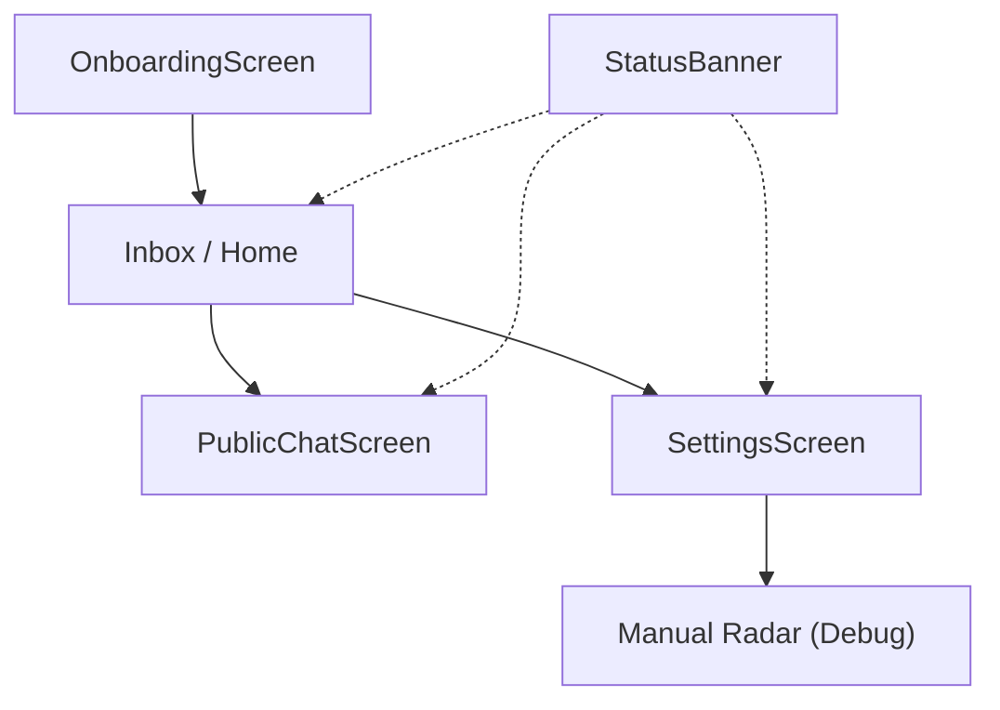

# UI Components & Screens

The MeshChat UI is built as a series of reactive screens and components designed for a high-contrast, "terminal-style" aesthetic. The interface prioritizes immediate feedback regarding hardware state (Bluetooth) and peer connectivity.

## Navigation Flow

The application follows a linear onboarding path leading into a hub-and-spoke navigation model.

---

## Global Components

### `StatusBanner`
A high-priority notification bar that appears at the top of screens to alert users of critical hardware or software blockers.

**Logic & Behavior:**
- **Reactive Monitoring**: Listens to `BLEService` for `btState` changes.
- **Polling**: Periodically checks permissions every 5 seconds to ensure the app can resume functionality as soon as the user grants access in system settings.
- **Conditional Rendering**: Returns `null` if Bluetooth is powered on and permissions are granted.

**State Mapping:**
| Condition | Visual Style | Message |
| :--- | :--- | :--- |
| `bt === 'PoweredOff'` | Amber/Brown | Bluetooth is disabled — turn it on to connect |
| `bt === 'TurningOn/Off'` | Dark Blue | Bluetooth is changing state... |
| `!permsOk` | Deep Red | Permissions required — go to Settings |

---

## Screens

### `OnboardingScreen`
The entry point for new users. This screen ensures every device in the mesh has a human-readable identity.

- **Validation**: Requires a name between 2 and 20 characters.
- **Persistence**: Uses `StorageService.setUsername()` to save the identity locally.
- **Navigation**: Uses `navigation.replace('Inbox')` to ensure the user cannot return to onboarding via the back button.

### `PublicChatScreen`
A broadcast-style communication channel where messages are sent to all discovered peers rather than a specific individual.

**Technical Implementation:**
- **Protocol**: Utilizes the `public` message type defined in `MessageProtocol`.
- **Message Flow**: 
    1. Local state is updated immediately for zero-latency feel.
    2. Message is persisted via `StorageService.savePublicMessage()`.
    3. `BLEService.sendPublic()` broadcasts the payload to the mesh.
- **Peer Tracking**: Subscribes to `discovery`, `connect`, and `disconnect` events to provide a real-time count of nearby peers in the header.

### `SettingsScreen`
A centralized hub for identity management, system permissions, and data privacy.

#### Identity Management
Users can update their display name. The UI tracks `originalName` to determine if the `[ SAVE CHANGES ]` button should be visible, preventing unnecessary storage writes.

#### Android Permission Matrix
The screen implements a dynamic permission checker based on the Android API level:
- **Standard**: `ACCESS_FINE_LOCATION`, `ACCESS_COARSE_LOCATION`.
- **API 31+**: Adds `BLUETOOTH_SCAN`, `BLUETOOTH_CONNECT`, `BLUETOOTH_ADVERTISE`.
- **API 33+**: Adds `POST_NOTIFICATIONS`.

#### Data Privacy
Provides a "Nuclear Option" via `StorageService.clearAll()`, which wipes all conversation histories and peer metadata from the local device.

---

## Styling Guide
The UI uses a consistent "Hacker" theme:
- **Background**: `#0a0f0a` (Deep Black/Green)
- **Accents**: `#4ade80` (Neon Green) for primary actions.
- **Typography**: `monospace` is used globally to reinforce the technical, P2P nature of the application.
- **Interaction**: Buttons use bracketed text (e.g., `[ ENTER THE MESH ]`) to simulate a CLI environment.