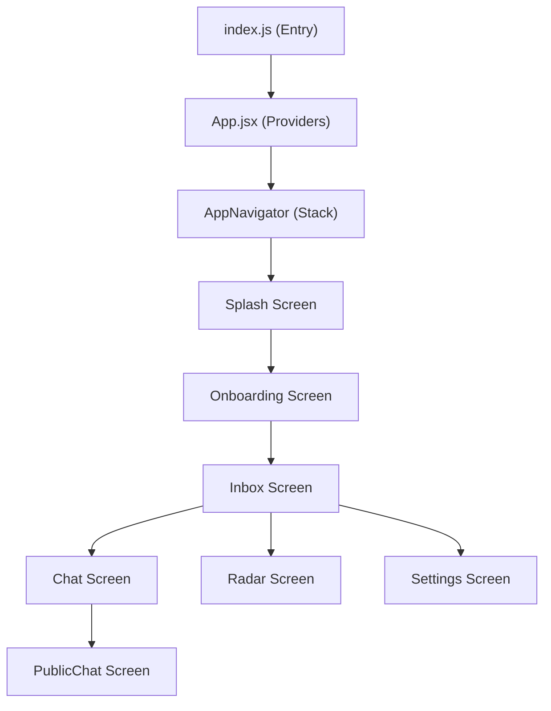

# App Architecture

The MeshChat application is built using a modular React Native architecture, prioritizing a clean separation between the application entry point, global provider wrappers, and the navigation layer.

## Entry Point and Root Initialization

The application boot sequence follows a standard React Native lifecycle to ensure the environment is correctly initialized before rendering the UI.

1.  **`index.js`**: Acts as the primary entry point. It utilizes `AppRegistry` to register the main component with the native platform, using the application name defined in `app.json`.
2.  **`App.jsx`**: Serves as the root component. It wraps the entire application in a `SafeAreaProvider` from `react-native-safe-area-context`, ensuring that the UI respects device notches, status bars, and home indicator areas across different iOS and Android devices.

## Navigation Flow

MeshChat implements a stack-based navigation pattern using `@react-navigation/native` and `@react-navigation/native-stack`. This approach allows for a linear, hierarchical transition between screens.

### Navigator Configuration
The `AppNavigator` component defines the routing logic for the entire application. Key configurations include:
- **Initial Route**: The application starts at the `Splash` screen.
- **Visual Style**: A consistent dark theme is enforced globally via `contentStyle: { backgroundColor: '#0a0f0a' }`.
- **Transitions**: All screen transitions use the `slide_from_right` animation to provide a native mobile feel.
- **Header**: The default navigation header is disabled (`headerShown: false`) to allow for custom screen-level headers.

### Application Flow Diagram

## Screen Registry

The following table outlines the screens integrated into the navigation stack:

| Route Name | Component | Purpose |
| :--- | :--- | :--- |
| `Splash` | `SplashScreen` | Initial app loading and branding. |
| `Onboarding` | `OnboardingScreen` | User introduction and setup flow. |
| `Inbox` | `InboxScreen` | Primary hub for active conversations. |
| `Radar` | `RadarScreen` | Discovery of nearby mesh nodes/users. |
| `Chat` | `ChatScreen` | Private one-to-one messaging interface. |
| `PublicChat` | `PublicChatScreen` | Open community communication channels. |
| `Settings` | `SettingsScreen` | User preferences and app configuration. |