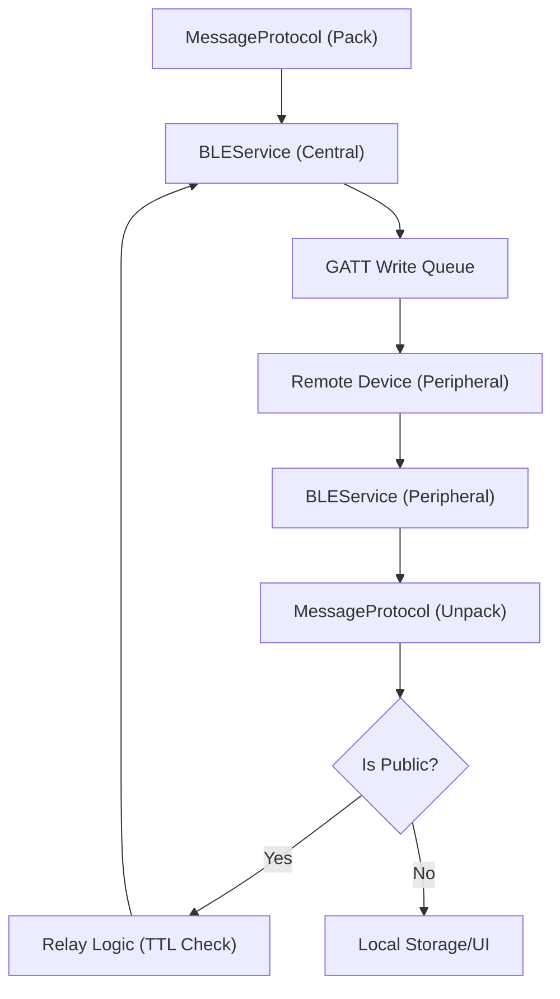

# Core Communication Layer

MeshChat implements a decentralized, peer-to-peer communication system leveraging Bluetooth Low Energy (BLE). The architecture employs a **dual-role** strategy, where every device simultaneously operates as a BLE Peripheral (to be discoverable) and a BLE Central (to discover and connect to others).

## Architecture Overview

The communication layer is divided into three primary components: the **Constants** definition, the **BLE Service** (transport), and the **Message Protocol** (serialization).

## BLE Transport Logic

### Dual-Role Operation
To facilitate a mesh network without a central coordinator, `BLEService` manages two concurrent states:

1.  **Peripheral Role**: Managed via a native Java module. The device advertises the `MESHCHAT_SERVICE_UUID` and hosts a GATT server. It listens for writes to the `MESSAGE_CHAR_UUID` and allows reads of the `NAME_CHAR_UUID`.
2.  **Central Role**: Managed via `react-native-ble-plx`. The device scans for the same service UUID, establishes connections to discovered peers, and writes data to their message characteristics.

### Auto-Mesh Discovery
The `startAutoMesh()` method initiates a continuous lifecycle:
- **Scan Phase**: A 10-second burst scan to find nearby MeshChat peers.
- **Connection Phase**: Automatic connection to all discovered peers not currently connected.
- **Pause Phase**: A 5-second cooldown to conserve battery before restarting the cycle.

### Reliability & Throughput
Because BLE GATT writes can be unstable if hammered with concurrent requests, MeshChat implements several reliability layers:

- **Sequential Write Queue**: The `_enqueueWrite` method ensures that only one GATT write is active per connection. Requests are queued and executed sequentially with a retry mechanism (`WRITE_MAX_RETRIES = 2`).
- **MTU Negotiation**: The service requests an MTU (Maximum Transmission Unit) of 512 bytes to maximize data throughput per packet.
- **Message Chunking**: For payloads exceeding the negotiated MTU, the system splits data into chunks prefixed with a header (`CHUNK:seq:total:id:`), reassembling them on the receiving end before protocol unpacking.

## Message Protocol

The `MessageProtocol` acts as the serialization layer, ensuring a unified packet format across the mesh.

### Packet Structure
Every message is packed into a JSON object with the following schema:

| Field | Type | Description |
| :--- | :--- | :--- |
| `id` | String | Globally unique identifier for deduplication. |
| `from` | String | The nickname of the original sender. |
| `type` | String | Either `'dm'` (Direct Message) or `'public'` (Broadcast). |
| `to` | String/null | Recipient identifier for DMs; null for public messages. |
| `payload` | String | The actual message text. |
| `ts` | Number | Unix timestamp of creation. |
| `ttl` | Number | Time-to-Live: Max hops remaining before the message expires. |
| `hops` | Number | Total number of relays this message has undergone. |

### Mesh Routing & Relaying
Public messages are propagated through the network using a **flood-fill** algorithm with loop prevention:

1.  **Deduplication**: The `_seen` cache (up to 500 IDs) ensures a device never processes or relays the same message ID twice.
2.  **TTL Decrementation**: When a `public` message is received, the `relay()` method decrements the `ttl` and increments the `hops`.
3.  **Termination**: If `ttl` reaches 0, the message is dropped and not relayed further, preventing infinite loops and network congestion.
4.  **Propagation**: Valid relayed messages are broadcast to all connected peers except the one that originally sent the packet.

## Technical Specifications

### UUIDs
| Component | UUID |
| :--- | :--- |
| **Service** | `a1b2c3d4-e5f6-7890-abcd-ef1234567890` |
| **Message Char** | `a1b2c3d4-e5f6-7890-abcd-ef1234567891` |
| **Name Char** | `a1b2c3d4-e5f6-7890-abcd-ef1234567892` |

### Configuration Constants
- **Default TTL**: `7` hops.
- **Scan Interval**: `5000ms`.
- **Max Seen IDs**: `500` (LRU-style queue).
- **Write Timeout**: `5000ms`.