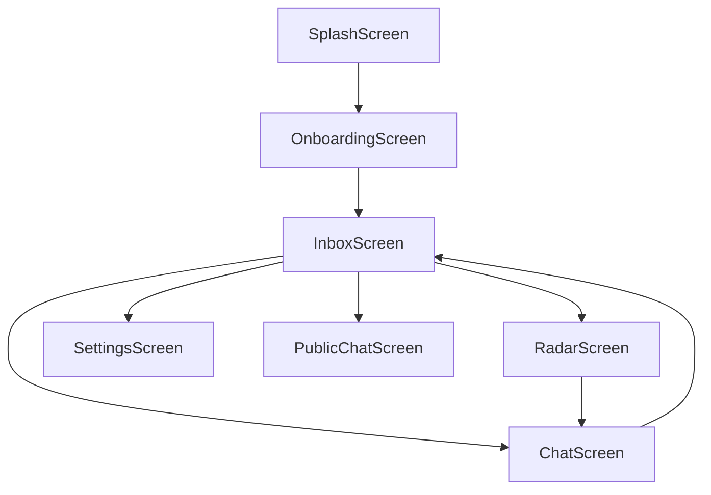

# Frontend Architecture

MeshChat is built using **React Native**, leveraging a stack-based navigation pattern to manage a peer-to-peer (P2P) messaging experience. The architecture emphasizes real-time system state monitoring (Bluetooth availability) and asynchronous event-driven UI updates.

## Navigation Flow

The application utilizes `@react-navigation/native-stack` to handle screen transitions. The `AppNavigator` acts as the central routing hub, implementing a seamless "slide-from-right" transition and a consistent dark-theme aesthetic.

### Route Configuration
- **Initial Route**: `Splash`
- **Global Theme**: Background color `#0a0f0a`
- **Header Strategy**: Headers are disabled (`headerShown: false`) to allow for custom, context-aware headers within individual screens (e.g., the `ChatScreen` header).

## System State Management

Because the application relies entirely on Bluetooth Low Energy (BLE), the UI must respond instantly to hardware state changes. This is achieved through a decoupled service-to-component pattern.

### The StatusBanner Component
The `StatusBanner` is a high-order utility component injected into screens to provide immediate feedback on system requirements. It monitors two primary vectors via `BLEService`:
1. **Bluetooth State**: Detects `PoweredOff` or transitional states (`TurningOn`/`TurningOff`).
2. **Permissions**: Periodically polls for necessary OS-level permissions every 5 seconds.

This ensures that the user is never left wondering why a connection failed, providing a clear call to action (e.g., "Go to Settings").

## Chat Implementation Analysis

The `ChatScreen` is the most complex architectural piece, managing the intersection of local storage, BLE streams, and user input.

### Lifecycle and Data Flow
1. **Initialization**: On mount, the screen fetches message history and peer metadata from `StorageService` using the `peerMac` passed via navigation params.
2. **Event Subscription**: The screen subscribes to several `BLEService` events:
   - `message`: Updates the message list in real-time when a payload arrives.
   - `disconnect`/`connect`: Toggles the `alive` state to enable/disable the input field.
   - `btState`: Forces a disconnected state if the hardware is powered off.
3. **Message Transmission**:
   - Messages are assigned a unique ID via `MessageProtocol`.
   - The UI updates optimistically by adding the message to the local state before the `BLEService.send()` call completes.
   - Messages are persisted to `StorageService` immediately to prevent data loss during disconnects.

### UI/UX Patterns
- **Optimistic UI**: Local messages appear instantly.
- **Connectivity Guard**: The `TextInput` and `Send` button are disabled when `alive === false`, preventing the user from attempting to send data into a void.
- **Auto-Scroll**: A `FlatList` ref is used with `onContentSizeChange` to ensure the view always anchors to the latest message.
- **Aesthetic**: A "terminal" style is enforced using `fontFamily: 'monospace'`, a high-contrast dark palette, and accent colors (`#4ade80` for active, `#ef4444` for error).