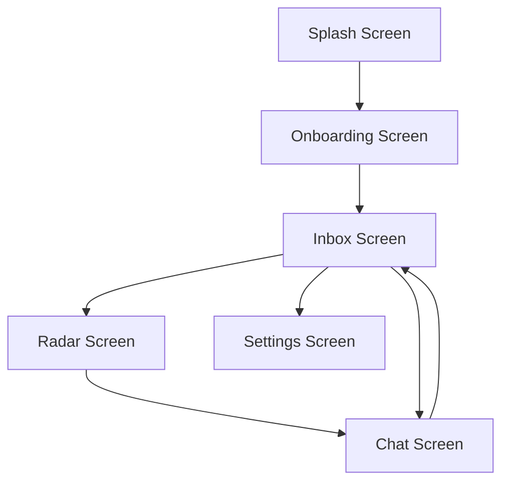

# Frontend Architecture

MeshChat is built with **React Native**, utilizing a stack-based navigation pattern and a service-oriented architecture to decouple the Bluetooth Low Energy (BLE) logic from the UI layer.

## Navigation Flow

The application employs `@react-navigation/native-stack` to manage the user journey. The navigation is designed to be linear for onboarding and hub-and-spoke for the primary messaging functions.

### Route Configuration
The `AppNavigator` defines the global visual theme and transition animations:
- **Initial Route**: `Splash`
- **Animation**: `slide_from_right`
- **Theme**: Dark-mode optimized with a background color of `#0a0f0a`.

## Core Screen Implementations

### 1. Radar Screen (Peer Discovery)
The `RadarScreen` serves as the discovery hub. It interfaces directly with the `BLEService` to scan for nearby advertising devices.

**Key Technical Features:**
- **Real-time Discovery**: Uses a subscription model (`ble.on('discovery')`) to update the peer list dynamically as devices are found.
- **Signal Strength Visualization**: Maps RSSI values to visual "signal bars" (e.g., `▓▓▓` for $>-60\text{dBm}$) to provide users with proximity context.
- **Interactive Console**: A dedicated log view providing low-level BLE event transparency (e.g., `RADAR_READY`, `BT_OFF`).
- **Animation**: A `pulse` animation synchronized with the scanning state to provide visual feedback.

### 2. Chat Screen (P2P Communication)
The `ChatScreen` handles the complex state management required for asynchronous BLE messaging and local persistence.

**Technical Workflow:**
- **Hydration**: On mount, the screen retrieves message history from `StorageService` using the `peerMac` as the primary key.
- **Event Coordination**: It listens for four distinct BLE events:
    - `message`: Appends incoming payloads to the message state.
    - `disconnect`: Triggers the "Connection Lost" banner.
    - `connect`: Restores the "Connected" status.
    - `btState`: Handles hardware-level Bluetooth power-offs.
- **Message Lifecycle**:
    1. **Local Update**: Message is immediately added to the state for optimistic UI.
    2. **Persistence**: Message is saved to local storage via `StorageService`.
    3. **Transmission**: Sent over the air via `BLEService.send()`.

## UI State Management

MeshChat uses a combination of React hooks and Singleton services to maintain state across the application.

| Feature | Mechanism | Implementation |
| :--- | :--- | :--- |
| **Connectivity** | Event Emitter | `BLEService` emits events that screens subscribe to via `useEffect`. |
| **Persistence** | Async Storage | `StorageService` handles usernames and message archives. |
| **UI Feedback** | Local State | `useState` manages loading spinners and connection banners. |
| **Input Handling** | `KeyboardAvoidingView` | Ensures the chat input remains visible across iOS and Android platforms. |

## Design System
The frontend adheres to a "Terminal-inspired" aesthetic:
- **Typography**: Monospace fonts are used throughout for a technical, mesh-network feel.
- **Color Palette**: 
  - Primary: `#4ade80` (Neon Green)
  - Background: `#0a0f0a` (Deep Black)
  - Accents: `#1f2937` (Dark Grey) and `#ef4444` (Alert Red)