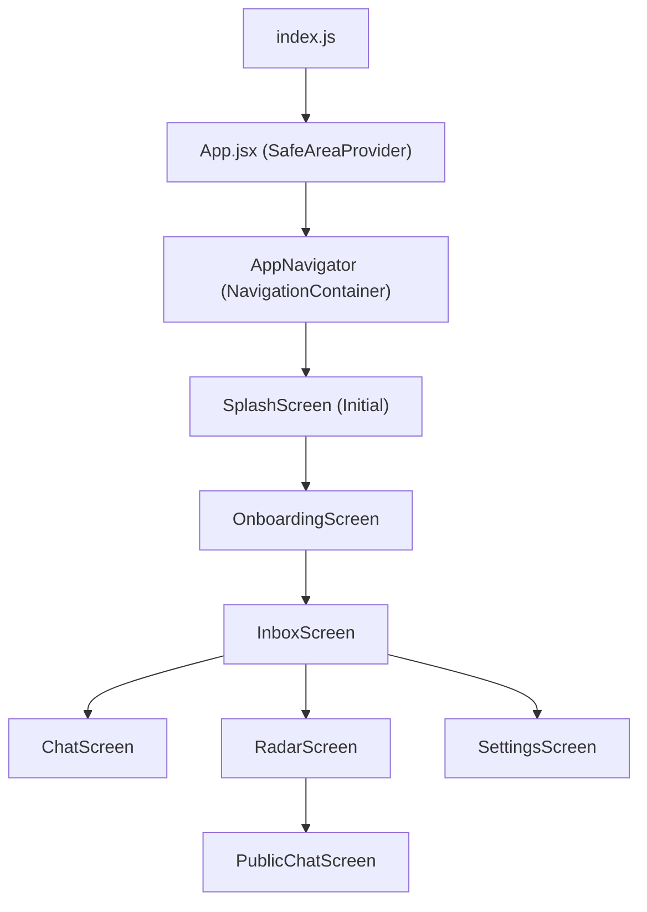

# Project Architecture

MeshChat is built as a React Native application utilizing a centralized stack-based navigation pattern. The architecture follows a unidirectional flow from the native entry point to a provider-wrapped root, culminating in a managed navigation stack that controls the user experience.

## Application Lifecycle & Entry Point

The application bootstrap process follows a three-tier hierarchy to ensure the environment is correctly configured before the UI is rendered:

1.  **`index.js`**: The native entry point. It utilizes `AppRegistry` to register the main application component with the native OS, linking the JavaScript bundle to the native platform.
2.  **`App.jsx`**: The root wrapper. This layer provides essential global contexts, specifically the `SafeAreaProvider`, which ensures that the application layout adapts to various device notches and system bars.
3.  **`AppNavigator.jsx`**: The routing engine. This component manages the navigation state and defines the available views within the application.

## Navigation Flow

MeshChat employs a `native-stack` navigator for optimized performance. The navigation is structured as a linear stack where the `SplashScreen` serves as the initial mount point.

## Component Hierarchy

### Navigation Configuration
The `AppNavigator` defines the global visual constraints for all screens in the stack:
- **Theme**: A dark aesthetic with a background color of `#0a0f0a`.
- **Transitions**: Uses `slide_from_right` animations to maintain a consistent mobile-native feel.
- **Header**: Headers are disabled (`headerShown: false`) to allow for custom screen-level UI implementations.

### Route Definitions
| Route Name | Component | Purpose |
| :--- | :--- | :--- |
| `Splash` | `SplashScreen` | Initial app loading and branding. |
| `Onboarding` | `OnboardingScreen` | User introduction and setup flow. |
| `Inbox` | `InboxScreen` | Primary hub for private conversations. |
| `Radar` | `RadarScreen` | Discovery interface for nearby mesh nodes. |
| `Chat` | `ChatScreen` | Direct messaging interface. |
| `PublicChat` | `PublicChatScreen` | Open communication channels. |
| `Settings` | `SettingsScreen` | User preferences and app configuration. |