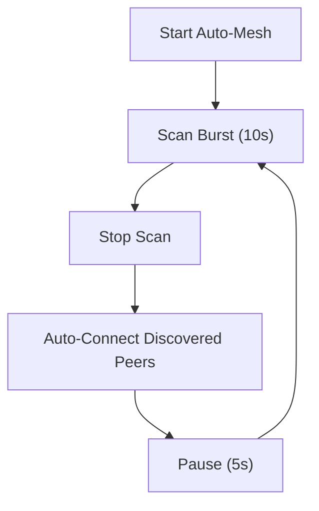

# Connectivity & BLE Services

MeshChat utilizes a dual-role Bluetooth Low Energy (BLE) architecture, allowing every device to act simultaneously as a **Peripheral** (Server) and a **Central** (Client). This symmetry is fundamental to the mesh network, enabling any node to discover, connect to, and relay messages for any other node.

## BLE Architecture Overview

The transport layer is split between a native Java module for peripheral capabilities and the `react-native-ble-plx` library for central operations.

### Dual-Role Responsibility

| Role | Component | Primary Responsibility | Key Operations |
| :--- | :--- | :--- | :--- |
| **Peripheral** | `BLEPeripheral` (Native) | Device Visibility | Advertising, hosting GATT server, receiving writes. |
| **Central** | `BleManager` (JS) | Network Expansion | Scanning for peers, initiating connections, writing messages. |

## BLE Profile & UUIDs

To ensure interoperability, MeshChat uses fixed UUIDs. These constants must remain unchanged across deployments to ensure devices can recognize each other.

- **Service UUID**: `a1b2c3d4-e5f6-7890-abcd-ef1234567890` (Used for scanner filtering)
- **Message Characteristic**: `a1b2c3d4-e5f6-7890-abcd-ef1234567891` (Read/Write/Notify)
- **Name Characteristic**: `a1b2c3d4-e5f6-7890-abcd-ef1234567892` (Read-only; stores display name)

## Connectivity Lifecycle

### The Auto-Mesh Loop
MeshChat implements a continuous "Auto-Mesh" cycle to maintain network density without user intervention.

### Connection Process
When a device initiates a connection, the following sequence occurs:
1. **GATT Connection**: Establish connection with a requested MTU of 512 bytes.
2. **Service Discovery**: Discover all services and characteristics.
3. **Identity Exchange**: Read the `NAME_CHAR_UUID` to resolve the peer's display name.
4. **Queue Initialization**: Create a dedicated GATT write queue for that specific `deviceId`.

**Robustness Note:** The service specifically handles Android "GATT 133" errors by implementing a mandatory 1-second delay followed by a single reconnection attempt.

## Data Transport & Optimization

### GATT Write Queue
To prevent GATT congestion and "device busy" errors, `BLEService` implements a per-connection write queue.
- **Sequential Execution**: Only one write operation is active per peer at any time.
- **Retry Logic**: Failed writes are retried up to 2 times with a progressive delay (`WRITE_RETRY_DELAY_MS`).
- **Timeout**: Individual writes timeout after 5 seconds to prevent queue blocking.

### MTU & Chunking
While the system requests an MTU of 512, actual supported MTUs vary by device. To handle payloads larger than the negotiated MTU:
1. **Slicing**: Data is split into chunks based on `MTU - 3`.
2. **Header**: Each chunk is prefixed with a header: `CHUNK:{sequence}:{total}:{messageId}:`.
3. **Reassembly**: The receiving device buffers chunks in a `Map` and triggers `_onIncoming` only once all sequence numbers are collected.

## Mesh Relay Logic

MeshChat supports multi-hop communication via "Public" messages.

### Relay Mechanism
When a public message is received:
1. **Deduplication**: The `msg.id` is checked against a `MAX_SEEN_IDS` (500) cache. If seen, it is dropped to prevent infinite loops.
2. **TTL Validation**: The Time-to-Live (TTL) is checked. If `TTL <= 0`, the message is not relayed.
3. **Propagation**: The message is forwarded to all connected peers **except** the one that sent it.
4. **Metric Update**: The `ttl` is decremented and the `hops` count is incremented before forwarding.

### Summary of Constants

| Constant | Value | Description |
| :--- | :--- | :--- |
| `DEFAULT_TTL` | `7` | Max number of hops a public message can travel. |
| `MAX_SEEN_IDS` | `500` | Size of the deduplication cache. |
| `SCAN_INTERVAL_MS`| `5000` | Duty cycle pause to conserve battery. |
| `REQUESTED_MTU` | `512` | Target MTU for high-throughput transfers. |