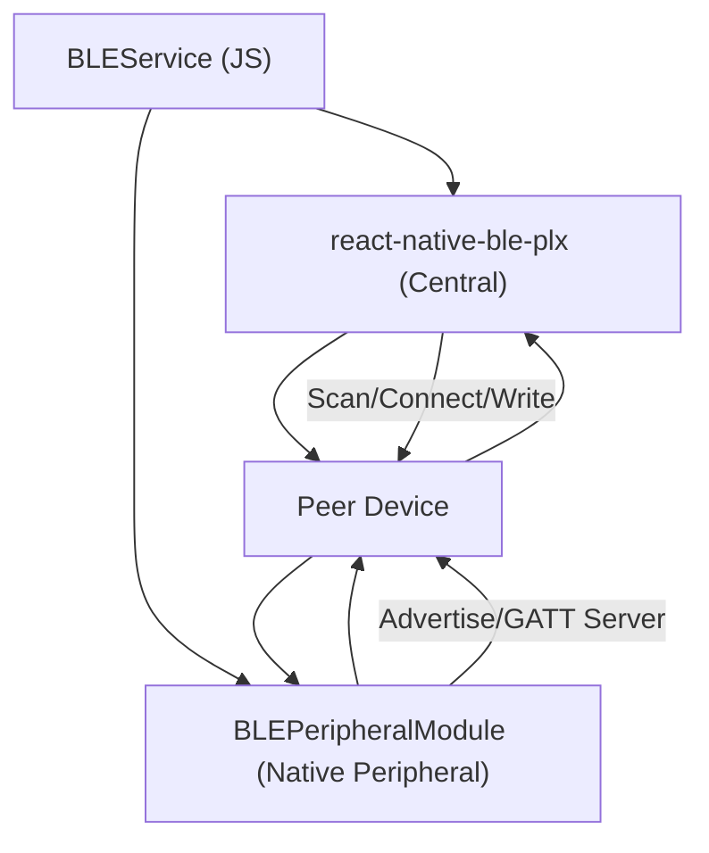

# Mesh Networking & BLE

MeshChat implements a decentralized, peer-to-peer communication layer using Bluetooth Low Energy (BLE). To achieve a true mesh topology without a central coordinator, every device operates in a **Dual-Role** capacity, acting simultaneously as a BLE Peripheral and a BLE Central.

## Architecture Overview

The system splits responsibilities between a high-performance Android native module for server-side operations and a JavaScript service for orchestration and state management.

## The Peripheral Role (Native Implementation)

The `BLEPeripheralModule.java` implements a custom GATT (Generic Attribute Profile) server. This allows the device to be discoverable and receive data without initiating a connection.

### GATT Server Configuration
The server exposes a primary service identified by `MESHCHAT_SERVICE_UUID` with two key characteristics:

| Characteristic | UUID | Property | Purpose |
| :--- | :--- | :--- | :--- |
| **Device Name** | `NAME_CHAR_UUID` | `READ` | Stores the user's display name for peer identification. |
| **Message** | `MESSAGE_CHAR_UUID` | `WRITE` | The entry point for incoming messages and relay data. |

### Key Native Optimizations
- **Idempotent Setup:** The `setup()` method prevents race conditions using an `isSettingUp` flag and performs a full cleanup of previous GATT servers before initialization.
- **OEM Compatibility:** To support manufacturers like Samsung, the module stores the `AdvertiseCallback` instance, as some Android OEMs require the exact same instance to stop advertising.
- **Safety Timeouts:** A 5-second safety net is implemented via `SERVICE_ADD_TIMEOUT_MS` to prevent the JS promise from hanging if the native `onServiceAdded` callback fails to fire.

## The Central Role (JS Orchestration)

The `BLEService.js` manages the discovery and connection lifecycle using `react-native-ble-plx`.

### Auto-Mesh Lifecycle
The "Auto-Mesh" feature ensures the network is self-healing and expanding:
1. **Scan Burst:** Scans for devices advertising the `MESHCHAT_SERVICE_UUID`.
2. **Deduplication:** Filters devices by MAC address and name to prevent duplicate entries during MAC rotation.
3. **Auto-Connect:** Iterates through discovered peers and initiates connections.
4. **MTU Negotiation:** Requests an MTU (Maximum Transmission Unit) of up to 512 bytes to increase throughput.

## Data Transport & Reliability

BLE is inherently lossy and has strict payload limits. MeshChat employs three strategies to ensure reliable delivery:

### 1. GATT Write Queue
Writing to BLE characteristics is asynchronous and prone to collisions. `BLEService` implements a per-connection write queue:
- Only one write operation is active per device at any time.
- If a write fails, it utilizes an exponential backoff retry mechanism (`WRITE_MAX_RETRIES`).
- Operations are wrapped in a `Promise.race` to prevent "ghost" writes from hanging the queue.

### 2. Chunking Mechanism
When a message exceeds the negotiated MTU, it is fragmented:
- **Header:** Each chunk is prefixed with `CHUNK:sequence:total:messageId:`.
- **Reassembly:** The receiving device buffers chunks in a `Map` and only processes the final payload once `got === total`.

### 3. Message Protocol
Messages are packed using a structured protocol to differentiate between communication types:
- **Direct Messages (`dm`):** Targeted at a specific peer.
- **Public Messages (`public`):** Intended for the entire mesh.

## Mesh Propagation (Relaying)

Public messages are propagated across the network via a **Store-and-Forward** mechanism.

### The Relay Logic
When a device receives a `public` message:
1. **Seen-ID Check:** It checks a local cache (`MAX_SEEN_IDS`) to see if the message has already been processed. This prevents infinite loops.
2. **TTL (Time-to-Live):** It checks the `ttl` value. If `ttl > 0`, it decrements the value and increments the `hops` count.
3. **Broadcast:** The message is relayed to all currently connected peers *except* the device that sent it.

### Propagation Constraints
- **TTL Exhaustion:** Once `ttl` reaches 0, the message is dropped and not relayed further.
- **Deduplication:** The `_seen` Set ensures that a device only processes and relays a unique message ID once.

## Configuration Constants

Critical parameters are defined in `BLEConstants.js` to ensure network uniformity:

- `MESHCHAT_SERVICE_UUID`: The unique identifier for all MeshChat-enabled devices.
- `DEFAULT_TTL`: Set to `7` hops by default.
- `SCAN_INTERVAL_MS`: The duty cycle for scanning to balance discovery speed vs. battery consumption.
- `REQUESTED_MTU`: Set to `512` to optimize for Android's maximum capabilities.