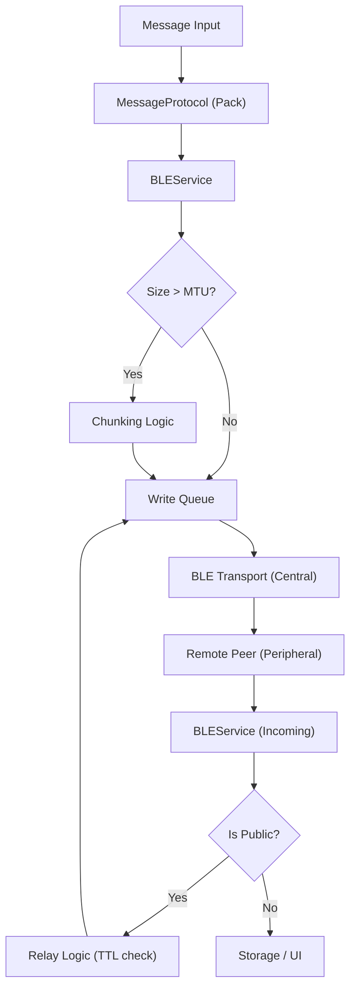

# Mesh Networking Core

The Mesh Networking Core is the business logic layer of MeshChat, responsible for establishing peer-to-peer connectivity via Bluetooth Low Energy (BLE) and managing the framing, transmission, and relaying of messages across a decentralized network.

## Architecture Overview

MeshChat employs a **Dual-Role BLE Architecture**. Every device simultaneously operates as both a **Peripheral** and a **Central** node to ensure seamless mesh discovery and communication.

- **Peripheral Role**: Advertises the device's presence and hosts a GATT server. It listens for incoming writes from other peers.
- **Central Role**: Actively scans for other MeshChat devices, establishes connections, and writes data to their characteristics.

## Message Protocol

To ensure interoperability and routing capabilities, all data is wrapped in a unified protocol via `MessageProtocol.js`. This transforms raw text into a structured JSON packet.

### Packet Structure

| Field | Type | Description |
| :--- | :--- | :--- |
| `id` | `string` | Unique identifier for deduplication. |
| `from` | `string` | Sender's display name. |
| `type` | `string` | `dm` (Direct Message) or `public` (Broadcast). |
| `to` | `string` | Recipient identifier (null for public messages). |
| `payload` | `string` | The actual message content. |
| `ts` | `number` | Unix timestamp of creation. |
| `ttl` | `number` | Time-to-Live; decremented on every hop. |
| `hops` | `number` | Total distance traveled from the origin. |

## Transport Reliability

BLE is inherently unstable. MeshChat implements three specific patterns to ensure high delivery rates.

### 1. Sequential Write Queue
GATT writes can fail if multiple requests are sent simultaneously. The `BLEService` implements a per-connection queue:
- Only one write operation is active at a time per peer.
- Failed writes are retried up to 3 times with an exponential backoff (`WRITE_RETRY_DELAY_MS`).
- Each write is wrapped in a `Promise.race` to prevent hanging on hardware timeouts.

### 2. Message Chunking
Because BLE MTU (Maximum Transmission Unit) is limited (typically 20-512 bytes), large messages are fragmented into chunks:
- **Format**: `CHUNK:sequence:total:messageId:data`
- The receiver buffers these chunks in a `Map` and reassembles the full payload only when all sequences are received.

### 3. Auto-Mesh Lifecycle
The `startAutoMesh()` loop automates the network discovery process:
1. **Scan Burst**: Scans for `MESHCHAT_SERVICE_UUID` for 10 seconds.
2. **Connect Phase**: Automatically establishes connections with all discovered peers.
3. **Maintenance**: Pauses for 5 seconds to conserve battery before restarting the cycle.

## Mesh Routing & Relaying

Public messages are designed to "flood" the network to reach the maximum number of peers.

### Deduplication
To prevent infinite loops (broadcast storms), the service maintains a `_seen` cache (limited to `MAX_SEEN_IDS`). If a message ID has already been processed, it is immediately discarded.

### The Relay Mechanism
When a `public` message is received:
1. **TTL Check**: The `MessageProtocol.relay()` method checks if `ttl > 0`.
2. **Decrement**: If valid, `ttl` is decremented by 1 and `hops` is incremented by 1.
3. **Forward**: The message is re-enqueued for write to all connected peers *except* the one that originally sent it.
4. **Expiration**: Once `ttl` reaches 0, the message is no longer relayed, preventing it from circling the network indefinitely.

## Core Constants

These values define the network's identity and behavior.

| Constant | Value | Description |
| :--- | :--- | :--- |
| `MESHCHAT_SERVICE_UUID` | `a1b2c3d4...` | Primary filter for device discovery. |
| `DEFAULT_TTL` | `7` | Default maximum hops for public messages. |
| `REQUESTED_MTU` | `512` | Preferred packet size for Android/iOS. |
| `SCAN_INTERVAL_MS` | `5000` | Duty cycle pause to save battery. |
| `MAX_SEEN_IDS` | `500` | Size of the deduplication cache. |