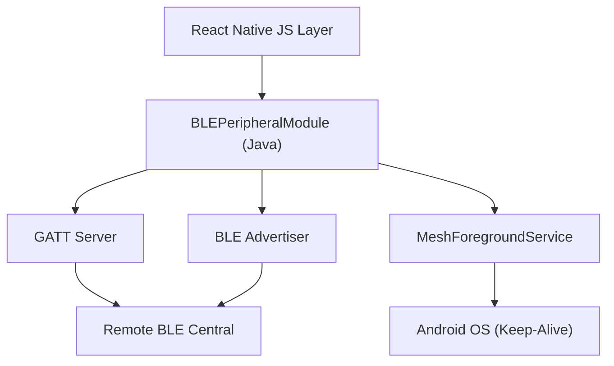

# Native BLE Integration

MeshChat utilizes native Android and iOS modules to implement a Bluetooth Low Energy (BLE) peripheral architecture. This allows devices to act as GATT (Generic Attribute Profile) servers, advertising their presence and allowing other devices (Centrals) to read identity data and write messages.

## Architecture Overview

The integration is designed to maintain a persistent connection state and discovery visibility even when the application is backgrounded. On Android, this is achieved through a combination of a custom `ReactContextBaseJavaModule` and a `Foreground Service`.

## Android Implementation

### BLEPeripheralModule

The `BLEPeripheralModule` serves as the primary bridge between JavaScript and the Android BLE stack. It manages the lifecycle of the GATT server and the advertising state.

#### 1. Idempotent Setup
The `setup()` method ensures the BLE stack is initialized without race conditions. Key technical safeguards include:
- **Concurrency Guard**: A `isSettingUp` flag prevents multiple simultaneous initialization attempts.
- **State Reset**: Performs a `fullCleanup()` (closing previous GATT servers and stopping advertising) before initializing a new instance.
- **Asynchronous Resolution**: Unlike standard methods, the setup promise only resolves inside the `onServiceAdded` callback, ensuring the GATT service is actually registered before the JS layer proceeds.
- **Safety Timeout**: A 5-second `setupTimeoutRunnable` prevents the application from hanging if the native BLE stack fails to trigger the `onServiceAdded` callback.

#### 2. GATT Server Configuration
The module implements a Primary Service with two specific characteristics:

| Characteristic | Property | Permission | Purpose |
| :--- | :--- | :--- | :--- |
| **Name** | `READ` | `READ` | Stores the user's display name for identification by Centrals. |
| **Message** | `WRITE`, `WRITE_NO_RESPONSE` | `WRITE` | Acts as the inbox for incoming mesh messages. |

#### 3. Advertising Logic
To ensure maximum discoverability, the module configures the `BluetoothLeAdvertiser` with:
- **Mode**: `ADVERTISE_MODE_LOW_LATENCY` for faster discovery.
- **TX Power**: `ADVERTISE_TX_POWER_HIGH` to maximize range.
- **OEM Compatibility**: The `activeAdvertiseCallback` is stored as a class member. This is critical for devices (e.g., Samsung) that require the same callback instance to be passed to `stopAdvertising()` as was used in `startAdvertising()`.

### MeshForegroundService

Android's battery optimization often kills background processes. To prevent the BLE peripheral from being deactivated, MeshChat implements a `Foreground Service`.

- **Persistence**: By calling `startForeground()`, the app displays a non-dismissible notification ("Listening for nearby messages"), which signals to the OS that the app is performing a critical task.
- **Resilience**: The service returns `START_STICKY`, instructing the Android OS to restart the service if it is killed due to memory pressure.
- **Notification Channel**: Uses `IMPORTANCE_LOW` to ensure the background operation does not interrupt the user with sounds or pop-ups while still maintaining the foreground priority.

## Lifecycle and Event Handling

The native layer communicates state changes back to the JavaScript layer via the `DeviceEventManagerModule`.

### Emitted Events

| Event | Payload | Trigger |
| :--- | :--- | :--- |
| `BLEBluetoothStateChanged` | `{ state: string }` | Triggered by `btStateReceiver` when Bluetooth is turned ON/OFF. |
| `BLEPeripheralRead` | `{ deviceId: string }` | Triggered when a remote device reads the Name characteristic. |
| `BLEPeripheralWrite` | `{ data: string, deviceId: string }` | Triggered when a remote device writes a message to the Message characteristic. |

### Cleanup Procedure
To prevent memory leaks and "GATT server already exists" errors, the `fullCleanup()` method is invoked during:
1. An explicit call to `stop()`.
2. When the `BluetoothAdapter.ACTION_STATE_CHANGED` receiver detects that Bluetooth has been powered off.
3. Immediately before a new `setup()` sequence begins.