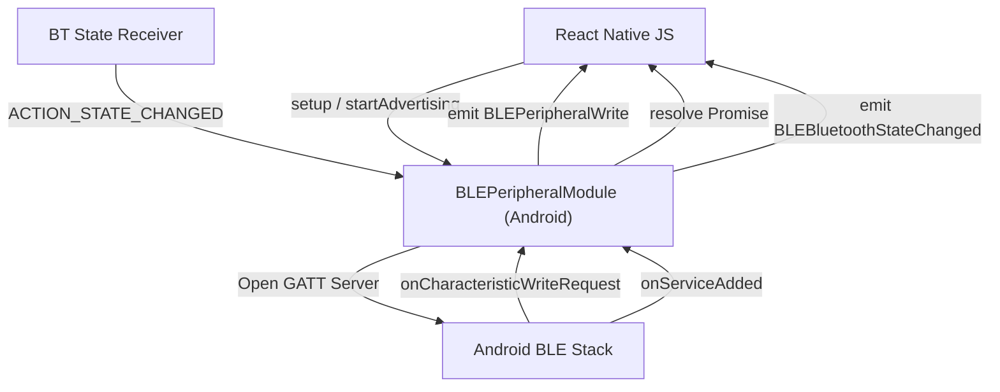

# Native Implementations

The `MeshChat` architecture relies on a high-performance bridge between the React Native JavaScript layer and the native Bluetooth Low Energy (BLE) stacks of Android and iOS. To achieve reliable peer-to-peer communication, the application implements a **BLE Peripheral** (GATT Server) role, allowing devices to be discoverable and accept data writes from other peers.

## Architecture Overview

The native bridge is designed to handle the asynchronous nature of BLE hardware, ensuring that JavaScript promises are only resolved when the hardware state has actually transitioned.



## Android Implementation: BLEPeripheralModule

The Android implementation is encapsulated within `BLEPeripheralModule.java`, which extends `ReactContextBaseJavaModule`. It transforms the device into a GATT server capable of advertising a specific service and hosting characteristics for identity and messaging.

### Core Capabilities

#### 1. Idempotent Setup
The `setup()` method initializes the BLE stack. Unlike naive implementations, it employs several production-safety guards:
- **Concurrency Locking**: An `isSettingUp` flag prevents race conditions from multiple simultaneous calls.
- **Async Resolution**: The setup promise does not resolve immediately; it waits for the `onServiceAdded` callback from the Android OS.
- **Safety Timeout**: A 5-second watchdog timer ensures the JS layer isn't left hanging if the GATT server fails to register.

#### 2. GATT Server Logic
The module defines a primary service containing two critical characteristics:
- **Name Characteristic (READ)**: Allows peer devices to retrieve the `displayName` of the user. It handles offset-based reading to support long names.
- **Message Characteristic (WRITE)**: The primary data ingress point. When a peer writes to this characteristic, the module captures the byte array, converts it to UTF-8, and emits a `BLEPeripheralWrite` event to JavaScript.

#### 3. OEM-Compatible Advertising
To ensure compatibility across diverse Android hardware (specifically Samsung and Pixel devices), the module:
- Stores a reference to the `AdvertiseCallback` instance.
- Uses the same callback instance for both `startAdvertising` and `stopAdvertising`, as some OEMs validate callback identity to prevent memory leaks or ghost advertisements.

### Native API Reference

| Method | Parameters | Description |
| :--- | :--- | :--- |
| `setup` | `svcUUID, msgUUID, nmUUID, displayName` | Initializes the GATT server and registers the service. |
| `startAdvertising` | `none` | Begins broadcasting the service UUID with `ADVERTISE_MODE_LOW_LATENCY`. |
| `stopAdvertising` | `none` | Halts BLE broadcasting. |
| `updateName` | `newName` | Updates the value of the Name characteristic dynamically. |
| `stop` | `none` | Performs a full cleanup (stops advertising, closes GATT server, unregisters receivers). |

## Event System

The native layer communicates back to the React Native layer using the `DeviceEventManagerModule`.

| Event | Payload | Trigger |
| :--- | :--- | :--- |
| `BLEBluetoothStateChanged` | `{ state: string }` | Triggered by `BroadcastReceiver` when BT is toggled (e.g., `PoweredOn`, `PoweredOff`). |
| `BLEPeripheralRead` | `{ deviceId: string }` | Triggered when a remote peer reads the user's display name. |
| `BLEPeripheralWrite` | `{ data: string, deviceId: string }` | Triggered when a remote peer sends a message. |

## Integration

The module is exposed to React Native via the `BLEPeripheralPackage`, which registers the `BLEPeripheralModule` during the application's native initialization phase.

```java
public class BLEPeripheralPackage implements ReactPackage {
    @Override
    public List<NativeModule> createNativeModules(ReactApplicationContext reactContext) {
        List<NativeModule> modules = new ArrayList<>();
        modules.add(new BLEPeripheralModule(reactContext));
        return modules;
    }
}