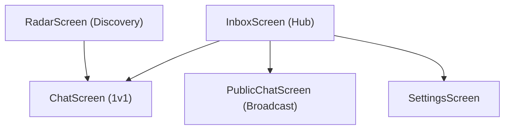

# Feature Screens

MeshChat utilizes a series of dedicated screens to manage P2P BLE discovery and communication. The application is structured to handle both automatic mesh discovery and manual peer targeting.

## Inbox Screen
The `InboxScreen` serves as the central command center. It manages the high-level state of the BLE mesh and organizes users into two categories: active conversations and discovered nearby peers.

### Key Functionalities
- **Auto-Mesh Initialization**: Triggers `BLEService.startAutoMesh()` on mount to begin background discovery.
- **Conversation Management**: Loads persisted chat history via `StorageService.getConversations()`.
- **Dynamic Peer Tracking**: Listens for `connect`, `disconnect`, and `discovery` events to update the "Nearby" list in real-time.
- **Entry Point**: Provides navigation to 1v1 chats, the Public Broadcast channel, and global settings.

## Chat Screen
The `ChatScreen` facilitates private, 1v1 messaging between two BLE-enabled devices. It is designed for resilience in unstable RF environments.

### Technical Implementation
- **State Synchronization**: Subscribes to `BLEService` message events. It filters incoming packets to ensure only messages from the current `peerMac` are displayed.
- **Persistence**: Every outgoing and incoming message is mirrored to `StorageService` to maintain a local history.
- **Connectivity Logic**:
    - **Connection Monitoring**: Tracks the `alive` state of the peer.
    - **Reconnection Flow**: If a connection is dropped, a reconnection banner appears, allowing the user to trigger `BLEService.reconnect(peerMac)`.
- **Messaging Protocol**: Uses `MessageProtocol.createId()` to generate unique identifiers for every packet to prevent duplicates during mesh propagation.

## Public Chat Screen
The `PublicChatScreen` is a broadcast channel where messages are transmitted to every connected peer in the current mesh.

### Communication Flow
- **Broadcast Mode**: Instead of targeting a specific MAC address, it utilizes `BLEService.sendPublic()`, which iterates through all active connections.
- **Global Filtering**: The screen listens for messages with the protocol type `public`.
- **Peer Awareness**: The header dynamically displays the count of discovered peers via `ble.getDiscovered().length`, providing a real-time sense of mesh density.

## Radar Screen
The `RadarScreen` provides a low-level interface for manual device discovery and connection debugging.

### Core Capabilities
- **Manual Scanning**: Allows users to explicitly trigger `startScan()` and `stopScan()`.
- **Signal Strength (RSSI)**: Visualizes the proximity of peers using a bar-graph representation based on the RSSI value (dBm).
- **Manual Pairing**: Users can select a specific discovered device to initiate a connection, which redirects the user to the `ChatScreen` upon success.
- **Developer Console**: Includes a real-time log feed that captures internal BLE events (`RADAR_READY`, `FOUND`, `CONNECT_FAILED`), essential for troubleshooting RF interference or pairing issues.

## Common UI Patterns
All feature screens integrate the following components for a consistent user experience:

| Component | Purpose |
| :--- | :--- |
| `StatusBanner` | Global indicator of Bluetooth adapter state and mesh health. |
| `KeyboardAvoidingView` | Ensures the input field remains visible across various Android and iOS screen sizes. |
| `SafeAreaView` | Handles notch and system navigation bar offsets. |
| `FlatList` | Optimized rendering for long message histories and peer lists. |