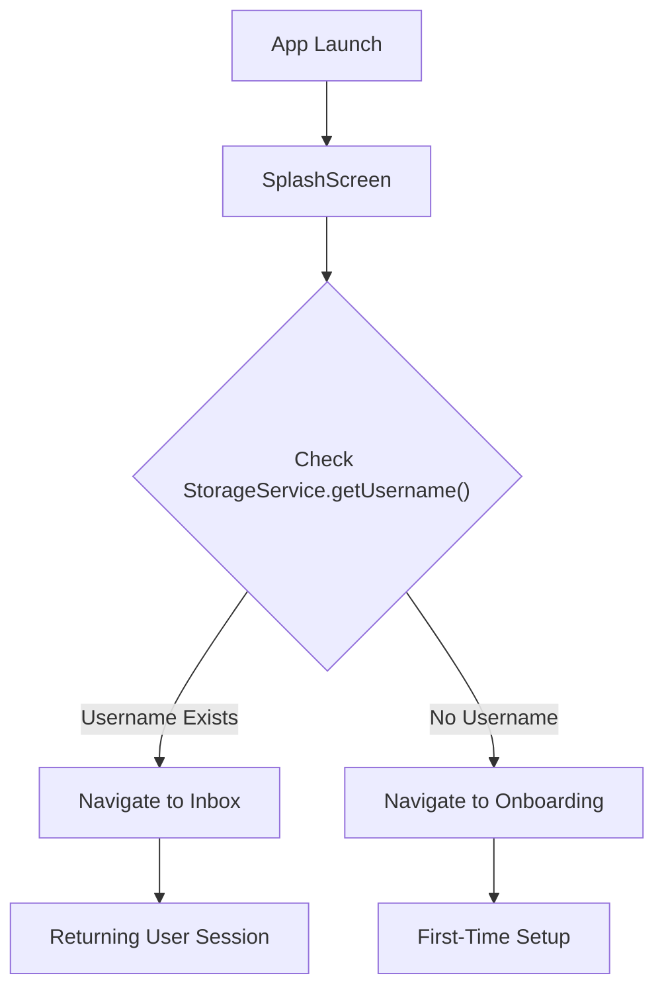

# Common Components

The Common Components layer provides reusable UI elements and foundational screens that maintain the global state of the application, specifically focusing on hardware availability and initial session routing.

## StatusBanner

The `StatusBanner` is a conditional notification bar that appears at the top of the interface when the device's Bluetooth state or system permissions prevent the MeshChat protocol from functioning.

### Behavior Logic

The component monitors the `BLEService` to determine visibility. It remains hidden (`null`) if all connectivity requirements are met.

| State | Trigger | Visual Cue | Action Required |
| :--- | :--- | :--- | :--- |
| **Disabled** | `btState === 'PoweredOff'` | Amber Bar | User must enable Bluetooth |
| **Transitioning** | `TurningOn` or `TurningOff` | Blue Bar | Wait for state change |
| **Unauthorized** | `permsOk === false` | Red Bar | User must grant OS permissions |

### Implementation Details

The component implements a hybrid approach to state synchronization:
1. **Event-Driven**: Subscribes to `btState` events via `BLEService`.
2. **Polling**: Executes a permission check every 5,000ms to react to external settings changes without requiring an app restart.

```jsx
// Key logic for permission polling
useEffect(() => {
    const check = async () => {
        const { ok } = await ble.checkPermissions();
        setPermsOk(ok);
    };
    const iv = setInterval(check, 5000);
    return () => clearInterval(iv);
}, []);
```

---

## SplashScreen

The `SplashScreen` serves as the application's boot router. It is the first screen mounted, responsible for determining the user's authentication state before directing them to the appropriate functional module.

### Routing Workflow

The screen interacts with the `StorageService` to check for a persisted identity.



### Technical Specifications

- **UX Delay**: A hardcoded delay of 800ms is implemented to prevent "flickering" on fast devices and ensure the branding is visible to the user.
- **Error Handling**: Any failure during the storage lookup defaults the user to the `Onboarding` flow to ensure the app remains accessible.
- **Styling**: Uses a high-contrast dark theme (`#0a0f0a`) with monospace typography to align with the "Offline P2P Protocol" aesthetic.

```jsx
const checkUser = async () => {
    try {
        const username = await StorageService.getUsername();
        await new Promise(resolve => setTimeout(resolve, 800));

        if (username) {
            navigation.replace('Inbox');
        } else {
            navigation.replace('Onboarding');
        }
    } catch (err) {
        navigation.replace('Onboarding');
    }
};