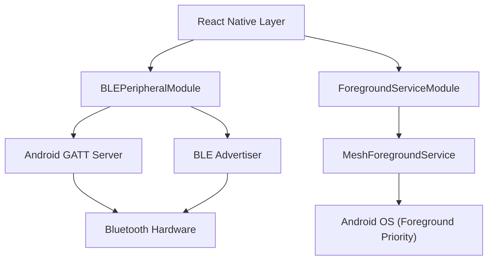

# Android Native Modules

The MeshChat Android implementation utilizes native Java modules to extend React Native's capabilities, specifically focusing on transforming the device into a **BLE Peripheral** and ensuring background persistence via a **Foreground Service**.

## Architecture Overview

The native layer acts as a bridge between the JavaScript business logic and the Android Bluetooth stack and OS lifecycle management.

---

## BLE Peripheral Module

The `BLEPeripheralModule` allows MeshChat to act as a GATT server. This enables other devices (Centrals) to discover the device, read its identity, and write messages to it.

### API Reference

| Method | Arguments | Returns | Description |
| :--- | :--- | :--- | :--- |
| `setup` | `svcUUID, msgUUID, nmUUID, displayName` | `Promise<boolean>` | Initializes the GATT server and registers the primary service and characteristics. |
| `startAdvertising` | None | `Promise<boolean>` | Begins broadcasting the service UUID to make the device discoverable. |
| `stopAdvertising` | None | `Promise<boolean>` | Stops the BLE advertisement. |
| `updateName` | `newName` | `Promise<boolean>` | Updates the value of the Name characteristic dynamically. |
| `stop` | None | `Promise<boolean>` | Performs full cleanup: stops advertising, closes the GATT server, and unregisters receivers. |

### Native Events

The module emits the following events to JavaScript via `RCTDeviceEventEmitter`:

- **`BLEBluetoothStateChanged`**: Fired when the system Bluetooth adapter changes state (e.g., `PoweredOn`, `PoweredOff`).
- **`BLEPeripheralRead`**: Fired when a remote Central reads the device name characteristic. Returns `{ deviceId: string }`.
- **`BLEPeripheralWrite`**: Fired when a remote Central writes data to the message characteristic. Returns `{ data: string, deviceId: string }`.

### Implementation Highlights

- **OEM Compatibility**: The module stores the `AdvertiseCallback` instance. This is critical for devices (e.g., Samsung) that require the exact same callback instance to stop advertising as was used to start it.
- **Safety Timeouts**: A 5-second safety net is implemented during `setup()`. If the `onServiceAdded` callback from the Android OS never fires, the promise is rejected to prevent the JS layer from hanging.
- **Idempotency**: The `setup` method is guarded by an `isSettingUp` flag to prevent race conditions from concurrent calls.

---

## Foreground Service

To prevent Android's aggressive battery optimization from killing the BLE stack when the app is backgrounded, MeshChat implements a persistent Foreground Service.

### ForegroundServiceModule

This module provides the JS bridge to control the service lifecycle.

| Method | Returns | Description |
| :--- | :--- | :--- |
| `start()` | `Promise<boolean>` | Launches the `MeshForegroundService`. Uses `startForegroundService` for Android O+. |
| `stop()` | `Promise<boolean>` | Terminates the service and removes the notification. |

### MeshForegroundService

The `MeshForegroundService` is a `START_STICKY` service that ensures the application maintains a high process priority.

**Key Characteristics:**
- **Persistent Notification**: Displays "MeshChat • Listening for nearby messages".
- **Non-Dismissible**: The notification is set to `setOngoing(true)`, preventing users from swiping it away while the mesh network is active.
- **Notification Channel**: Creates a dedicated `meshchat_bg_channel` with `IMPORTANCE_LOW` to avoid intrusive sounds while remaining visible in the status bar.
- **Lifecycle**: By returning `START_STICKY`, the Android OS will attempt to restart the service if it is killed due to extreme memory pressure.

## Permissions Required

For these modules to function, the following permissions must be declared in `AndroidManifest.xml` and requested at runtime:

- `android.permission.BLUETOOTH`
- `android.permission.BLUETOOTH_ADMIN`
- `android.permission.BLUETOOTH_ADVERTISE` (Android 12+)
- `android.permission.BLUETOOTH_CONNECT` (Android 12+)
- `android.permission.FOREGROUND_SERVICE`