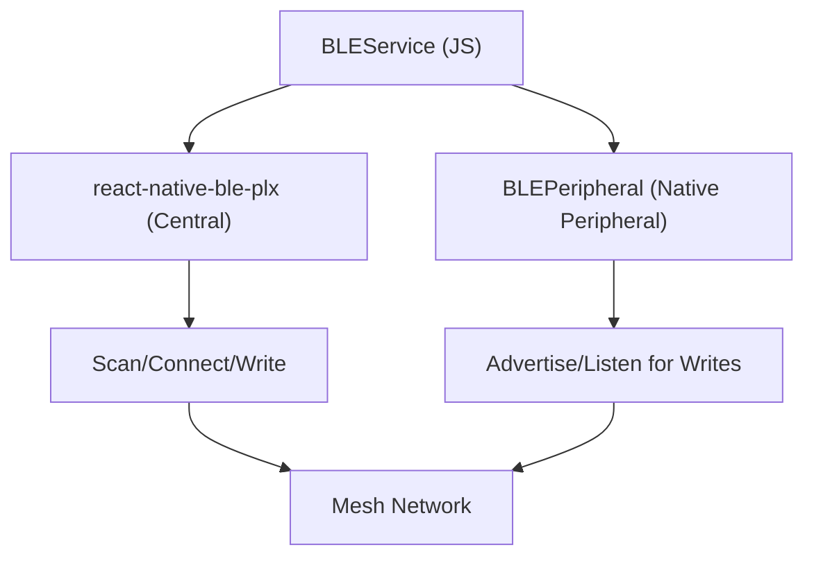

# BLE Communication Layer

The BLE Communication Layer is the transport backbone of MeshChat. It implements a **dual-role** architecture, allowing every device to act as both a GATT Server (Peripheral) and a GATT Client (Central) simultaneously. This enables the formation of an ad-hoc mesh network where messages can be relayed across multiple hops without a central coordinator.

## Architecture Overview

The layer is split between a JavaScript service managing high-level logic and native modules handling low-level BLE hardware interactions.

## Network Configuration

The behavior of the mesh is governed by constants defined in `BLEConstants.js`. These values ensure interoperability between different MeshChat instances.

### Service Identifiers
| Constant | UUID | Purpose |
| :--- | :--- | :--- |
| `MESHCHAT_SERVICE_UUID` | `a1b2c3d4-...-7890` | Primary service used for scanner filtering. |
| `MESSAGE_CHAR_UUID` | `a1b2c3d4-...-7891` | Characteristic for sending/receiving messages. |
| `NAME_CHAR_UUID` | `a1b2c3d4-...-7892` | Read-only characteristic containing the user's name. |

### Mesh Parameters
- **`DEFAULT_TTL` (7):** Time-to-Live. Limits the number of hops a public message can travel to prevent infinite loops.
- **`MAX_SEEN_IDS` (500):** The size of the deduplication cache. Once a message ID is cached, it will not be processed or relayed again.
- **`REQUESTED_MTU` (512):** The maximum transmission unit requested during connection to optimize throughput.
- **`SCAN_INTERVAL_MS` (5000):** The duty cycle for scanning to balance peer discovery with battery preservation.

## Core Implementation Details

### 1. Dual-Role Management
The `BLEService` manages two distinct states:
- **Peripheral Role:** Uses the `BLEPeripheral` native module to advertise the `MESHCHAT_SERVICE_UUID`. It listens for incoming GATT writes and triggers the `_onIncoming` handler.
- **Central Role:** Uses `react-native-ble-plx` to scan for other MeshChat devices, establish connections, and write data to their message characteristics.

### 2. The GATT Write Queue
BLE hardware typically cannot handle concurrent write operations on a single connection. `BLEService` implements a per-device **Write Queue** to ensure sequential delivery:
- Each device connection has its own queue.
- Writes are executed one-by-one.
- **Retries:** If a write fails or times out (`WRITE_TIMEOUT_MS`), the service attempts up to 3 retries with exponential backoff (`WRITE_RETRY_DELAY_MS`).

### 3. Message Chunking
Since BLE packets are limited by the MTU, large messages are split into chunks. 
- **Format:** `CHUNK:sequence:total:messageId:data`
- **Reassembly:** The receiver stores fragments in a `_chunks` Map. Once all fragments for a specific `messageId` arrive, the full payload is reconstructed and passed to the protocol unpacker.

### 4. Auto-Mesh Logic
The `startAutoMesh()` method initiates a continuous cycle:
1. **Scan Burst:** Scans for `MESHCHAT_SERVICE_UUID` for 10 seconds.
2. **Auto-Connect:** Attempts to connect to all discovered peers not currently active.
3. **Maintenance:** Monitors disconnects and attempts auto-reconnection (up to 3 times) before returning the peer to the discovery pool.

## Message Propagation & Relaying

MeshChat supports two types of traffic: Direct Messages (DM) and Public Broadcasts.

### Direct Messages (DM)
Sent directly from the Central to a specific Peripheral. These are stored locally and emitted to the UI.

### Public Relaying
Public messages implement a simplified gossip protocol to spread across the network:
1. **Reception:** A device receives a `public` type message.
2. **Dedup:** It checks the `_seen` Set. If the ID exists, the message is discarded.
3. **Processing:** The message is stored in the public channel.
4. **Relay:** The `_relayPublic` method:
   - Decrements the **TTL** (Time-to-Live).
   - Increments the **Hops** counter.
   - Broadcasts the modified message to all connected peers *except* the one that sent it.
   - Stops relaying if TTL <= 0.

## API Reference

### `BLEService` Methods

| Method | Description |
| :--- | :--- |
| `init()` | Initializes permissions, BT state listeners, and boots the peripheral. |
| `startScan()` | Manually triggers a BLE scan for mesh peers. |
| `connectTo(deviceId)` | Establishes a GATT connection, negotiates MTU, and reads the peer name. |
| `send(deviceId, text)` | Packs a DM via `MessageProtocol` and sends it through the write queue. |
| `sendPublic(text)` | Broadcasts a public message to all currently connected peers. |
| `on(event, callback)` | Subscribes to `message`, `connect`, `disconnect`, `btState`, or `discovery`. |
| `updateName(name)` | Updates the local username and refreshes the Peripheral's name characteristic. |
