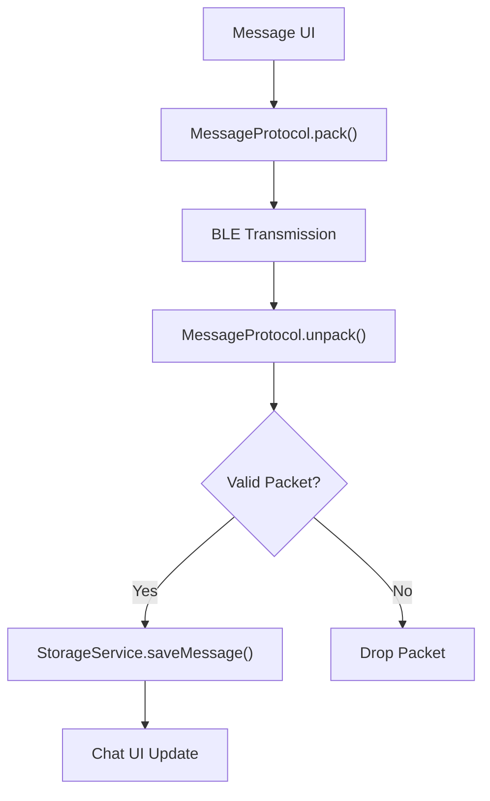

# Data Protocol & Persistence

MeshChat utilizes a unified messaging protocol to ensure consistent data exchange across Bluetooth Low Energy (BLE) transmissions and a centralized storage service for local persistence.

## Messaging Protocol

The `MessageProtocol` service acts as the serialization layer for all network traffic. Every message, whether a Direct Message (DM) or a Public Broadcast, is packed into a standardized JSON packet before transmission and unpacked upon receipt.

### Packet Structure

The protocol defines a strict schema to ensure that nodes can correctly route, filter, and display messages.

| Field | Type | Description |
| :--- | :--- | :--- |
| `id` | `string` | Unique message identifier (generated via `createId()`). |
| `from` | `string` | Nickname of the sender. |
| `type` | `'dm' \| 'public'` | Determines if the message is targeted or broadcast. |
| `to` | `string \| null` | Recipient identifier (`nickname::deviceName` for DMs, `null` for public). |
| `payload` | `string` | The actual message text. |
| `ts` | `number` | Epoch timestamp of creation. |
| `ttl` | `number` | Time-to-Live: maximum allowed hops before the packet is dropped. |
| `hops` | `number` | The number of nodes this packet has already traversed. |

### Data Lifecycle

The following diagram illustrates the lifecycle of a message from creation to local persistence:



### Mesh Relay Logic

To support multi-hop communication, the protocol includes a `relay` mechanism. When a node receives a packet intended for another recipient, it can relay the message by:
1. Decrementing the `ttl` (Time-to-Live).
2. Incrementing the `hops` count.
3. Dropping the packet if `ttl <= 0` to prevent infinite loops in the mesh.

---

## Local Persistence

Data persistence is managed by the `StorageService`, a centralized wrapper around `AsyncStorage`. To avoid key collisions with other applications, all MeshChat data is namespaced with the `@meshchat:` prefix.

### Storage Schema

The service manages four primary categories of data:

#### 1. User Identity
Stored under `@meshchat:username`, this holds the local user's display name.

#### 2. Peer Metadata
Stored under `@meshchat:peer:<peerMac>`, storing identity and presence:
```json
{
  "name": "Alice",
  "lastSeen": 1715432000000
}
```

#### 3. Private Conversations
Messages are stored in arrays keyed by the peer's MAC address: `@meshchat:chat:<peerMac>`.
- **Sorting:** Messages are automatically sorted by timestamp during retrieval.
- **Cleanup:** `deleteConversation(peerMac)` removes both the chat history and the peer metadata.

#### 4. Public Channel
Stored under a global key (`PUBLIC_CHANNEL_KEY`).
- **Deduplication:** The service checks the message `id` before saving to prevent duplicate entries caused by mesh relaying.
- **Retention:** To prevent storage bloat, the public channel is trimmed to a maximum size defined by `MAX_PUBLIC_MESSAGES`.

### Conversation Aggregation

The `getConversations()` method provides an optimized view for the Inbox UI. It scans all keys starting with `@meshchat:chat:`, extracts the most recent message from each array, and joins it with the corresponding peer metadata to return a sorted list of active conversations.